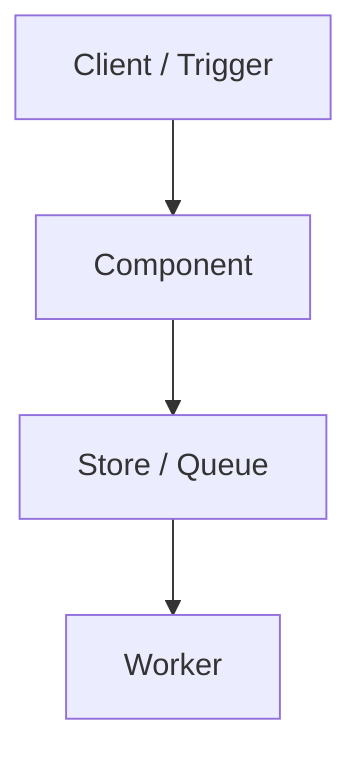

# <Article Title>

## What Was Built

<!-- Concrete summary of the engineering change. -->

## The Problem

<!-- What problem does this solve? Why is the obvious solution insufficient? -->

## Why This Problem Is Difficult

<!-- Constraints, scale, failure modes, or domain complexity. -->

## Beginner Mental Model

<!-- Plain-language analogy or step-by-step mental picture before architecture. -->

## Requirements and Constraints

<!-- Functional and non-functional requirements evidenced in source code. -->

## Architecture Overview

<!-- High-level component diagram description. -->



## Execution Flow

1. <!-- Step 1 -->
2. <!-- Step 2 -->
3. <!-- Step 3 -->

## Important Components

| Component | Responsibility |
|-----------|----------------|
| <!-- name --> | <!-- role --> |

## Simplified Implementation Examples

<!-- Mark as simplified when not copied exactly from source. -->

```typescript
// simplified example
```

## Reliability and Idempotency

<!-- Where is state stored? What happens on retry? -->

## Failure Modes

<!-- What breaks, how it is detected, and what recovery looks like. -->

## Trade-offs and Rejected Alternatives

<!-- Design decisions with evidence from PRs or code. -->

## Testing

<!-- How correctness is verified. -->

## Operations and Observability

<!-- How to run, monitor, and debug. -->

## Lessons Learned

<!-- Durable engineering takeaways. -->

## Sources

- Repository: `okfriansyah-moh/<repo>`
- Pull request(s): <!-- links -->
- Commit(s): <!-- SHAs -->
