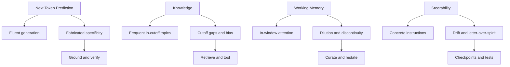
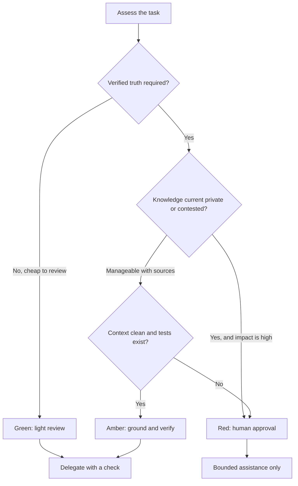

# Four Properties of Generative AI: A Practical Framework for Calibrated Trust

I can ask a model to refactor a Go handler and get clean, idiomatic code in seconds.
Ten minutes later, the same session invents a GitHub issue number, a changelog date,
or an API field that never existed. Both outputs look equally fluent. That contradiction
is the practical problem this article is about.

This is my engineering reading of Claude Academy's
[AI Capabilities and Limitations](https://academy.claude.com/courses/ai-capabilities-and-limitations)
course. The four-property framework, the idea that each property is a
capability-to-limitation continuum, the post-training behavioral fingerprints, the
property-collision diagnostic, and the link to the
[AI Fluency 4D Framework](https://academy.claude.com/courses/ai-fluency-framework-foundations)
come from that course. What I add here is how I apply that model to software delivery:
when to delegate, how to design context, which checks must be deterministic, and where
a human still has to approve.

The course's companion,
[AI Fluency: Framework & Foundations](https://academy.claude.com/courses/ai-fluency-framework-foundations),
teaches four human competencies — Delegation, Description, Discernment, and Diligence.
This article is about the machine properties those competencies respond to. I am not
claiming the taxonomy as original work, and this is not an official Anthropic document.

## The Problem

Most teams still ask a binary question: "Can we trust AI?" That question produces the
wrong operating model. Either people over-delegate and ship fabricated citations, or they
under-delegate and treat every fluent draft as a toy.

The useful question is narrower. For *this* task, which property is doing the work, where
is that property near its edge, and what evidence will catch failure before it matters?
That is what the course calls **calibrated trust**: task-specific trust, not blanket trust
and not blanket distrust.

Capability and limitation usually come from the same mechanism. Next-token prediction is
why the model writes a coherent summary *and* why it can invent a plausible-looking paper
title. Knowledge cutoff is why common language patterns are cheap *and* why last week's
pricing page is invisible unless you retrieve it. Working memory is why a compact prompt
is followed tightly *and* why a twenty-page paste loses the constraint buried on page 11.

## Why This Problem Is Difficult

1. **Fluency hides uncertainty.** A confident paragraph is not a verified claim.
2. **The same property enables and fails.** The mechanism that made the first draft good
   can make the second draft worse.
3. **Real failures are collisions.** A hallucinated citation is fluent completion meeting
   a knowledge gap, not a random glitch.
4. **Product features shift the boundary, not the property.** Larger windows, search,
   memory, and tools move the edge. They do not remove the axis.
5. **Delivery work is irreversible in pieces.** A bad review comment is cheap. A bad
   production rollback plan is not.

## Beginner Mental Model

Treat a generative model as a high-bandwidth pattern completer with four operating
constraints, not as a junior engineer who "knows," "understands," or "remembers" the way
a teammate does.

| Property | What it enables | Characteristic limitation | Warning signs | Best controls | 4D connection |
| --- | --- | --- | --- | --- | --- |
| Next Token Prediction | Fluent drafting, summarization, transformation, pattern completion | Plausible text is not verified truth; specificity is easy to fabricate | Invented names, dates, stats, quotes, URLs, APIs, citations | Retrieval, schemas, tools, generator-verifier loops, explicit uncertainty | Discernment, Diligence |
| Knowledge | Strong answers on frequent, consistent, in-cutoff topics | Cutoff, staleness, uneven coverage, inherited defaults, weak source attribution | Confident answers on rare, local, contested, or post-cutoff facts | Search, retrieval, private context, deterministic tools | Delegation, Discernment, Diligence |
| Working Memory | Attention to what is in the current context window | More context is not automatically better; sessions do not persist by default | Forgotten constraints, middle-of-paste misses, cross-session amnesia | Curate, front-load, restate, external source of truth, fresh session | Description, Diligence |
| Steerability | Concrete, testable instructions land reliably | Ambiguous goals, long chains, and conflicts produce drift or letter-over-spirit | Literal compliance that misses intent; compounding small errors | Goals, constraints, non-goals, checkpoints, tests, schemas | Description, Discernment, Diligence |

Each row is a continuum. Tasks deep in the capability zone can be handed off with light
review. Tasks near the edge need grounding, checkpoints, and a human in the critical
path.



## How an Assistant Gets Its Behavior

A useful simplified story has two stages. During **pretraining**, the model learns to
predict the next token across a large corpus. That stage produces language competence:
syntax, common facts, coding conventions, and the statistical shape of documents. After
pretraining, the system is a document completer. It is not yet a helpful assistant. It
does not have a built-in notion of "the user asked me a question, so I should answer."

**Post-training** then shapes assistant behavior. The course presents this as fine-tuning
on human preferences. That is a fair teaching model. In current systems the same stage
often includes supervised fine-tuning, preference optimization, reinforcement learning,
and safety training — see, for example, [InstructGPT](https://arxiv.org/abs/2203.02155)
and Anthropic's [Constitutional AI](https://www.anthropic.com/research/constitutional-ai-harmlessness-from-ai-feedback).
The important engineering point is unchanged: raw language competence and helpful-assistant
behavior are different layers. Politeness, refusal style, and a tendency to sound certain
are trained in. They are not evidence that the model checked a source.

Weights encode statistical regularities, not human knowing. Some regularities match
true facts. Some match common mistakes, outdated pages, or fluent filler. The assistant
layer only changes *how* that prediction is presented.

## Property 1 — Next Token Prediction

Generative AI writes by continuing a pattern. That is closer to a very large autocomplete
than to a search engine. It is why the model is strong at summarization, reformatting,
explaining common concepts, and completing code that looks like code it has seen often.

The same mechanism is why plausible text is not the same as verified truth. Fabrication
concentrates in specificity: names, dates, statistics, quotations, URLs, API fields, and
citations. A generic explanation of HTTP timeouts can be useful. A sentence that says
"RFC 9110 section 15.5.1 requires a 473 status" is a different kind of claim and needs
a different kind of check.

Controls I actually use:

- **Source grounding.** Put the primary text in context, or retrieve it, then ask the
  model to work *from that text*.
- **Constrained output.** JSON schemas, enums, and allowed identifier lists shrink the
  space where invention hides.
- **Deterministic tools.** Let code, not the model, compute hashes, parse dates, query
  APIs, and run tests.
- **Generator-verifier loops.** One pass drafts; a second pass, preferably code, checks
  schema, citations, and invariants. Fail closed.
- **Explicit uncertainty.** Ask for assumptions and unknowns. Treat a precise claim
  without evidence as unverified, not as a fact.

I do not ask for hidden chain-of-thought. I ask for artifacts I can inspect: a plan, a
diff, tests, a cited excerpt, a command output. This property maps mainly to
**Discernment** and **Diligence**.

## Property 2 — Knowledge

What the model can recall without tools comes from training data and is frozen at a
cutoff. Frequent, consistent, in-cutoff topics sit in the capability zone. Rare, local,
contested, or post-cutoff topics sit in the limitation zone. Staleness is a separate
failure: a fact can have been true at training time and false now, and the model has no
internal clock that invalidates it.

Coverage is uneven. Popular languages and well-documented APIs are cheaper than a
provincial regulation or an internal service name. Inherited defaults fill "normal"
with whatever was common in the corpus. "I read this somewhere" is not a citation.

It helps to keep four channels distinct:

| Channel | What it is | What it is not |
| --- | --- | --- |
| Parametric knowledge | Patterns stored in model weights | A live database |
| Web search | Current public pages fetched at response time | Proof that the page is authoritative |
| Retrieval / RAG | External documents selected and placed into the inference context | An update to the model's weights |
| Deterministic tools | Calculators, databases, compilers, APIs | A substitute for human judgment on contested questions |

[Retrieval-augmented generation](https://arxiv.org/abs/2005.11401) does **not** enrich
the model's "brain." It retrieves relevant text and conditions generation on that text.
Embeddings are vector representations used for semantic similarity. They help you find
candidate chunks. They do not write new facts into the weights.

The [Model Context Protocol](https://modelcontextprotocol.io/docs/getting-started/intro)
is a **connection protocol** for exposing tools and data sources to an application. MCP
is not a vector database and not a retrieval algorithm. A product can use MCP to reach
a wiki, a SQL database, or an embeddings index. Those backends do the retrieval.

For delivery work, I treat knowledge gaps as a Delegation decision. If the answer must
be current, private, rare, or contested, I supply sources or tools first. I do not ask
the model to remember the pricing page from last quarter. This property maps to
**Delegation**, **Discernment**, and **Diligence**.

## Property 3 — Working Memory

Everything the model can attend to on this turn lives in a finite **context window**:
system instructions, conversation history, retrieved documents, tool definitions, tool
results, and the output it is about to write. Anthropic's
[context window documentation](https://platform.claude.com/docs/en/build-with-claude/context-windows)
is explicit on two points I rely on: the window is not the training corpus, and more
context is not automatically better. As token count grows, recall can degrade — a pattern
Anthropic and others describe as *context rot*. See also
[Effective context engineering for AI agents](https://www.anthropic.com/engineering/effective-context-engineering-for-ai-agents).

Products do not all handle overflow the same way. An API may reject an oversized prompt.
A chat UI may drop older turns, summarize, or compact. I do **not** assume silent
truncation is universal. I assume this: once the useful working set no longer fits
cleanly, behavior degrades, and I may not get a loud alarm.

[Lost in the Middle](https://arxiv.org/abs/2307.03172) (Liu et al., TACL 2024) measured
an observed long-context retrieval pattern: on multi-document question answering and
key-value lookup, several models were stronger when the relevant fact sat at the beginning
or the end of a long input, and weaker when it sat in the middle. That U-shaped curve is
an empirical finding. It varies by model and setup. It is not a proof that transformers
can only attend to the edges.

I also keep three words apart:

- **Context** is the current window.
- **Product memory / projects / compaction** preserve, select, summarize, or reintroduce
  information. [Compaction](https://platform.claude.com/docs/en/build-with-claude/compaction)
  summarizes older turns so a conversation can continue; it does not enlarge the model's
  native window.
- **Training** is how weights were formed. Correcting the model in chat does not teach
  the weights. It only changes what is in context now.

Multi-agent workflows do not give one model a bigger window. They partition work across
separate contexts and add merge, coordination, and consistency cost. That can be worth
it. It is not free context.

What I do in practice:

1. Curate. Do not dump the whole repo "just in case."
2. Put goals and hard constraints early.
3. Restate the acceptance criteria near the final instruction.
4. Keep a source of truth outside the chat: a ticket, a spec, a test file, a `PLAN.md`.
5. Use structured summaries and explicit state files for long-running work.
6. Start a fresh session when the accumulated thread is noisy.
7. Split into sub-agents only when partitioning has a clear benefit, then budget for
   the merge.

This property maps mainly to **Description** and **Diligence**.

## Property 4 — Steerability

The model follows instructions the same way it does everything else: by continuing a
pattern. Short, concrete, testable asks land well: "return a table," "do not change the
public API," "fail the build if `go test ./...` is red." Abstract goals, long unsupervised
chains, and native arithmetic or logic are where steering slips.

Two failure modes show up constantly in delivery:

- **Reasoning drift.** A small early miss compounds. By step eight the plan is internally
  consistent and wrong.
- **Letter over spirit.** The instruction was followed; the outcome is useless. "Be
  concise" deletes the one caveat that mattered. "Add tests" produces a test that asserts
  the buggy behavior.

Repeating the same instruction louder rarely closes that gap. Restating the intended
outcome does. I write goal, constraints, non-goals, and definition of done. I break
execution into short stages with checkpoints. I ask for structured output. I offload
arithmetic, transforms, and data access to tools. I keep tests and validators in the
loop. If a literal reading produced a useless result, I say what "done" looks like, not
what the previous sentence should have meant.

I still do not treat "show your reasoning" as a control unless that reasoning is an
artifact I can check: a sequenced plan, a failing test, a traced tool call. Hidden
internal traces are not a review surface.

This property maps to **Description**, **Discernment**, and **Diligence**.

## Four Shadow Behaviors from Post-Training

Assistant training leaves fingerprints. They are not defects unique to one provider, and
their strength varies by model and post-training mix. I watch for four.

| Fingerprint | Warning sign | User response |
| --- | --- | --- |
| Sycophancy | The model agrees with a bad premise after light pushback, even when the first answer was better | Ask it to argue the opposite case and show evidence |
| Verbosity | A long answer that buries the decision | Cap length and demand the recommendation first |
| Over-caution | Refusal or heavy hedging on a request that is actually in policy | Narrow the ask and state the allowed context |
| Loose confidence calibration | "I'm confident" with no checkable support | Ignore the adjective; require artifacts, tests, or sources |

These are reasons to add process, not reasons to anthropomorphize the model as insecure
or eager to please in a human way. Preference data rewarded some of these shapes. Your
workflow has to compensate.

## When Properties Collide

Most production surprises are two properties meeting. Naming the pair tells you which
control to reach for. Making the prompt longer is usually the wrong first move.

| Observed failure | Properties interacting | Likely cause | Correct response |
| --- | --- | --- | --- |
| Hallucinated citation or precise fact | Next Token Prediction + Knowledge | Fluent completion meets missing or stale evidence | Retrieve a primary source, require citations, verify independently |
| Constraints forgotten late in a long task | Working Memory + Steerability | Critical instructions were diluted, summarized, or displaced | Re-supply compact state and acceptance criteria; start a fresh execution context if needed |
| Confident but incorrect recommendation | Knowledge + post-training calibration | Uneven knowledge plus weak confidence language | Ask for assumptions and evidence, use tools, compare against domain judgment |
| Correct format but wrong outcome | Steerability + Next Token Prediction | Literal pattern compliance missed intent | Restate the goal and add outcome-based tests |

Diagnostic principle: name the properties, then choose a control that addresses those
properties. A hallucinated issue number is not fixed by saying "be accurate." It is
fixed by retrieval plus a verifier that fails closed. A forgotten non-goal is not fixed
by a longer pep talk. It is fixed by a short restated contract at the point of action.

This is Discernment applied to failure type, not to vibe.

## A Practical Pre-Flight Check

Before I hand work to a model, I run a short checklist.

1. Is this mainly generation or transformation, or does it require verified truth?
2. Is the required knowledge current, private, rare, local, or contested?
3. Does the necessary context fit cleanly, and is the source of truth explicit outside
   the chat?
4. Are the goal, constraints, non-goals, and acceptance tests concrete?
5. Can the output be validated by code, schema, citations, tests, or a domain expert?
6. What is the consequence if the answer is wrong, or if an action is irreversible?

I then map the answers to a three-level delegation model. Green is not risk-free. It
means the expected failure is cheap and detectable.

| Level | When | Operating mode |
| --- | --- | --- |
| Green | Generation/transform, in-distribution knowledge, small context, cheap mistakes, easy review | Delegate with lightweight review |
| Amber | Mixed truth claims, some private or current data, medium context, reversible actions | Delegate with grounding, checkpoints, and verification |
| Red | Contested or high-impact facts, irreversible actions, thin knowledge, noisy context | Keep human approval in the critical path; use AI only for bounded assistance |



This is Delegation with a budget. It is the same instinct I use in
[LLM Guardrails](/docs/concepts/llm-guardrails): isolate advisory output from irreversible
action. The difference is that this checklist decides *whether* to enter that architecture
for a given task, not how to implement the checkpoints.

## Applied Engineering Examples

### Generating or refactoring routine backend code

Dominant risk: Next Token Prediction plus Steerability. The model will produce code that
looks like the surrounding package and still miss a hidden invariant.

Safe boundary: Green to Amber. Let it draft the change. Do not let it merge.

Required evidence: `go test`, typecheck, and a diff review against the invariant list.

Human judgment: concurrency, authz, and "this matches our failure mode," not comma style.

### Reviewing a system-design proposal

Dominant risk: Knowledge plus Steerability. A review can be rhetorically complete and
still assume a database we do not run.

Safe boundary: Amber. Use AI to enumerate questions, failure modes, and missing diagrams.

Required evidence: the actual proposal, current service inventory, and explicit
non-goals.

Human judgment: trade-offs, organizational constraints, and what we will regret in six
months. See [AI Orchestration Patterns](/docs/concepts/ai-orchestration-patterns) for
how I keep role-separated critique from overwriting canonical state.

### Analyzing production-incident evidence or drafting an RCA

Dominant risk: Working Memory plus Knowledge. Logs are long. The interesting line is
often in the middle. Post-cutoff topology will be invented if you let it.

Safe boundary: Amber to Red, depending on customer impact.

Required evidence: raw log excerpts, dashboards, deploy timestamps, and a timeline you
maintain outside the chat.

Human judgment: blast radius, customer communication, and whether the proposed fix
addresses the actual mechanism. For long write-ups, generate in pieces and audit the
whole — the same idea as
[document coherence](/docs/concepts/ai-document-coherence).

### Researching current pricing, regulations, APIs, or product specs

Dominant risk: Knowledge. Parametric memory is the wrong store.

Safe boundary: Red for the claim, Amber for the synthesis. Fetch the page, the spec, or
the statute first.

Required evidence: linked primary sources with quoted excerpts. No URL, no claim.

Human judgment: whether the source is in force, which region it applies to, and what
legal or commercial risk we are actually taking.

### Simplified generator-verifier in Go

The sketch below is **not** production-ready. It only shows the control: treat model
output as untrusted input, validate a schema, check cited evidence, and fail closed.

```go
// simplified — generator-verifier treating model output as untrusted input
package review

import (
	"encoding/json"
	"errors"
	"fmt"
	"net/url"
	"strings"
)

type Draft struct {
	Summary   string   `json:"summary"`
	Findings  []string `json:"findings"`
	Citations []string `json:"citations"`
}

func Verify(raw []byte, evidence string) (*Draft, error) {
	var draft Draft
	if err := json.Unmarshal(raw, &draft); err != nil {
		return nil, fmt.Errorf("fail closed: invalid JSON: %w", err)
	}
	if strings.TrimSpace(draft.Summary) == "" || len(draft.Findings) == 0 {
		return nil, errors.New("fail closed: missing required fields")
	}
	if len(draft.Citations) == 0 {
		return nil, errors.New("fail closed: no citations")
	}
	for _, cite := range draft.Citations {
		parsed, err := url.Parse(cite)
		if err != nil || parsed.Scheme == "" || parsed.Host == "" {
			return nil, fmt.Errorf("fail closed: malformed citation %q", cite)
		}
		if !strings.Contains(evidence, cite) {
			return nil, fmt.Errorf("fail closed: citation not in evidence set: %s", cite)
		}
	}
	return &draft, nil
}
```

A coding orchestrator can wrap the same idea around tests and git checkpoints. That is
the loop in
[Designing a Deterministic Agentic Coding Orchestrator](/docs/concepts/deterministic-agentic-orchestrator):
generate, validate, retry inside a bound, or roll back.

## Limits of the Framework

These four properties are the practical mental model taught by
[Claude Academy](https://academy.claude.com/courses/ai-capabilities-and-limitations).
They are not a complete scientific taxonomy of transformers, alignment, or evals. I am
applying the model to engineering work. I am not claiming I originated it.

The framework does not replace model-specific evaluation, security review, privacy
controls, domain expertise, or production testing. It also does not tell you whether a
vendor's memory feature is storing data in a way your threat model accepts. Those are
separate reviews.

If a later model moves a boundary — better long-context retrieval, better tool use, a
later cutoff — the axes remain useful. I still ask which property the task depends on.

## Testing, Verification, and Operations

Calibrated trust is only as good as the check named in advance. Code needs tests and a
reviewed diff. Facts need a primary source. Design critique needs the actual proposal.
Incident narrative needs timestamps from the system of record. Structured extraction
needs a schema and a reject path. If I cannot name the check, the task is Red.
"It sounds right" is not a test.

Outside the model I keep three artifacts: a source of truth, a definition of done, and
an approval boundary. When a session goes stale, I start a new thread with the short
contract and the evidence pointers.

## Lessons Learned

1. Grade the task against four properties, not the model as a person.
2. Fluency is the default; verification is the exception I have to design.
3. Collisions diagnose faster than vibes: name the pair, then pick the control.
4. Context is a budget. Adding tokens can hide the instruction that matters.
5. Green still gets a glance. Cheap review is still review.

I do not ask whether AI is trustworthy in general. I ask which property this task
depends on, where that property is near its boundary, and what evidence will catch
failure before it ships.

## Related

- [LLM Guardrails](/docs/concepts/llm-guardrails) — production patterns for sanitizing
  input, validating output, reverting failed fixes, and isolating advisory AI
- [AI Orchestration Patterns](/docs/concepts/ai-orchestration-patterns) — fixed-role
  sequential pipelines with immutable canonical state
- [How to Prevent Contradictions in AI-Generated Documents](/docs/concepts/ai-document-coherence)
  — section-sequential generation and guarded micro-fixes
- [Designing a Deterministic Agentic Coding Orchestrator](/docs/concepts/deterministic-agentic-orchestrator)
  — bounded retries, checkpoints, and quality gates

## Sources

- Claude Academy / Anthropic,
  [AI Capabilities and Limitations](https://academy.claude.com/courses/ai-capabilities-and-limitations)
  — four-property framework, training-stage teaching model, behavioral fingerprints,
  property collisions, calibrated trust, and 4D connection. Authoritative conceptual
  source for this article.
- Claude Academy / Anthropic, with Rick Dakan and Joseph Feller,
  [AI Fluency: Framework & Foundations](https://academy.claude.com/courses/ai-fluency-framework-foundations)
  — Delegation, Description, Discernment, Diligence.
- Personal study notes, "AI Capabilities and Limitation.md" — author's raw notes from
  the course; not an independent authority.
- Nelson F. Liu et al.,
  [Lost in the Middle: How Language Models Use Long Contexts](https://arxiv.org/abs/2307.03172),
  TACL 2024.
- Patrick Lewis et al.,
  [Retrieval-Augmented Generation for Knowledge-Intensive NLP Tasks](https://arxiv.org/abs/2005.11401),
  NeurIPS 2020.
- [Model Context Protocol](https://modelcontextprotocol.io/docs/getting-started/intro) —
  open protocol for connecting applications to tools and data sources.
- Anthropic,
  [Context windows](https://platform.claude.com/docs/en/build-with-claude/context-windows)
  and
  [Compaction](https://platform.claude.com/docs/en/build-with-claude/compaction).
- Anthropic,
  [Effective context engineering for AI agents](https://www.anthropic.com/engineering/effective-context-engineering-for-ai-agents)
  (29 Sep 2025).
- Long Ouyang et al., [Training language models to follow instructions with human
  feedback](https://arxiv.org/abs/2203.02155) (InstructGPT), 2022.
- Anthropic,
  [Constitutional AI: Harmlessness from AI Feedback](https://www.anthropic.com/research/constitutional-ai-harmlessness-from-ai-feedback).
