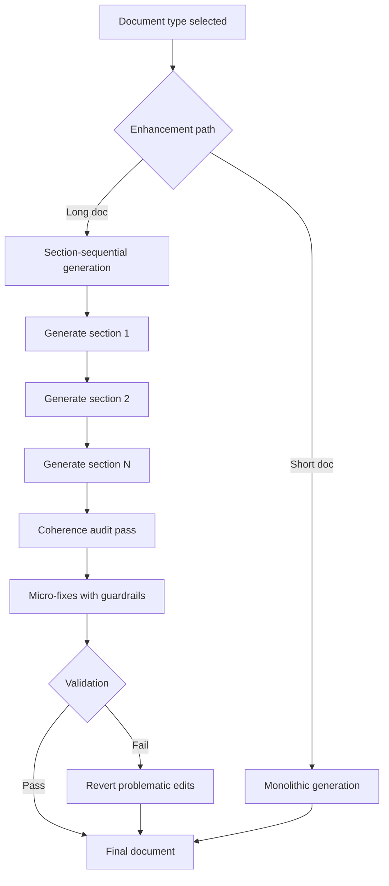

# How to Prevent Contradictions in AI-Generated Documents

## What Was Built

[A2A Brainstorm](https://github.com/okfriansyah-moh/a2a-brainstormer) converts a raw
product idea into structured Markdown artifacts (`architecture.md`, `plan.md`,
`readme.md`) through a multi-agent pipeline. A later enhancement adds **section-per-section
generation** with a **coherence audit pass** that detects cross-section contradictions
and applies **guarded micro-fixes** — small edits that are reverted if they fail
validation guardrails.

## The Problem

When an LLM generates a long document in one shot, sections can contradict each other:
the architecture section might specify PostgreSQL while the plan section references
MongoDB. Regenerating the entire document is expensive and may introduce new errors.
You need a way to generate incrementally **and** verify consistency across sections.

## Why This Problem Is Difficult

1. **Context window limits** — monolithic generation degrades on long documents.
2. **Section isolation** — each section is generated with partial awareness of others.
3. **Over-correction risk** — fixing one contradiction can break unrelated content.
4. **Non-deterministic LLM output** — fixes must be validated, not blindly applied.

## Beginner Mental Model

Imagine writing a book one chapter at a time. After each chapter, an editor reads
**all chapters together** and flags sentences that contradict earlier chapters.
The editor makes **tiny corrections** (a word here, a technology name there) — but
if a correction makes things worse, it is **automatically undone**.

## Requirements and Constraints

| Requirement | Implementation |
|-------------|----------------|
| Incremental generation | Section-sequential enhancement path per document type |
| Cross-section consistency | `coherence.go` module with `runCoherencePass` |
| Safe fixes only | Guardrails revert edits that fail validation |
| Observable progress | `ProgressMeta` struct with section and coherence step enums |
| Test coverage | `coherence_test.go` unit tests + `aigen_test.go` integration tests |

## Architecture Overview



The backend selects between monolithic and section-sequential paths in
`enhanceOneWithOpts` based on document type.

## Execution Flow

1. User finalizes a brainstorming session with converged canonical state.
2. Backend selects enhancement path (monolithic or section-sequential).
3. For section-sequential: each section body is generated independently using
   section-level rubric findings from `rubric.go`.
4. After all sections exist, `runCoherencePass` audits the full document for
   cross-section inconsistencies.
5. The coherence module proposes micro-fixes for detected contradictions.
6. Guardrails validate each fix; problematic edits are reverted.
7. Progress events stream to the frontend via SSE with granular step metadata.

## Important Components

| Component | Responsibility |
|-----------|----------------|
| `coherence.go` | Cross-section audit, micro-fix application, guardrail revert |
| `rubric.go` | Section body extraction, validation, rubric findings |
| `enhanceOneWithOpts` | Path selection between monolithic and section-sequential |
| `ProgressMeta` | Rich progress reporting for UI (section + coherence steps) |
| Convergence engine | Scores design stability before document generation begins |

## Simplified Implementation Examples

Path selection (simplified):

```go
// simplified — enhanceOneWithOpts concept
func enhanceOneWithOpts(docType string, state CanonicalState) (string, error) {
    if usesSectionSequential(docType) {
        body := generateSectionsSequentially(state)
        return runCoherencePass(body)
    }
    return generateMonolithic(state)
}
```

Guardrail revert (simplified):

```go
// simplified — if micro-fix fails validation, restore previous section body
if !validateSection(fixedBody) {
    revertToSnapshot(sectionID)
}
```

## Reliability and Idempotency

- **State storage:** PostgreSQL holds session state, canonical design state, and
  iteration history. Document generation reads from finalized state snapshots.
- **Synchronous generation:** Section-sequential and coherence passes run sequentially
  within the backend process.
- **Asynchronous UI updates:** Progress streams via Server-Sent Events.
- **Guarded fixes:** Micro-fixes are transactional at the section level — failed
  fixes revert to the pre-fix snapshot rather than leaving partial corruption.

## Failure Modes

| Failure | Behaviour |
|---------|-----------|
| Coherence audit finds no issues | Document passes through unchanged |
| Micro-fix fails guardrail | Edit reverted; original section body preserved |
| Section generation fails | Error reported via SSE; session remains resumable |
| LLM provider unavailable | Agent marked unavailable; no silent fallback |

## Trade-offs and Rejected Alternatives

| Choice | Why | Rejected alternative |
|--------|-----|-------------------|
| Section-sequential | Better quality on long docs; fits context limits | Always monolithic — contradictions increase with length |
| Micro-fixes | Targeted corrections preserve good sections | Full regeneration — expensive and introduces new errors |
| Guardrail revert | Prevents fix-from-fix cascades | Blind apply — one bad fix corrupts the document |
| Coherence as separate pass | Audits complete document with full context | Per-section self-check only — misses cross-section conflicts |

## Testing

- `coherence_test.go` — unit tests for audit parser and guardrail revert logic.
- `aigen_test.go` — integration tests for both monolithic and section-sequential paths.
- Backend quality gate: `make test` → `make lint` → `make check`.

## Operations and Observability

- Progress steps include explicit enums for section generation and coherence operations.
- Frontend session page (`/session/:id`) shows pipeline progress via SSE.
- Document history available at `/history` route.

## Lessons Learned

1. **Generate in pieces, verify as a whole** — section-sequential generation plus a
   global coherence pass combines the best of both strategies.
2. **Guardrails beat trust** — never apply LLM-proposed fixes without validation.
3. **Micro-fixes over rewrites** — small targeted edits preserve investment in good
   sections.
4. **Progress granularity matters** — users tolerate long generation if they see
   which section and which audit step is running.

## Sources

- Repository: [okfriansyah-moh/a2a-brainstormer](https://github.com/okfriansyah-moh/a2a-brainstormer)
- Pull requests: [#12 section-per-section coherence audit](https://github.com/okfriansyah-moh/a2a-brainstormer/pull/12) (open), [#8 output quality improvements](https://github.com/okfriansyah-moh/a2a-brainstormer/pull/8)
- Architecture: `docs/A2A-agent-Brainstorm.md` in source repo

:::note
PR #12 was open at the time of writing. The coherence module is described in the PR body
and associated test files; verify merge status before citing as production-proven.
:::
