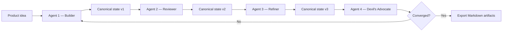

# AI Orchestration Patterns

## What Was Built

[A2A Brainstorm](https://github.com/okfriansyah-moh/a2a-brainstormer) orchestrates a
**fixed-role sequential pipeline** where specialized agents (builder, reviewer, refiner,
devil's advocate) each receive the full **canonical state**, append their contribution,
and pass it to the next agent. The backend Go modular monolith runs this pipeline with
PostgreSQL persistence and streams progress to the frontend via Server-Sent Events.

This pattern differs from task-based coding orchestration (see
[Deterministic Agentic Orchestrator](/docs/concepts/deterministic-agentic-orchestrator))
and from document coherence auditing (see
[AI Document Coherence](/docs/concepts/ai-document-coherence)).

## The Problem

Multi-agent AI systems often devolve into unstructured chat: agents talk past each other,
contradict prior decisions, and produce non-reproducible output. For design sessions
that must converge on architecture documents, you need orchestration where **roles are
fixed**, **state is immutable between agents within a pass**, and **iterations are bounded**.

## Why This Problem Is Difficult

1. **Agent autonomy vs convergence** — too much freedom prevents stabilization.
2. **State consistency** — each agent must see the full prior context, not a summary.
3. **Role boundaries** — a reviewer must not rewrite what the builder produced wholesale.
4. **Iteration control** — sessions need a convergence signal, not infinite loops.
5. **Provider flexibility** — agents may use different LLM providers without breaking the pipeline.

## Beginner Mental Model

Think of a design review meeting with a **shared document on screen**. Each participant
has a fixed role: one person drafts, the next critiques, the third refines, the fourth
challenges assumptions. Everyone reads the same document. After one full round, you check
whether the design has stabilized. If not, you run another round — up to a maximum.

## Requirements and Constraints

| Requirement | Implementation |
|-------------|----------------|
| Fixed-role pipeline | Builder → Reviewer → Refiner → Devil's Advocate |
| Canonical state | Shared state object passed sequentially; each agent appends |
| Determinism | Same input + same config = identical output |
| Convergence detection | Confidence score after each full pass |
| Bounded iterations | Max-iteration limit with user override |
| Provider neutrality | `LLMProvider` interface; credentials via env refs only |
| Progress streaming | SSE to frontend (no WebSocket, no polling) |

## Architecture Overview



The backend runs agents sequentially within each iteration. After every full pass, the
convergence engine scores the delta. Pipeline progress streams over SSE.

## Execution Flow

1. **Session creation** — user provides product idea, selects ≥ 2 agents, optional tech
   constraints and clarifying answers.
2. **Iteration start** — backend loads canonical state from PostgreSQL.
3. **Sequential agent pass** — each agent receives full state, appends contribution via
   A2A executor binary.
4. **Convergence check** — engine scores confidence; if below threshold and under max
   iterations, user triggers next pass.
5. **Feedback injection** — user can inject notes between iterations; folded into state.
6. **Finalization** — user finalizes session; backend generates `architecture.md`,
   `plan.md`, `readme.md`.
7. **Document enhancement** — optional section-sequential generation with coherence audit
   (see [AI Document Coherence](/docs/concepts/ai-document-coherence)).

## Important Components

| Component | Responsibility |
| --------- | -------------- |
| `backend/` (Go) | REST API, pipeline engine, session management |
| `agent/` (Go) | A2A executor binary — one instance per agent slot |
| `frontend/` (SvelteKit) | Session UI, iteration controls, document export |
| Convergence engine | Scores design delta after each full pass |
| `LLMProvider` interface | Provider-neutral LLM calls (DeepSeek, Claude, Copilot) |
| `migrations/` | Append-only SQL schema changes |
| PostgreSQL 16 | Session, iteration, agent, and state persistence |

## Simplified Implementation Examples

Sequential pipeline pass (simplified):

```go
// simplified — each agent receives and returns canonical state
func (p *Pipeline) RunIteration(ctx context.Context, state CanonicalState) (CanonicalState, error) {
    for _, agent := range p.agentsInOrder {
        contribution, err := agent.Execute(ctx, state)
        if err != nil {
            return state, err
        }
        state = state.Append(agent.Role, contribution)
    }
    return state, nil
}
```

Provider-neutral LLM config (simplified):

```env
# simplified — credential ref, not the key itself
GLOBAL_LLM_PROVIDER=deepseek
GLOBAL_LLM_CREDENTIAL_REF=DEEPSEEK_API_KEY
DEEPSEEK_API_KEY=your-key-here
```

## Reliability and Idempotency

- **State persistence:** Every iteration snapshot stored in PostgreSQL; sessions survive
  backend restarts.
- **Agent card resolution:** Retry with exponential backoff for transient A2A errors.
- **JSON extraction:** Tolerant parsing of LLM responses (markdown fences, trailing commas).
- **No silent fallback:** Missing API key makes agent unavailable — no degraded provider switch.

## Failure Modes

| Failure | Behaviour |
| ------- | --------- |
| Agent LLM timeout | Iteration fails; user can retry |
| Invalid JSON from LLM | Extraction logic retries; prompts enforce pure JSON |
| Convergence not reached | User decides to finalize or continue iterations |
| Missing API key | Agent marked unavailable; session cannot use that agent |
| Backend crash | Session state persisted; resume from last iteration |

## Trade-offs and Rejected Alternatives

| Choice | Why | Rejected alternative |
| ------ | --- | -------------------- |
| Fixed-role sequential | Predictable, auditable contributions | Free-form multi-agent chat |
| Canonical state object | Full context for each agent | Per-agent isolated memory |
| SSE progress streaming | Simple, unidirectional | WebSocket complexity |
| Convergence scoring | Objective stop condition | User guesses when done |
| A2A executor binary | Scalable agent slots | Inline LLM calls in backend modules |

## Testing

The repository includes Go tests for JSON extraction, LLM provider selection, agent card
retry logic, and pipeline integration. Frontend has type checking via `make lint`.

## Operations and Observability

- **Start:** `make start` (Docker Compose: postgres, backend, agent, frontend)
- **Logs:** `make docker-logs`
- **Quality gate:** `make test` → `make lint` → `make check`
- **Scale agents:** `make docker-scale SCALE=2`

## Lessons Learned

1. **Orchestration is not conversation** — fixed roles and sequential passes produce
   reviewable, convergent output.
2. **Canonical state is the contract** — every agent reads and appends to the same object.
3. **Convergence needs a metric** — without a confidence score, iterations never end cleanly.
4. **Separate coding orchestration from design orchestration** — skeleton-parallel tasks
   and A2A brainstorm sessions solve different problems.

## Related

- [How to Prevent Contradictions in AI-Generated Documents](/docs/concepts/ai-document-coherence)
- [Designing a Deterministic Agentic Coding Orchestrator](/docs/concepts/deterministic-agentic-orchestrator)
- [LLM Guardrails](/docs/concepts/llm-guardrails)

## Sources

- Repository: [okfriansyah-moh/a2a-brainstormer](https://github.com/okfriansyah-moh/a2a-brainstormer)
- Pull requests: [#7 e2e MVP](https://github.com/okfriansyah-moh/a2a-brainstormer/pull/7), [#8 output quality](https://github.com/okfriansyah-moh/a2a-brainstormer/pull/8)
- Architecture docs: `docs/A2A-agent-Brainstorm.md` in source repo
