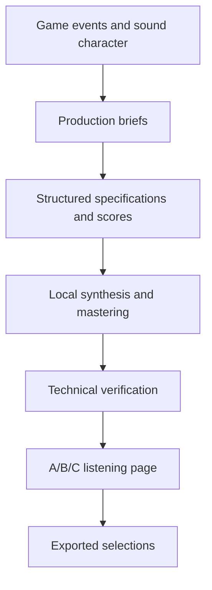

import audio0 from '@site/docs/concepts/audio/codex-game-audio-synthesis/tile_place_A.wav';
import audio1 from '@site/docs/concepts/audio/codex-game-audio-synthesis/tile_place_B.wav';
import audio2 from '@site/docs/concepts/audio/codex-game-audio-synthesis/tile_place_C.wav';
import audio3 from '@site/docs/concepts/audio/codex-game-audio-synthesis/puzzle_victory_C.wav';
import audio4 from '@site/docs/concepts/audio/codex-game-audio-synthesis/bg_gameplay_A.wav';

# How I Used Codex to Synthesize Game Audio: Lessons from Padu

While building Padu, my puzzle game, I needed sounds that belonged to the same world as its ceramic tiles and enamel surfaces. A button press, a tile settling into a slot, and a puzzle victory should each say something different while feeling related.

I used Codex to build a small asset-production workflow: describe the sound, translate that description into editable synthesis code, render alternatives, check the files, and compare them in a listening page. This article shares that method, five real examples, and a prompt I can reuse when building another game.

## What Was Built

The standalone candidate bundle contained **33 sound-effect roles and nine background compositions, with three alternatives each**: 99 effects plus 27 music tracks, or **126 WAV candidates**. A was ceramic/marimba, B wood/copper, and C electronic/ceramic. A saved selection file later recorded one choice for each of the 42 roles.

This is a case study of the candidate-production stage. Its September 28, 2026 evidence covers generation and audition tooling; it does not establish production gameplay or device playback. The Padu repository is private, so I am sharing selected audio, production briefs, and explained excerpts here. Contact me at the end if you want to discuss the full implementation.

## The Problem

I needed a coherent sound vocabulary, not just a folder of appealing noises. A placement cue confirms a move. A mistake cue should be clear without becoming punishing. A victory phrase can be longer, but it must remain pleasant when heard repeatedly.

Background music has a different job: maintain momentum while leaving room for thought and effects. The home composition was 80 BPM; the gameplay composition was 150 BPM. Defining those roles gave Codex something concrete to implement.

## Why This Problem Is Difficult

“Make a nice sound” leaves almost every decision open. Timing, attack, pitch, resonance, loudness, and repetition all affect how the cue feels. A pleasant isolated effect may become tiring after dozens of placements. A good melody can still have an audible seam when repeated.

There is also a distinction between a technically valid file and a sound I want in the game. A script can measure clipping or duration. Choosing whether ceramic, copper, or an electronic pluck fits the scene remains a listening decision.

## Beginner Mental Model

Think of Codex as a collaborator building a tiny instrument workshop. I describe the materials and the action; it writes the instrument and score; my computer computes the waveform; I listen and choose.

Codex can inspect files, write code, and run installed tools, as described in the [official Codex documentation](https://learn.chatgpt.com/docs/codex/cli). In this project, the audio samples came from local numerical synthesis. Python and NumPy generated the waveform, while FFmpeg measured loudness and verified decoding. The workflow used no external music-generation service or source recordings.

The saved natural-language prompts were **production briefs**. Codex translated the intent into instrument algorithms, note patterns, and structured specifications. The renderer itself reads the specification; changing the prose alone does not change the sound.

## Requirements and Constraints

| Asset | Recorded requirement |
| --- | --- |
| Effects | One isolated cue, immediate attack, short natural decay, mono |
| Music | Instrumental, complete-bar repeating arrangement, 90–120 seconds, stereo |
| Masters | 48 kHz, 24-bit signed PCM WAV |
| Effects mastering | Category-dependent RMS targets and a −5 dBFS sample-peak ceiling |
| Music mastering | Target −20 LUFS integrated; true peak below −1 dBTP |
| Inputs | Computed oscillators and seeded noise; no downloaded samples, speech, or artist imitation |
| Handoff | Editable sources, exact scores, prompts, metadata, hashes, and listening choices |

These requirements belong to Padu's brief. Another game may need different tempos, durations, or loudness targets.

## Architecture Overview



## Execution Flow

1. **Describe the event.** Name its trigger, intended meaning, duration, and permitted game modes.
2. **Define three directions.** Keep the same role while varying instruments, pitch, timing, and arrangement.
3. **Compose and synthesize.** Build event scores, mix the voices, and export masters.
4. **Measure the outputs.** Check the actual files against the brief.
5. **Audition and select.** Compare the alternatives and export a portable record of the choices.

### Listen to five real examples

These are the original 48 kHz, 24-bit WAV masters. The three tile-placement alternatives are each 0.24 seconds; compare their contact and decay. The saved selection was B. The victory effect is 1.25 seconds. The gameplay loop is 102.4 seconds: 64 bars in 4/4 at 150 BPM.

Press Play to listen. Audio does not start or download automatically; the full music file is about 29.5 MB. Each block below contains its **complete saved production brief**, copied verbatim from the candidate metadata. These briefs describe the intended result; the renderer uses structured specifications and composition code rather than parsing these paragraphs at runtime.

#### Tile placement A: ceramic / marimba

<p id="demo-0">S07 · 0.24 seconds</p>

<audio controls preload="none" aria-label="Tile placement A: ceramic / marimba" style={{width: '100%', maxWidth: '36rem'}}>
  <source src={audio0} type="audio/wav" />
  <a href={audio0}>Open the WAV audio</a>
</audio>

**Saved production brief:**

> One isolated original Padu effect with a ceramic/enamel character. No speech, vocals, background music, ambience, borrowed melodies or artist imitation. Immediate clean attack and natural short decay; comfortable on headphones and clear on phone speakers. No harsh treble, excessive bass, distortion or long reverb. One effect only. 48 kHz, 24-bit PCM mono WAV. Ceramic tile settling in a fitted recess, contact click then rounded clack, short decay.

#### Tile placement B: wood / copper — saved selection

<p id="demo-1">S07 · 0.24 seconds</p>

<audio controls preload="none" aria-label="Tile placement B: wood / copper — saved selection" style={{width: '100%', maxWidth: '36rem'}}>
  <source src={audio1} type="audio/wav" />
  <a href={audio1}>Open the WAV audio</a>
</audio>

**Saved production brief:**

> One isolated original Padu effect with a ceramic/enamel character. No speech, vocals, background music, ambience, borrowed melodies or artist imitation. Immediate clean attack and natural short decay; comfortable on headphones and clear on phone speakers. No harsh treble, excessive bass, distortion or long reverb. One effect only. 48 kHz, 24-bit PCM mono WAV. Wooden block knock with tiny copper ping; weight and confirmation, no melody.

#### Tile placement C: electronic / ceramic

<p id="demo-2">S07 · 0.24 seconds</p>

<audio controls preload="none" aria-label="Tile placement C: electronic / ceramic" style={{width: '100%', maxWidth: '36rem'}}>
  <source src={audio2} type="audio/wav" />
  <a href={audio2}>Open the WAV audio</a>
</audio>

**Saved production brief:**

> One isolated original Padu effect with a ceramic/enamel character. No speech, vocals, background music, ambience, borrowed melodies or artist imitation. Immediate clean attack and natural short decay; comfortable on headphones and clear on phone speakers. No harsh treble, excessive bass, distortion or long reverb. One effect only. 48 kHz, 24-bit PCM mono WAV. Tight electronic snap then one warm note; accurate lock-in, suitable for rapid placements.

#### Puzzle victory C — saved selection

<p id="demo-3">S25 · 1.25 seconds</p>

<audio controls preload="none" aria-label="Puzzle victory C — saved selection" style={{width: '100%', maxWidth: '36rem'}}>
  <source src={audio3} type="audio/wav" />
  <a href={audio3}>Open the WAV audio</a>
</audio>

**Saved production brief:**

> One isolated original Padu effect with a ceramic/enamel character. No speech, vocals, background music, ambience, borrowed melodies or artist imitation. Immediate clean attack and natural short decay; comfortable on headphones and clear on phone speakers. No harsh treble, excessive bass, distortion or long reverb. One effect only. 48 kHz, 24-bit PCM mono WAV. Punchy ascending electronic phrase with ceramic clicks and bright chord; no bass drop.

#### Gameplay music A — saved selection

<p id="demo-4">B02 · 102.4 seconds · 150 BPM</p>

<audio controls preload="none" aria-label="Gameplay music A — saved selection" style={{width: '100%', maxWidth: '36rem'}}>
  <source src={audio4} type="audio/wav" />
  <a href={audio4}>Open the WAV audio</a>
</audio>

**Saved production brief:**

> Original instrumental Padu puzzle background. No vocals, lyrics, speech, borrowed melodies, artist imitation, downloaded samples or environmental recordings. Sparse melodic space for concentration and effects. Consistent energy, no dramatic introduction, breakdown, final cadence or fade-out. Seamless repeating arrangement, 90–120 seconds. 48 kHz, 24-bit PCM stereo WAV. Fast driving puzzle groove, strong drums and bass, short hooks, no relaxed sections. Instrumental at 150 BPM. Primarily ceramic and marimba: quick mallet attacks, warm modal resonance, dry wooden support and clear tactile contacts. Maintain energy and leave melodic space for thought and short effects. No breakdown, final cadence or fade-out.


## Important Components

| Component | Responsibility |
| --- | --- |
| Editable specification | Event inventory, palettes, duration, BPM, bars, motifs, and harmony |
| Composer | Turn each structured role into timed instrument events |
| Synthesizer | Compute samples for ceramic, wood, copper, marimba, plucks, bass, and drums |
| Mastering and verifier | Set gain and inspect format, peaks, loudness, joins, and compatibility |
| Catalog and listening page | Connect actual files to briefs, triggers, and A/B/C comparison |
| Selection export | Record asset ID, chosen variant, path, and SHA-256 hash |

The listening page could search names and modes, filter categories, play one candidate at a time, stop playback, and repeat background music. Preferences stayed in browser storage when available; JSON export made the choices portable. A storage failure kept choices in the current session and prompted an export.

## Simplified Implementation Examples

An oscillator is a repeating mathematical signal. Add several oscillators with different frequency ratios and decays, and the result can suggest a struck material. In the original renderer, ceramic used ratios such as 1, 2.73, 4.18, and 6.27; marimba used 1, 4, and 10. These are stylized instruments, not recordings of physical objects.

The following excerpt is **simplified from the renderer** to show additive/modal synthesis and an envelope. It is an explanation, not the complete master-production code:

```python
# Simplified: oscillators plus attack and decay.
t = np.arange(round(seconds * sample_rate)) / sample_rate
attack = 1 - np.exp(-t / 0.0007)
x = np.zeros_like(t)
for ratio, weight, decay in partials:
    x += weight * np.sin(2 * np.pi * frequency * ratio * t) * np.exp(-t * decay)
x *= attack
```

The **envelope** controls how quickly a sound starts and fades. A brief filtered-noise burst adds a contact tick. Seeded noise gives that texture repeatable inputs. Electronic plucks use **FM**: another oscillator changes the main oscillator's phase, producing a richer attack. The mixer places each event at its scheduled time, applies gain, and pans stereo instruments.

For a loop, a note near the end can still be ringing when the next repetition starts. The mixer wraps that tail into the beginning instead of cutting it off. Complete bars determine the musical duration:

```python
# Simplified duration calculation for the gameplay composition.
duration_seconds = 64 * 4 * 60 / 150  # 102.4 seconds
```

Mastering then sets the output level. Effects use linear gain constrained by RMS and peak targets. Music uses gentle memoryless saturation followed by measured linear gain. FFmpeg measures loudness; it is not composing the notes. The music masters have no endpoint fades that would create a dip on each repetition.

## Reliability and Idempotency

The workflow retains both the intention and the implementation: production brief, structured specification, exact event score, synthesis code, and metadata. Hashes identify the resulting files. Stable seeds keep procedural noise repeatable when inputs and tooling remain the same.

The historical reproducibility check regenerated **one effect and one complete stereo loop** byte-identically. That is evidence for those two cases in the recorded environment, not a guarantee that every tool version will reproduce every master identically.

## Failure Modes

| Failure | Detection and response |
| --- | --- |
| Clipped or invalid samples | Reject non-finite or out-of-range waveforms before export; verify peaks afterward |
| Wrong duration or channels | Inspect decoded samples and WAV format against metadata |
| Click at a loop join | Measure boundary discontinuity and review repeated playback; preserve note tails |
| Alternatives differ only in loudness | Compare waveforms and inspect instrument, pitch, timing, and arrangement changes |
| Browser playback or storage fails | Show an error or session-only state and keep a usable file/export path |
| Conversion adds padding or changes a join | Recheck decoded timing and playback in the intended delivery backend |

Measured joins do not guarantee seamless playback in every browser or game audio backend. The delivery format, decoder, scheduling, and audio session still need their own checks.

## Trade-offs and Rejected Alternatives

Local synthesis suited the stylized materials in this brief and left editable code and scores. It gave me direct control over attacks, note timing, and loop construction. It also required composition and DSP work; a ceramic model does not automatically sound like a convincing real ceramic tile.

The recorded bundle used no sample library or external generation service. That describes this implementation; it is not evidence that those approaches are unsuitable for another game. A future project with orchestral music, realistic voices, or field recordings would need a different asset workflow and its own source and rights review.

## Testing

The September 28, 2026 verification report recorded **126 expected and present masters, 126 unique hashes, and no missing or extra files**. All files passed its decoding, format, duration, audibility, and applicable compatibility checks.

The final historical evidence summary reported music at **−20.02 to −19.99 LUFS integrated**, a highest music true peak of **−6.59 dBTP**, and a highest effect sample peak of **−5.00 dBFS**. Every measured music join passed the defined check. These are recorded results for that production batch, not measurements newly performed while writing this article.

The original listening interface was checked in Chromium at 320, 390, and 900 pixels. That evidence covers its controls and layout. It does not certify artistic preference, acoustic realism, physical-device listening, or production-game behavior.

## Operations and Observability

In the original private bundle, the workflow was run with:

```sh
# From the candidate bundle; these scripts are not distributed with this article.
python3 sources/render.py
python3 sources/verify_audio.py
python3 sources/build_index.py
```

The production notes recorded Python 3.13.2, NumPy 2.4.4, and FFmpeg 8.1. The verifier produced per-file measurements and failures rather than relying on a successful renderer exit code. To change a sound, edit the structured brief or composer, regenerate the candidate, and recheck its outputs and metadata. Do experimental regeneration in a separate output folder to preserve selected masters.

## Lessons Learned

**Start with the game's events.** Material and mood matter, but the action gives the sound a job. Specify what should trigger the cue and what it should communicate.

**Ask for meaningful alternatives.** Three timbres or arrangements give me something to compare. Three copies with different gain do not help me choose a direction.

**Preserve the recipe.** A WAV is the final result. The specification, code, scores, seeds, and brief make iteration understandable and repeatable.

**Use checks and listening together.** Technical verification catches broken outputs. Listening decides whether the result belongs in the game. Neither replaces the other.

**Treat delivery as another stage.** A validated PCM master still needs conversion, backend, loop, and device checks before production acceptance.

The same pattern can help create other assets: describe the role and constraints, choose a suitable tool, generate editable alternatives, compare them, and preserve provenance. Procedural shapes or particle textures may suit code; illustrations may need an image tool. The reusable part is the workflow, not a claim that one synthesizer can make every asset.

### A prompt for the next game

This is a **new reusable task prompt**, written for this article. It is not a recovered transcript of the original session or one of the saved candidate briefs above. Replace the bracketed fields with your game's requirements:

```text
You are helping me create audio assets for a new game.

First inspect the existing game brief, visual style, asset conventions,
and installed tools. Propose a sound-event inventory before rendering.

Game: [name and one-sentence description]
Sound character: [materials, mood, energy, and sounds to avoid]
Events: [UI click, tile placement, mistake, victory, and game-specific cues]
Timing: [duration range for each effect; BPM, meter, and bars for music]

Create three meaningfully different timbre/arrangement alternatives per
event. Use local procedural synthesis with Python/NumPy and FFmpeg when
appropriate. Do not use downloaded samples or imitate an artist. Inspect
dependencies first; explain any missing tools before adding them.

Deliver 48 kHz, 24-bit PCM WAV masters: mono effects and stereo music.
For music, use complete bars and wrap note tails across the loop boundary.
Use category-appropriate loudness; document targets and measure the output.
Keep effects immediate and comfortable, with clean short tails.

Keep editable specifications, synthesis/composition code, exact event
scores, deterministic seeds, full production briefs, and SHA-256 hashes.
Create a local listening page with search, category filters, A/B/C playback,
one active player, a music-loop option, and exportable selections.

Verify decoding, inventory, duration, channels, clipping, loudness, loop
joins, mono compatibility, and source records. Report actual results and
limitations. Test reproducibility in a separate output directory.
Leave final artistic selection to me. Keep candidates separate from the
game until selected, and verify converted delivery assets separately.
```

### Want to go further?

If you want to discuss the full synthesizer, the listening catalog, or adapting this method to another game, reach out by [email](mailto:okfriansyah@gmail.com) or [LinkedIn](https://www.linkedin.com/in/muhammad-okfriansyah-74092671). I have shared examples and explained excerpts here; the full implementation remains private.

## Sources

- [Official Codex documentation](https://learn.chatgpt.com/docs/codex/cli): inspecting repositories, editing code, and running local tools.
- Author's private repository: `okfriansyah-moh/padu`, inspected at revision `5746ab7c04828d6b382de8a132a2332a18480ee9`. No public source checkout is required to listen to the examples here.
- Candidate records dated September 28, 2026: `artifacts/audio/padu-candidates/README.md`, `sources/specification.json`, `sources/render.py`, and the five candidates' `sources/metadata/*.json` records.
- Historical evidence: `evidence/audio-verification-all.json`, `evidence/reproducibility.json`, `evidence/FINAL_REPORT.md`, and `PROVENANCE.json` in that bundle.
- Saved choices: `selected/padu-audio-choices.json`; B for S07 tile placement, C for S25 victory, and A for B02 gameplay music. The five audio files reproduced here retain the recorded SHA-256 hashes.
