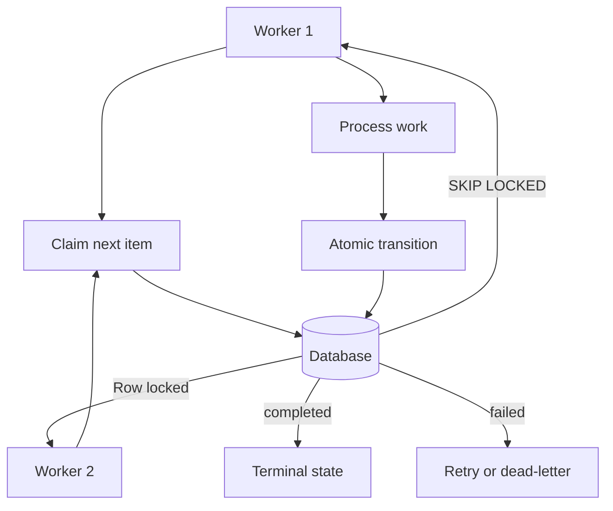

# Database-Backed State Machines

## What Was Built

This article documents the database-backed state machine pattern as implemented across
[shorts-generator](https://github.com/okfriansyah-moh/shorts-generator) (SQLite stage
checkpoints), [md-ame](https://github.com/okfriansyah-moh/md-ame) (PostgreSQL RPC
transitions with `FOR UPDATE SKIP LOCKED`), and
[edge-polymarket-agent](https://github.com/okfriansyah-moh/edge-polymarket-agent)
(Postgres event bus with worker claim lifecycle). In each system, the database is the
**single source of truth** for workflow progress.

## The Problem

Distributed AI workflows need to survive crashes, support concurrent workers, and prevent
duplicate processing. In-memory state machines lose everything on process death.
File-based state (JSON checkpoints, log files) races under concurrency and lacks atomic
transition guarantees. You need a store that supports **atomic state transitions** with
queryable history.

## Why This Problem Is Difficult

1. **Partial writes** — updating status and output in separate queries leaves inconsistent state.
2. **Concurrent claims** — two workers picking the same job causes duplicate LLM calls or trades.
3. **Crash mid-transition** — the process dies between read and write.
4. **Recovery ambiguity** — without explicit states, you cannot distinguish "in progress"
   from "failed" from "stuck".
5. **Idempotency at scale** — retries must not create duplicate side effects.

## Beginner Mental Model

A database-backed state machine is a **ledger with rules**. Each row is a work item with
a current status. Transitions follow allowed paths (`queued` → `processing` → `completed`).
Only the database (via RPC or a single adapter) can change a status. Workers read the
ledger, claim one item, do the work, and write the result back — atomically.

## Requirements and Constraints

| Requirement | shorts-generator | md-ame | polymarket-agent |
|-------------|------------------|--------|------------------|
| State store | SQLite (single file) | Supabase PostgreSQL | PostgreSQL event bus |
| Transition atomicity | Adapter layer writes | PostgreSQL RPC functions | Event claim/complete API |
| Concurrent claims | Single-process orchestrator | `FOR UPDATE SKIP LOCKED` | `FOR UPDATE SKIP LOCKED` |
| Idempotency | Content-addressable IDs | SHA-256 idempotency_key | Event deduplication |
| Recovery | Resume from last stage | Cron replay + recovery pass | Unclaimed events re-claimed |
| Schema changes | Python migrations | Append-only SQL migrations | Versioned DB migrations |

## Architecture Overview



## Execution Flow

1. **Create work item** — insert row with initial status and `idempotency_key`.
2. **Claim** — worker selects next eligible row with row-level lock (`FOR UPDATE SKIP LOCKED`).
3. **Process** — worker executes stage logic (may include LLM calls).
4. **Transition** — atomically update status, output, and timestamps in one operation.
5. **Complete or fail** — terminal states are explicit; failed items may retry with backoff.
6. **Recovery** — orchestrator scans for stuck items (processing too long) and resumes or fails.

## Important Components

| Component | Responsibility |
| --------- | -------------- |
| State table / event bus | Stores current status and payload per work item |
| Claim query | `FOR UPDATE SKIP LOCKED` prevents double-claiming |
| RPC / adapter layer | Sole authority for multi-row transitions |
| Idempotency key | Unique constraint prevents duplicate work units |
| Recovery scanner | Finds stalled items before new work generation |
| Dead-letter queue | Captures permanently failed items for inspection |

## Simplified Implementation Examples

SQLite stage checkpoint (simplified):

```python
# simplified — shorts-generator pattern
def record_stage_complete(video_id: str, stage: str, output: dict):
    db.execute(
        "INSERT INTO stage_results (video_id, stage, output, completed_at) "
        "VALUES (?, ?, ?, ?) ON CONFLICT DO NOTHING",
        (video_id, stage, json.dumps(output), now()),
    )
```

PostgreSQL RPC transition (simplified):

```sql
-- simplified — md-ame pattern: atomic status update via RPC
CREATE FUNCTION transition_job_status(
  p_job_id UUID, p_from TEXT, p_to TEXT
) RETURNS BOOLEAN AS $$
  UPDATE jobs SET status = p_to, updated_at = now()
  WHERE id = p_job_id AND status = p_from
  RETURNING id IS NOT NULL;
$$ LANGUAGE sql;
```

Event bus claim (simplified):

```python
# simplified — polymarket pattern
def claim_next(event_type: str) -> Event | None:
    return db.fetchone("""
        UPDATE events SET status = 'processing', claimed_at = now()
        WHERE id = (
            SELECT id FROM events
            WHERE event_type = %s AND status = 'pending'
            ORDER BY created_at
            FOR UPDATE SKIP LOCKED LIMIT 1
        ) RETURNING *
    """, (event_type,))
```

## Reliability and Idempotency

- **Atomic transitions:** Status changes and output writes happen in a single database
  operation (RPC, transaction, or `UPDATE ... RETURNING`).
- **Claim isolation:** `SKIP LOCKED` lets concurrent workers proceed without blocking
  on each other's claims.
- **Idempotency keys:** `ON CONFLICT DO NOTHING` or unique constraints prevent duplicate
  work units on retry.
- **Recovery:** Stuck detection uses timestamps — items in `processing` beyond a
  threshold are resumed or marked failed.

## Failure Modes

| Failure | Behaviour |
| ------- | --------- |
| Worker crash after claim | Item stays `processing`; recovery scanner reclaims |
| Duplicate insert | Idempotency key rejects duplicate |
| RPC transition race | `WHERE status = p_from` guard fails safely |
| Database unavailable | Workers fail fast; no silent in-memory fallback |
| Schema migration error | Append-only migrations; rollback via new migration |

## Trade-offs and Rejected Alternatives

| Store | Best for | Limitation |
| ----- | -------- | ---------- |
| SQLite | Single-machine pipelines (shorts-generator) | No concurrent writers across processes |
| PostgreSQL RPC | Multi-worker, cloud-hosted (md-ame, polymarket) | Requires managed DB and migration discipline |
| In-memory state | Prototyping only | Lost on crash |
| JSON file checkpoints | Simple scripts | Race conditions under concurrency |
| Redis | Fast ephemeral queues | Not authoritative for complex state graphs |

## Testing

Test state machines by asserting allowed transitions, rejecting invalid transitions, and
verifying concurrent claim behaviour. All three source repos include tests for adapter/RPC
layers and worker claim logic.

## Operations and Observability

- Query stuck items: `SELECT * FROM jobs WHERE status = 'processing' AND updated_at < now() - interval '30 minutes'`
- Monitor dead-letter queue depth for permanently failed events
- Use structured logging with work-item IDs correlated to database rows

## Lessons Learned

1. **The database is the state machine** — do not mirror state in application memory.
2. **RPC functions enforce invariants** — move multi-row logic to the database boundary.
3. **`SKIP LOCKED` is essential** — for concurrent workers without a central dispatcher.
4. **Explicit terminal states** — every work item must end in `completed`, `failed`, or
   `cancelled`; never ambiguous `processing` forever.

## Related

- [Deterministic AI Pipelines](/docs/concepts/deterministic-ai-pipelines)
- [Building a Restartable Long-Video Processing Pipeline](/docs/systems/shorts-generator-pipeline)
- [MD-AME: Autonomous Media Engine](/docs/systems/md-ame-autonomous-media-engine)
- [Polymarket Trading Agent](/docs/systems/polymarket-trading-agent)

## Sources

- Repository: [okfriansyah-moh/shorts-generator](https://github.com/okfriansyah-moh/shorts-generator)
- Repository: [okfriansyah-moh/md-ame](https://github.com/okfriansyah-moh/md-ame)
- Repository: [okfriansyah-moh/edge-polymarket-agent](https://github.com/okfriansyah-moh/edge-polymarket-agent)
