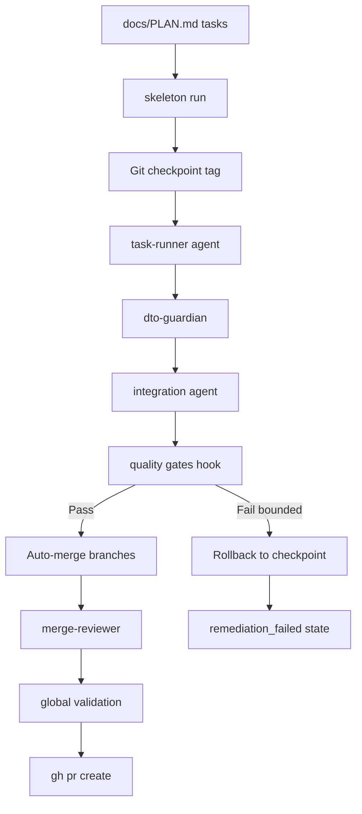

# Designing a Deterministic Agentic Coding Orchestrator

## What Was Built

[skeleton-parallel](https://github.com/okfriansyah-moh/skeleton-parallel) is a
reusable baseline for building deterministic software with AI agents. Version 1.0
replaced a **phase-based parallel orchestrator** (`run_parallel.sh` +
`config/phases.yaml`) with a **task-based agentic CLI** (`skeleton run` +
`docs/PLAN.md`). The system runs autonomous implementation tasks through a bounded
retry pipeline with Git checkpoint rollback and automated quality gates.

## The Problem

AI agents can implement software features, but unconstrained agent loops are
non-deterministic, expensive, and prone to infinite retry. You need an orchestrator
that:

- Defines work as discrete, verifiable tasks.
- Runs agents with bounded retries and explicit rollback.
- Validates architecture rules (DTO immutability, module boundaries).
- Terminates in a known state — success, rollback, or `remediation_failed`.

## Why This Problem Is Difficult

1. **Parallelism vs context** — parallel agents are fast but merge conflicts are costly.
2. **Agent non-determinism** — same prompt can produce different code.
3. **Architecture drift** — agents violate module boundaries without enforcement.
4. **Unbounded retries** — failed agents can loop forever without checkpoint rollback.
5. **Migration** — existing projects using phase-based config need a compatibility path.

## Beginner Mental Model

Think of a construction site manager with a task list (`docs/PLAN.md`). For each
task, the manager sends workers (AI agents) through a **fixed checklist**: build →
validate DTOs → check integration → run quality gates. Before starting each task,
the manager places a **checkpoint flag** (Git tag). If workers fail after 5 attempts,
the manager resets to the flag and marks the task failed. The site **always** ends in
a known state.

## Requirements and Constraints

| Requirement | v1.0 implementation |
|-------------|---------------------|
| Work definition | `docs/PLAN.md` with `### Task N` sections |
| Orchestrator | `skeleton run` CLI reading `config/skeleton.yaml` |
| Bounded retries | Per-stage limits in YAML (`retries.task_runner`, etc.) |
| Checkpoint rollback | Git tags before each task; `git reset --hard` on failure |
| Quality gates | `scripts/hooks/quality-gates.sh` (project-specific) |
| Provider flexibility | `router_http`, `cli_subscription`, `sdk_cursor` drivers |
| Backward compatibility | `run_parallel.sh` shim delegates to `skeleton run` for one release |

## Architecture Overview



Three execution modes balance speed and cost:

| Mode | Parallelism | Best for |
|------|-------------|----------|
| `--parallel` | Full (separate worktrees) | Independent tasks, deadline pressure |
| `--sequential` | None (shared context) | Cost-sensitive, dependent tasks |
| Default (hybrid) | Groups in parallel, sequential within group | Most sessions |

## Execution Flow

1. Operator defines tasks in `docs/PLAN.md` with dependencies and complexity.
2. `skeleton run <task-ids>` creates Git branches/worktrees per mode.
3. Checkpoint tag placed: `checkpoint-<task>-pre`.
4. Agent pipeline executes per task:
   - **task-runner** — implements the task (up to N retries).
   - **dto-guardian** — validates `contracts/` immutability (STRICT).
   - **integration** — checks cross-module wiring.
   - **refactor** — fixes quality gate failures (bounded retries).
5. On retry exhaustion: `git reset --hard` to checkpoint; task marked `failed`.
6. Successful tasks auto-merge via union strategy; `conflict-resolver` agent handles merges.
7. Post-merge: `merge-reviewer` validates DTO flow and module boundaries.
8. Global validation runs `quality-gates.sh`; remediation agent fixes failures.
9. `gh pr create` opens a reviewable pull request.

## Important Components

| Component | Responsibility |
|-----------|----------------|
| `skeleton run` | Task orchestration CLI entry point |
| `config/skeleton.yaml` | Retry limits, model routing, execution drivers |
| `.skeleton-dev/run-status.json` | Per-task state tracking |
| `.skeleton-dev/events.jsonl` | Append-only event log (rollbacks, failures) |
| `scripts/hooks/quality-gates.sh` | Project-specific lint, test, architecture checks |
| `scripts/hooks/setup-env.sh` | Dependency installation per worktree |
| `run_parallel.sh` | Deprecated shim → `skeleton run` |

## Simplified Implementation Examples

Universal retry pattern (from project docs):

```text
execute → validate → fix → re-validate → bounded retry → success OR rollback
```

Task state values:

```json
{
  "task-1": {
    "state": "complete",
    "model": "claude-sonnet-4.6",
    "exit_code": 0
  }
}
```

States: `running` → `complete` | `failed` | `timed_out`

## Reliability and Idempotency

- **State storage:** `.skeleton-dev/run-status.json` and `events.jsonl`.
- **Synchronous agent stages:** Each pipeline stage completes before the next begins.
- **Parallel task groups:** Independent worktrees isolate file conflicts.
- **Checkpoint rollback:** Git tags provide deterministic undo — no partial file state.
- **Guaranteed termination:** All retry limits are bounded; system cannot loop forever.

## Failure Modes

| Failure | Behaviour |
|---------|-----------|
| Task exceeds retry limit | Rollback to checkpoint; other parallel tasks continue |
| DTO validation fails (STRICT) | Rollback; DTO changes are never partially merged |
| Merge conflict | `conflict-resolver` agent (up to 5 retries) |
| Global validation fails | `refactor` remediation (up to 5 retries) → `remediation_failed` |
| Agent timeout (30 min default) | Task marked `timed_out`; treated as failure |
| Partial group failure (hybrid mode) | Auto-merge skipped; operator runs `skeleton run merge` manually |

## Trade-offs and Rejected Alternatives

| Choice | Why | Rejected alternative |
|--------|-----|-------------------|
| Task-based (`PLAN.md`) | Human-readable; maps to PR-sized work units | Phase YAML — harder to read and migrate |
| Git checkpoint rollback | Simple, proven, auditable | Filesystem snapshots — not version-controlled |
| Hook-based quality gates | Language-agnostic orchestrator | Hardcoded Python/Go checks in orchestrator |
| Bounded retries everywhere | Guaranteed termination | Unlimited retry — infinite loops, token waste |
| One-release shim | Smooth migration for existing users | Hard cutover — breaks CI pipelines |

## Testing

Quality gate chain: `make test` → `make lint` → `make check`. The orchestrator
delegates all language-specific validation to hook scripts, keeping the core
orchestrator project-agnostic.

## Operations and Observability

```bash
skeleton run 1 2 3               # hybrid mode (default)
skeleton run --parallel 1 2 3     # full parallel
skeleton run --sequential 1 2 3   # token-optimized
skeleton run --full               # entire PLAN
skeleton doctor                   # verify installation
```

Status persisted to `.skeleton-dev/run-status.json` with per-task model, exit code,
and timestamps. Event log in `.skeleton-dev/events.jsonl` captures rollbacks.

## Lessons Learned

1. **Tasks beat phases** — `### Task N` in Markdown is more portable than YAML phase
   configs and maps naturally to PR scope.
2. **Checkpoints before agents, not after** — rollback must be instant and trustworthy.
3. **Strict DTO enforcement** — architecture violations caught early save expensive
   integration debugging.
4. **Shim migrations** — one-release compatibility shims prevent breaking existing
   automation while new CLI stabilizes.

## Sources

- Repository: [okfriansyah-moh/skeleton-parallel](https://github.com/okfriansyah-moh/skeleton-parallel)
- Pull requests: [#1 Agentic loop migration](https://github.com/okfriansyah-moh/skeleton-parallel/pull/1), [#2 Arch-aware scaffolding](https://github.com/okfriansyah-moh/skeleton-parallel/pull/2)
- Documentation: `docs/PARALLEL_DEV.md` §11 Migration Guide in source repo
