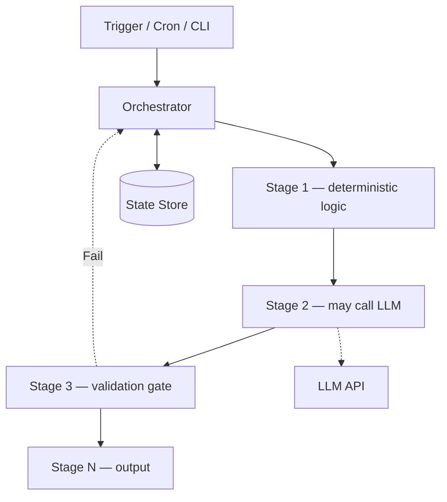

# Deterministic AI Pipelines

## What Was Built

This article synthesizes the deterministic pipeline pattern used across three public
repositories: [shorts-generator](https://github.com/okfriansyah-moh/shorts-generator)
(16-stage video pipeline with SQLite checkpoints),
[md-ame](https://github.com/okfriansyah-moh/md-ame) (autonomous media engine with
PostgreSQL RPC state machines), and
[skeleton-parallel](https://github.com/okfriansyah-moh/skeleton-parallel) (task-based
agent loop with Git checkpoint rollback). Together they demonstrate how to build AI
systems where **same input + same config = predictable, recoverable output**.

## The Problem

Most AI pipelines fail in production because they treat LLM calls as the orchestration
layer. Agents decide what to do next, retries are unbounded, and state lives in memory
or scattered log files. When a run crashes or an operator reruns a job, you get
duplicate outputs, corrupted partial state, or non-reproducible results.

## Why This Problem Is Difficult

1. **LLM non-determinism** — model outputs vary even with identical prompts.
2. **Long-running stages** — transcription, rendering, and API calls take minutes.
3. **Partial failure** — a crash at stage 12 of 16 must not restart from stage 1.
4. **Concurrency** — multiple workers claiming the same job causes duplicate work.
5. **Configuration drift** — per-account or per-dimension overrides multiply state space.

## Beginner Mental Model

A deterministic AI pipeline is a **recipe with a checklist**, not a conversation. The
orchestrator owns the checklist (state store). Each step receives defined inputs, produces
defined outputs, and records completion before the next step begins. If the kitchen
catches fire, you read the checklist and resume at the first unchecked item — you do
not start cooking from scratch.

## Requirements and Constraints

| Requirement | shorts-generator | md-ame | skeleton-parallel |
|-------------|------------------|--------|-------------------|
| State store | SQLite | Supabase PostgreSQL | Git tags + PLAN.md |
| Stage ordering | Fixed 16 stages | Fixed pipeline phases | Task list in PLAN.md |
| Idempotency | Content-addressable video_id | SHA-256 idempotency_key | Checkpoint rollback |
| Module isolation | Frozen DTO contracts | RPC-gated DB transitions | Quality gate scripts |
| Retry bounds | Resume from last stage | Cron replay + recovery pass | Max 5 attempts per task |
| Orchestrator authority | Single Python process | Cron + global lock | `skeleton run` CLI |

## Architecture Overview



The orchestrator is the only component that advances state. LLM calls are **workers
inside stages**, not the control plane.

## Execution Flow

1. **Trigger** — cron, scheduler, or CLI command starts a run with a known execution ID.
2. **Load state** — orchestrator reads the state store for in-progress or stalled work.
3. **Recovery pass** — identify and resume or fail stuck jobs before generating new work.
4. **Stage execution** — run each stage sequentially; record completion in state store.
5. **LLM stages** — treat LLM output as data to validate, not as routing decisions.
6. **Quality gates** — validation stages reject bad output before it propagates downstream.
7. **Terminal state** — run ends in `completed`, `failed`, or `rolled_back` — never ambiguous.

## Important Components

| Pattern | Responsibility |
| ------- | -------------- |
| Orchestrator | Stage ordering, checkpointing, error handling |
| State store | Single source of truth for progress and outputs |
| Frozen contracts | DTOs or RPC schemas between stages/modules |
| Idempotency keys | Prevent duplicate outputs on retry |
| Quality gates | Validate LLM output before advancing |
| Recovery pass | Handle stalled work before new generation |

## Simplified Implementation Examples

Orchestrator checkpoint pattern (simplified):

```python
# simplified — resume from last completed stage
last_stage = db.get_last_completed_stage(run_id)
for stage in STAGES[index_of(last_stage) + 1:]:
    output = stage.run(input_dto)
    db.record_stage_complete(run_id, stage.name, output)
```

Idempotent insert (simplified):

```sql
-- simplified — safe rerun
INSERT INTO work_units (idempotency_key, status, payload)
VALUES ($1, 'queued', $2)
ON CONFLICT (idempotency_key) DO NOTHING;
```

## Reliability and Idempotency

- **Where state lives:** Always in a durable store (SQLite, PostgreSQL, or Git), never
  only in process memory.
- **What happens on retry:** Completed stages are skipped; in-progress stages are
  resumed or failed explicitly.
- **LLM calls:** Cached by content hash where possible (TTS in shorts-generator,
  scene cache in md-ame).
- **Concurrency:** `FOR UPDATE SKIP LOCKED` (md-ame, polymarket) or single-process
  orchestrator (shorts-generator) prevents duplicate claims.

## Failure Modes

| Failure | Behaviour |
| ------- | --------- |
| Crash mid-pipeline | Resume from last recorded stage |
| LLM returns invalid output | Quality gate rejects; bounded retry |
| Duplicate cron trigger | Idempotency keys prevent duplicate outputs |
| Stale in-progress job | Recovery pass identifies and resumes or fails |
| Config change mid-run | New run gets new idempotency key; old run completes or fails |

## Trade-offs and Rejected Alternatives

| Choice | Why | Rejected alternative |
| ------ | --- | -------------------- |
| Orchestrator-controlled stages | Predictable, testable flow | Agent decides next step dynamically |
| Durable state store | Crash recovery | In-memory state + hope |
| Bounded retries | Known termination | Unbounded agent loops |
| Quality gates on LLM output | Catch errors before propagation | Trust LLM output blindly |
| Idempotency keys | Safe reruns | Delete-and-recreate on retry |

## Testing

All three source repositories include unit and integration tests. Deterministic stages
are tested with fixtures; LLM stages use mocks or recorded responses. Quality gates
have explicit test cases for pass/fail/revert paths.

## Operations and Observability

- **shorts-generator:** Per-video `pipeline.log`; SQLite queryable state; cron schedulers
- **md-ame:** Structured stdout with `execution_id`; Telegram weekly reports
- **skeleton-parallel:** Git tags as rollback points; quality gate script output

## Lessons Learned

1. **Separate the control plane from the LLM** — orchestrators decide *when*; LLMs
   decide *what text/code* within a bounded stage.
2. **Checkpoint at stage boundaries** — coarse-grained resume beats fine-grained
   sub-step recovery for most pipelines.
3. **Idempotency is not optional** — any system that can be retried must produce the
   same outcome given the same input state.
4. **Agent chaos is a design smell** — if your pipeline cannot be diagrammed as a
   flowchart, it is not deterministic enough for production.

## Related

- [Building a Restartable Long-Video Processing Pipeline](/docs/systems/shorts-generator-pipeline)
- [MD-AME: Autonomous Media Engine](/docs/systems/md-ame-autonomous-media-engine)
- [Designing a Deterministic Agentic Coding Orchestrator](/docs/concepts/deterministic-agentic-orchestrator)
- [Database-Backed State Machines](/docs/concepts/database-state-machines)

## Sources

- Repository: [okfriansyah-moh/shorts-generator](https://github.com/okfriansyah-moh/shorts-generator)
- Repository: [okfriansyah-moh/md-ame](https://github.com/okfriansyah-moh/md-ame)
- Repository: [okfriansyah-moh/skeleton-parallel](https://github.com/okfriansyah-moh/skeleton-parallel)
- Pull requests: [shorts-generator#8](https://github.com/okfriansyah-moh/shorts-generator/pull/8), [skeleton-parallel#1](https://github.com/okfriansyah-moh/skeleton-parallel/pull/1)
