# 8 LeetCode Patterns to Master

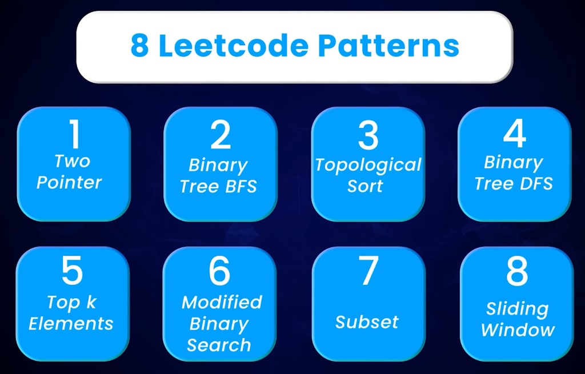

You do not need 2,000 unique tricks to pass a coding interview. You need a small set of
**reusable patterns** that show up again and again. Once you can name the pattern, the
code shape is usually the same: two indices moving on a sorted array, a window growing
and shrinking on a string, a min-heap of size `k`, a queue that processes one tree
level at a time.

This guide covers **eight LeetCode patterns**. For each one you will get:

- **When to use it** — the trigger that should fire when you read a new prompt
- **A beginner mental model** — what the algorithm is doing in plain language
- **A worked example** with diagrams
- **Canonical problems** (the questions interviewers actually reuse)
- **Simplified code** you can type from memory
- **Practice questions** to lock the pattern in

The companion Java catalog is
[Data Structures & Algorithms Learning Catalog](/docs/projects/data-structure-and-algorithm).
Use this page to **recognize** the pattern; use that repo to **run** related
implementations.

## What this guide is

A pattern catalog for interview problem-solving. The eight patterns are the ones that
cover most array, string, tree, and graph questions you will see in a 45-minute
round. The original study notes behind this page are preserved here as the **when to
use** rules — polished for clarity, but with the same intent.

## The problem

Solving LeetCode one problem at a time feels productive until you hit a new prompt
and start from zero. The question is rarely “have I seen this exact input before?”
It is “which **family** does this belong to?”

Without a named family, you brute-force nested loops, then run out of time. With a
named family, you already know the data structure (two indices, a queue, a heap of
size `k`) and only have to fill in the condition.

## Why this is difficult

1. **Prompts hide the pattern.** “Longest substring with at most `k` distinct
   characters” never says “sliding window.”
2. **Two patterns can look similar.** DFS and BFS both visit every node. Two Pointer
   and Sliding Window both use two indices. The _question_ decides which one.
3. **Edge cases are the real test.** Duplicates, rotated arrays, cycles in a graph,
   empty trees — the pattern still holds, but the condition changes.
4. **Interviews reward recognition speed.** You have minutes, not hours, to pick a
   direction.

## Beginner mental model

Think of patterns as **tools on a belt**, not as 2,000 separate recipes:

| If the prompt sounds like…                               | Reach for…             |
| -------------------------------------------------------- | ---------------------- |
| Two indices on a **sorted** array, one pass              | Two Pointer            |
| Visit a tree **level by level**                          | Binary Tree BFS        |
| Tasks with **prerequisites**, no loops                   | Topological Sort       |
| Walk a tree **one branch at a time**                     | Binary Tree DFS        |
| The **top ranking** `k` items in a list                  | Top K Elements (heap)  |
| Search a space that is **sorted but rotated / noisy**    | Modified Binary Search |
| **All combinations / arrangements** of a set             | Subset                 |
| A **substring / subarray** that must satisfy a condition | Sliding Window         |

The rest of this page is that table, expanded, with pictures and problems.

## The 8 patterns at a glance

| #   | Pattern                | Core data structure              | Typical output                            |
| --- | ---------------------- | -------------------------------- | ----------------------------------------- |
| 1   | Two Pointer            | Two indices on a sorted array    | A pair, a triplet, or an in-place rewrite |
| 2   | Binary Tree BFS        | Queue                            | Values grouped by level                   |
| 3   | Topological Sort       | Graph + indegree / DFS state     | A valid order, or “impossible”            |
| 4   | Binary Tree DFS        | Recursion (call stack)           | Depth, path, or a yes/no on a branch      |
| 5   | Top K Elements         | Heap of size `k`                 | The k-th largest, or the k largest        |
| 6   | Modified Binary Search | Lo / hi on a search space        | An index, a boundary, or a minimum        |
| 7   | Subset                 | Recursion + choose / skip        | All combinations or arrangements          |
| 8   | Sliding Window         | Left / right on a list or string | Shortest or longest valid window          |

---

## Pattern 1 — Two Pointer

### When to use

Use Two Pointer when you need to **iterate through a sorted array**. Taking a hint
from the name itself, you will be using **two pointers** in this pattern. Each
pointer keeps track of an index in the array. By moving these pointers smartly, you
can often solve the problem in a **single pass**, which makes the algorithm more
efficient.

That is the whole idea: two moving fingers instead of a nested `for` loop.

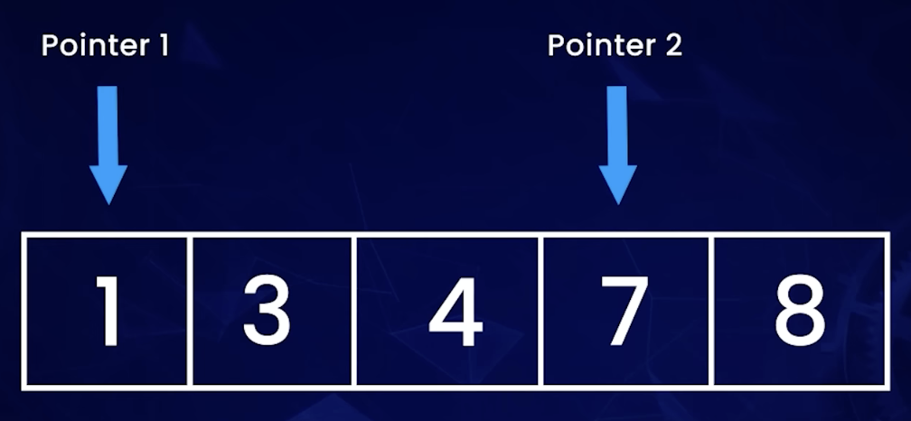

In the diagram, Pointer 1 sits on `1` and Pointer 2 sits on `7` in
`[1, 3, 4, 7, 8]`. You compare (or add) the two values, then move **one** pointer.
You never restart from the left on every step — that is what makes it `O(n)` after
the sort.

### Beginner mental model

Imagine a dictionary already sorted A→Z. You want two words whose page numbers add
up to a target. One finger starts at the first page, the other at the last. If the
sum is too small, move the left finger right. If the sum is too big, move the right
finger left. You meet in the middle after one pass.

### How it works

1. **Sort** if the input is not already sorted (some prompts already are).
2. Put `left` at index `0` and `right` at index `n - 1`.
3. While `left < right`:
   - If the pair (or the sum) **matches** the target, you are done (or you record it
     and skip duplicates).
   - If the result is **too small**, `left += 1`.
   - If the result is **too large**, `right -= 1`.
4. Stop when the pointers cross.

Two other flavors use the same two indices, with different move rules:

- **Same direction** (26. Remove Duplicates): `slow` writes the next unique value, `fast` reads ahead
- **Height / area** (11. Container With Most Water): move the pointer at the **shorter** wall

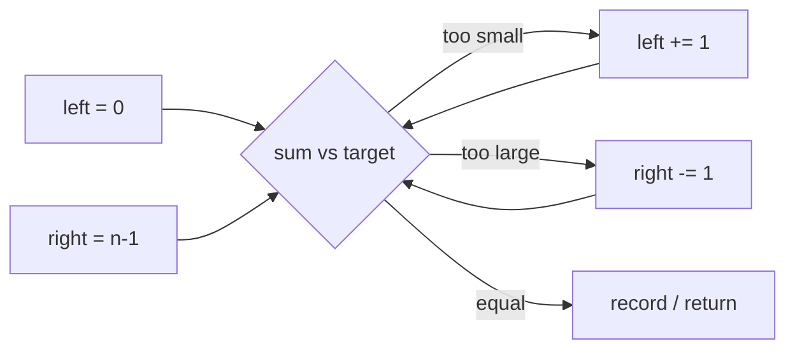

### Problem: Two Sum II — Input Array Is Sorted

This is the cleanest Two Pointer question. The array is **already sorted**, you must
use **constant extra space**, and there is exactly one solution.


**Prompt (same intent as the problem):** given a 1-indexed array `numbers` sorted in
non-decreasing order, find two numbers that add up to `target`. Return their
**1-based** indices. You may not use the same element twice.

| Example | Input                                    | Output   | Why           |
| ------- | ---------------------------------------- | -------- | ------------- |
| 1       | `numbers = [2, 7, 11, 15]`, `target = 9` | `[1, 2]` | `2 + 7 = 9`   |
| 2       | `numbers = [2, 3, 4]`, `target = 6`      | `[1, 3]` | `2 + 4 = 6`   |
| 3       | `numbers = [-1, 0]`, `target = -1`       | `[1, 2]` | `-1 + 0 = -1` |

A hash map would also find the pair, but it uses `O(n)` extra space. The prompt
forbids that. Two Pointer is the pattern that stays at `O(1)` extra space.

### Worked example: target = 18

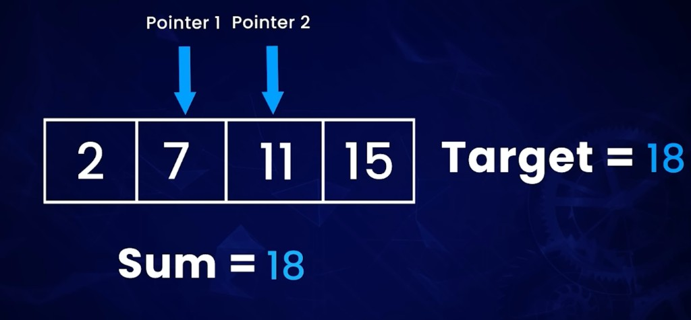

Walk `[2, 7, 11, 15]` with `target = 18`:

1. `left` on `2`, `right` on `15`. Sum = `17` — too small, so move `left`.
2. `left` on `7`, `right` on `15`. Sum = `22` — too large, so move `right`.
3. `left` on `7`, `right` on `11`. Sum = `18` — match.

Return the 1-based indices `[2, 3]`.

### Simplified code

```python
def two_sum_sorted(numbers: list[int], target: int) -> list[int]:
    left, right = 0, len(numbers) - 1
    while left < right:
        total = numbers[left] + numbers[right]
        if total == target:
            return [left + 1, right + 1]  # 1-based
        if total < target:
            left += 1
        else:
            right -= 1
    return []
```

Time `O(n)`. Extra space `O(1)`.

### Problem: 3Sum

Two Pointer also scales to **triplets**. You fix one number, then run Two Sum on
the rest of the sorted array. The extra rule: **do not return duplicate triplets**.

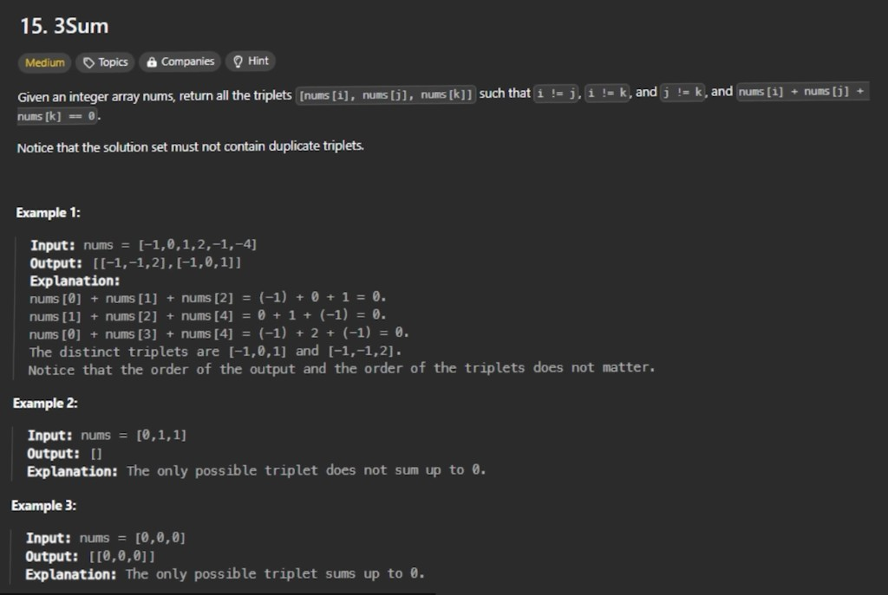

**Prompt (same intent):** given `nums`, return all triplets `[nums[i], nums[j],
nums[k]]` such that `i`, `j`, and `k` are different indices and the three values
sum to `0`. The solution set must not contain duplicate triplets.

| Example | Input                   | Output                      |
| ------- | ----------------------- | --------------------------- |
| 1       | `[-1, 0, 1, 2, -1, -4]` | `[[-1, -1, 2], [-1, 0, 1]]` |
| 2       | `[0, 1, 1]`             | `[]`                        |
| 3       | `[0, 0, 0]`             | `[[0, 0, 0]]`               |

Why sorting first? After `[-4, -1, -1, 0, 1, 2]`, you can skip a value when it
equals the previous one. That is how you kill duplicate triplets without a set of
tuples.

```python
def three_sum(nums: list[int]) -> list[list[int]]:
    nums.sort()
    result: list[list[int]] = []
    for i in range(len(nums)):
        if i > 0 and nums[i] == nums[i - 1]:
            continue  # skip duplicate anchors
        left, right = i + 1, len(nums) - 1
        while left < right:
            total = nums[i] + nums[left] + nums[right]
            if total == 0:
                result.append([nums[i], nums[left], nums[right]])
                left += 1
                right -= 1
                while left < right and nums[left] == nums[left - 1]:
                    left += 1
                while left < right and nums[right] == nums[right + 1]:
                    right -= 1
            elif total < 0:
                left += 1
            else:
                right -= 1
    return result
```

### Practice questions

| Problem                                                                                                       | What to notice                                        |
| ------------------------------------------------------------------------------------------------------------- | ----------------------------------------------------- |
| [167. Two Sum II](https://leetcode.com/problems/two-sum-ii-input-array-is-sorted/)                            | Sorted + `O(1)` space → Two Pointer, not a hash map   |
| [15. 3Sum](https://leetcode.com/problems/3sum/)                                                               | Sort, then Two Pointer inside a loop; skip duplicates |
| [11. Container With Most Water](https://leetcode.com/problems/container-with-most-water/)                     | Move the pointer at the **shorter** wall              |
| [26. Remove Duplicates from Sorted Array](https://leetcode.com/problems/remove-duplicates-from-sorted-array/) | Slow pointer writes, fast pointer reads               |

### Common mistakes

- Using Two Pointer on an **unsorted** array without sorting first (unless the
  prompt is a linked-list / in-place partition, which is a different flavor).
- Forgetting that Two Sum II returns **1-based** indices.
- In 3Sum, skipping duplicates on only one side, so `[-1, -1, 2]` is lost or
  repeated.

---

## Pattern 2 — Binary Tree BFS

### When to use

The difference between DFS and BFS: **DFS goes deep**, starting from the left side
first, and finishes all the deeper nodes on that branch. **BFS goes one at a time
on the same level**, across different branches first.

To do BFS you need a **queue**. By doing this, the elements at the same level of
the tree will always remain next to each other on the queue. This way you can
process them one after the other. The problem is usually called **level order
traversal** of a binary tree.

### Beginner mental model

DFS is a person walking down one hallway to the end, then backing up. BFS is a
firefighter spraying **every door on this floor** before taking the stairs. The
queue is the line of doors on the current floor.

### How it works

1. Put the root in a queue.
2. While the queue is not empty:
   - Read `size = queue.length` — that is **this level’s width**.
   - Pop `size` nodes, collect their values, and enqueue their children.
3. Each inner loop is one level. Append that level’s list to the answer.

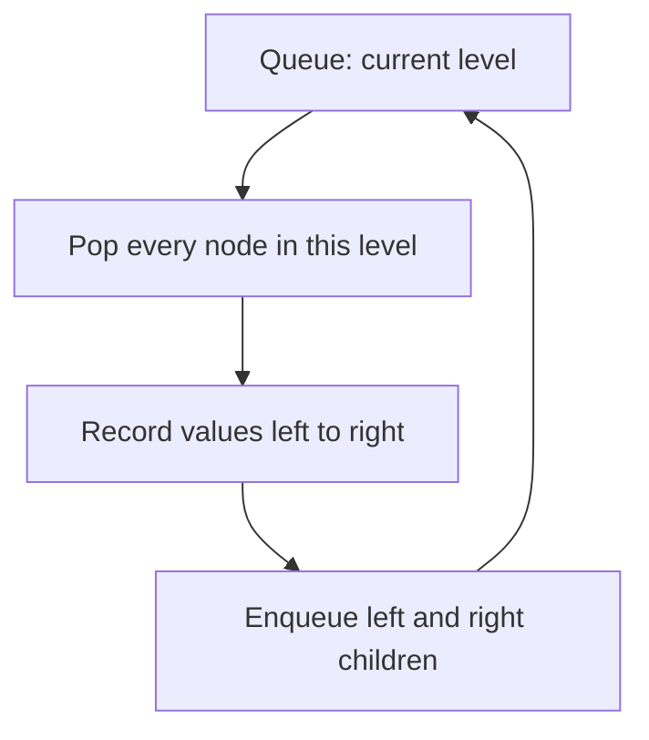

### Problem: Binary Tree Level Order Traversal


**Prompt (same intent):** given the `root` of a binary tree, return the level order
traversal of its nodes’ values — from left to right, level by level.

**Input:** `root = [3, 9, 20, null, null, 15, 7]`  
**Output:** `[[3], [9, 20], [15, 7]]`

| Level | Nodes in the queue (left to right) | Collected |
| ----- | ---------------------------------- | --------- |
| 0     | `3`                                | `[3]`     |
| 1     | `9`, `20`                          | `[9, 20]` |
| 2     | `15`, `7`                          | `[15, 7]` |

The highlighted leaves `15` and `7` sit on the same level even though they hang
under different parents. The queue is what keeps them neighbors.

### Simplified code

```python
from collections import deque

def level_order(root) -> list[list[int]]:
    if not root:
        return []
    result = []
    queue = deque([root])
    while queue:
        level = []
        for _ in range(len(queue)):
            node = queue.popleft()
            level.append(node.val)
            if node.left:
                queue.append(node.left)
            if node.right:
                queue.append(node.right)
        result.append(level)
    return result
```

Time `O(n)`. Extra space `O(w)` where `w` is the widest level.

The same queue loop solves “zigzag level order,” “right side view,” and “minimum
depth” — you only change **what you record** per level, not the traversal.

### Practice questions

| Problem                                                                                                          | What to notice                                 |
| ---------------------------------------------------------------------------------------------------------------- | ---------------------------------------------- |
| [102. Binary Tree Level Order Traversal](https://leetcode.com/problems/binary-tree-level-order-traversal/)       | The template above                             |
| [107. Binary Tree Level Order Traversal II](https://leetcode.com/problems/binary-tree-level-order-traversal-ii/) | Same BFS, reverse the list of levels           |
| [199. Binary Tree Right Side View](https://leetcode.com/problems/binary-tree-right-side-view/)                   | Last node in each level                        |
| [111. Minimum Depth of Binary Tree](https://leetcode.com/problems/minimum-depth-of-binary-tree/)                 | Stop at the first leaf — BFS finds it earliest |

### Common mistakes

- Using a stack instead of a queue (that becomes DFS).
- Forgetting to snapshot `len(queue)` before the inner loop, so children of this
  level leak into this level’s list.
- Returning a flat list `[3, 9, 20, 15, 7]` when the prompt wants **grouped**
  levels.

---

## Pattern 3 — Topological Sort

### When to use

Use Topological Sort to **arrange elements in a specific order when they have
dependencies on each other**. It is particularly useful for **directed acyclic
graphs** (DAGs). Use it whenever the nodes of a graph have a **one-way
connection** between them and there is **no cycle / loop**.

Think of a DAG when you have a **prerequisite chain**. Imagine you are building a
complex program: some parts of the code might rely on other modules being written
and tested, and those modules can in turn depend on other modules. Topological
sort figures out the order in which you should write the modules by analyzing the
dependencies. It creates a sequence where **each module is processed only after
all its prerequisites have been completed**.

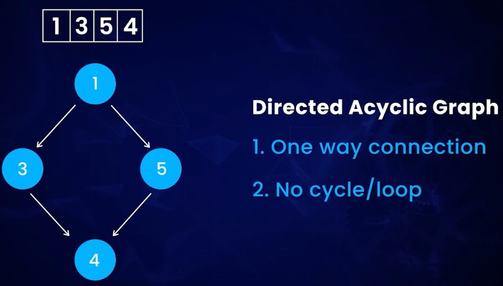

Two facts define the graph:

1. **One-way connection** — every edge is an arrow, not an undirected line.
2. **No cycle / loop** — following arrows never returns you to a node you already
   left.

The order `[1, 3, 5, 4]` is one valid flattening: `1` before `3` and `5`, and both
`3` and `5` before `4`. `[1, 5, 3, 4]` would also be valid. If a cycle existed,
**no** valid order would exist.

### Beginner mental model

University registration: you cannot take _Compilers_ before _Data Structures_, and
you cannot take _Data Structures_ before _Intro to Programming_. Topological sort
prints a semester plan. If two courses require each other, the plan is impossible
— that is a cycle.

### How it works (Kahn’s algorithm)

1. Build the adjacency list and an **indegree** count (how many prerequisites each
   node still needs).
2. Put every node with indegree `0` into a queue (no remaining prerequisites).
3. Pop a node, append it to the order, and decrement indegree of its neighbors.
4. Any neighbor that reaches indegree `0` enters the queue.
5. If you finish fewer nodes than `numCourses`, a **cycle** exists.

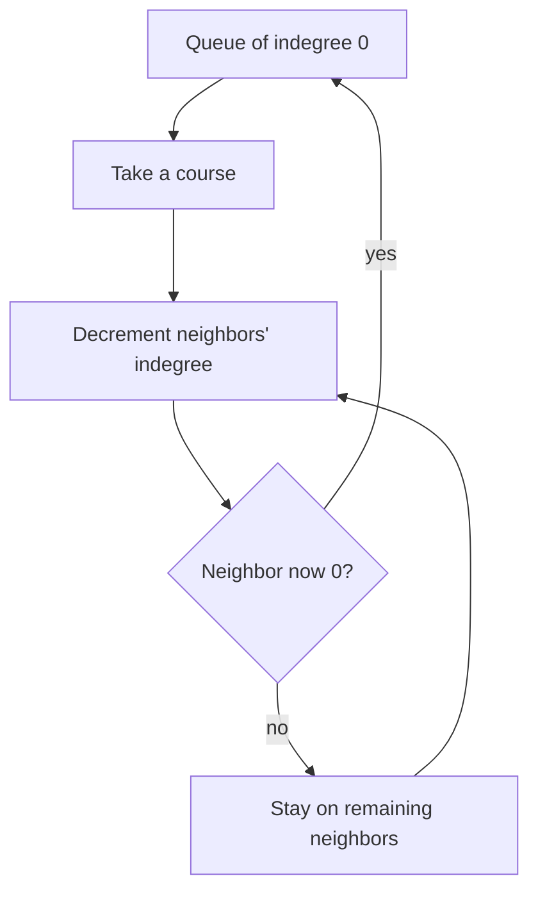

### Problem: Course Schedule


**Prompt (same intent):** there are `numCourses` courses labeled `0` to
`numCourses - 1`. `prerequisites[i] = [ai, bi]` means you **must** take `bi`
before `ai`. Return `true` if you can finish all courses, otherwise `false`.

| Example | Input                                                | Output  | Why                            |
| ------- | ---------------------------------------------------- | ------- | ------------------------------ |
| 1       | `numCourses = 2`, `prerequisites = [[1, 0]]`         | `true`  | Take `0`, then `1`             |
| 2       | `numCourses = 2`, `prerequisites = [[1, 0], [0, 1]]` | `false` | Cycle: each waits on the other |

Example 2 is the “two modules that require each other” case from the mental model.
Topological sort is how you **detect** that impossibility, not only how you print
an order.

### Simplified code

```python
from collections import deque, defaultdict

def can_finish(num_courses: int, prerequisites: list[list[int]]) -> bool:
    graph: dict[int, list[int]] = defaultdict(list)
    indegree = [0] * num_courses
    for course, pre in prerequisites:
        graph[pre].append(course)
        indegree[course] += 1

    queue = deque([i for i in range(num_courses) if indegree[i] == 0])
    taken = 0
    while queue:
        node = queue.popleft()
        taken += 1
        for nxt in graph[node]:
            indegree[nxt] -= 1
            if indegree[nxt] == 0:
                queue.append(nxt)
    return taken == num_courses
```

If you need the actual order (Course Schedule II), append `node` to a list instead
of only counting `taken`.

### Practice questions

| Problem                                                                      | What to notice                                |
| ---------------------------------------------------------------------------- | --------------------------------------------- |
| [207. Course Schedule](https://leetcode.com/problems/course-schedule/)       | Cycle detection = “can you finish?”           |
| [210. Course Schedule II](https://leetcode.com/problems/course-schedule-ii/) | Return one valid order, or `[]`               |
| [269. Alien Dictionary](https://leetcode.com/problems/alien-dictionary/)     | Letters as nodes, “before” as edges (premium) |

### Common mistakes

- Reversing the edge: `[ai, bi]` means `bi → ai` (take `bi` first), not the other
  way.
- Returning `true` as soon as the queue is empty, without checking `taken ==
numCourses`. Isolated nodes are valid; leftover indegree is not.
- Using this pattern on an **undirected** graph or on a graph that is allowed to
  have cycles without asking “is it possible?”

---

## Pattern 4 — Binary Tree DFS

### When to use

Binary Tree DFS helps you **visit every node in a tree**, focusing on **one
branch at a time**. We use **recursion** to do this.

It starts from the left side first until there is no child node. Once it has
finished the last left-side part, it **backtracks** and checks whether there is a
right node. If one exists, it applies the recursion again: from that right node,
find the left node first. By doing this, we explore the entire tree.


The numbered nodes `1 → 2 → 3 → 4 → 5 → 6 → 7` are a **pre-order** visit: parent
before children, left branch before right. Recursion is the engine; the call stack
is the “backtrack.”

### Beginner mental model

A maze with one flashlight. You always take the left corridor until you hit a
wall, then you walk back to the last fork and try the right corridor. You do not
jump to another floor the way BFS does.

### How it works

A DFS on a binary tree is three lines plus a base case:

```text
dfs(node):
    if node is null: return <identity>
    left  = dfs(node.left)
    right = dfs(node.right)
    return combine(node, left, right)
```

Where you put `combine` decides the flavor:

| Flavor     | When you process the node  | Typical problem                           |
| ---------- | -------------------------- | ----------------------------------------- |
| Pre-order  | Before the recursive calls | Serialize, copy, “print path so far”      |
| In-order   | Between left and right     | BST sorted order                          |
| Post-order | After both children return | Depth, diameter, “height of this subtree” |

Maximum depth is **post-order**: you cannot know this node’s depth until both
subtrees report theirs.

### Problem: Maximum Depth of Binary Tree


**Prompt (same intent):** given the `root` of a binary tree, return its maximum
depth. Maximum depth is the number of nodes along the longest path from the root
down to the farthest leaf.

**Input:** `root = [3, 9, 20, null, null, 15, 7]`  
**Output:** `3`

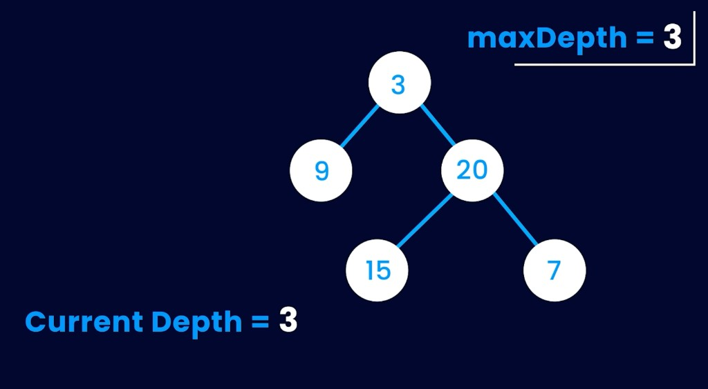

Paths `3 → 20 → 15` and `3 → 20 → 7` both have 3 nodes. Node `9` is a leaf at
depth 2, so it does not win. The recursion returns `1 + max(left, right)` at every
node; at the root that value is `3`.

### Simplified code

```python
def max_depth(root) -> int:
    if not root:
        return 0
    return 1 + max(max_depth(root.left), max_depth(root.right))
```

Time `O(n)`. Extra space `O(h)` for the call stack (`h` = height).

The same skeleton becomes Path Sum (`need remaining == 0` at a leaf), Invert
Binary Tree (swap, then recurse), and Diameter (`left_height + right_height` as a
side effect).

### Practice questions

| Problem                                                                                          | What to notice                            |
| ------------------------------------------------------------------------------------------------ | ----------------------------------------- |
| [104. Maximum Depth of Binary Tree](https://leetcode.com/problems/maximum-depth-of-binary-tree/) | Post-order height                         |
| [112. Path Sum](https://leetcode.com/problems/path-sum/)                                         | Carry a running total down one branch     |
| [226. Invert Binary Tree](https://leetcode.com/problems/invert-binary-tree/)                     | Swap children, recurse                    |
| [543. Diameter of Binary Tree](https://leetcode.com/problems/diameter-of-binary-tree/)           | Depth of both children, plus a global max |

### Common mistakes

- Returning `1` for a `null` node (depth of empty is `0`).
- Mixing BFS “level count” with DFS “height of subtree” without being clear which
  you want. Both can solve max depth; interviews often expect the recursive
  one-liner for 104.
- Forgetting that “right node or not” is a **backtrack** step — if you skip
  returning from the left call, you never visit the right child.

---

## Pattern 5 — Top K Elements

### When to use

Use Top K when you need to find a **top ranking element** from a dataset. Input is
usually an **array or a list**.

To solve this problem, you need to **keep track of the `k` most important numbers
that you have seen so far**. Since you care about the K largest elements, the
largest K elements you have seen so far are the important ones. The data structure
is called a **heap**.


For `[1, 23, 12, 9, 30, 2, 50]` and `k = 3`, the elite set is `{50, 30, 23}`. In a
min-heap of size 3 the root is `23`, the 3rd largest.

### Beginner mental model

A scoreboard that only has `k` slots. The **worst** player currently on the
scoreboard sits at the top of a min-heap. A new player kicks them off only if they
are better than that worst player. At the end, the worst player still on the board
is the **k-th largest** overall.

That is why we use a **min-heap of size `k`** to find the **largest** values: the
root is the smallest of the elite group — exactly the k-th largest.

### How it works

1. Push the first `k` numbers into a min-heap.
2. For every remaining number `x`:
   - If `x` is larger than the root, pop the root and push `x`.
   - Otherwise ignore `x` — it cannot join the top `k`.
3. The root is the k-th largest.

Time `O(n log k)`, which beats `O(n log n)` full sort when `k` is much smaller
than `n`. The follow-up on the classic problem is: **can you solve it without
sorting?** The heap (or Quickselect) is the answer.

### Problem: Kth Largest Element in an Array


**Prompt (same intent):** given an integer array `nums` and an integer `k`, return
the k-th largest element in the array. It is the k-th largest in **sorted order**,
not the k-th distinct element.

| Example | Input                                         | Output | Sorted descending    |
| ------- | --------------------------------------------- | ------ | -------------------- |
| 1       | `nums = [3, 2, 1, 5, 6, 4]`, `k = 2`          | `5`    | `[6, 5, 4, 3, 2, 1]` |
| 2       | `nums = [3, 2, 3, 1, 2, 4, 5, 5, 6]`, `k = 4` | `4`    | `[6, 5, 5, 4, …]`    |

Duplicates count. In example 2, both `5`s are “largest,” so the 4th slot is `4`.

### Worked example: k = 3 on `[3, 2, 1, 5, 6, 4]`

**Start.** Heap is empty. We keep only 3 numbers. Array still `[3, 2, 1, 5, 6, 4]`.

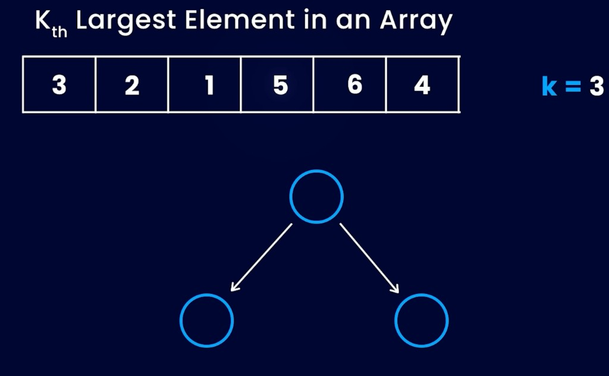

**After consuming `3, 2, 1`.** Remaining `5, 6, 4`. Min-heap `{1, 3, 2}` with `1`
at the root: smallest of the elite so far.


**After consuming `5` and `6`.** `1` and `2` are evicted. Heap `{3, 6, 5}` with
`3` at the root. The strip may still show discarded values; trust the heap nodes.


**After `4`:** `4 > 3`, so `3` is popped and `4` is pushed. Heap `{4, 6, 5}`.
Root `4` is the 3rd largest. Discarded `3, 2, 1` never re-enter.

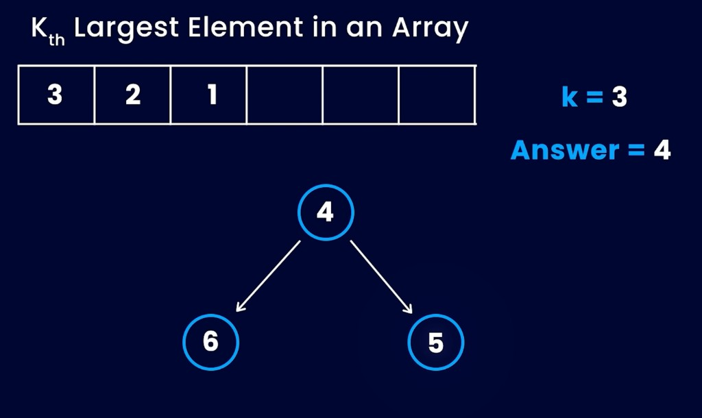

**Answer = 4.**

### Simplified code

```python
import heapq

def find_kth_largest(nums: list[int], k: int) -> int:
    heap: list[int] = []
    for x in nums:
        heapq.heappush(heap, x)
        if len(heap) > k:
            heapq.heappop(heap)  # drop the smallest of the elite
    return heap[0]
```

Python’s `heapq` is a min-heap, which is exactly what this pattern wants for
“k largest.”

### Practice questions

| Problem                                                                                                | What to notice                     |
| ------------------------------------------------------------------------------------------------------ | ---------------------------------- |
| [215. Kth Largest Element in an Array](https://leetcode.com/problems/kth-largest-element-in-an-array/) | Min-heap size `k`, or Quickselect  |
| [347. Top K Frequent Elements](https://leetcode.com/problems/top-k-frequent-elements/)                 | Heap of `(frequency, value)`       |
| [703. Kth Largest Element in a Stream](https://leetcode.com/problems/kth-largest-element-in-a-stream/) | Same heap, kept alive across `add` |
| [973. K Closest Points to Origin](https://leetcode.com/problems/k-closest-points-to-origin/)           | Heap by distance, size `k`         |

### Common mistakes

- Using a **max-heap** of size `k` for k-th **largest** (you want the _smallest_
  of the large ones at the root).
- Treating “k-th largest” as “k-th **distinct**.” The note on 215 says otherwise.
- Sorting the whole array when `k` is tiny — it works, but it ignores the
  follow-up.

---

## Pattern 6 — Modified Binary Search

### When to use

The core idea is to **divide a search space in half again and again**.

Classic binary search needs a fully sorted array and a target. **Modified** binary
search keeps the “cut in half” idea when the search space is still ordered in
_some_ way: rotated, has duplicates, or you are searching on an **answer range**
(minimum capacity, first true / last false) instead of on array indices.

If you want to understand it a lot, **implement in another language chosen by
you** the logic of Python’s `bisect`. Then you will understand modified binary
search.

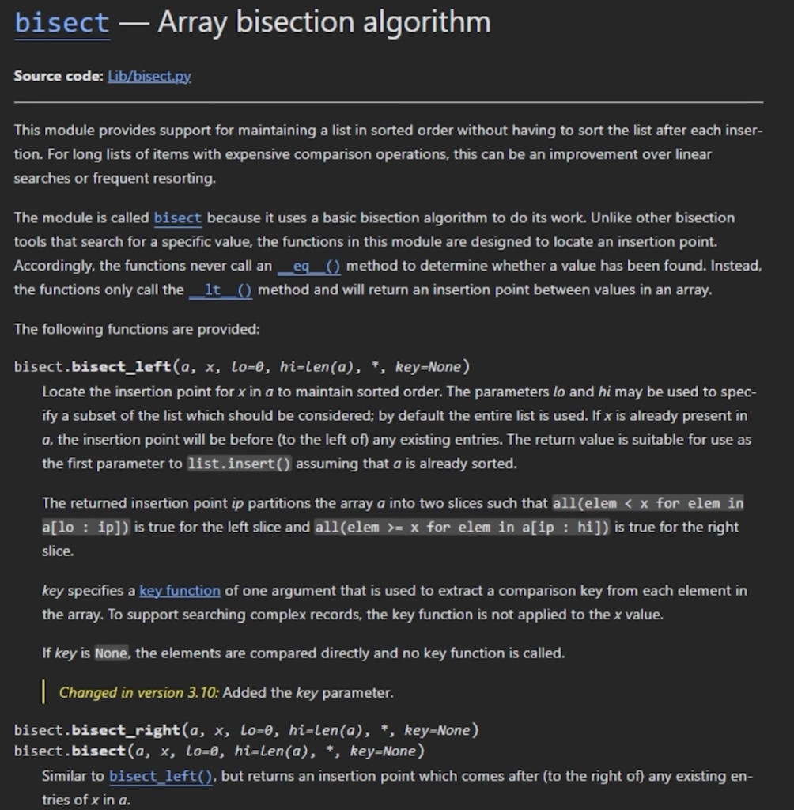

`bisect_left` and `bisect_right` are the industrial version of “lo / hi / mid.”
They do not care that your array is a list of numbers — they care that the
predicate “is this slot still too small?” flips from false to true **once**. That
single flip is why halving works.

### Beginner mental model

You are guessing a number from 1 to 100. Each guess, the other person says
“higher” or “lower.” You throw away half the remaining range. Modified binary
search is the same game on a **rotated** or **noisy** range: you first ask “which
half is still sorted / still valid?” and only then throw the other half away.

### How it works: cut the space in half

The unmodified loop already does the original job: **divide a search space in half
again and again**. The two boxes below are that remaining range, split at `mid`.


Classic `lo` / `hi` / `mid` looks like this. Duplicates and a missing target only
change how the pointers move, not the halving idea.


If you need the **first** or **last** duplicate, do not return on `array[mid] == x`.
Use `bisect_left` / `bisect_right` (first index where `x` can go, and first index
after any existing `x`). If the target is missing, `lo` and `hi` cross and you
return `-1`.

### Problem: Search in Rotated Sorted Array

A rotated sorted array is two sorted runs glued together: `[4, 5, 6, 7, 0, 1, 2]`.
One of the two halves around `mid` is always sorted. Check which half is sorted,
then ask whether the target lives in that half.

| Example | Input                                        | Output |
| ------- | -------------------------------------------- | ------ |
| 1       | `nums = [4, 5, 6, 7, 0, 1, 2]`, `target = 0` | `4`    |
| 2       | `nums = [4, 5, 6, 7, 0, 1, 2]`, `target = 3` | `-1`   |

**Trace for target `0`:**

1. `lo = 0`, `hi = 6`, `mid = 3`, `nums[mid] = 7`
2. Left half `[4, 5, 6, 7]` is sorted. `0` is not in `[4, 7)`, so search right:
   `lo = 4`
3. `lo = 4`, `hi = 6`, `mid = 5`, `nums[mid] = 1`
4. Left half `[0, 1]` is sorted (`nums[4] = 0 <= 1`). `0` is in `[0, 1)`, so
   search left: `hi = 4`
5. `lo = hi = 4`, `nums[4] = 0`. Return `4`

The `search_rotated` snippet below is **LeetCode 33 (distinct values)**. If
`nums[lo] == nums[mid] == nums[hi]` (LeetCode 81), you cannot tell which half is
sorted: shrink both ends by one and continue.

```python
# extra shrink for rotated arrays with duplicates (LeetCode 81)
if nums[lo] == nums[mid] == nums[hi]:
    lo += 1
    hi -= 1
    continue
```

```python
def search_rotated(nums: list[int], target: int) -> int:
    lo, hi = 0, len(nums) - 1
    while lo <= hi:
        mid = (lo + hi) // 2
        if nums[mid] == target:
            return mid
        if nums[lo] <= nums[mid]:  # left half sorted
            if nums[lo] <= target < nums[mid]:
                hi = mid - 1
            else:
                lo = mid + 1
        else:  # right half sorted
            if nums[mid] < target <= nums[hi]:
                lo = mid + 1
            else:
                hi = mid - 1
    return -1
```

### Exercise: port `bisect` yourself

Do the original drill. Pick a language that is **not** Python (Java matches the
[DSA catalog](/docs/projects/data-structure-and-algorithm) well). Implement:

- `bisect_left(arr, x)` — first index where `x` can be inserted to keep order
- `bisect_right(arr, x)` — first index **after** any existing `x`

You will rediscover the same loop: `while lo < hi`, pick `mid`, move `lo` or
`hi`. Every modified binary search problem is that loop with a different
condition.

```python
def bisect_left(arr: list[int], x: int) -> int:
    lo, hi = 0, len(arr)
    while lo < hi:
        mid = (lo + hi) // 2
        if arr[mid] < x:
            lo = mid + 1
        else:
            hi = mid
    return lo
```

This is a **simplified teaching version**, not a copy of CPython. The screenshot
above is the reference for the _idea_ (halve a range with `lo` / `hi` / `mid`).
Type the loop in Java, Go, or C until you no longer need to look at it.

### Practice questions

| Problem                                                                                                                                               | What to notice                   |
| ----------------------------------------------------------------------------------------------------------------------------------------------------- | -------------------------------- |
| [33. Search in Rotated Sorted Array](https://leetcode.com/problems/search-in-rotated-sorted-array/)                                                   | Which half is sorted?            |
| [81. Search in Rotated Sorted Array II](https://leetcode.com/problems/search-in-rotated-sorted-array-ii/)                                             | Duplicates: shrink `lo` and `hi` |
| [153. Find Minimum in Rotated Sorted Array](https://leetcode.com/problems/find-minimum-in-rotated-sorted-array/)                                      | The min is the rotation pivot    |
| [34. Find First and Last Position of Element in Sorted Array](https://leetcode.com/problems/find-first-and-last-position-of-element-in-sorted-array/) | `bisect_left` + `bisect_right`   |

### Common mistakes

- Using `(lo + hi) // 2` as if the array were **not** rotated, then discarding the
  wrong half.
- Infinite loops: when `lo` and `hi` meet, you must still move one of them.
- On duplicates, assuming `nums[lo] <= nums[mid]` always means “left is strictly
  increasing.”

---

## Pattern 7 — Subset

### When to use

The Subset pattern is used when we need to find **all the possible combinations
of elements from a given set**. Repetitions may or may not be allowed, depending
on the question.

In the Subset pattern, we need to find the **possible arrangement of elements**
from a given set.

So this pattern covers two close families:

- **Combinations / subsets** — order does not matter: `{1, 2}` is the same as
  `{2, 1}`
- **Arrangements / permutations** — order does matter: `[1, 2]` is different from
  `[2, 1]`

Both are built by the same idea: at each element, **include it or skip it** (and
if order matters, **which unused element goes next**).

### Arrangements: order matters, repetitions optional

The original note covers both combinations and arrangements. Repetitions may or
may not be allowed, depending on the question.

![Combinations of Set [1, 2]: no repetitions gives (1,2) and (2,1); repetitions also add (1,1) and (2,2)](./img/leetcode-patterns/subset-empty-set.png)

`(1, 2)` and `(2, 1)` are the **same subset** `{1, 2}` and **different
permutations**. The right branch is permutations **with replacement**.

You can grow arrangements level by level (the figure labels this “similar to
BFS”): start from `{}`, insert the next unused number into every position of
every partial list.


That last column is `3! = 6` permutations, not `2^3 = 8` subsets.

### Subsets: order does not matter

Every **subset** problem starts from `{}`. Each new element **doubles** the
collection: copy every existing subset and add the new element to the copy.

For `{1, 2, 3}` the power set is:

| Subset                       | How it was born  |
| ---------------------------- | ---------------- |
| `{}`                         | Start            |
| `{1}`, `{2}`, `{3}`          | Take one element |
| `{1, 2}`, `{1, 3}`, `{2, 3}` | Take two         |
| `{1, 2, 3}`                  | Take all         |

That is `2^n` subsets, including the empty one. If the prompt asks for
permutations, the count is `n!` instead.

### Beginner mental model

A row of light switches, one per element. Each switch is ON (take it) or OFF
(skip it). Walking through every ON/OFF combination **is** the power set. If the
question forbids duplicates in the input, skip a switch when it equals the
previous one and the previous one was OFF.

### How it works (backtracking)

```text
dfs(start, path):
    record a copy of path          # every path is a valid subset
    for i from start to n - 1:
        path.append(nums[i])
        dfs(i + 1, path)           # i+1: each element at most once
        path.pop()                 # backtrack
```

Permutations swap the `for` loop to “every unused index,” not `i + 1`.

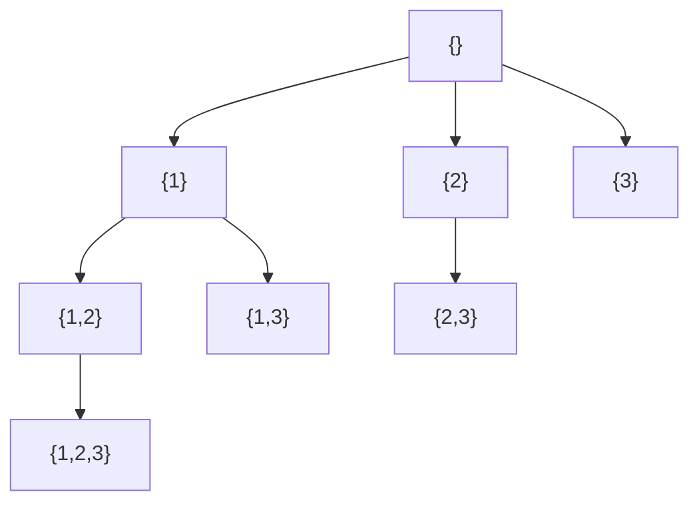

Partial tree: `{2,3}` and `{1,3}` also grow to `{1,2,3}`; the diagram shows one
path so the include/skip idea stays readable.

For permutations, swap the `for` loop to every unused index:

```python
def permute(nums: list[int]) -> list[list[int]]:
    result: list[list[int]] = []
    used = [False] * len(nums)

    def dfs(path: list[int]) -> None:
        if len(path) == len(nums):
            result.append(path.copy())
            return
        for i, x in enumerate(nums):
            if used[i]:
                continue
            used[i] = True
            path.append(x)
            dfs(path)
            path.pop()
            used[i] = False

    dfs([])
    return result
```

### Problem: Subsets

**Prompt (same intent as LeetCode 78):** given a set of **distinct** integers,
return all possible subsets (the power set). The solution must not contain
duplicate subsets.

**Example:** `nums = [1, 2, 3]` →
`[[], [1], [2], [1, 2], [3], [1, 3], [2, 3], [1, 2, 3]]`

If the input can contain duplicates (Subsets II), sort first and skip `nums[i] ==
nums[i - 1]` at the same depth so `{1, 2}` is not generated twice from two
identical `1`s.

### Simplified code

```python
def subsets(nums: list[int]) -> list[list[int]]:
    result: list[list[int]] = []

    def dfs(start: int, path: list[int]) -> None:
        result.append(path.copy())
        for i in range(start, len(nums)):
            path.append(nums[i])
            dfs(i + 1, path)
            path.pop()

    dfs(0, [])
    return result
```

Time `O(n · 2^n)` — you spend `O(n)` copying each of `2^n` subsets.

### Practice questions

| Problem                                                               | What to notice                                       |
| --------------------------------------------------------------------- | ---------------------------------------------------- |
| [78. Subsets](https://leetcode.com/problems/subsets/)                 | Include / skip, no duplicates in input               |
| [90. Subsets II](https://leetcode.com/problems/subsets-ii/)           | Sort + skip duplicates at the same depth             |
| [46. Permutations](https://leetcode.com/problems/permutations/)       | Arrangement: used-mask instead of `i + 1`            |
| [39. Combination Sum](https://leetcode.com/problems/combination-sum/) | Repetition **allowed** — recurse on `i`, not `i + 1` |

That last one is the original note: **repetitions may or may not be allowed
depending on the question**. Combination Sum allows reuse; Subsets does not.

### Common mistakes

- Mutating `path` and appending `path` itself to `result` (you need a **copy**).
- Using permutations code for a combinations prompt (and getting duplicate sets
  with different order).
- Forgetting to sort before skipping duplicates.

---

## Pattern 8 — Sliding Window

### When to use

Use Sliding Window when you need to **process a series of data elements** like a
list or a string. In the sliding window pattern, you find a specific list inside
a string (or a subarray inside an array) by looking at a **smaller list of the
bigger list**. The window **slides 1 at a time** until the bigger list is fully
scanned.

So, **when the question is to satisfy a given condition**, use the sliding window
pattern.

It is usually used to find the **shortest substring** under a particular
condition. The same machine also finds the **longest** valid window — only the
shrink / expand rule changes.


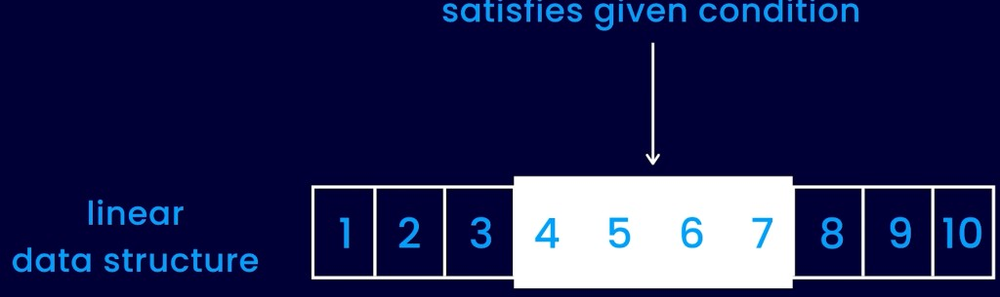

### Beginner mental model

A metal detector gate at a stadium. People walk in on the right (`right += 1`).
If the gate starts beeping (the window **violates** the condition), you send
people out on the left (`left += 1`) until it is quiet again. You never rebuild
the line from scratch — you only adjust the two ends.

### How it works

1. `left = 0`. Grow `right` from `0` to `n - 1`.
2. Add `s[right]` into a counter / sum / set.
3. While the window **breaks** the condition, remove `s[left]` and `left += 1`.
4. After the window is valid again, record the answer (length, the slice, a min
   sum, …).
5. The window always slides forward. `left` never moves backward.

**Longest** records **after** shrinking an **invalid** window. **Shortest**
records **inside** the shrink loop while the window **stays valid**.

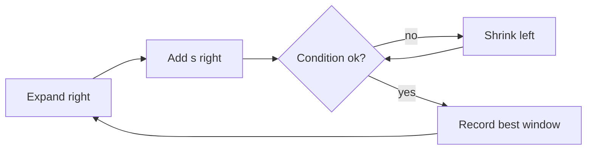

### Problem: longest substring with k unique characters

The screenshot below is the GFG-style prompt: a **linear data structure**, a
**substring**, and a **condition**. Those three tags are why Sliding Window
applies.

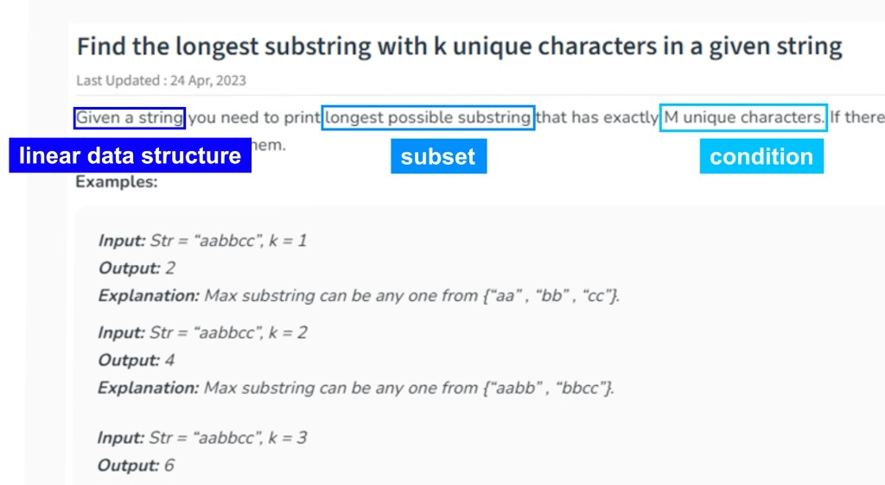

The title says **k unique characters**. The examples use `aabbcc` and match both
**exactly k** and **at most k** for this particular string. They diverge when the
string has fewer than k distinct characters: `aaabbb` with `k = 3` is length `6`
for at-most-k and length `0` for exactly-k. The code below is **at most k**
(LeetCode 340). For exactly k, only record `best` when `len(count) == k`.

| Input                   | At most k          | Exactly k |
| ----------------------- | ------------------ | --------- |
| `s = "aabbcc"`, `k = 1` | `2` (`"aa"`)       | `2`       |
| `s = "aabbcc"`, `k = 2` | `4` (`"aabb"`)     | `4`       |
| `s = "aabbcc"`, `k = 3` | `6` (`"aabbcc"`)   | `6`       |
| `s = "aaabbb"`, `k = 3` | `6` (whole string) | `0`       |

A second walk-through: `s = "aabacbebebe"`, `k = 3`. One valid at-most-k window
is `"cbebebe"` (length 7) with unique set `{c, b, e}`. A fourth distinct character
forces a shrink from the left until the window is back to 3.

### Simplified code (longest, at most k)

```python
from collections import defaultdict

def longest_at_most_k_unique(s: str, k: int) -> int:
    count: dict[str, int] = defaultdict(int)
    left = 0
    best = 0
    for right, ch in enumerate(s):
        count[ch] += 1
        while len(count) > k:  # invalid: too many uniques
            count[s[left]] -= 1
            if count[s[left]] == 0:
                del count[s[left]]
            left += 1
        best = max(best, right - left + 1)  # record after the window is valid
    return best
```

Time `O(n)`. Extra space `O(k)` for the character map.

### The usual case: shortest window that satisfies a condition

The original notes usually point at the **shortest** substring under a condition.
Expand until the window is valid, then shrink as far as you can **while it stays
valid**, and keep the smallest length.

```python
def min_subarray_len(target: int, nums: list[int]) -> int:
    left = 0
    total = 0
    best = len(nums) + 1
    for right, x in enumerate(nums):
        total += x
        while total >= target:  # valid: record, then shrink
            best = min(best, right - left + 1)
            total -= nums[left]
            left += 1
    return 0 if best == len(nums) + 1 else best
```

Example: `nums = [2, 3, 1, 2, 4, 3]`, `target = 7` returns `2` (`[4, 3]`).

### Practice questions

| Problem                                                                                                                                          | What to notice                                             |
| ------------------------------------------------------------------------------------------------------------------------------------------------ | ---------------------------------------------------------- |
| [3. Longest Substring Without Repeating Characters](https://leetcode.com/problems/longest-substring-without-repeating-characters/)               | No repeated character: distinct count equals window length |
| [209. Minimum Size Subarray Sum](https://leetcode.com/problems/minimum-size-subarray-sum/)                                                       | Shortest window whose **sum** ≥ target                     |
| [76. Minimum Window Substring](https://leetcode.com/problems/minimum-window-substring/)                                                          | Shortest window that **covers** another string             |
| [340. Longest Substring with At Most K Distinct Characters](https://leetcode.com/problems/longest-substring-with-at-most-k-distinct-characters/) | At most k (premium); screenshot examples use `aabbcc`      |

### Common mistakes

- Resetting `left` to `0` on every `right` — that is `O(n²)`, not a window.
- Updating `best` while the condition is still **broken**.
- Using Sliding Window on a problem that needs **subsequences** (not contiguous).
  A window only covers a **contiguous** slice.

---

## How to choose a pattern

Read the prompt once, then ask these questions in order. This is the original
when-to-use list, turned into a decision path.

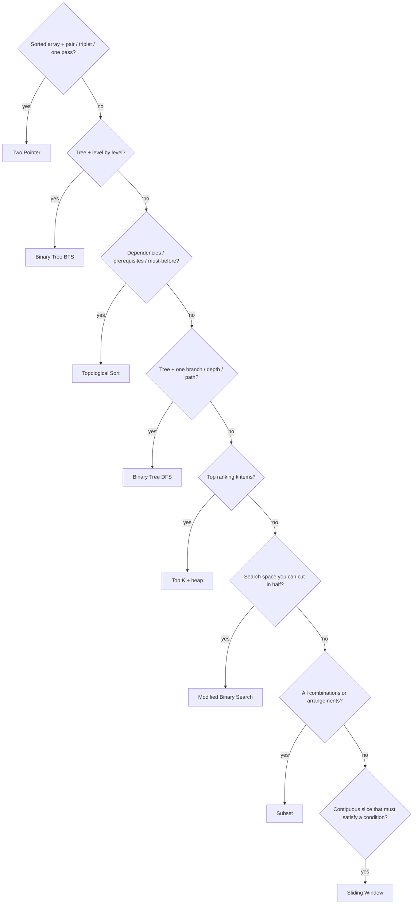

| Signal in the prompt                                  | Pattern                |
| ----------------------------------------------------- | ---------------------- |
| Sorted array, two indices, single pass                | Two Pointer            |
| Level order, zigzag, right side view                  | Binary Tree BFS        |
| One-way edges, no cycle, prerequisite chain           | Topological Sort       |
| Recursion down one branch, then backtrack             | Binary Tree DFS        |
| k-th largest / top k / k closest                      | Top K Elements         |
| Divide the search space in half again and again       | Modified Binary Search |
| All combinations; repetitions maybe allowed           | Subset                 |
| Substring / subarray that satisfies a given condition | Sliding Window         |

If two patterns both seem to fit, pick the one that matches the **output shape**.
“Return every subset” is Subset, even though you could brute-force it with nested
loops. “Return the longest valid substring” is Sliding Window, even though Two
Pointer also uses two indices.

## Practice roadmap

Work one **warm-up** and one **core** problem per pattern before mixing them.
Difficulties below match LeetCode’s labels.

| Pattern                | Warm-up                             | Core                                         |
| ---------------------- | ----------------------------------- | -------------------------------------------- |
| Two Pointer            | 26 Remove Duplicates (Easy)         | 167 Two Sum II / 15 3Sum (Medium)            |
| Binary Tree BFS        | 111 Minimum Depth (Easy)            | 102 Level Order (Medium)                     |
| Topological Sort       | 207 Course Schedule (Medium)        | 210 Course Schedule II (Medium)              |
| Binary Tree DFS        | 104 Max Depth (Easy)                | 112 Path Sum (Easy) then 543 Diameter (Easy) |
| Top K Elements         | 215 Kth Largest (Medium)            | 347 Top K Frequent (Medium)                  |
| Modified Binary Search | 704 Binary Search (Easy)            | 33 Search in Rotated Array (Medium)          |
| Subset                 | 78 Subsets (Medium)                 | 90 Subsets II (Medium)                       |
| Sliding Window         | 3 Longest Unique Substring (Medium) | 209 Min Size Subarray Sum (Medium)           |

After that, implement Python `bisect` in **another language** (the original
drill). Then re-solve 215 **without sorting**, using only a heap of size `k`.

## Trade-offs

| Pattern                | You gain                              | You pay                                        |
| ---------------------- | ------------------------------------- | ---------------------------------------------- |
| Two Pointer            | `O(n)` after sort, `O(1)` extra space | Needs order, or a different two-index flavor   |
| BFS                    | Natural “per level” grouping          | Queue memory on wide trees                     |
| Topological Sort       | Order + cycle detection               | Only DAGs; wrong edge direction fails silently |
| DFS                    | Tiny code, path/state on the stack    | Recursion depth on skewed trees                |
| Top K (heap)           | `O(n log k)` without full sort        | Easy to pick max-heap vs min-heap wrong        |
| Modified Binary Search | `O(log n)` on huge ranges             | Off-by-one; duplicates need extra shrink       |
| Subset                 | Complete enumeration                  | Exponential time — n must stay small           |
| Sliding Window         | `O(n)` on strings/arrays              | Contiguous only; condition must be monotonic   |

## Lessons learned

- **Name the pattern before you write a loop.** The when-to-use sentence is the
  interview skill; the code is just the filling.
- **Two indices are not always Two Pointer.** If they form a **contiguous**
  window that must **satisfy a given condition**, that is Sliding Window.
- **DFS vs BFS is a data-structure choice.** Recursion (or a stack) vs a queue.
  The tree is the same.
- **Top K is a bounded scoreboard.** Keep the `k` most important numbers you have
  seen so far in a heap.
- **Modified binary search is bisect with a different predicate.** Port `bisect`
  once and the rest of the family gets easier.
- **Subset is include-or-skip.** Repetition allowed or not is a one-line change
  (`dfs(i)` vs `dfs(i + 1)`).
- **Topological sort is a prerequisite plan.** One-way edges, no loops, each
  module after its dependencies.

## Sources

- Study notes: _8 leetcode pattern_ (when-to-use rules for all eight patterns)
- Repository: [`okfriansyah-moh/data-structure-and-algorithm`](https://github.com/okfriansyah-moh/data-structure-and-algorithm) — runnable Java catalog (search, trees, arrays) to practice the same ideas
- Related article: [Data Structures & Algorithms Learning Catalog](/docs/projects/data-structure-and-algorithm)
- Canonical problems: LeetCode 167, 15, 102, 207, 104, 215, 33, 78, and 3
