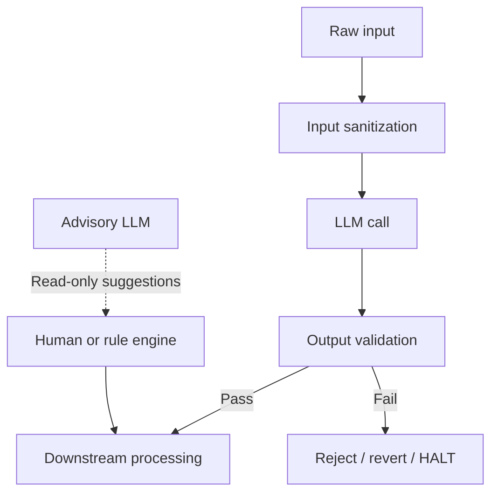

# LLM Guardrails

## What Was Built

This article synthesizes LLM guardrail patterns from three production systems:
[A2A Brainstorm](https://github.com/okfriansyah-moh/a2a-brainstormer) (coherence audits
with guarded micro-fixes and revert-on-failure),
[MD-AME](https://github.com/okfriansyah-moh/md-ame) (Prompt Firewall + Gemini safety
classifier on every topic and script), and
[edge-polymarket-agent](https://github.com/okfriansyah-moh/edge-polymarket-agent)
(AI advisor isolated from the execution critical path).

## The Problem

LLMs hallucinate, contradict themselves, inject unsafe content, and produce malformed
output. In production systems, you cannot trust raw LLM responses. You need layers that
**sanitize inputs**, **validate outputs**, **reject or revert bad results**, and
**isolate advisory AI** from actions that have real-world consequences.

## Why This Problem Is Difficult

1. **Over-correction** — fixing one issue can break unrelated content.
2. **False positives** — overly aggressive filters block valid output.
3. **Latency** — safety classifiers add API calls per item.
4. **Advisory creep** — LLM suggestions slowly become execution dependencies.
5. **Non-determinism** — the same guardrail must handle variable LLM output shapes.

## Beginner Mental Model

Guardrails are **airport security checkpoints**, not the destination. Every item passes
through inspection before proceeding. If inspection fails, the item is rejected or sent
back — it does not get a "mostly okay" stamp. Advisory AI is like a travel guide: useful
suggestions, but never allowed to fly the plane.

## Requirements and Constraints

| Guardrail type | A2A Brainstorm | MD-AME | Polymarket agent |
|----------------|----------------|--------|------------------|
| Input sanitization | JSON extraction tolerance | Prompt Firewall (`sanitize_trend_input`) | N/A (structured market data) |
| Output validation | Coherence audit + guardrails | Safety classifier on topics/scripts | Probability hard gate |
| Revert on failure | Micro-fix revert if validation fails | ContentSafetyRejection HALT | Block trade, no fallback |
| Advisory isolation | N/A | N/A | AI advisor read-only, failure-isolated |
| Audit trail | Session state in PostgreSQL | `safety_audit_logs` immutable trail | Allocation audit log |
| Credential safety | `*_CREDENTIAL_REF` env refs only | Master Key Crypto, zero-logging | Env-only secrets |

## Architecture Overview



## Execution Flow

### Input guardrails (MD-AME Prompt Firewall)

1. Truncate input to maximum length.
2. Strip injection phrases, HTML tags, and LLM role tokens.
3. Pass sanitized input to downstream processing.

### Output guardrails (MD-AME Safety Classifier)

1. Evaluate topic or script against dimension's `safety_profile`.
2. Write result to immutable `safety_audit_logs`.
3. Reject item if classifier returns unsafe; pipeline skips or HALTs.

### Coherence guardrails (A2A Brainstorm)

1. Generate document section-by-section.
2. Run coherence audit across all sections.
3. Apply micro-fixes for contradictions.
4. Validate each fix; revert if validation fails.

### Advisory isolation (Polymarket)

1. AI advisor produces read-only recommendations with required insight structure.
2. Execution path never awaits advisor response.
3. Advisor failure is logged but does not block trades.

## Important Components

| Component | Responsibility |
| --------- | -------------- |
| Prompt Firewall | Input sanitization before LLM or DB write |
| Safety classifier | Output evaluation against policy profiles |
| Coherence audit | Cross-section contradiction detection |
| Guardrail revert | Undo micro-fixes that fail validation |
| Hard gate | Block downstream action without valid prerequisite |
| Advisory layer | Suggestions only — no execution side effects |
| Audit log | Immutable trail of safety decisions |

## Simplified Implementation Examples

Input sanitization (simplified):

```python
# simplified — md-ame Prompt Firewall pattern
def sanitize_trend_input(raw: str) -> str:
    text = truncate(raw, MAX_TREND_INPUT_LENGTH)
    text = strip_html_tags(text)
    text = remove_injection_phrases(text)
    text = remove_role_tokens(text)
    return text
```

Guarded micro-fix with revert (simplified):

```go
// simplified — a2a-brainstormer coherence pattern
fix := proposeMicroFix(sections, contradiction)
patched := applyFix(sections, fix)
if !validateDocument(patched) {
    return sections // revert — original preserved
}
return patched
```

Advisory isolation (simplified):

```python
# simplified — polymarket pattern: advisor never blocks execution
try:
    insight = ai_advisor.suggest(context)  # read-only
    log_advisory(insight)
except AdvisorError as e:
    log_warning("advisor_unavailable", error=str(e))
    # execution continues without advisor input
```

## Reliability and Idempotency

- **Fail safe defaults:** MD-AME HALTs on voice failure; polymarket blocks without probability.
- **Immutable audit logs:** Safety decisions are append-only for post-incident review.
- **No silent fallback:** Missing API keys disable agents, not switch to weaker models silently.
- **Bounded fix scope:** Coherence micro-fixes are small edits, not full regeneration.

## Failure Modes

| Failure | Behaviour |
| ------- | --------- |
| Safety classifier API down | Topic/script rejected; logged to audit |
| Coherence fix makes things worse | Automatic revert to pre-fix state |
| Prompt injection attempt | Stripped by firewall; may be rejected entirely |
| AI advisor timeout | Execution proceeds without advisory input |
| Over-aggressive filter | False rejections logged; tune safety_profile per dimension |

## Trade-offs and Rejected Alternatives

| Choice | Why | Rejected alternative |
| ------ | --- | -------------------- |
| Classifier per item | Catches unsafe content early | Trust LLM self-moderation |
| Micro-fixes not regeneration | Preserves good content; cheaper | Regenerate entire document |
| HALT on voice failure | Quality over availability | Publish video without audio |
| Advisory isolation | Execution reliability | LLM in trade decision path |
| Immutable audit logs | Accountability | Overwrite safety decisions |

## Testing

- **A2A Brainstorm:** `coherence_test.go`, `aigen_test.go` for audit and revert paths
- **MD-AME:** Unit tests with mock classifiers; integration tests for safety rejection flow
- **Polymarket:** Tests verify execution proceeds when advisor fails

## Operations and Observability

- Review `safety_audit_logs` for rejection patterns and false positive rates
- Monitor classifier API latency — adds 2 Gemini calls per video in MD-AME
- Track advisor availability separately from execution success rate

## Lessons Learned

1. **Guardrails are architecture, not prompts** — "please be safe" in a system prompt is not a guardrail.
2. **Revert is as important as fix** — always validate and undo failed corrections.
3. **Isolate advisory AI** — LLM latency and failures must not block critical paths.
4. **Audit everything** — safety decisions need immutable logs for tuning and compliance.

## Related

- [How to Prevent Contradictions in AI-Generated Documents](/docs/concepts/ai-document-coherence)
- [AI Orchestration Patterns](/docs/concepts/ai-orchestration-patterns)
- [MD-AME: Autonomous Media Engine](/docs/systems/md-ame-autonomous-media-engine)
- [Polymarket Trading Agent](/docs/systems/polymarket-trading-agent)

## Sources

- Repository: [okfriansyah-moh/a2a-brainstormer](https://github.com/okfriansyah-moh/a2a-brainstormer)
- Repository: [okfriansyah-moh/md-ame](https://github.com/okfriansyah-moh/md-ame)
- Repository: [okfriansyah-moh/edge-polymarket-agent](https://github.com/okfriansyah-moh/edge-polymarket-agent)
- Pull requests: [a2a-brainstormer#8](https://github.com/okfriansyah-moh/a2a-brainstormer/pull/8), [a2a-brainstormer#12](https://github.com/okfriansyah-moh/a2a-brainstormer/pull/12)
