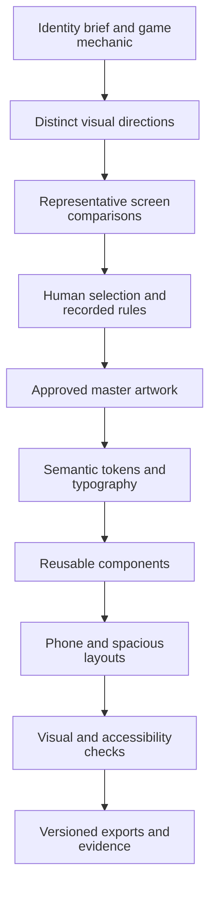

import {AssetGallery, Palette, StyleComparison, SizeComparison, HistoricalHome} from '@site/docs/concepts/images/visual-identity-before-development/Visuals';
import articleStyles from '@site/docs/concepts/images/visual-identity-before-development/visuals.module.css';

# Visual Identity Before Development: Lessons from Padu

<div className={articleStyles.article}>

When creating another game, I want to think about its visual identity before starting the main development work. The theme, mascot, logo, icons, and colors will influence almost every screen. Deciding their roles early gives the implementation a direction and helps the brand stay recognizable as the game grows.

Padu, my number puzzle game, provides a concrete example: warm enamel surfaces, ceramic tiles, a rounded wordmark, and connected characters numbered 6 and 7. Its identity illustrates a method I can reuse with Codex, leaving room for refinement through prototypes and testing.

## What Was Built

Padu has several related brand assets with different responsibilities. Its wordmark spells the name. The full mascot adds expression through faces, limbs, and orange shoes. A compact mark retains the paired tiles and connector without the limbs. The app icon places that simplified identity on a cream field.

<AssetGallery />

The private Padu repository records brand rules, production theme tokens, shared components, and an asset manifest. Selected artwork and excerpts are shared here; they do not establish how each original image was generated or reproduce an original Codex conversation.

## The Problem

A game needs a recognizable visual identity across gameplay, menus, its launcher icon, and material people see before installing it. Each surface has different constraints. The same detailed illustration that works beside a welcome message may become indistinct in a small icon.

Unrelated placeholder styles can spread into every component. Later changes involve controls, typography, spacing, exports, and screenshots. An identity brief gives those choices a common reference: does this screen belong to the same game, and can the player understand its main action?

## Why This Problem Is Difficult

Words such as “friendly,” “premium,” or “bold” allow many interpretations. A bright mascot can suggest a children’s game even when the intended audience is adults. Rounded shapes can feel tactile or cartoonish depending on proportion, lighting, and surrounding typography.

Padu’s documented direction is a calm, adult number logic game. Its ceramic characters must coexist with readable equations and immediate control across dense boards, short phone windows, and spacious tablet compositions.

“Strong and bold” can mean a distinctive silhouette, clear hierarchy, and consistent action emphasis. Saturating every surface or enlarging the mascot everywhere would make a puzzle harder to read. The player still needs to see the numbers and know what to do next.

## Beginner Mental Model

Visual identity joins several decisions: theme describes the world, assets identify the game, tokens store repeatable values, and components apply them to controls and layouts.

A logo can identify a screen whose other elements use inconsistent materials. This teaching comparison keeps the equation constant; inspect the surfaces, corners, and action emphasis.

<StyleComparison />

## Requirements and Constraints

Padu’s identity is tied to its mechanic: limited tiles join connected equations. The name means fused or made one in Indonesian. Its approved symbol shows an ivory 6 on the left and 7 on the right with a copper-orange connector. Both have friendly faces. The full mascot adds limbs; the compact mark does not.

The typography stack uses DM Sans for the interface and JetBrains Mono for tile values. The rounded wordmark is an image asset. Players repeatedly inspect numbers and operators, so their readability needs its own decision.

Specify spacing, corners, illustration density, icons, motion, and tone. Padu’s theme includes 18dp button corners and a 48dp minimum target token. Its rules also record Material Symbols-style icons, concise wording, and respect for reduced motion.

## Architecture Overview



Review can return to an earlier stage when a direction fails in context. After approval, shared rules guide subsequent screens.

## Execution Flow

For another game, I would use this sequence with Codex:

1. Describe the mechanic, audience, mood, and places where the identity will appear. Include existing approved references and constraints.
2. Ask for meaningfully different directions. Compare material, silhouette, typography roles, and hierarchy; changing only an accent color gives little information.
3. Place each direction in representative contexts: welcome screen, active gameplay, result screen, and a small app icon preview.
4. Choose the direction as the owner, then record the selected assets and rules. Keep the alternatives separate from approved production material.
5. Translate the selection into semantic tokens, reusable controls, and asset exports. Inspect the actual screens at narrow and spacious sizes.

This is a reusable process, not a reconstruction of the original image-generation session. The [official Codex documentation](https://learn.chatgpt.com/docs/codex/cli) describes inspecting files, editing code, and running local tools. Those capabilities support reading a brief, building comparisons, extracting tokens, and verifying exports. Producing raster artwork additionally requires an available image tool or supplied artwork; a coding session alone does not guarantee that capability. Human selection remains part of the workflow.

### See the identity in context

<HistoricalHome />

The historical capture combines the orange wordmark, mascot, warm background, yellow feature card, teal headings, and copper action. Mode icons communicate function while the mascot communicates character.

The layout has evolved since September 17. This is a visual reference, not a current screen specification; the present implementation uses shared responsive chrome and Home exceptions.

## Important Components

| Element | Job | Design question |
| --- | --- | --- |
| Theme | Establish material, mood, and shape language | What kind of world does the interaction belong to? |
| Wordmark | Make the product name recognizable | Is the name readable in its intended placements? |
| Compact mark | Carry identity with fewer details | Which features survive a smaller reproduction? |
| Mascot | Add character in suitable moments | Does it support the scene without blocking the task? |
| App icon | Identify the app in launcher and store contexts | Does the artwork survive small size and platform masking? |
| Interface icons | Explain actions and destinations | Can a player understand the action with its label? |
| Tokens and components | Repeat decisions across screens | Will a new feature inherit the approved treatment? |

### Color has a job

<Palette />

These values come from the production `AppTheme` at the source revision listed below. In particular, its ivory is `#FFFDF7`; older written references contain a different ivory value. For implementation, read the current token authority and record the discrepancy instead of mixing palettes silently.

A color role should remain predictable. Copper emphasizes primary actions; teal is available for powered states; neutral traces have their own token. Define accompanying labels, symbols, or shapes for important states. W3C explains why [color cannot be the only means of conveying information](https://www.w3.org/WAI/WCAG22/Understanding/use-of-color.html).

Check text against the actual background it uses. WCAG’s usual minimum is 4.5:1 for ordinary text and 3:1 for qualifying large text. The logo exception does not extend to a game’s controls or instructions. A palette by itself proves no contrast result; assess the combinations and states in context. See the [W3C contrast guidance](https://www.w3.org/WAI/WCAG22/Understanding/contrast-minimum.html).

### Simplification needs its own artwork

<SizeComparison />

At small sizes, the full mascot spends space on arms and shoes. The compact mark gives more of the available area to the paired tiles. Both belong to Padu, but they serve different placements. The app icon is a separate composition with a background; an interface settings icon serves a different functional purpose again.

Preserve proportions and check transparent padding when comparing sizes. A 24-pixel image box does not guarantee 24 pixels of visible artwork. Review exported files under the target platform’s mask and in their actual placement before approving a minimum reproduction size.

## Simplified Implementation Examples

This excerpt retains actual production constants from Padu’s `AppTheme`; the surrounding Flutter theme is omitted:

```dart
static const Color parchment = Color(0xFFFFF9EE);
static const Color ivory = Color(0xFFFFFDF7);
static const Color copper = Color(0xFFC44921);
static const Color verdigris = Color(0xFF176B59);
static const String bodyFontFamily = 'DM Sans';
static const String tileFontFamily = 'JetBrains Mono';
```

The next step is to consume those values through shared components. A feature should reuse the established action control and screen chrome so that an identity correction has a clear home. Keep component behavior, hit areas, and accessible names alongside the visual rules.

### A copyable task for the next game

The following is a **new teaching prompt**, written for this article. It is not a saved Padu production brief. Replace the bracketed fields before giving it to Codex.

```text
Help me establish the visual identity for [game name]
before implementing its main screens.
Mechanic: [what players actually do].
Audience: [who plays and where].
Desired mood: [specific qualities and material references].
Existing approved assets and rules: [paths, or none yet].

Read the project instructions and existing design references.
Propose distinct directions for theme, silhouette, palette,
typography roles, mascot, wordmark, compact mark, app icon,
interface icons, motion, and copy tone. Explain the choices.

Show each direction on welcome, gameplay, and result scenes,
plus a small icon preview. Use the same content for comparison.
Label teaching mockups and unapproved assets clearly.
Use an available image tool for raster artwork, or explain
which assets I need to supply. Preserve editable sources.

Ask me to choose before adopting a production direction.
Then record approved masters, semantic color roles, type,
spacing, corners, icon rules, and reusable components.
Keep new screens consistent with that selection.

Verify at 320px, 390px, and spacious tablet widths,
with enlarged text, keyboard or non-drag interaction,
contrast, non-color cues, and reduced motion where relevant.
Check exports, transparent padding, masks, and licenses.
Keep filenames, source provenance, and revision evidence.
Deliver a reviewable diff and an acceptance report.
```

For a Padu-like teaching exercise, these smaller briefs keep the asset roles distinct. They are also **new examples**, not original prompts or proof of how the existing images were produced:

```text
Mascot brief: Explore a friendly pair of ceramic number tiles,
6 left and 7 right, joined by a copper-orange connector.
Give both faces; include limbs for a full illustration.
Show it in a welcome or result scene without covering controls.
Retain the approved material, proportions, and palette.
```

```text
Logo brief: Preserve the approved rounded Padu wordmark.
Explore its lockup with the paired 6-and-7 compact mark.
Keep faces and connector, omit limbs, preserve proportions.
Show clear space and readable placements on warm surfaces.
```

```text
App icon brief: Compose the approved compact 6-and-7 mark
on a cream field, without a wordmark or limbs.
Preview small exports and platform masks before selection.
Retain the master and document padding and export settings.
```

## Reliability and Idempotency

For assets, repeatability starts with preserving the selected master and its provenance. Padu’s brand manifest names the full-body and simplified masters; its icon packaging script derives platform exports from approved artwork. This allows export checks to refer back to a known input.

Keep the chosen direction, revision, file hashes, and export settings with the handoff. Rerunning a generative prompt can produce a different image, so the prompt alone is insufficient to reproduce the selection. A repeated export should use the recorded master rather than silently selecting new artwork.

## Failure Modes

| Symptom | What to inspect | Practical correction |
| --- | --- | --- |
| Screens feel unrelated | Hard-coded colors, local typography, divergent controls | Reuse the approved tokens and components |
| Icon becomes indistinct | Details and padding at final size | Select the compact artwork and inspect exports |
| Mascot competes with gameplay | Placement, scale, and control overlap | Reserve illustration for a suitable composition |
| State is unclear without color | Missing labels or symbols | Add an understandable non-color cue |
| Phone works, tablet feels empty | Hierarchy and grouping in spacious windows | Compose coordinated areas instead of stretching a column |

## Trade-offs and Rejected Alternatives

The documented Padu identity excludes a second palette, an unrelated font pairing, and a different brand treatment. Those boundaries help a new feature remain recognizable. The compact mark also intentionally excludes the full mascot’s limbs. These are recorded decisions, not invented accounts of rejected historical mockups.

Early identity work should have a useful stopping point: enough approved direction for a few representative screens and reusable components. Refinement can continue after prototypes expose real constraints. Reopening every asset on every feature would prevent the rules from becoming dependable.

## Testing

Review meaning before polish: can someone identify the game, read the numbers, and find the main action? Then inspect the actual exports and layouts. Use narrow phone, standard phone, tablet portrait, landscape, and constrained window sizes. Increase text size and confirm that controls remain reachable.

Check contrast, icon labels, reduced motion, and interaction paths independently of whether the artwork looks appealing. An attractive screenshot does not establish accessibility or behavior. The small-size comparison here is a teaching aid, not certification of native launcher results.

## Operations and Observability

Keep a short design reference beside the code: approved masters, semantic tokens, typography roles, control rules, and dated screenshots. Identify which reference governs current implementation. Record layout exceptions so a future contributor does not “fix” an intentional composition.

For this article, the five copied images were checked against their source hashes. The historical capture remains dated, and production color values are attributed to a specific source revision. Apply the same separation to future work: source assets, generated exports, and screen evidence have different jobs.

## Lessons Learned

Before building another game’s main interface, I want to check:

- The brief names the mechanic, audience, and intended mood.
- Each asset has a role and a suitable small-size treatment.
- Representative screens demonstrate the chosen direction.
- Tokens and components record the approved rules.
- Source artwork, export settings, and review evidence are preserved.

The reusable method is to preserve the chosen assets, translate decisions into tokens and components, and check them where players will encounter them. The [earlier Padu audio article](./codex-game-audio-synthesis.mdx) uses the same pattern: define the role, compare alternatives, select, and keep the source and evidence.

If you want to discuss the complete workflow for your next game, contact me by [email](mailto:okfriansyah@gmail.com) or on [LinkedIn](https://www.linkedin.com/in/muhammad-okfriansyah-74092671).

## Sources

- Private source: `okfriansyah-moh/padu`, revision `6e1d0e836c2741f64bd47b35aef1d44d8919a1e0`, inspected October 10, 2026. Selected artwork is shared with the owner’s approval; the repository and full workflow remain private.
- Padu references: `docs/PADU_BRAND.md`, `docs/GAME_DESIGN_GUIDELINES.md`, `docs/CURRENT_UI_VISUAL_REFERENCE.md`, production `apps/mobile_flutter/lib/core/theme/app_theme.dart`, `apps/mobile_flutter/assets/brand/brand-manifest.json`, and `apps/mobile_flutter/tool/render_padu_icons.py`.
- Artwork: `docs/brand/padu/wordmark.png`, `mascot-full-6-7.png`, `mark-6-7-master.png`, and `icon-1024.png`. Historical capture: `docs/brand/padu/visual-evidence/home.png`, dated by its accompanying README to September 17, 2026.
- External primary references are linked beside the Codex capability and accessibility claims above. No original image-generation prompt or transcript is asserted.

</div>
