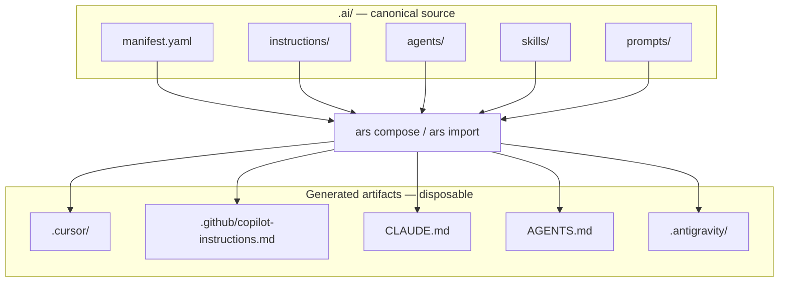

# Portable AI Coding Knowledge with ARES

## What Was Built

[ARES](https://github.com/okfriansyah-moh/ares) (AI Repository Standard) is a Go CLI
that lets repositories define durable AI coding knowledge once in `.ai/`, then generate
provider-specific files for Cursor, GitHub Copilot, Claude Code, OpenAI Codex, and
Antigravity. The golden rule: delete generated provider files, run `ars compose`, and
everything regenerates from `.ai/`.

## The Problem

Teams adopting AI coding tools accumulate fragmented knowledge: rules in `.cursor/`,
instructions in `.github/copilot-instructions.md`, `CLAUDE.md`, `AGENTS.md` — each
drifting independently. Switching tools means rewriting knowledge. Multi-tool teams
maintain duplicate, inconsistent copies.

## Architecture Summary



ARES is a local, file-based CLI — not an agent runtime, workflow engine, or web app.

## Evolution and Milestones

| Milestone | What shipped |
| --------- | ------------ |
| ARS v1 spec | `.ai/` directory format defined in `SPEC.md` |
| Core CLI | `ars init`, `ars validate`, `ars compose`, `ars import` |
| Multi-provider compose | Cursor, Copilot, Claude, Codex targets |
| Skills refactor (PR #7) | Restructured `.ai/skills/` format and validation |
| Antigravity support (PR #8) | Compose and import for Antigravity provider |
| Release binaries | macOS, Linux, Windows via GitHub Releases |

## Key Decisions

| Decision | Rationale |
| -------- | --------- |
| `.ai/` as single source of truth | Provider files are generated, never hand-maintained |
| Import + compose symmetry | Teams can migrate from any existing provider format |
| Local CLI only | No server, no database, no agent runtime |
| `ars validate` in CI | Catch structural drift before merge |
| Preserve existing `AGENTS.md` | Codex compose skips overwrite if file already exists |

## Repository Format

```text
.ai/
  manifest.yaml                 project metadata
  instructions/<name>.md         repository-wide instructions
  agents/<name>/AGENT.md         agent role, responsibilities, boundaries
  skills/<name>/SKILL.md         reusable knowledge
  prompts/<name>.md              reusable prompt templates
```

## Lessons Learned

1. **Generated artifacts are disposable** — if you hand-edit `.cursor/rules/`, you will
   lose changes on next compose. Edit `.ai/` instead.
2. **Import before compose when migrating** — `ars import cursor` brings existing rules
   into `.ai/` without rewriting from scratch.
3. **Validate in CI** — `ars validate --json` catches broken references before they
   reach every developer's machine.
4. **Provider parity is the goal** — one knowledge tree, many tool outputs.

## Related

- [Deterministic Agentic Orchestrator](/docs/concepts/deterministic-agentic-orchestrator)
- [LLM Guardrails](/docs/concepts/llm-guardrails)

## Sources

- Repository: [okfriansyah-moh/ares](https://github.com/okfriansyah-moh/ares)
- Pull requests: [#7 skills refactor](https://github.com/okfriansyah-moh/ares/pull/7), [#8 Antigravity support](https://github.com/okfriansyah-moh/ares/pull/8)
- Specification: `SPEC.md` in source repo
