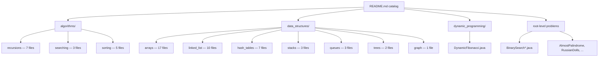

# Data Structures & Algorithms Learning Catalog

## What Was Built

[data-structure-and-algorithm](https://github.com/okfriansyah-moh/data-structure-and-algorithm)
is a long-running personal learning repository with **70+ Java source files** covering
fundamental algorithms, classic data structures, dynamic programming, and interview-style
problems. Each implementation is runnable via a `main` method or JUnit-style execution,
organized under `src/main/java/zero/to/mastery/` by topic.

A comprehensive **README catalog** (updated August 2026) maps every file to its category,
complexity (where relevant), and a one-line description — turning the repo into a
navigable reference rather than a flat dump of solutions.

## The Problem

Studying data structures and algorithms from random LeetCode submissions or scattered
gists makes it hard to:

- See how implementations relate (e.g., singly vs doubly vs circular linked lists).
- Compare algorithm families (bubble vs merge vs quick sort side by side).
- Revisit a topic months later without re-searching.

A durable learning repo needs **taxonomy + runnable code + a single index**.

## Why This Problem Is Difficult

DSA knowledge spans many independent topics with different mental models — recursion base
cases, pointer manipulation in linked lists, graph traversal state, and dynamic programming
memoization tables. Without a consistent package layout and README index, the same
concepts get reimplemented under inconsistent names and lost in the tree.

## Beginner Mental Model

Picture a **library with labeled shelves**:

- **Algorithms shelf** — recipes that transform or search data (sort, search, recurse).
- **Data structures shelf** — containers that hold data (array, list, stack, tree).
- **Problem solving shelf** — interview patterns that combine both.

The README is the card catalog. Each Java file is one book you can open and run.

## Requirements and Constraints

| Requirement | How the repo satisfies it |
| ----------- | ------------------------- |
| Runnable implementations | `main` methods in algorithm classes |
| Progressive categories | Package per topic under `zero.to.mastery` |
| Discoverability | README tables link to every file |
| Standard build | Maven `pom.xml` with Java 11 |
| Interview coverage | Classic problems (two sum, trapping rain water, etc.) |

## Architecture Overview



## Execution Flow

1. Reader opens `README.md` and picks a topic (e.g., Merge Sort).
2. README links to `src/main/java/zero/to/mastery/algorithms/sorting/MergeSort.java`.
3. Reader runs the class `main` method (IDE or `mvn compile exec:java`).
4. Implementation prints intermediate steps (e.g., split/merge traces in merge sort).
5. Reader compares with adjacent algorithms in the same package (bubble, quick, etc.).

## Important Components

| Category | Count | Representative files |
| -------- | ----: | -------------------- |
| Array problems | 17 | `TwoPairSum.java`, `TrappingRainWater.java`, `RotateMatrix90d.java` |
| Linked lists | 10 | Singly, doubly, circular variants under `linked_list/` |
| Sorting | 5 | `BubbleSort`, `MergeSort`, `QuickSort`, `InsertionSort`, `SelectionSort` |
| Recursion | 7 | `Factorial`, `Fibonacci`, `GreatestCommonDivision` |
| Searching | 3 | `BreadthFirstSearch`, `DepthFirstSearch`, `SearchNode` |
| Hash tables | 7 | Custom hash map implementations and collision handling |
| Stacks / Queues | 6 | `Stack`, queue variants with array and linked backing |
| Trees / Graphs | 3 | Tree traversals, graph search support |
| Dynamic programming | 1 | `DynamicFibonacci.java` |
| Root-level problems | 8+ | `BinarySearchTargetInArray`, `AlmostPalindrome`, etc. |

## Simplified Implementation Examples

Merge sort with stable merge (simplified from source — uses `<=` for stability):

```java
public static List<Integer> merge(List<Integer> left, List<Integer> right) {
    List<Integer> merged = new ArrayList<>();
    int leftIndex = 0, rightIndex = 0;
    while (leftIndex < left.size() && rightIndex < right.size()) {
        if (left.get(leftIndex) <= right.get(rightIndex)) {
            merged.add(left.get(leftIndex++));
        } else {
            merged.add(right.get(rightIndex++));
        }
    }
    merged.addAll(left.subList(leftIndex, left.size()));
    merged.addAll(right.subList(rightIndex, right.size()));
    return merged;
}
```

The README catalogs complexity for sorting algorithms:

| Algorithm | Time | Space |
| --------- | ---- | ----- |
| Bubble Sort | O(n²) | O(1) |
| Merge Sort | O(n log n) | O(n) |
| Quick Sort | O(n log n) avg | O(log n) |

## Reliability and Idempotency

Each class is self-contained with its own `main` method. Running one file does not mutate
shared state across other files. There is no shared database or service — correctness is
local to each implementation.

## Failure Modes

| Failure | Detection | Recovery |
| ------- | --------- | -------- |
| Stale README link | 404 in GitHub UI | Update README when moving/renaming files |
| Off-by-one in binary search | Wrong index returned | Compare with `BinarySearchStartAndEndOfTarget` variant |
| Unstable merge sort | Equal elements reorder | Use `<=` not `<` in merge comparison |
| Linked list cycle | Infinite loop | Circular list examples document cycle detection |

## Trade-offs and Rejected Alternatives

| Decision | Rationale | Rejected alternative |
| -------- | --------- | -------------------- |
| One class per concept | Easy to run and share individually | Single mega-class with all algorithms |
| README as catalog | Zero build step to browse topics | Generated docs site (heavier setup) |
| Java 11 + Maven | Familiar interview language | Multi-language polyglot repo |
| Verbose println tracing | Teaches algorithm steps | Silent implementations |
| Lombok dependency | Less boilerplate in data classes | Pure Java POJOs everywhere |

## Testing

JUnit 4 is listed as a dependency in `pom.xml`. Many files use `main` methods for
demonstration rather than formal test classes. The repo prioritizes **readable execution
traces** over comprehensive test coverage.

## Operations and Observability

```bash
git clone https://github.com/okfriansyah-moh/data-structure-and-algorithm.git
cd data-structure-and-algorithm
mvn compile
# Run individual classes from your IDE or:
mvn -q exec:java -Dexec.mainClass="zero.to.mastery.algorithms.sorting.MergeSort"
```

Requires Java 11+ and Maven.

## Lessons Learned

1. **A README catalog is the cheapest navigation layer** — 70 files stay usable when
   every file has a table row with a link and description.
2. **Package by topic, not by date** — `algorithms/sorting/` beats `week3/` for recall.
3. **Print intermediate states** — merge sort's split/merge logs teach divide-and-conquer
   better than a final sorted array alone.
4. **Keep interview problems near their data structure** — `TwoPairSum` lives under
   `arrays/`, not a separate "leetcode" dump.

## Sources

- Repository: [okfriansyah-moh/data-structure-and-algorithm](https://github.com/okfriansyah-moh/data-structure-and-algorithm)
- Commits: [`d1b8540`](https://github.com/okfriansyah-moh/data-structure-and-algorithm/commit/d1b854098c96aa9ff22f8deea853953fe7a0477c), [`af6f156`](https://github.com/okfriansyah-moh/data-structure-and-algorithm/commit/af6f1568259904663cb9ff08b41e811d7930f744) (README catalog refresh, August 2026)
