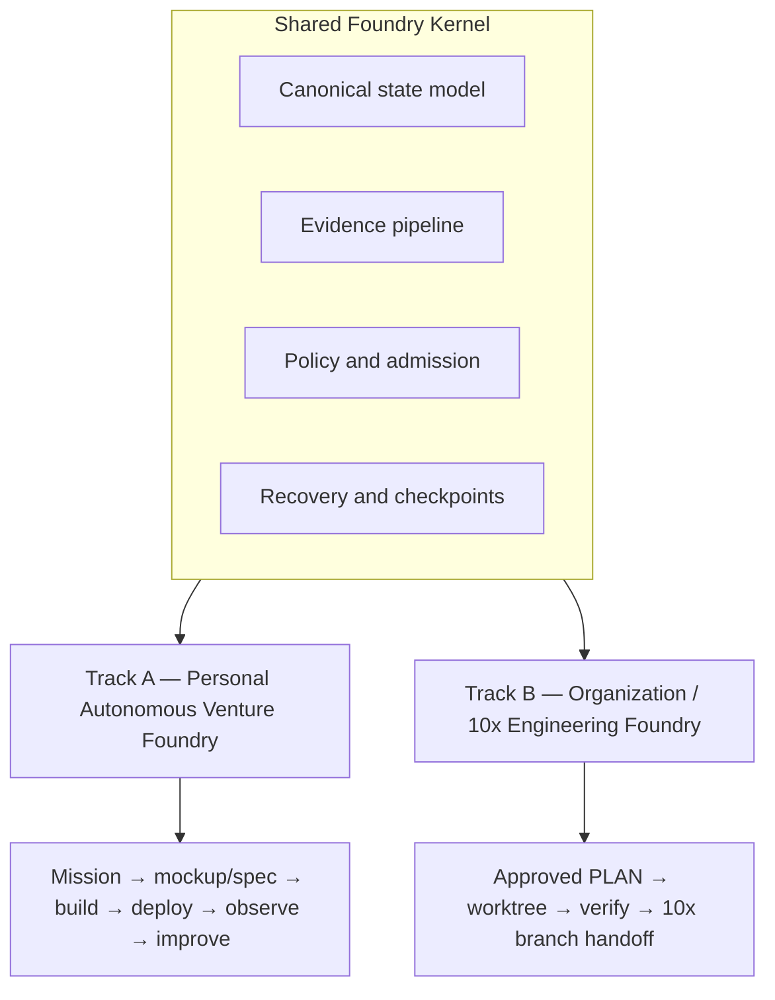

# Delivery Foundry: Autonomous Software Delivery Loop

## What Was Built

[Delivery Foundry](https://github.com/okfriansyah-moh/the-foundry) packages the V12
architecture for **loop-engineered software delivery**: give it a `PLAN.md`, a mockup,
or a mission statement, and the system loops through build → verify → deploy → observe →
improve until the work is honestly complete or provably blocked.

The public repository (created 2026-07-20) contains:

- **Normative architecture** — `delivery_foundry.md` master index plus modular contracts
  under `docs/architecture/`, `docs/workflows/`, `docs/autonomy/`, `docs/security/`, and
  `docs/operations/`
- **Implementation roadmap** — 83 sequentially numbered tasks in `PLAN_7.md` with
  constitution articles C1–C22
- **Task 1 bootstrap** — Docker-wrapped Makefile, CI, Go module, and package scaffolds
  for the shared kernel

Implementation beyond scaffolding is in progress; this page describes the project's
design intent and roadmap as documented in source.

## The Problem

Engineering teams want AI agents to deliver software autonomously — from a mockup sketch
to a deployed product, or from an approved plan to verified commits on a shared branch.
Two contexts need different governance:

- **Solo builders** want bounded autonomy: discover, build, deploy, observe revenue, and
  self-improve inside an explicit envelope with minimal touchpoints.
- **Organizations** want stricter control: provenance-verified plans, multi-repository
  execution, and handoff to existing 10x branch workflows without implicit trust in agents.

Both need the same durable kernel — state, evidence, recovery, policy — not two separate
orchestration stacks.

## Architecture Summary



**Track A** accepts missions (example documented: reach verified net monthly recurring
revenue), runs a venture loop with synthetic verification and bounded self-adaptation, and
uses admission tiers A0/A1/A2/H plus a Mission Setup Ceremony before unattended operation.

**Track B** accepts human-approved `PLAN.md` files, executes across one or many
repositories, and may stop at `TEN_X_BRANCH_HANDOFF_READY` — verified atomic groups on a
shared 10x branch with no PR, merge, or deployment in that workflow.

## Evolution and Milestones

| Milestone | What it proves / ships |
| --------- | ---------------------- |
| V12 documentation set | Modular normative contracts; V11 content preserved via migration map |
| Task 1 (✅ 2026-07-20) | Docker dev toolchain, CI, Go package scaffolds, fitness v0 |
| Shared Kernel Proof (planned) | Admit one plan → one repo → worktree → verify → evidence → resume after restart |
| Venture MLS (Track A) | Mission → deployable product → billing observation → one bounded improvement cycle |
| 10x MLS (Track B) | Approved plan → provenance → atomic group → direct 10x branch push |
| Mission-capable venture | Autonomous improvement within drift governance envelope |
| Org-production 10x | Multi-repo orchestration with organization integrations |

Roadmap estimates and builder assumptions are documented honestly in
`docs/architecture/overview.md` — ranges with confidence levels, not false precision.

## Key Decisions

| Decision | Rationale |
| -------- | --------- |
| Two tracks, one kernel | Avoid serializing venture autonomy behind org milestones |
| Mockup as first-class entry | `docs/workflows/mockup-to-delivery.md` with Observed/Inferred/Assumed labels |
| PEC rename from "Forge" | Avoid collision with Atigravity Forge; kernel retains authority |
| Docker-only host requirements | Docker + GNU make; no local Go/Node/Playwright install |
| Constitution-gated tasks | Every plan task checked against C1–C22; `make fitness` at milestone exits |
| Autonomous plan runner (Task 3) | Risk-tiered orchestrator replaces manual task triggering from Task 4 onward |
| Four container image lineages | Anti-sprawl rule: dev, postgres/temporal, executor sandbox, release binary |

## Entry Types and Workflows

All entries converge on deterministic admission, then the standard delivery loop:

| Entry type | Typical workflow document |
| ---------- | ------------------------- |
| Approved `PLAN.md` | `docs/workflows/direct-plan.md` |
| Mockup or sketch | `docs/workflows/mockup-to-delivery.md` |
| Mission statement | `docs/workflows/venture-loop.md` |
| Multi-repo org plan | `docs/workflows/multi-repository.md` |
| 10x shared branch | `docs/workflows/ten-x-branch.md` |

Recovery, retry, and honest completion semantics live in `docs/workflows/recovery.md`.

## Repository Layout (current)

```text
delivery_foundry.md          master architecture index
docs/                      normative contracts (architecture, workflows, autonomy, security)
PLAN_7.md                  83-task implementation plan
deploy/                    Docker dev toolchain (Dockerfile.dev, docker-compose.yaml)
internal/                  Go packages (kernel, pec, state, admission, evidence, …)
scripts/fitness.sh         constitution check v0
Makefile                   docker-wrapped targets: bootstrap, test, lint, fitness
```

## Lessons Learned

1. **Document authority before code** — V12 relocates V11 prose into modular contracts
   so implementation agents receive only relevant normative sections.
2. **Honest roadmap sizing** — Dual-track scope increases total effort; the architecture
   states this explicitly rather than hiding it behind a single-track estimate.
3. **Bootstrap tasks are necessarily manual** — Tasks 1–3 require human (or later,
   runner) trigger before the autonomous plan runner exists.
4. **Fitness functions earn the design score** — The spec targets 10/10-quality design
   but declares the score is earned only when fault-injection, security, and SLO tests pass.
5. **Legacy quarantine** — `docs/legacy/` is banner-marked superseded history and must
   never be fed to implementation agents.

## Related

- [Delivery Foundry Control Plane Architecture](/docs/systems/delivery-foundry-control-plane)
- [Deterministic AI Pipelines](/docs/concepts/deterministic-ai-pipelines)
- [LLM Guardrails](/docs/concepts/llm-guardrails)

## Sources

- Repository: [okfriansyah-moh/the-foundry](https://github.com/okfriansyah-moh/the-foundry)
- Commits: [`58632a0`](https://github.com/okfriansyah-moh/the-foundry/commit/58632a0), [`9409080`](https://github.com/okfriansyah-moh/the-foundry/commit/9409080)
- Review: `V12_REVIEW_REPORT.md` in source repo
- Changelog: `CHANGELOG.md` in source repo
