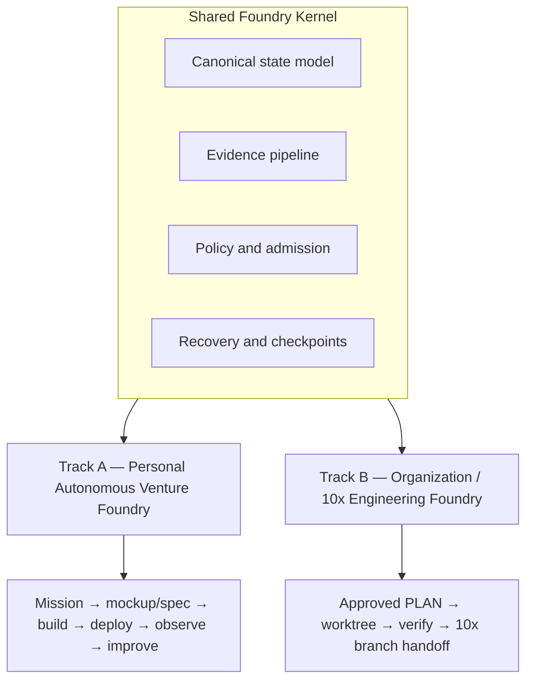

# Delivery Foundry: Autonomous Software Delivery Loop

## What Was Built

[Delivery Foundry](https://github.com/okfriansyah-moh/the-foundry) packages the V12
architecture for **loop-engineered software delivery**: give it a `PLAN.md`, a mockup,
or a mission statement, and the system loops through build → verify → deploy → observe →
improve until the work is honestly complete or provably blocked.

The public repository (created 2026-07-20) contains:

- **Normative architecture** — `docs/foundry/delivery_foundry.md` master index plus modular contracts
  under `docs/foundry/docs/` (architecture, workflows, autonomy, security, operations)
- **Implementation roadmap** — 83 sequentially numbered tasks in `docs/PLAN.md` with
  constitution articles C1–C22
- **Tasks 1–22 complete (2026-07-25)** — via [PR #1](https://github.com/okfriansyah-moh/the-foundry/pull/1):
  agent harness, autonomous plan runner, Temporal kernel workflow, CLI/daemon, fitness suite,
  migrations, profiles, and policy compiler v1
- **Tasks 156–161 complete (2026-08-08)** — via [PR #14](https://github.com/okfriansyah-moh/the-foundry/pull/14):
  Postgres-backed operator config store (`operatorcfg.Store`), versioned policy/quotas/model
  tables, packaging catalog DB load path, and `-pg-dsn` on `foundry catalog` commands
- **Shared Kernel Proof (M0 exit)** — end-to-end demo proving admit → worktree → verify →
  evidence → checkpoint restart

Tasks 23–155 and 162–83 (OPA integration, full provenance chain, venture and 10x tracks) remain open;
this page tracks project evolution as documented in source.

## The Problem

Engineering teams want AI agents to deliver software autonomously — from a mockup sketch
to a deployed product, or from an approved plan to verified commits on a shared branch.
Two contexts need different governance:

- **Solo builders** want bounded autonomy: discover, build, deploy, observe revenue, and
  self-improve inside an explicit envelope with minimal touchpoints.
- **Organizations** want stricter control: provenance-verified plans, multi-repository
  execution, and handoff to existing 10x branch workflows without implicit trust in agents.

Both need the same durable kernel — state, evidence, recovery, policy — not two separate
orchestration stacks.

## Architecture Summary


```mermaid
flowchart TD
  subgraph Kernel["Shared Foundry Kernel"]
    STATE[Canonical state model]
    EVID[Evidence pipeline]
    POL[Policy and admission]
    REC[Recovery and checkpoints]
  end

  Kernel --> TA["Track A — Personal Autonomous Venture Foundry"]
  Kernel --> TB["Track B — Organization / 10x Engineering Foundry"]

  TA --> TAFlow["Mission → mockup/spec → build → deploy → observe → improve"]
  TB --> TBFlow["Approved PLAN → worktree → verify → 10x branch handoff"]
```

**Track A** accepts missions (example documented: reach verified net monthly recurring
revenue), runs a venture loop with synthetic verification and bounded self-adaptation, and
uses admission tiers A0/A1/A2/H plus a Mission Setup Ceremony before unattended operation.

**Track B** accepts human-approved `PLAN.md` files, executes across one or many
repositories, and may stop at `TEN_X_BRANCH_HANDOFF_READY` — verified atomic groups on a
shared 10x branch with no PR, merge, or deployment in that workflow.

## Evolution and Milestones

| Milestone | What it proves / ships |
| --------- | ---------------------- |
| V12 documentation set | Modular normative contracts; V11 content preserved via migration map |
| Task 1 (✅ 2026-07-20) | Docker dev toolchain, CI, Go package scaffolds, fitness v0 |
| Tasks 2–22 (✅ 2026-07-25, PR #1) | Agent harness (`.ai/`), plan runner, Temporal kernel, CLI/daemon, SKP e2e, migrations + policy compiler |
| Tasks 156–161 (✅ 2026-08-08, PR #14) | Operator-hot config Postgres SoT: `operatorcfg.Store`, versioned policy/quotas/catalogs, DB-backed `foundry catalog` |
| M0 — Shared Kernel Proof (✅) | Admit one plan → worktree → verify → evidence → **resume after restart** |
| M1 — Foundation (partial) | Tasks 20–22 done; OPA PDP, full provenance chain, ledger (Tasks 23–26) pending |
| Venture MLS (Track A) | Mission → deployable product → billing observation → one bounded improvement cycle |
| 10x MLS (Track B) | Approved plan → provenance → atomic group → direct 10x branch push |
| Mission-capable venture | Autonomous improvement within drift governance envelope |
| Org-production 10x | Multi-repo orchestration with organization integrations |

Roadmap estimates and builder assumptions are documented honestly in
`docs/architecture/overview.md` — ranges with confidence levels, not false precision.

## Key Decisions

| Decision | Rationale |
| -------- | --------- |
| Two tracks, one kernel | Avoid serializing venture autonomy behind org milestones |
| Mockup as first-class entry | `docs/workflows/mockup-to-delivery.md` with Observed/Inferred/Assumed labels |
| PEC rename from "Forge" | Avoid collision with Atigravity Forge; kernel retains authority |
| Docker-only host requirements | Docker + GNU make; no local Go/Node/Playwright install |
| Constitution-gated tasks | Every plan task checked against C1–C22; `make fitness` at milestone exits |
| Autonomous plan runner (Task 3) | Risk-tiered AUTO/GATED orchestrator; bootstrap tool retires once kernel admits backlog |
| Multi-provider agent harness (Task 2) | ARES `.ai/` canonical source composed to Claude/Codex; eleven skills mapped to six roles |
| Constitution fitness (Task 18) | `fitlint` enforces C1 enum rules, import boundaries, and doc links in CI |
| Four container image lineages | Anti-sprawl rule: dev, postgres/temporal, executor sandbox, release binary |
| Postgres operator config SoT (Tasks 156–161) | Policy, quotas, model rates, and packaging catalogs share one versioned store; disk YAML seeds once at daemon boot |

## Entry Types and Workflows

All entries converge on deterministic admission, then the standard delivery loop:

| Entry type | Typical workflow document |
| ---------- | ------------------------- |
| Approved `PLAN.md` | `docs/workflows/direct-plan.md` |
| Mockup or sketch | `docs/workflows/mockup-to-delivery.md` |
| Mission statement | `docs/workflows/venture-loop.md` |
| Multi-repo org plan | `docs/workflows/multi-repository.md` |
| 10x shared branch | `docs/workflows/ten-x-branch.md` |

Recovery, retry, and honest completion semantics live in `docs/workflows/recovery.md`.

## Repository Layout (current)

```text
docs/foundry/delivery_foundry.md   master architecture index
docs/PLAN.md                       83-task implementation plan (Tasks 1–22 ✅)
docs/architecture.md               one-page constitution + link map
.ai/                               canonical agent harness (ARES format)
AGENTS.md / CLAUDE.md              composed provider views (do not hand-edit)
cmd/foundry/                       operator CLI
cmd/foundryd/                      Temporal kernel worker
cmd/fitlint/                       constitution linter
tools/planrunner/                  bootstrap autonomous task orchestrator
deploy/                            Docker dev toolchain + postgres/temporal compose
internal/                          Go packages (kernel, state, admission, evidence, operatorcfg, …)
scripts/fitness.sh                 constitution check suite
Makefile                           docker-wrapped targets
```

## Lessons Learned

1. **Document authority before code** — V12 relocates V11 prose into modular contracts
   so implementation agents receive only relevant normative sections.
2. **Honest roadmap sizing** — Dual-track scope increases total effort; the architecture
   states this explicitly rather than hiding it behind a single-track estimate.
3. **Bootstrap then kernel** — Tasks 1–3 required manual or runner trigger; PR #1 delivered
   the runner and the first kernel workflow so later tasks can dogfood Foundry itself.
4. **Fitness functions earn the design score** — The spec targets 10/10-quality design
   but declares the score is earned only when fault-injection, security, and SLO tests pass.
5. **Legacy quarantine** — `docs/legacy/` is banner-marked superseded history and must
   never be fed to implementation agents.

## Related

- [Delivery Foundry Control Plane Architecture](/docs/systems/delivery-foundry-control-plane)
- [Deterministic AI Pipelines](/docs/concepts/deterministic-ai-pipelines)
- [LLM Guardrails](/docs/concepts/llm-guardrails)

## Sources

- Repository: [okfriansyah-moh/the-foundry](https://github.com/okfriansyah-moh/the-foundry)
- Pull request: [#1 — Tasks 3–22](https://github.com/okfriansyah-moh/the-foundry/pull/1) (merge [`6efd492`](https://github.com/okfriansyah-moh/the-foundry/commit/6efd492d48d99672afea27da565699e8e8a3983d))
- Pull request: [#14 — Tasks 156–161 operator config Postgres SoT](https://github.com/okfriansyah-moh/the-foundry/pull/14) (merge [`5b01562`](https://github.com/okfriansyah-moh/the-foundry/commit/5b015620a5a676c47dfe806486e82137b7801834))
- Earlier commits: [`58632a0`](https://github.com/okfriansyah-moh/the-foundry/commit/58632a0), [`9409080`](https://github.com/okfriansyah-moh/the-foundry/commit/9409080)
- Review: `docs/foundry/V12_REVIEW_REPORT.md` in source repo
- Changelog: `docs/foundry/CHANGELOG.md` in source repo
- Plan index: `docs/PLAN.md` §D Master Task Index
