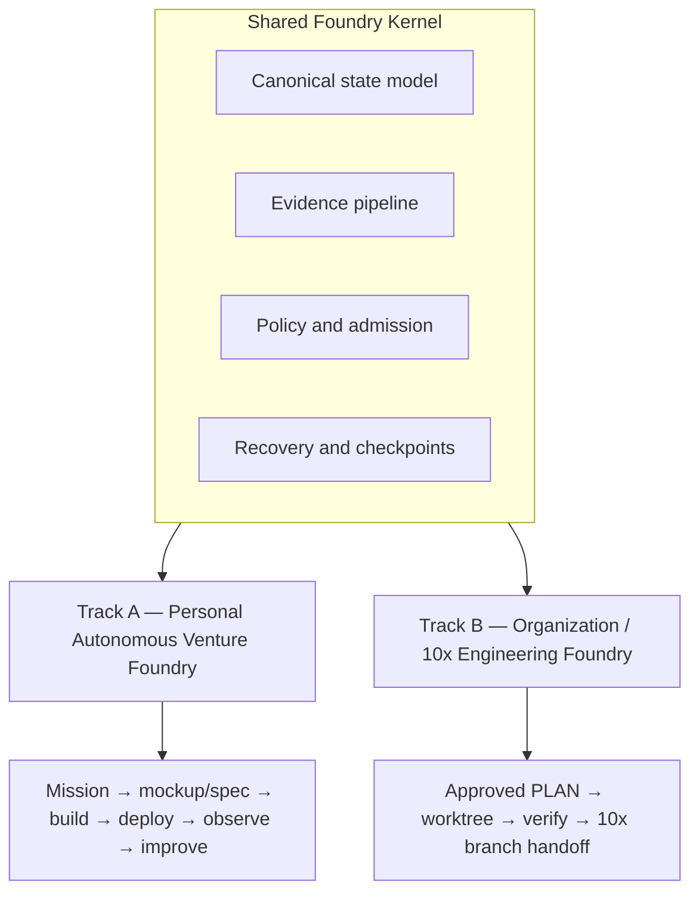

# Delivery Foundry: Autonomous Software Delivery Loop

## What Was Built

[Delivery Foundry](https://github.com/okfriansyah-moh/the-foundry) packages the V12
architecture for **loop-engineered software delivery**: give it a `PLAN.md`, a mockup,
or a mission statement, and the system loops through build → verify → deploy → observe →
improve until the work is honestly complete or provably blocked.

The public repository (created 2026-07-20) contains:

- **Normative architecture** — `docs/foundry/delivery_foundry.md` master index plus modular contracts
  under `docs/foundry/docs/` (architecture, workflows, autonomy, security, operations)
- **Implementation roadmap** — 83 sequentially numbered tasks in `docs/PLAN.md` with
  constitution articles C1–C22
- **Tasks 1–22 complete (2026-07-25)** — via [PR #1](https://github.com/okfriansyah-moh/the-foundry/pull/1):
  agent harness, autonomous plan runner, Temporal kernel workflow, CLI/daemon, fitness suite,
  migrations, profiles, and policy compiler v1
- **Tasks 23–40 complete (2026-07-27)** — via [PR #2](https://github.com/okfriansyah-moh/the-foundry/pull/2):
  OPA PDP, provenance chain, OIDC/WebAuthn auth, external-op ledger, SCM GitHub write, cost
  accounting, Telegram engine, observability stack, rootless OCI sandbox, HTTP API, backup/restore
  drills, and MissionContract engine — **M1 Production Foundation exit**
- **Tasks 41–60 complete (2026-07-28)** — via [PR #4](https://github.com/okfriansyah-moh/the-foundry/pull/4) and
  [PR #5](https://github.com/okfriansyah-moh/the-foundry/pull/5): Mission Setup Ceremony, product templates,
  bounded improvement cycle, **Track A venture MLS exit**, org governance pack, PEC v1, atomic groups,
  Branch Integrator, and 10x handoff terminal semantics
- **Tasks 61–75 complete (2026-07-28)** — via [PR #6](https://github.com/okfriansyah-moh/the-foundry/pull/6):
  TenX prohibition proof, Bitbucket SCM adapter, **Track B 10x MLS exit**, and **M2 Operational Hardening exit**
  (chaos, retention, audit tamper drill, SLO alerts, DR drill, Telegram hardening, versioned release)
- **Tasks 76–110 complete (2026-07-28 – 2026-07-30)** — via [PR #7](https://github.com/okfriansyah-moh/the-foundry/pull/7) and
  [PR #8](https://github.com/okfriansyah-moh/the-foundry/pull/8): executor capability registry, policy-driven
  routing, multi-provider adapters, mission/plan CLI+API UX, and PLAN topology CI gates
- **Tasks 111–120 complete (2026-07-31)** — via [PR #9](https://github.com/okfriansyah-moh/the-foundry/pull/9):
  staged resumable intake (`mission start --idea`), Telegram inbound transport, mandatory sandbox,
  fail-closed policy paths, profile isolation, and actual-cost reconciliation — **M5 gap-closure**
- **Tasks 121–130 complete (2026-08-01)** — via [PR #10](https://github.com/okfriansyah-moh/the-foundry/pull/10):
  portfolio scheduler with restart proof, mission-activity idempotency, poisoned-task recovery,
  concurrent PEC waves, Fly.io deploy, Stripe billing webhook, S3/MinIO evidence store, and provider
  fallback circuit breaker
- **Tasks 131–140 complete (2026-08-01)** — via [PR #11](https://github.com/okfriansyah-moh/the-foundry/pull/11):
  live venture + Bitbucket 10x proofs, V1 acceleration benchmark baseline, unified mockup intake,
  validation-signal allowlist, fail-closed SCM provider selection — **V1 Evidence Gate (Task 136) exit**
- **Tasks 141–152 complete (2026-08-02)** — via [PR #12](https://github.com/okfriansyah-moh/the-foundry/pull/12):
  execution envelopes, live CLI/Telegram intake, unified input router, closed venture loop, full 10x
  orchestration, profile isolation closure, mandatory `make v1-proof` release proofs — **Final V1
  Evidence Gate (Task 152) exit**
- **Tasks 153–155 complete (2026-08-04)** — via [PR #13](https://github.com/okfriansyah-moh/the-foundry/pull/13):
  agent/skill catalogs, Claude Code runtime materialization, L1 skill evolution bridge with rollback e2e
- **Shared Kernel Proof (M0 exit)** — end-to-end demo proving admit → worktree → verify →
  evidence → checkpoint restart

All 155 sequentially numbered PLAN tasks are marked complete in source `docs/PLAN.md`.
Both product tracks have documented MLS exit evidence, live-proof CI workflows, and M7 capability packaging.

## The Problem

Engineering teams want AI agents to deliver software autonomously — from a mockup sketch
to a deployed product, or from an approved plan to verified commits on a shared branch.
Two contexts need different governance:

- **Solo builders** want bounded autonomy: discover, build, deploy, observe revenue, and
  self-improve inside an explicit envelope with minimal touchpoints.
- **Organizations** want stricter control: provenance-verified plans, multi-repository
  execution, and handoff to existing 10x branch workflows without implicit trust in agents.

Both need the same durable kernel — state, evidence, recovery, policy — not two separate
orchestration stacks.

## Architecture Summary


```mermaid
flowchart TD
  subgraph Kernel["Shared Foundry Kernel"]
    STATE[Canonical state model]
    EVID[Evidence pipeline]
    POL[Policy and admission]
    REC[Recovery and checkpoints]
  end

  Kernel --> TA["Track A — Personal Autonomous Venture Foundry"]
  Kernel --> TB["Track B — Organization / 10x Engineering Foundry"]

  TA --> TAFlow["Mission → mockup/spec → build → deploy → observe → improve"]
  TB --> TBFlow["Approved PLAN → worktree → verify → 10x branch handoff"]
```

**Track A** accepts missions (example documented: reach verified net monthly recurring
revenue), runs a venture loop with synthetic verification and bounded self-adaptation, and
uses admission tiers A0/A1/A2/H plus a Mission Setup Ceremony before unattended operation.

**Track B** accepts human-approved `PLAN.md` files, executes across one or many
repositories, and may stop at `TEN_X_BRANCH_HANDOFF_READY` — verified atomic groups on a
shared 10x branch with no PR, merge, or deployment in that workflow.

## Evolution and Milestones

| Milestone | What it proves / ships |
| --------- | ---------------------- |
| V12 documentation set | Modular normative contracts; V11 content preserved via migration map |
| Task 1 (✅ 2026-07-20) | Docker dev toolchain, CI, Go package scaffolds, fitness v0 |
| Tasks 2–22 (✅ 2026-07-25, PR #1) | Agent harness (`.ai/`), plan runner, Temporal kernel, CLI/daemon, SKP e2e, migrations + policy compiler |
| M0 — Shared Kernel Proof (✅) | Admit one plan → worktree → verify → evidence → **resume after restart** |
| Tasks 23–40 (✅ 2026-07-27, PR #2) | OPA PDP, provenance/audit chain, strong auth, extops ledger, SCM write, cost/budgets, Telegram, observability, OCI sandbox, API server, backup/restore, missions |
| M1 — Production Foundation (✅) | `make m1-exit` acceptance: GitHub e2e, WebAuthn gate, notify soak, audit verify, brownout drill, backup/restore |
| Tasks 41–50 (✅ 2026-07-28, PR #4) | Mission Setup Ceremony, product templates, policy/effect mapping configs |
| Tasks 51–53 (✅ 2026-07-28, PR #5) | Bounded improvement cycle, veto digest, **Track A venture MLS exit** (`make e2e-venture`) |
| Tasks 54–60 (✅ 2026-07-28, PR #5) | Org governance pack, org provenance validation, PEC v1, atomic groups, Branch Integrator, drift guard, 10x handoff terminal |
| Tasks 61–63 (✅ 2026-07-28, PR #6) | TenX prohibition proof (C15), Bitbucket SCM adapter, **Track B 10x MLS exit** (`make e2e-tenx`) |
| M2 — Operational Hardening (✅) | Tasks 64–73: chaos suite, backpressure fairness, retention/PII, audit tamper drill, SLO alerts, cost reconciliation, red-team, DR drill, Telegram soak, goreleaser — `make m2-exit` |
| M3 bootstrap (✅ partial) | Task 74–75: L0 auto-promotion pipeline and tunable registry (PR #6) |
| Tasks 76–93 (✅ 2026-07-28, PR #7) | Executor capability registry, policy-driven routing, multi-provider adapters |
| Tasks 100–110 (✅ 2026-07-30, PR #8) | Mission/plan CLI+API UX, PLAN topology/validation/research-boundary CI gates |
| M5 gap-closure (✅ 2026-07-31, PR #9) | Tasks 111–120: resumable intake, Telegram inbound, mandatory sandbox, fail-closed policy, profile isolation, cost reconciliation |
| M5 runtime convergence (✅ 2026-08-01, PR #10) | Tasks 121–130: portfolio scheduler, mission idempotency, poisoned-task recovery, concurrent waves, Fly.io/Stripe/S3 production integrations |
| V1 Evidence Gate (✅ 2026-08-01, PR #11) | Tasks 131–140: live venture + Bitbucket proofs, benchmark baseline, mockup intake, validation signals, fail-closed SCM — `docs/notes/v1-evidence-gate.md` |
| M6 runtime closure (✅ 2026-08-02, PR #12) | Tasks 141–152: execution envelopes, live intake, input router, closed venture/10x loops, `make v1-proof` — `docs/notes/v1-final-evidence-gate.md` |
| M7 capability packaging (✅ 2026-08-04, PR #13) | Tasks 153–155: agent/skill catalogs, Claude Code materialization, L1 skill evolution with rollback e2e |

Roadmap estimates and builder assumptions are documented honestly in
`docs/architecture/overview.md` — ranges with confidence levels, not false precision.

## Key Decisions

| Decision | Rationale |
| -------- | --------- |
| Two tracks, one kernel | Avoid serializing venture autonomy behind org milestones |
| Mockup as first-class entry | `docs/workflows/mockup-to-delivery.md` with Observed/Inferred/Assumed labels |
| PEC rename from "Forge" | Avoid collision with Atigravity Forge; kernel retains authority |
| Docker-only host requirements | Docker + GNU make; no local Go/Node/Playwright install |
| Constitution-gated tasks | Every plan task checked against C1–C22; `make fitness` at milestone exits |
| Autonomous plan runner (Task 3) | Risk-tiered AUTO/GATED orchestrator; bootstrap tool retires once kernel admits backlog |
| Multi-provider agent harness (Task 2) | ARES `.ai/` canonical source composed to Claude/Codex; eleven skills mapped to six roles |
| Constitution fitness (Task 18) | `fitlint` enforces C1 enum rules, import boundaries, and doc links in CI |
| Four container image lineages | Anti-sprawl rule: dev, postgres/temporal, executor sandbox, release binary |
| V1 measured acceleration (C25) | Benchmark baseline mined from control-arm git deliveries; exit requires evidence comparison, not claims |
| Mandatory V1 release proofs (C9/C10) | `make v1-proof` fails closed without live infra; skip exit code 2 never archived as PASS |
| Packaging ≠ execution authority | Agent/skill install materializes provider files only; kernel retains SCM/deploy decisions |
| 9Router rejected / OpenHands deferred | ADR-001 records disposition explicitly — provider fallback (Task 129) satisfies routing intent |

## Entry Types and Workflows

All entries converge on deterministic admission, then the standard delivery loop:

| Entry type | Typical workflow document |
| ---------- | ------------------------- |
| Approved `PLAN.md` | `docs/workflows/direct-plan.md` |
| Mockup or sketch | `docs/workflows/mockup-to-delivery.md` |
| Mission statement | `docs/workflows/venture-loop.md` |
| Multi-repo org plan | `docs/workflows/multi-repository.md` |
| 10x shared branch | `docs/workflows/ten-x-branch.md` |

Recovery, retry, and honest completion semantics live in `docs/workflows/recovery.md`.

## Repository Layout (current)

```text
docs/foundry/delivery_foundry.md   master architecture index
docs/PLAN.md                       155-task implementation plan (Tasks 1–155 ✅, M7 complete)
docs/architecture.md               one-page constitution + link map
docs/notes/v1-evidence-gate.md     V1 Evidence Gate verdict (Task 136)
docs/notes/v1-final-evidence-gate.md  Final V1 Evidence Gate verdict (Task 152)
docs/notes/capability-packaging.md runtime materialization authority boundaries
agents/catalog.yaml                canonical agent catalog (Task 153)
skills/catalog.yaml                canonical skill catalog (Task 153)
adapters/agent-runtime/            provider-neutral materializer + Claude Code adapter
benchmarks/baseline/               control-arm baseline deliveries + manifest for acceleration comparison
docs/notes/m1-exit-report.md       M1 acceptance evidence
docs/notes/m2-exit-report.md       M2 operational hardening exit evidence
docs/notes/track-a-exit-report.md  Track A venture MLS exit evidence
docs/notes/track-b-exit-report.md  Track B 10x MLS exit evidence
config/executor-*.yaml             capability registry, routing, and model tables
config/profiles/                   personal vs organization-10x governance packs
.ai/                               canonical agent harness (ARES format)
AGENTS.md / CLAUDE.md              composed provider views (do not hand-edit)
api/openapi.yaml                   /v1 HTTP API contract (CLI parity)
cmd/foundry/                       operator CLI (mission, intake, plan, cost, audit)
cmd/foundryd/                      Temporal kernel worker + HTTP API + sandbox runner
cmd/fitlint/                       constitution linter (capability, topology, env, subprocess)
tools/planrunner/                  bootstrap autonomous task orchestrator
deploy/                            Docker dev toolchain, postgres/temporal, prometheus/grafana
internal/                          Go packages (kernel, pec, intake, integrator, retention, …)
scripts/backup.sh, restore.sh      backup/restore with manifest verification
Makefile                           docker-wrapped targets including m1-exit, m2-exit, e2e-venture, e2e-tenx, bench-baseline, bench-foundry, e2e-bitbucket, v1-proof
.github/workflows/e2e-*.yml        scheduled/manual live proofs (venture, tenx, bitbucket)
.github/workflows/v1-proof.yml     protected real release proof workflow (Task 151)
```

## Lessons Learned

1. **Document authority before code** — V12 relocates V11 prose into modular contracts
   so implementation agents receive only relevant normative sections.
2. **Honest roadmap sizing** — Dual-track scope increases total effort; the architecture
   states this explicitly rather than hiding it behind a single-track estimate.
3. **Bootstrap then kernel** — Tasks 1–3 required manual or runner trigger; PR #1 delivered
   the runner and the first kernel workflow so later tasks can dogfood Foundry itself.
4. **Fitness functions earn the design score** — The spec targets 10/10-quality design
   but declares the score is earned only when fault-injection, security, and SLO tests pass.
5. **Legacy quarantine** — `docs/legacy/` is banner-marked superseded history and must
   never be fed to implementation agents.
6. **V1 exit is an evidence verdict** — Task 136 checks live proofs, benchmark comparison, and
   constitution fitness together; Task 152 adds mandatory release proofs — completing code tasks alone does not declare V1.
7. **Catalogs are source of truth, projections are derived** — M7 keeps Foundry catalogs canonical;
   provider workspace files are install artifacts with manifest-pinned digests, not alternate authority.

## Related

- [Delivery Foundry Control Plane Architecture](/docs/systems/delivery-foundry-control-plane)
- [Deterministic AI Pipelines](/docs/concepts/deterministic-ai-pipelines)
- [LLM Guardrails](/docs/concepts/llm-guardrails)

## Sources

- Repository: [okfriansyah-moh/the-foundry](https://github.com/okfriansyah-moh/the-foundry)
- Pull requests: [#13](https://github.com/okfriansyah-moh/the-foundry/pull/13), [#12](https://github.com/okfriansyah-moh/the-foundry/pull/12), [#11](https://github.com/okfriansyah-moh/the-foundry/pull/11), [#10](https://github.com/okfriansyah-moh/the-foundry/pull/10), [#9](https://github.com/okfriansyah-moh/the-foundry/pull/9), [#8](https://github.com/okfriansyah-moh/the-foundry/pull/8), [#7](https://github.com/okfriansyah-moh/the-foundry/pull/7), [#6](https://github.com/okfriansyah-moh/the-foundry/pull/6), [#5](https://github.com/okfriansyah-moh/the-foundry/pull/5), [#4](https://github.com/okfriansyah-moh/the-foundry/pull/4), [#2](https://github.com/okfriansyah-moh/the-foundry/pull/2), [#1](https://github.com/okfriansyah-moh/the-foundry/pull/1)
- Exit reports: `docs/notes/m1-exit-report.md`, `docs/notes/m2-exit-report.md`, `docs/notes/track-a-exit-report.md`, `docs/notes/track-b-exit-report.md`, `docs/notes/v1-evidence-gate.md`, `docs/notes/v1-final-evidence-gate.md`, `docs/notes/capability-packaging.md`, `benchmarks/report-v1-final.md`
- Review: `docs/foundry/V12_REVIEW_REPORT.md` in source repo
- Changelog: `docs/foundry/CHANGELOG.md` in source repo
- Plan index: `docs/PLAN.md` §D Master Task Index (Tasks 1–155 ✅)
