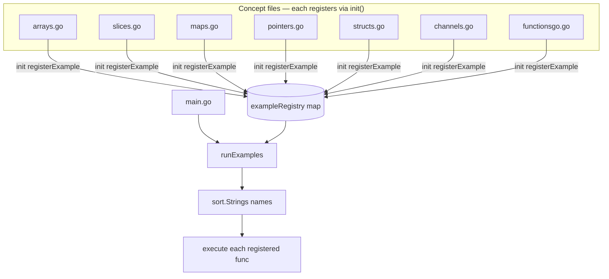

# Go Remembers: Runnable Go Fundamentals

## What Was Built

[go-remembers](https://github.com/okfriansyah-moh/go-remembers) is a small Go project
that teaches core language concepts through isolated, executable examples. Each concept
lives in its own file (`arrays.go`, `channels.go`, `pointers.go`, and others). Running
`go run .` executes every registered example in alphabetical order and prints the output
to the terminal.

The repository was created on **2026-08-13** and grew from basic arrays through channels,
functions, and goroutine communication in a single day of iterative commits.

## The Problem

Learning Go from scattered snippets makes it hard to remember how slices differ from
arrays, when to use pointers, or how channels coordinate goroutines. Copy-pasting into
`main.go` for every experiment creates merge conflicts and hides which examples exist.
A learning repo needs two properties:

1. **One command runs everything** — no manual wiring when adding a new topic file.
2. **Each concept stays isolated** — readers can open one file and understand one idea.

## Why This Problem Is Difficult

Go's `init()` functions run before `main()` but do not guarantee execution order across
files. A naive approach — calling example functions directly from `main.go` — requires
editing the entry point every time a new file is added. For a repo meant to grow topic by
topic, that friction compounds quickly.

## Beginner Mental Model

Think of the repository as a **plugin board**:

- Each `.go` file is a card that teaches one concept.
- Each card has an `init()` hook that pins itself onto a shared registry.
- `main.go` only flips the power switch — it asks the registry to run every pinned card
  in sorted name order.

You add a new concept by creating a new file; you never touch `main.go` again.

## Requirements and Constraints

| Requirement | How the repo satisfies it |
| ----------- | ------------------------- |
| Runnable without configuration | Standard `go run .` from repo root |
| Discoverable examples | Registry collects all `registerExample` calls automatically |
| Deterministic run order | Names sorted alphabetically before execution |
| Isolated concept files | One topic per file with its own `init()` |
| Beginner-readable output | `fmt.Printf` / `println` traces in each example |

## Architecture Overview



## Execution Flow

1. Go compiles all files in the `main` package.
2. Each file's `init()` calls `registerExample(name, fn)` and stores the function in
   `exampleRegistry`.
3. `main()` calls `runExamples()`.
4. `runExamples()` collects all registered names, sorts them, and invokes each function
   sequentially.
5. Each example prints its own output — arrays, slices, channels, and so on.

## Important Components

| Component | File | Responsibility |
| --------- | ---- | -------------- |
| Registry | `examples.go` | `registerExample`, `runExamples`, sorted dispatch |
| Entry point | `main.go` | Calls `runExamples()` only |
| Arrays | `arrays.go` | Fixed-size collections, struct arrays, multi-dimensional arrays |
| Slices | `slices.go` | Dynamic slices, append, struct slices |
| Maps | `maps.go` | Key-value operations and iteration |
| Pointers | `pointers.go` | Address, dereference, mutation through pointers |
| Structs | `structs.go` | Custom types and composition |
| Strings | `stringss.go` | String manipulation |
| Channels | `channels.go` | Unbuffered/buffered channels, goroutines, `select` |
| Functions | `functionsgo.go` | Closures, multi-return, higher-order patterns |

## Simplified Implementation Examples

The registry pattern (simplified from `examples.go`):

```go
type exampleFunc func()

var exampleRegistry = make(map[string]exampleFunc)

func registerExample(name string, fn exampleFunc) {
    exampleRegistry[name] = fn
}

func runExamples() {
    names := make([]string, 0, len(exampleRegistry))
    for name := range exampleRegistry {
        names = append(names, name)
    }
    sort.Strings(names)
    for _, name := range names {
        exampleRegistry[name]()
    }
}
```

Each concept file registers itself:

```go
func init() {
    registerExample("channels", channels)
}

func channels() {
    ch := make(chan int)
    go func() {
        for i := 0; i < 5; i++ {
            ch <- i
        }
        close(ch)
    }()
    for val := range ch {
        println("Received value:", val)
    }
}
```

## Reliability and Idempotency

This is a stateless learning runner — no database, no network, no persistent state between
runs. Re-running `go run .` always produces the same output for the same source code.
Examples are independent; a panic in one file would stop the run (acceptable for a local
learning tool).

## Failure Modes

| Failure | Detection | Recovery |
| ------- | --------- | -------- |
| Duplicate registry name | Later registration silently overwrites earlier one | Use unique names per file |
| Example panics | Process exits with stack trace | Fix the example function |
| Missing `init()` registration | Example never runs | Add `registerExample` in `init()` |
| Import cycle | Compile error | Keep all files in `package main` |

## Trade-offs and Rejected Alternatives

| Decision | Rationale | Rejected alternative |
| -------- | --------- | -------------------- |
| `init()` registration | Zero central manifest; new files self-discover | Manual list in `main.go` |
| Alphabetical sort | Predictable order across machines | File compile order (non-deterministic) |
| Single `main` package | Simplest `go run .` experience | Subpackages per topic (harder to run all) |
| Print-based output | Immediate feedback for learners | Table-driven tests only (less visual) |

## Testing

The repository does not ship a test suite. Correctness is verified by running examples and
observing printed output. Each file is effectively a manual integration test for one
language feature.

## Operations and Observability

```bash
git clone https://github.com/okfriansyah-moh/go-remembers.git
cd go-remembers
go run .
```

Requires Go 1.16 or higher. No environment variables or external services.

## Lessons Learned

1. **`init()` hooks scale for small plugin-style repos** — adding a file is enough; no
   central manifest to maintain.
2. **Sorted names beat compile order** — learners see the same sequence on every machine.
3. **One concept per file lowers cognitive load** — readers can study `channels.go` without
   parsing unrelated code.
4. **Print traces teach control flow** — especially for goroutines and channel `select`.

## Sources

- Repository: [okfriansyah-moh/go-remembers](https://github.com/okfriansyah-moh/go-remembers)
- Commits: [`a99a204`](https://github.com/okfriansyah-moh/go-remembers/commit/a99a204) (first commit), [`1bbb318`](https://github.com/okfriansyah-moh/go-remembers/commit/1bbb318) (channels and functions)
