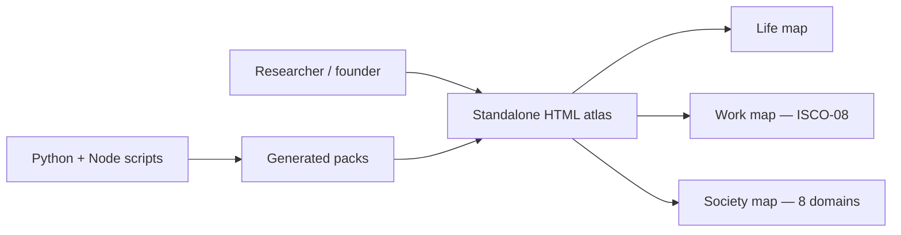

# Human Atlas

## What Was Built

[Human Atlas](https://github.com/okfriansyah-moh/human-atlas) is a public research
workspace for exploring human contexts across life stages, occupations, and society —
while keeping evidence, geography, uncertainty, and ethical boundaries visible. The
repository description positions it as a **human atlas for brainstorming sessions to
create a product and for solo founder** work.

The first public snapshot landed on **2026-08-17** with a standalone browser interface,
generated occupation and society data packs, build scripts, and offline validation tests.

## The Problem

Product and venture research often jumps from a persona sticky note to feature ideas
without structured context: Which life stage drives the pain? Which occupation workflow
matches the buyer? What civic or cultural constraints apply in Indonesia versus globally?
Generic persona templates hide **what is known, inferred, or still an evidence gap**.

Human Atlas exists to give founders a **dated, inspectable snapshot** they can open
offline, cite field by field, and rebuild when sources change — without pretending
coverage is complete.

## Why This Problem Is Difficult

Research spanning religion, ethnicity, migration, and public actors carries ethical
risk if presented as exhaustive truth. Human Atlas explicitly documents:

- Named people restricted to dated public-record entries.
- Prohibited inferred religion or politics for private individuals.
- Directory coverage claims of **dated open registry, not exhaustive**.
- Recommendation boundaries that keep `ai_hypothesis` and `evidence_gap` fields visible
  in research but excluded from product recommendations.

Building this as a **serverless static snapshot** adds engineering constraints documented
in the [system architecture article](/docs/systems/human-atlas-research-workspace).

## Beginner Mental Model

Human Atlas is a **research map book**, not a CRM or survey product:

- **Life** answers "where in a person's journey might this need appear?"
- **Work** answers "which job family experiences this workflow?"
- **Society** answers "which cultural, civic, or household context shapes the need?"
- Colored evidence tags tell you whether to **cite**, **validate**, or **keep researching**.

## Requirements and Constraints

| Requirement | How the repo satisfies it |
| ----------- | ------------------------- |
| Open without setup | Single HTML file + sibling data directory |
| Reproducible snapshot | Dated manifests (`build_date: 2026-08-17`) with checksums |
| Honest coverage limits | `directory_coverage.gaps` strings per domain |
| Source traceability | `sources` registry with URLs, licences, and scopes |
| Validation before trust | Python validators + Node offline smoke test |
| GitHub Pages entry | `index.html` redirects to the atlas HTML |

## Architecture Summary

See the full technical breakdown in
[Human Atlas System Architecture](/docs/systems/human-atlas-research-workspace).

## Snapshot Contents (2026-08-17)

| Layer | Scale | Notes |
| ----- | ----: | ----- |
| Life map | 15 stages, 190 observations | Linked life-stage research |
| Work map | 436 unit profiles | ISCO-08 backbone + ESCO/O\*NET/KBJI supplements |
| Society map | 312 nodes, 343 edges | Eight domains with domain-leader opportunity hooks |
| Sources | 17+ society sources | Wikidata CC0 identifiers, Pew, Kemenag, IDEA, KPU, UNESCO, ISO, UN |
| Validation | All packs `release_ready: true` | Checksum + evidence gate scripts pass on checked-in snapshot |

## Evolution and Milestones

| Date | Milestone |
| ---- | --------- |
| 2026-08-17 | Repository created; first commit with atlas HTML, occupation and society packs |
| 2026-08-17 | GitHub Pages `index.html` added for public hosting |
| 2026-08-17 | Validation scripts and offline smoke test checked in |

Future work implied by the repository (not yet evidenced as shipped):

- Expanded public-actor directories beyond initial Indonesia examples.
- Additional society domains or deeper country packs.
- Rebuilt snapshots when source spreadsheets or PDFs update.

## Key Decisions

| Decision | Rationale |
| -------- | --------- |
| Static snapshot over live API | Reproducible research baseline for brainstorming sessions |
| ISCO-08 as Work backbone | Global occupation interoperability |
| Society hypotheses separated from facts | Prevents over-confident product recommendations |
| Offline `file://` support | Founders can archive and share an exact dated bundle |
| Domain-level opportunity hooks | Links research nodes to validation experiments |

## Relationship to Other Projects

Human Atlas complements venture-building tools like
[Delivery Foundry](/docs/projects/delivery-foundry) — Foundry governs **how** software
gets delivered with evidence gates, while Human Atlas structures **who** and **in what
context** a product idea might matter. It does not share code with Foundry; the link is
conceptual (research intake → mission brief → delivery loop).

## Lessons Learned

1. **Research tools need explicit uncertainty UI** — four evidence statuses beat one
   "confidence score."
2. **Dated snapshots enable diffable research** — rebuild scripts make "what changed
   since August?" answerable.
3. **Privacy rules belong in data, not README footnotes** — manifest-level enforcement
   scales as packs grow.
4. **Start with validation scripts on day one** — checksum + smoke tests protect a
   12 MB HTML file from silent drift.

## Related

- [Human Atlas System Architecture](/docs/systems/human-atlas-research-workspace)
- [LLM Guardrails](/docs/concepts/llm-guardrails) — analogous separation of advisory vs authoritative layers

## Sources

- Repository: [okfriansyah-moh/human-atlas](https://github.com/okfriansyah-moh/human-atlas)
- Commits: `97f78f5` (first commit), `7d61cc0` (GitHub Pages index)
- README and manifests dated **2026-08-17**
