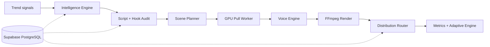

# MD-AME

## What Was Built

[MD-AME](https://github.com/okfriansyah-moh/md-ame) (Multi-Dimensional Autonomous Media
Engine) is a fully autonomous media production and distribution pipeline. The system
ingests trend signals, generates video scripts, renders assets via FFmpeg, and publishes
to social platforms — designed for unattended extended operation with weekly human
strategic review.

## The Problem

Running multiple YouTube channels at scale requires automating the full loop: topic
selection, script writing, voice synthesis, video rendering, and platform upload. Each
channel (dimension) has different content strategy, safety profiles, and publishing
accounts — but duplicating pipeline code per channel does not scale.

## Architecture Summary

All persistent state lives in Supabase PostgreSQL. No local filesystem state across runs.
See the full system breakdown in [MD-AME System Architecture](/docs/systems/md-ame-autonomous-media-engine).

## Evolution and Milestones

| Phase | Focus |
| ----- | ----- |
| Infrastructure core | Schema migrations, RPC functions, idempotency utilities |
| State machine | Job claiming, crash recovery, `FOR UPDATE SKIP LOCKED` |
| Voice + rendering | Edge-TTS, Gemini fallback, FFmpeg subprocess only |
| Distribution | YouTube adapter, quota reservation, resumable upload |
| Intelligence + script | Trend scoring, hook audit, adversarial pass |
| Scene pipeline (4.5+) | Scene decomposition, GPU pull workers, scene cache |
| Content safety (9) | Prompt Firewall + Gemini safety classifier |
| Adaptive engine | Weekly CTR/retention feedback with bounded deltas |

## Key Decisions

| Decision | Rationale |
| -------- | --------- |
| Dimension parameterization | Add niche via DB row, not code fork |
| PostgreSQL RPC transitions | Atomic multi-row updates; no app-level RMW |
| Fail safe, not graceful | Voice failure HALTs pipeline — no degraded output |
| GitHub Actions cron (Phase 1) | Zero VPS cost during validation |
| Pull GPU workers | No inbound ports; natural backpressure |
| Forbidden: MoviePy, gTTS | Deterministic FFmpeg subprocess only |

## Relationship to Other Projects

MD-AME shares deterministic pipeline DNA with
[Shorts Factory](https://github.com/okfriansyah-moh/shorts-generator) (local video
processing with SQLite checkpoints) but scales to cloud-hosted PostgreSQL, multi-dimensional
parameterization, and autonomous trend-driven content generation.

## Lessons Learned

1. **Parameterization over duplication** — one pipeline, many dimensions.
2. **Idempotency is correctness** — crash recovery depends on deterministic keys.
3. **Quality gates are non-negotiable** — one bad video can depress channel standing for weeks.
4. **Phase-gated complexity** — GPU workers and scene cache come after core pipeline is stable.

## Related

- [MD-AME System Architecture](/docs/systems/md-ame-autonomous-media-engine)
- [Deterministic AI Pipelines](/docs/concepts/deterministic-ai-pipelines)
- [Database-Backed State Machines](/docs/concepts/database-state-machines)
- [LLM Guardrails](/docs/concepts/llm-guardrails)

## Sources

- Repository: [okfriansyah-moh/md-ame](https://github.com/okfriansyah-moh/md-ame)
- Roadmap: `IMPLEMENTATION_ROADMAP.md`, `PROGRESS_REPORT.md` in source repo
