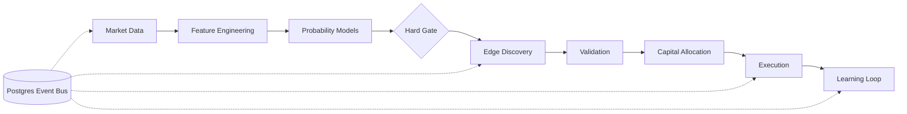

# Polymarket Agent

## What Was Built

The [Polymarket Autonomous Trading Engine](https://github.com/okfriansyah-moh/edge-polymarket-agent)
is an experimental trading system for prediction markets. Phases 0–15 implement a full
pipeline from market data ingestion through trade execution, position monitoring,
learning analytics, and adaptive parameter tuning — all as a **modular monolith**
communicating through a Postgres event bus.

## The Problem

Prediction markets have structural inefficiencies — fragmented liquidity, stale quotes,
slow information propagation — but exploiting them requires more than signal detection.
A production trading system needs probability estimates before execution, hard risk limits,
strategy lifecycle management, and isolation between advisory AI and trade execution.

## Architecture Summary

See the full system breakdown in [Polymarket Trading Agent](/docs/systems/polymarket-trading-agent).

## Evolution and Milestones

| Phase | What shipped |
| ----- | ------------ |
| 0–2 | Core infrastructure, Postgres event bus, worker runtime |
| 3–4 | Market data, quality filter, edge discovery, validation |
| 4.5–5 | Opportunity selection, capital allocation, adaptive risk |
| 6–7 | Trade execution, position monitoring, profit vault |
| 8–9 | Learning loop, safety/alerting, Telegram control |
| 11–12 | External signals, probability models, domain ensembles |
| 12.5 | Probability hard gate — NO PROBABILITY → NO TRADE |
| 12.6 | External alpha integration with strategy killer |
| 14 | AI advisor isolation layer (read-only) |
| 15 | Adaptive tuning engine with bounded ±20% caps |

## Key Decisions

| Decision | Rationale |
| -------- | --------- |
| Modular monolith | Shared Postgres; no network overhead between phases |
| Event bus integration | Clean module boundaries via persisted events |
| Probability hard gate | Enforce edge-based discipline before execution |
| Kelly + hard ceilings | Mathematical sizing with safety bounds |
| DRY_RUN default | Observe pipeline before risking capital |
| AI advisor isolation | LLM failures must not block trades |

## Lessons Learned

1. **Profit = Edge × Execution Quality × Capital Allocation** — all three must work.
2. **Event bus as integration layer** — modules stay isolated when communication is persisted.
3. **Strategy auto-disable is essential** — underperforming strategies must be killed automatically.
4. **Advisory AI stays advisory** — never put LLM latency in the execution critical path.

## Related

- [Polymarket Trading Agent](/docs/systems/polymarket-trading-agent)
- [Database-Backed State Machines](/docs/concepts/database-state-machines)
- [AI Orchestration Patterns](/docs/concepts/ai-orchestration-patterns)
- [LLM Guardrails](/docs/concepts/llm-guardrails)

## Sources

- Repository: [okfriansyah-moh/edge-polymarket-agent](https://github.com/okfriansyah-moh/edge-polymarket-agent)
- Architecture: `docs/ARCHITECTURE.md`, `docs/TRADING_EDGE_STRATEGY.md` in source repo
