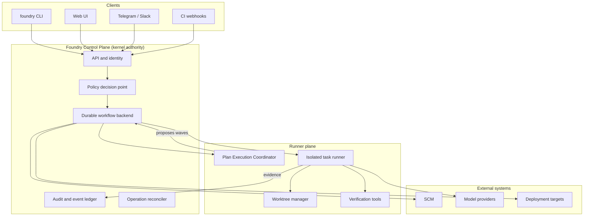

# Delivery Foundry: Governed Control Plane for AI Software Delivery

## What Was Built

[Delivery Foundry](https://github.com/okfriansyah-moh/the-foundry) is a **governed
control plane** for loop-engineered software delivery. The V12 architecture defines a
durable, resumable, evidence-verified execution model for AI agents operating under
explicit policy envelopes rather than implicit trust.

As of the repository's initial public release (2026-07-20), **Task 1** is complete:
Docker-wrapped Makefile toolchain, CI workflow, Go module scaffold, and nineteen
`internal/*` package stubs each carrying an authority-limit `doc.go`. The normative
architecture and workflow contracts live in `delivery_foundry.md` and the modular
`docs/` tree; runtime implementation follows the 83-task plan in `PLAN_7.md`.

## The Problem

Most AI coding workflows treat agents as trusted executors: they read a plan, mutate
repositories, and self-report completion. That model breaks under retries (duplicate
side effects), crashes (lost progress), policy drift (agents expanding their own
permissions), and ambiguous terminal states (was the work actually verified?).

A production-grade delivery loop needs a **control plane** that owns authoritative state,
sequences side effects, enforces budgets and approvals, and accepts completion only when
backed by typed evidence — while still letting an agent coordinator propose the next
wave of work.

## Why This Problem Is Difficult

1. **Split authority** — An agent must interpret plans and recommend dispatch, but must
   never become a second workflow engine or mutate authoritative state directly.
2. **Six statuses, infinite nuance** — Workflow meaning must live in registry-controlled
   typed fields (`phase`, `reason`, `result_code`), not in ad hoc status enums.
3. **Dual product tracks** — Personal venture autonomy and organization 10x engineering
   share one kernel but require different governance profiles and terminal semantics.
4. **Honest completion** — Terminal outcomes like `PROVEN_BLOCKED` or
   `TEN_X_BRANCH_HANDOFF_READY` must encode real evidence, not agent optimism.
5. **Recovery without invention** — Self-healing must climb a bounded ladder (retry →
   sandbox recreate → rollback → human escalation) without suppressing security alerts.

## Beginner Mental Model

Picture a factory control room (the **kernel**) and a floor supervisor (the **Plan
Execution Coordinator**, or PEC). The supervisor reads the production plan, proposes
which station should run next, and reports progress — but only the control room may
flip switches, write to the ledger, push to Git, or declare the batch finished. Every
state change requires a stamped evidence bundle. If power fails, the control room
replays from the last checkpoint; the supervisor does not restart the factory from
memory.

## Requirements and Constraints

| Requirement | Architectural contract |
|-------------|------------------------|
| Exactly six workflow statuses | `PENDING`, `RUNNING`, `WAITING`, `SUCCEEDED`, `FAILED`, `CANCELLED` |
| Richer meaning in typed fields | Registry-controlled `phase`, `reason`, `result_code` |
| Kernel owns side effects | SCM writes, budgets, leases, checkpoints, completion |
| PEC proposes only | Waves, dispatch, remediation — prohibition-tested in CI |
| Evidence-based completion | No self-reported "done" without verification bundle |
| Deterministic admission | Versioned classifier; plans cannot authorize themselves |
| Isolated workspaces | Agents operate in worktrees, never canonical clones |
| Idempotent external ops | Operation ledger with idempotency keys for every side effect |
| Dual-track parallelism | Venture and 10x tracks share kernel, independent acceptance gates |

These constraints are enumerated as constitution articles C1–C22 in `PLAN_7.md`.

## Architecture Overview

Delivery Foundry is a **control plane**, not a universal agent framework or a shell-script
collection. Clients (CLI, Web UI, Telegram, CI webhooks) call into the control plane;
the runner plane executes bounded work in isolated sandboxes and returns typed evidence.



## Execution Flow

1. **Entry** — A mission, mockup, requirement, specification, or approved `PLAN.md`
   arrives at the control plane API.
2. **Intake and admission** — The deterministic admission classifier assigns tier
   (A0/A1/A2/H) and verifies provenance for approved plans.
3. **Workflow creation** — Kernel creates a workflow in `PENDING`, transitions to
   `RUNNING` with phase `intake`, and assigns a checkpoint.
4. **PEC interpretation** — PEC reads the admitted plan, proposes dependency-aware
   waves and bounded task dispatch within the kernel-granted envelope.
5. **Isolated execution** — Runner spawns an ephemeral sandbox worktree; agents execute
   tasks and return summaries to PEC (not directly to kernel state).
6. **Verification** — Deterministic checks produce an evidence bundle; kernel advances
   phase (e.g., `implementation` → `verifying` → `integrating`).
7. **Side effects** — Kernel-owned Branch Integrator performs SCM writes; external
   operations record idempotency keys in the ledger.
8. **Terminal decision** — Kernel sets `SUCCEEDED` or `FAILED` with a registry-controlled
   `result_code` (e.g., `MISSION_TARGET_REACHED`, `TEN_X_BRANCH_HANDOFF_READY`,
   `PROVEN_BLOCKED`).
9. **Recovery on failure** — Recovery Manager reads failure classification and climbs
   the L0–L7 ladder; human gates pause at configured boundaries.

## Important Components

| Component | Responsibility |
| --------- | -------------- |
| **Kernel** | Authoritative workflow state, sequencing, leases, checkpoints, policy, budgets, all side effects |
| **Plan Execution Coordinator (PEC)** | Interprets admitted plans; proposes waves, dispatch, remediation, progress |
| **Admission classifier** | Deterministic tier assignment; prevents self-authorizing plans |
| **State projection (PostgreSQL)** | Rebuildable read model — not execution authority |
| **Temporal backend** | Durable execution history, timers, sequencing (planned Task 12) |
| **Evidence pipeline** | Typed verification bundles required for phase advancement |
| **Operation ledger** | Idempotency keys and reconciliation for external side effects |
| **Recovery Manager** | Bounded self-healing ladder with explicit prohibitions |
| **Branch Integrator** | Kernel-owned SCM writes to isolated worktrees and 10x branches |

Go package layout (scaffolded in Task 1): `internal/kernel`, `internal/pec`, `internal/state`,
`internal/admission`, `internal/evidence`, `internal/recovery`, `internal/provenance`,
`internal/worktree`, and others — each with a `doc.go` stating authority limits.

## Simplified Implementation Examples

Canonical state representation (from `docs/architecture/state-model.md`):

```yaml
status: RUNNING          # one of six canonical statuses
phase: implementation    # registry-controlled
reason: null             # set when WAITING or FAILED
result_code: null        # set only at terminal transition
wake_at: null
next_action: verify
checkpoint_id: checkpoint-789
```

PEC authority boundary (simplified from `docs/architecture/authority-model.md`):

```text
PEC MAY:  propose waves, recommend dispatch, evaluate summaries, propose remediation
PEC MUST NOT: mutate workflow state, perform SCM writes, grant permissions,
              increase budgets, declare terminal completion, override policy
```

Recovery ladder entry (from `docs/workflows/recovery.md`):

```text
L0 — retry idempotent operation with backoff
L1 — recreate clean sandbox and repeat
L2 — focused debugging agent
...
L7 — pause and escalate to human
```

## Reliability and Idempotency

- **Checkpoints** — Kernel records `checkpoint_id` on every meaningful transition;
  process restart replays from Temporal history and PostgreSQL projection.
- **External-operation ledger** — Every SCM push, deployment, or billing call carries an
  idempotency key; reconciler detects duplicate or orphaned operations.
- **Six-status invariant** — CI fitness rules reject a second status enum; historical V11
  labels map to canonical `(status, phase, reason, result_code)` tuples only.
- **Liveness supervision** — `ORPHANED` is a supervisor condition, not a workflow status;
  disaster-recovery docs define checkpoint/restart semantics.
- **Honest blocking** — `PROVEN_BLOCKED` on `FAILED` means verified evidence that work is
  unsatisfiable as scoped — not a generic error code.

## Failure Modes

| Failure | Detection | Recovery |
| ------- | --------- | -------- |
| Transient provider outage | `WAITING`, reason `provider-outage` | L0 backoff; wake timer |
| Deterministic code failure | classification `deterministic-failure` | L2 debug agent; max 1 same-agent retry |
| Policy violation | `FAILED`, result `ADMISSION_REJECTED` | No auto-retry; human review |
| Budget exhaustion | `WAITING`, reason `budget` | Pause until budget reset or human override |
| PEC overreach | CI prohibition tests | Build fails before merge |
| Process crash mid-phase | Liveness supervisor | Replay from checkpoint; resume at last committed phase |
| Security hold | `WAITING`, reason `security-hold` | Recovery Manager cannot suppress alerts |

## Trade-offs and Rejected Alternatives

| Decision | Rationale |
| -------- | --------- |
| Kernel vs PEC split | Prevents agent frameworks from becoming shadow workflow engines |
| Six statuses + typed fields | Extensible phases without enum explosion; CI-enforceable |
| Temporal + PostgreSQL projection | Durable history separate from rebuildable read model (C2/C3) |
| Build control plane (ADR-000) | Differentiating sequencing/policy logic vs buying generic orchestration |
| V12 doc modularization | Preserves V11 content while adding normative contracts; size growth accepted |
| Docker-only dev toolchain | Host needs only Docker + make; dev/CI parity from Task 1 |
| 10x handoff without PR | `TEN_X_BRANCH_HANDOFF_READY` is success, not failure — org workflow stop boundary |

## Testing

Current Task 1 validation (implemented):

- `make bootstrap test lint fitness` inside the `dev` Docker image
- `scripts/fitness.sh` v0: `go vet ./...` and `doc.go` presence in every `internal/*` package
- GitHub Actions CI on push (`.github/workflows/ci.yaml`)

Planned validation (constitution check at milestone exits):

- Enum lint, superseded-term lint, import-boundary checks
- PEC prohibition conformance tests (Task 56)
- Shared Kernel Proof e2e: admit one plan → worktree → verify → evidence → **resume after restart**
- Fault-injection and security evaluations per V12 specification

## Operations and Observability

- **CLI entry** — `foundry` CLI (planned) with `make` targets: `bootstrap`, `test`, `lint`,
  `fitness`, `skp-e2e`, `evidence-verify`, `projection-rebuild`
- **Notifications** — Telegram engine for batched digests and gated approvals; high-risk
  approvals require OIDC + WebAuthn (not Telegram-only)
- **Cost accounting** — Reserve → incur → reconcile pattern with pre-execution budget enforcement
- **Observability** — SLOs, alerts, and payload limits defined in `docs/operations/observability-and-alerts.md`
- **Control-plane self-protection** — Separate contracts for capacity brokering and disaster recovery

## Lessons Learned

1. **Separate "who decides" from "who executes"** — PEC is powerful at plan interpretation
   but must remain proposal-only; kernel retention of side effects is non-negotiable.
2. **Terminal semantics are product features** — `TEN_X_BRANCH_HANDOFF_READY` encodes an
   intentional stop boundary for organization workflows, not a failure to merge.
3. **Registries beat enums** — Phase, wait-reason, and result-code registries let the system
   evolve without breaking the six-status invariant.
4. **Evidence before completion** — Self-reported agent summaries are inputs to PEC, not
   completion proofs; verification bundles gate phase advancement.
5. **Architecture-first bootstrap** — Task 1 scaffolds authority boundaries in `doc.go`
   before implementation code, so CI can enforce package roles early.

## Related

- [Designing a Deterministic Agentic Coding Orchestrator](/docs/concepts/deterministic-agentic-orchestrator)
- [Canonical State in Multi-Agent Design Pipelines](/docs/concepts/ai-orchestration-patterns)
- [Delivery Foundry Project Overview](/docs/projects/delivery-foundry)

## Sources

- Repository: [okfriansyah-moh/the-foundry](https://github.com/okfriansyah-moh/the-foundry)
- Commits: [`58632a0`](https://github.com/okfriansyah-moh/the-foundry/commit/58632a0) (first commit), [`9409080`](https://github.com/okfriansyah-moh/the-foundry/commit/9409080) (Task 1 scaffold)
- Architecture: `delivery_foundry.md`, `docs/architecture/state-model.md`, `docs/architecture/authority-model.md`
- Implementation plan: `PLAN_7.md` (Task 1 ✅, Tasks 2–83 pending)
