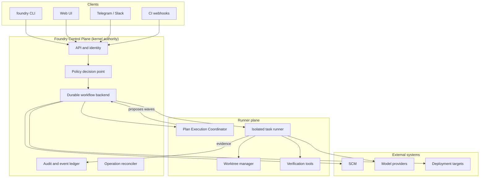

# Delivery Foundry: Governed Control Plane for AI Software Delivery

## What Was Built

[Delivery Foundry](https://github.com/okfriansyah-moh/the-foundry) is a **governed
control plane** for loop-engineered software delivery. The V12 architecture defines a
durable, resumable, evidence-verified execution model for AI agents operating under
explicit policy envelopes rather than implicit trust.

The repository shipped **Task 1** on 2026-07-20 (Docker-wrapped Makefile, CI, Go
scaffolds). [Pull request #1](https://github.com/okfriansyah-moh/the-foundry/pull/1)
(merged 2026-07-25) completes **Tasks 2–22** through milestone M0 (Shared Kernel Proof)
and the start of M1 (Foundation). [Pull request #2](https://github.com/okfriansyah-moh/the-foundry/pull/2)
(merged 2026-07-27) completes **Tasks 23–40** and exits **M1 — Production Foundation**:

- **Agent harness (Task 2)** — ARES-canonical [`.ai/`](https://github.com/okfriansyah-moh/the-foundry/tree/main/.ai) with six role agents, eleven skills, and multi-provider composition into `AGENTS.md` / `CLAUDE.md` / `.codex/` (Claude + Codex providers in `.ai/manifest.yaml`)
- **Autonomous plan runner (Task 3)** — `tools/planrunner` with risk-tiered AUTO vs GATED paths and Telegram approval gates
- **Runtime stack (Tasks 4–5)** — `postgres` + `temporal` in compose; canonical six-status state package (`internal/state`)
- **Admission and provenance (Tasks 6–8, 24)** — PLAN schema/parser, deterministic `AdmissionClassifier` v0, signed `ApprovedPlan` chain with hash-linked audit log
- **Execution substrate (Tasks 9–11, 34)** — worktree manager, executor contract, evidence bundle store, and **rootless OCI executor sandbox** (filesystem jail, default-deny network with egress gate, cgroup caps)
- **Kernel workflow (Tasks 12–16, 32)** — `foundryd` Temporal worker hosting `DeliverPlan`; checkpoint + forced-restart resume proof; liveness supervisor and honest `PROVEN_BLOCKED` terminal semantics
- **Operator surface (Tasks 13–15, 18–19, 36)** — validation runner, PostgreSQL status projection, `foundry` CLI, **`/v1` HTTP API** mirroring CLI parity, and `fitlint` constitution checks
- **Foundation layer (Tasks 20–22, 23–29, 35–39)** — migrations, profiles/principals/organizations, **OPA-backed PDP**, external-operation ledger, SCM GitHub write, cost accounting/budgets, secrets file backend, **backup/restore drills**, projector v2 with lag alerts
- **Production integrations (Tasks 30–33, 38)** — Telegram notification engine with flood control, Prometheus/Grafana observability baseline, control-plane backpressure/brownout, documentation lint (`make doclint`) in CI
- **Venture entry (Task 40)** — `MissionContract` engine and mission schema for Track A autonomous missions

[Pull request #4](https://github.com/okfriansyah-moh/the-foundry/pull/4) (merged 2026-07-28)
ships **Tasks 41–50** — venture readiness and policy scaffolding:

- **Mission Setup Ceremony (VEN-02)** — `foundry mission ceremony` walks a deterministic checklist,
  collects evidence or deferrals, and persists a `MissionReadinessArtifact` before unattended operation
- **Product template engine** — `foundry product new --from-template` instantiates venture scaffolds
  from `templates/product`
- **Policy/effect mapping configs** — `effect-mapping.yaml`, `mission-decide-policy.yaml`, and
  `synthetic-canary-policy.yaml` wire admission tiers to typed side effects

[Pull request #5](https://github.com/okfriansyah-moh/the-foundry/pull/5) (merged 2026-07-28)
completes **Tasks 51–60** — **Track A venture MLS exit** and **Track B integrator foundation**:

- **Bounded improvement cycle (VEN-12)** — cassette-driven `RunImproveCycle` with promotion leases
  and envelope checks; weekly veto digest with freeze-on-rollback-depth guard
- **Track A MLS e2e** — 12-step venture harness asserting `HUMAN_TOUCHES=0` through deploy → observe → improve
- **Organization governance pack (TX-01)** — `organization-10x.yaml` profile with tighten-only org policy compiler proofs
- **PEC v1 (TX-03)** — wave proposals via Kahn topological sort, remediation proposals, and CI prohibition tests (`check_pec_boundary.sh`)
- **Atomic groups + Branch Integrator (TX-04–06)** — deterministic change-set digests, integration queue, drift guard with `PROVEN_BLOCKED` requeue semantics
- **10x handoff terminal (TX-07)** — `TEN_X_BRANCH_HANDOFF_READY` with mandatory C15 prohibition statement in notifications

[Pull request #6](https://github.com/okfriansyah-moh/the-foundry/pull/6) (merged 2026-07-28)
delivers **Tasks 61–75** — **Track B 10x MLS exit**, **M2 Operational Hardening**, and M3 bootstrap:

- **10x prohibition proof (TX-08)** — CI fitness step rejects PR/merge/deploy symbols in TenX call paths
- **Bitbucket SCM adapter (TX-09)** — optional CAS-push/read adapters sharing contract tests with GitHub
- **Track B MLS e2e (TX-10)** — fixture-driven harness through org provenance → atomic groups → integrator → push → terminal
- **M2 hardening (HRD-01–10)** — chaos suite, quota/backpressure fairness, retention/PII sweeper, audit hash-chain verify + tamper drill,
  Prometheus SLO alerts, cost reconciliation jobs, prompt-injection red-team corpus, automated DR drill, Telegram fuzz/flood soak,
  goreleaser + upgrade drill — **M2 exit** via `docs/notes/m2-exit-report.md`
- **L0 auto-promotion pipeline (EVO-01)** — tunable registry and promotion pipeline bootstrap for M3

[Pull request #7](https://github.com/okfriansyah-moh/the-foundry/pull/7) (merged 2026-07-28)
implements **Tasks 76–93** — **config-driven executor selection**:

- **Executor capability registry** — `config/executor-capabilities.yaml` records adapter features, availability, and verification timestamps
- **Policy-driven routing** — `executor-routing.yaml` and `executor-models.yaml` map task classes to preferred executors/models; kernel `ExecutorSelector` replaces hardcoded names
- **Multi-provider adapters** — OpenCode, Gemini CLI, Cursor, Copilot, Windsurf, OpenAI, and Local executors registered in `foundryd`
- **Capability staleness lint** — `fitlint capability` fails CI when provider verification exceeds 180 days

[Pull request #8](https://github.com/okfriansyah-moh/the-foundry/pull/8) (merged 2026-07-30)
adds **Tasks 100–110** — PLAN/mission operational UX and CI gates:

- **Mission CLI/API** — `foundry mission start|resume|list|status`, opportunity commands, and OpenAPI `/missions` endpoints
- **PLAN delivery** — `foundry plan run` and `/plans/{id}/deliver` API wiring into kernel workflows
- **PLAN fitness gates** — `fitlint` research-boundary, validation, and topology (DAG) checks enforced as required CI jobs

[Pull request #9](https://github.com/okfriansyah-moh/the-foundry/pull/9) (merged 2026-07-31)
closes **Tasks 111–120 (M5 gap-closure)** — intake, security, and cost hardening:

- **Staged resumable intake (INT-03)** — `foundry mission start --idea` runs opportunity → verdict → spec → PLAN → admission → approval → mission-start; REJECT/VALIDATE-MORE build nothing; H-tier never self-approves
- **Telegram inbound transport (INT-04–05)** — durable offset pacing, `/idea`→`/confirm` with nonce/replay protection; message text treated as untrusted data
- **Mandatory sandbox + fail-closed policy (SEC-01–02)** — kernel refuses host execution when sandbox unavailable; four-layer policy loaders; empty URL allowlists deny
- **Credential isolation + profile tenancy (SEC-03–04)** — per-child env for subprocesses; `ApprovedPlan` profile-kind enforces org step-up and scoped worktree roots
- **Budget fail-closed + cost reconciliation (COST-01–02)** — unattended missions without envelope refuse; `RecordCost` wired into `DeliverPlan` with per-model rate table and `foundry cost reconcile`

[Pull request #10](https://github.com/okfriansyah-moh/the-foundry/pull/10) (merged 2026-08-01)
delivers **Tasks 121–130** — multi-mission runtime, concurrent waves, and production integrations:

- **Portfolio scheduler (MMR-01)** — Postgres-backed `PortfolioLoop` workflow with per-mission budget
  isolation, fairness bounds, and kill −9 restart proof (`test/portfolio_restart_live_test.go`)
- **Mission-activity idempotency (MMR-02)** — receipt-wrapped Temporal activities with deterministic
  gate IDs and replay-stable timestamps (C9)
- **Poisoned-task recovery (MMR-03)** — failure-signature tracking in PostgreSQL; repeated identical
  failures escalate to supervisor instead of infinite retry (C22)
- **Concurrent PEC waves (PAR-01)** — independent tasks in a wave run in parallel worktrees with
  Kahn topological ordering, bounded concurrency, and a per-wave barrier (`wave_concurrency_test.go`)
- **Fly.io deploy adapter (VEN-15)** — real deploy path with health checks, rollback, gate enforcement,
  and extops-receipt wrapping
- **Stripe billing (VEN-16)** — test-mode client, signature-verified webhook endpoint, durable event
  persistence, and revenue reconciler loop in `foundryd`
- **Production improvement cycle (VEN-17)** — bounded autonomous improvement wired through durable
  freeze state and change-budget enforcement
- **S3/MinIO evidence store (INF-01)** — profile-based backend selector with conformance suite proving
  interchangeability with filesystem store
- **Provider fallback (INF-02)** — `HealthTracker` circuit breaker with bounded reselection loop;
  typed provider-fault discrimination and fail-closed semantics when no allowed executor remains
- **OpenHands / 9Router ADR (ADR-01)** — [ADR-001](https://github.com/okfriansyah-moh/the-foundry/blob/main/docs/foundry/docs/architecture/adr/ADR-001-openhands-9router.md)
  records 9Router rejected (Task 129 satisfies intent) and OpenHands deferred as optional external adapter

[Pull request #11](https://github.com/okfriansyah-moh/the-foundry/pull/11) (merged 2026-08-01)
closes **Tasks 131–140** and the **V1 Evidence Gate (Task 136)**:

- **Documentation hygiene (DOC-01)** — `fitlint` stale-task and test-source-write lints fail CI on
  superseded self-disclosed-gap comments
- **Live venture proof (PRF-01, Task 132)** — personal mission proven end-to-end on real control plane
- **Live 10x Bitbucket proof (PRF-02, Task 133)** — disposable remote receives a real push whose SHA
  is independently re-read; C15 prohibition proof (no PR, merge, or deploy) in scheduled CI workflows
- **V1 acceleration benchmark (ACC-01/02, Tasks 134–135)** — control-arm baseline JSON mined from
  historical git deliveries; `foundry bench` and `make bench-baseline` / `make bench-foundry` compare
  against acceptance targets in `config/benchmark-targets.yaml`
- **Unified mockup intake (VEN-18, Task 138)** — router ingests Figma, HTML, PDF, and image mockups
  into spec/plan stages with golden-file extraction tests
- **Validation signal allowlist (OPP-05, Task 139)** — bounded real-market signal ingestion with
  provenance-backed records; `must_have_real_validation_signal` gated on allowlisted sources
- **Fail-closed SCM provider selection (TX-12, Task 140)** — kernel refuses when no policy-allowed
  SCM provider is configured; Bitbucket write parity hardened (Task 137)
- **Human-touch observability** — `internal/observe/humantouch.go` records operator interventions
  for benchmark and evidence-gate reporting

Normative contracts remain in `docs/foundry/delivery_foundry.md` and the modular
`docs/foundry/docs/` tree; the live implementation roadmap is `docs/PLAN.md`
(Tasks 1–140 ✅ through the V1 Evidence Gate).

## The Problem

Most AI coding workflows treat agents as trusted executors: they read a plan, mutate
repositories, and self-report completion. That model breaks under retries (duplicate
side effects), crashes (lost progress), policy drift (agents expanding their own
permissions), and ambiguous terminal states (was the work actually verified?).

A production-grade delivery loop needs a **control plane** that owns authoritative state,
sequences side effects, enforces budgets and approvals, and accepts completion only when
backed by typed evidence — while still letting an agent coordinator propose the next
wave of work.

## Why This Problem Is Difficult

1. **Split authority** — An agent must interpret plans and recommend dispatch, but must
   never become a second workflow engine or mutate authoritative state directly.
2. **Six statuses, infinite nuance** — Workflow meaning must live in registry-controlled
   typed fields (`phase`, `reason`, `result_code`), not in ad hoc status enums.
3. **Dual product tracks** — Personal venture autonomy and organization 10x engineering
   share one kernel but require different governance profiles and terminal semantics.
4. **Honest completion** — Terminal outcomes like `PROVEN_BLOCKED` or
   `TEN_X_BRANCH_HANDOFF_READY` must encode real evidence, not agent optimism.
5. **Recovery without invention** — Self-healing must climb a bounded ladder (retry →
   sandbox recreate → rollback → human escalation) without suppressing security alerts.

## Beginner Mental Model

Picture a factory control room (the **kernel**) and a floor supervisor (the **Plan
Execution Coordinator**, or PEC). The supervisor reads the production plan, proposes
which station should run next, and reports progress — but only the control room may
flip switches, write to the ledger, push to Git, or declare the batch finished. Every
state change requires a stamped evidence bundle. If power fails, the control room
replays from the last checkpoint; the supervisor does not restart the factory from
memory.

## Requirements and Constraints

| Requirement | Architectural contract |
|-------------|------------------------|
| Exactly six workflow statuses | `PENDING`, `RUNNING`, `WAITING`, `SUCCEEDED`, `FAILED`, `CANCELLED` |
| Richer meaning in typed fields | Registry-controlled `phase`, `reason`, `result_code` |
| Kernel owns side effects | SCM writes, budgets, leases, checkpoints, completion |
| PEC proposes only | Waves, dispatch, remediation — prohibition-tested in CI |
| Evidence-based completion | No self-reported "done" without verification bundle |
| Deterministic admission | Versioned classifier; plans cannot authorize themselves |
| Isolated workspaces | Agents operate in worktrees, never canonical clones |
| Idempotent external ops | Operation ledger with idempotency keys for every side effect |
| Dual-track parallelism | Venture and 10x tracks share kernel, independent acceptance gates |

These constraints are enumerated as constitution articles C1–C22 in `PLAN_7.md`.

## Architecture Overview

Delivery Foundry is a **control plane**, not a universal agent framework or a shell-script
collection. Clients (CLI, Web UI, Telegram, CI webhooks) call into the control plane;
the runner plane executes bounded work in isolated sandboxes and returns typed evidence.


```mermaid
flowchart TB
  subgraph Clients
    CLI[foundry CLI]
    WEB[Web UI]
    CHAT[Telegram / Slack]
    CI[CI webhooks]
  end

  subgraph ControlPlane["Foundry Control Plane (kernel authority)"]
    API[API and identity]
    POLICY[Policy decision point]
    WF[Durable workflow backend]
    LEDGER[Audit and event ledger]
    RECON[Operation reconciler]
  end

  subgraph RunnerPlane["Runner plane"]
    PEC[Plan Execution Coordinator]
    RUNNER[Isolated task runner]
    WORKTREE[Worktree manager]
    VERIFY[Verification tools]
  end

  subgraph External["External systems"]
    SCM[SCM]
    MODEL[Model providers]
    DEPLOY[Deployment targets]
  end

  CLI --> API
  WEB --> API
  CHAT --> API
  CI --> API

  API --> POLICY
  POLICY --> WF
  WF --> PEC
  PEC -->|proposes waves| WF
  WF --> RUNNER
  RUNNER --> WORKTREE
  RUNNER --> VERIFY
  RUNNER -->|evidence| LEDGER
  WF --> SCM
  WF --> DEPLOY
  RUNNER --> MODEL
```

## Execution Flow

1. **Entry** — A mission, mockup, requirement, specification, approved `PLAN.md`, or
   `--idea` text arrives at the control plane API or Telegram inbound transport.
2. **Intake and admission** — For ideas, the staged intake pipeline produces opportunity →
   spec → PLAN before admission; the deterministic classifier assigns tier (A0/A1/A2/H),
   verifies provenance for org plans, and refuses unattended starts without budget envelope.
3. **Workflow creation** — Kernel creates a workflow in `PENDING`, transitions to
   `RUNNING` with phase `intake`, and assigns a checkpoint.
4. **PEC interpretation** — PEC reads the admitted plan, proposes dependency-aware
   waves and bounded task dispatch within the kernel-granted envelope.
5. **Isolated execution** — Runner **must** use mandatory OCI sandbox (`requires_sandbox`);
   host execution is refused when sandbox is unavailable. Agents execute in ephemeral
   worktrees scoped to profile tenancy and return summaries to PEC (not kernel state).
6. **Verification** — Deterministic checks produce an evidence bundle; kernel advances
   phase (e.g., `implementation` → `verifying` → `integrating`).
7. **Side effects** — Kernel-owned Branch Integrator performs SCM writes; external
   operations record idempotency keys in the ledger.
8. **Terminal decision** — Kernel sets `SUCCEEDED` or `FAILED` with a registry-controlled
   `result_code` (e.g., `MISSION_TARGET_REACHED`, `TEN_X_BRANCH_HANDOFF_READY`,
   `PROVEN_BLOCKED`).
9. **Recovery on failure** — Recovery Manager reads failure classification and climbs
   the L0–L7 ladder; human gates pause at configured boundaries.

## Important Components

| Component | Responsibility |
| --------- | -------------- |
| **Kernel** | Authoritative workflow state, sequencing, leases, checkpoints, policy, budgets, all side effects |
| **Plan Execution Coordinator (PEC)** | Interprets admitted plans; proposes waves, dispatch, remediation, progress |
| **Admission classifier** | Deterministic tier assignment; prevents self-authorizing plans |
| **State projection (PostgreSQL)** | Rebuildable read model with v2 rebuild/lag alerts — not execution authority |
| **Temporal backend (`foundryd`)** | Durable execution history, timers, per-lane task-queue routing — worker on queue `foundry-core` |
| **`foundry` CLI + `/v1` API** | Operator commands and HTTP parity: status, plan submit/approve/verify, projection rebuild, doctor, policy, evidence, missions, budgets, audit verify |
| **OPA PDP (`internal/policy/pdp`)** | Rego-backed authorization decisions; API routes require session JWT + PDP Allow before handlers run |
| **Strong auth (`internal/authn`)** | OIDC sessions, WebAuthn step-up for H-tier approvals, Telegram identity binding |
| **Executor sandbox (`internal/executor/sandbox`)** | Rootless OCI containers with egress gate topology; CI verifies Docker and rootless Podman lanes |
| **`fitlint` + `make fitness`** | Constitution enforcement: enum lint (C1), superseded-term lint, import boundaries, doc-link resolver |
| **`.ai/` agent harness** | Six executor roles, eleven skills, authority-boundary instructions; composed to provider-specific agent files |
| **Plan runner (`tools/planrunner`)** | Bootstrap orchestrator for Tasks 4–22; retires once kernel admits its own backlog (Task 3 exit condition) |
| **Evidence pipeline** | Typed verification bundles required for phase advancement |
| **Operation ledger (`internal/ledger/extops`)** | Idempotency keys and reconciliation for external side effects including SCM pushes |
| **Cost ledger (`internal/ledger/cost`)** | Reserve → incur → reconcile accounting with budget enforcement |
| **Recovery Manager** | Bounded self-healing ladder with explicit prohibitions and liveness supervision |
| **Branch Integrator / SCM write** | Kernel-owned GitHub pushes with CAS verification and secrets-backed token source |
| **Telegram engine (`internal/notify`)** | Priority-tiered notifications, batching, flood control, dead-letter queue |
| **Mission engine (`internal/mission`)** | MissionContract schema, readiness ceremony, bounded improvement cycle, and intake pipeline |
| **Intake pipeline (`internal/intake`)** | Staged, resumable idea→mission flow with idempotent resume and budget fail-closed gates |
| **PEC (`internal/pec`)** | Wave/remediation proposals only; topological sort + cycle detection; CI boundary prohibition tests |
| **Branch Integrator (`internal/kernel/integrator`)** | Kernel-owned push queue, drift guard, scope validation, `PROVEN_BLOCKED` on unrecoverable drift |
| **Executor selector (`foundryd`)** | Loads capability registry + routing policy; selects sandboxed executor per task class |
| **Retention sweeper (`internal/retention`)** | TTL classes, legal hold, DSR endpoints — M2 PII enforcement |
| **Audit verifier (`internal/audit`)** | Hash-chain walker with incremental anchors; `foundry audit verify` tamper drill |
| **Portfolio scheduler (`internal/mission/portfolio_*`)** | `PortfolioLoop` Temporal workflow; Postgres portfolio store with budget isolation and restart proof |
| **Mission idempotency (`internal/kernel/idempotency.go`)** | Receipt-wrapped activities; deterministic gate IDs survive crash/replay |
| **Failure signatures (`internal/kernel/failure_signature.go`)** | Tracks repeated identical failures; escalates poisoned tasks to supervisor |
| **Concurrent wave barrier (`internal/kernel/workflow.go`)** | Parallel task dispatch within a wave; Kahn order + bounded concurrency + barrier |
| **Deploy adapter (`internal/deploy/flyio.go`)** | Fly.io deploy with health check, rollback, and extops receipts |
| **Stripe billing (`internal/billing/*`)** | Test-mode client, webhook verification, durable events, revenue reconciler |
| **Evidence backends (`internal/evidence/store_s3.go`)** | S3/MinIO store with profile selector; conformance-tested against FS store |
| **Provider health (`internal/executor/capability/health.go`)** | Circuit breaker + bounded fallback reselection in `ExecuteTask` |
| **Benchmark store (`internal/bench/*`)** | Baseline capture, metric comparison, and V1 acceleration evidence reports |
| **Validation signals (`internal/opportunity/signals/*`)** | Allowlisted ingestion of real-market validation signals with provenance |
| **Mockup router (`internal/spec/mockup/*`)** | Multi-format mockup ingestion (Figma/HTML/PDF/image) into spec stages |
| **SCM provider selector (`internal/kernel/scm_provider.go`)** | Fail-closed kernel selection of GitHub/Bitbucket write adapters |

Go packages now carry real implementations through Task 140 — each with a `doc.go`
stating authority limits: `internal/kernel`, `internal/state`, `internal/admission`,
`internal/provenance`, `internal/evidence`, `internal/worktree`, `internal/executor/*`
(including `sandbox/`), `internal/projection`, `internal/policy/pdp`, `internal/api`,
`internal/authn`, `internal/ledger/*`, `internal/scm/write`, `internal/notify`,
`internal/mission`, `internal/profile`, and others. PEC packages remain proposal-only
per C5; side-effect authority stays in kernel code paths exercised by `foundryd`.

## Simplified Implementation Examples

Canonical state representation (from `docs/architecture/state-model.md`):

```yaml
status: RUNNING          # one of six canonical statuses
phase: implementation    # registry-controlled
reason: null             # set when WAITING or FAILED
result_code: null        # set only at terminal transition
wake_at: null
next_action: verify
checkpoint_id: checkpoint-789
```

PEC authority boundary (simplified from `docs/architecture/authority-model.md`):

```text
PEC MAY:  propose waves, recommend dispatch, evaluate summaries, propose remediation
PEC MUST NOT: mutate workflow state, perform SCM writes, grant permissions,
              increase budgets, declare terminal completion, override policy
```

Recovery ladder entry (from `docs/workflows/recovery.md`):

```text
L0 — retry idempotent operation with backoff
L1 — recreate clean sandbox and repeat
L2 — focused debugging agent
...
L7 — pause and escalate to human
```

## Reliability and Idempotency

- **Checkpoints** — Kernel records `checkpoint_id` on every meaningful transition;
  process restart replays from Temporal history and PostgreSQL projection.
- **External-operation ledger** — Every SCM push, deployment, or billing call carries an
  idempotency key; reconciler detects duplicate or orphaned operations.
- **Six-status invariant** — CI fitness rules reject a second status enum; historical V11
  labels map to canonical `(status, phase, reason, result_code)` tuples only.
- **Liveness supervision** — `ORPHANED` is a supervisor condition, not a workflow status;
  disaster-recovery docs define checkpoint/restart semantics.
- **Honest blocking** — `PROVEN_BLOCKED` on `FAILED` means verified evidence that work is
  unsatisfiable as scoped — not a generic error code.
- **Portfolio restart** — Portfolio activation, spend, and schedule state survive `kill -9`;
  `PortfolioLoop` resumes without duplicate side effects (Task 121).
- **Mission activity receipts** — Temporal activities carry idempotency keys and replay-stable
  timestamps so crash mid-mission does not double-apply side effects (Task 122).
- **Poisoned-task escalation** — Failure signatures in PostgreSQL detect repeated identical
  failures and route to supervisor instead of unbounded retry (Task 123).
- **Provider failover** — Unavailable executors trip the health circuit breaker; kernel
  reselects the next policy-allowed provider or fails closed with a typed classification (Task 129).

## Failure Modes

| Failure | Detection | Recovery |
| ------- | --------- | -------- |
| Transient provider outage | `WAITING`, reason `provider-outage` | L0 backoff; wake timer |
| Deterministic code failure | classification `deterministic-failure` | L2 debug agent; max 1 same-agent retry |
| Policy violation | `FAILED`, result `ADMISSION_REJECTED` | No auto-retry; human review |
| Budget exhaustion | `WAITING`, reason `budget` | Pause until budget reset or human override |
| PEC overreach | CI prohibition tests | Build fails before merge |
| Process crash mid-phase | Liveness supervisor | Replay from checkpoint; resume at last committed phase |
| Security hold | `WAITING`, reason `security-hold` | Recovery Manager cannot suppress alerts |
| Poisoned / identical-repeat failure | Failure signature count threshold | Escalate to supervisor; no infinite retry (Task 123) |
| Provider capacity outage | HealthTracker open circuit | Reselect allowed executor or fail closed (Task 129) |
| Missing SCM provider config | Kernel admission/refusal at dispatch | Fail closed — no silent downgrade (Task 140) |
| Stripe webhook replay | Durable event store + signature verify | Idempotent event persistence (Task 126) |

## Trade-offs and Rejected Alternatives

| Decision | Rationale |
| -------- | --------- |
| Kernel vs PEC split | Prevents agent frameworks from becoming shadow workflow engines |
| Six statuses + typed fields | Extensible phases without enum explosion; CI-enforceable |
| Temporal + PostgreSQL projection | Durable history separate from rebuildable read model (C2/C3) |
| Build control plane (ADR-000) | Differentiating sequencing/policy logic vs buying generic orchestration |
| V12 doc modularization | Preserves V11 content while adding normative contracts; size growth accepted |
| Docker-only dev toolchain | Host needs only Docker + make; dev/CI parity from Task 1 |
| 10x handoff without PR | `TEN_X_BRANCH_HANDOFF_READY` is success, not failure — org workflow stop boundary |
| 9Router rejected (ADR-001) | Task 129 provider fallback satisfies routing intent without adding proxy dependency |
| OpenHands deferred | Optional external adapter — not required for V1 evidence gate |
| Measured acceleration (C25) | V1 exit requires benchmark evidence against recorded baseline, not self-reported speed claims |

## Testing

Current validation (Tasks 1–140, V1 Evidence Gate, live proofs, and benchmark baseline):

- `make bootstrap test lint fitness doclint` inside the `dev` Docker image
- `make up` + `make doctor` — verifies Docker/Compose, PostgreSQL `SELECT 1`, Temporal `GetSystemInfo`
- `scripts/fitness.sh` — constitution checks including C15 TenX prohibition (step i), PEC boundary (step h), executor capability staleness, PLAN topology/validation/research-boundary, subprocess sandbox rule, and env isolation rule
- `make skp-e2e` — Shared Kernel Proof: admit plan → worktree → verify → evidence → **forced restart → resume**
- `make m1-exit`, `make m2-exit` — milestone acceptance suites with exit reports in `docs/notes/`
- `make e2e-venture`, `make e2e-tenx` — Track A and Track B MLS harnesses (zero human touches / C15 prohibition assertions)
- `make chaos`, `make redteam`, `make dr-drill`, `make soak-telegram`, `make soak-fairness` — M2 operational hardening drills
- `test/improvement_cycle_e2e.sh`, intake/telegram e2e scripts — venture improvement and inbound transport proofs
- CI workflows: `ci.yaml` (required PLAN validation suite), `chaos.yml` (nightly), `dr-drill.yml` (monthly)
- Profile isolation red-team tests, budget fail-closed proofs, and N-way `-race` credential isolation tests (Tasks 117–119)
- `test/portfolio_restart_live_test.go`, `test/recovery_poisoned_live_test.go` — portfolio kill −9 restart and poisoned-task escalation proofs (Tasks 121, 123)
- `internal/kernel/wave_concurrency_test.go` — concurrent wave dispatch with replay determinism (Task 124)
- `internal/evidence/store_conformance_test.go` — S3/MinIO vs FS store interchangeability (Task 128)
- `internal/billing/stripe_live_test.go`, `internal/deploy/flyio_live_test.go` — contract tests for Stripe and Fly.io adapters (Tasks 125–126)
- `make bench-baseline`, `make bench-foundry` — V1 acceleration benchmark capture and comparison (Tasks 134–135)
- Scheduled CI workflows: `e2e-venture.yml`, `e2e-tenx.yml`, `e2e-bitbucket.yml` — manual/scheduled live proofs for Track A, Track B, and Bitbucket remote (Tasks 132–133)
- `test/e2e/venture/live_test.go`, `test/e2e/tenx/live_test.go` — live end-to-end proofs wired into CI (Tasks 132–133)
- V1 Evidence Gate verdict documented in `docs/notes/v1-evidence-gate.md` (Task 136)

Known limitation (documented in M1 exit report): projection upsert guard compares sequence
numbers only; stale content at a higher sequence can regress projected phase — flagged for
follow-up, not hidden.

## Operations and Observability

- **CLI entry** — `foundry` subcommands: `doctor`, `status`, `plan submit|approve|verify|revoke|run`,
  `projection rebuild`, `principal create`, `keygen`, `policy`, `evidence`, `migrate`, `login`,
  `mission start|resume|list|status|ceremony`, `intake show|resume|list`, `product new`,
  `opportunity list|show|report`, `budget`, `cost reconcile|show`, `audit verify`, plus HTTP `/v1` parity via `foundryd`
- **Daemon** — `foundryd` hosts Temporal worker and HTTP API; only process performing kernel side effects (C4)
- **Make targets** — `bootstrap`, `up`, `down`, `doctor`, `test`, `lint`, `fitness`, `doclint`,
  `skp-e2e`, `m1-exit`, `m2-exit`, `e2e-venture`, `e2e-tenx`, `chaos`, `redteam`, `dr-drill`,
  `soak-telegram`, `soak-fairness`, `plan-run`, `evidence-verify`, `projection-rebuild`, `backup`,
  `restore`, `drill-backup-restore`, `drill-brownout`, `release-dryrun`, `upgrade-drill`,
  `bench-baseline`, `bench-foundry`, `e2e-bitbucket`
  (all Docker-wrapped; `up obs` profile adds Prometheus/Grafana)
- **Telegram engine** — Priority-tiered notifications (P0–P3), batching, flood control, dead-letter
  store; H-tier approvals require WebAuthn step-up, never Telegram-only (C11/C12)
- **Cost accounting** — Reserve → incur → reconcile with budget tables (`00009_budgets.sql`) and CLI `budget`/`cost`
- **Observability** — Prometheus metrics, Grafana dashboard (`deploy/dashboards/foundry-overview.json`),
  projection-lag runbook; full SLO catalog remains in `docs/foundry/docs/operations/observability-and-alerts.md`
- **Backup/restore** — `scripts/backup.sh` / `scripts/restore.sh` with sha256 manifest verification and
  audit-chain re-verify after restore; mid-flight drill proves workflow continuity after destroy/recover

## Lessons Learned

1. **Separate "who decides" from "who executes"** — PEC is powerful at plan interpretation
   but must remain proposal-only; kernel retention of side effects is non-negotiable.
2. **Terminal semantics are product features** — `TEN_X_BRANCH_HANDOFF_READY` encodes an
   intentional stop boundary for organization workflows, not a failure to merge.
3. **Registries beat enums** — Phase, wait-reason, and result-code registries let the system
   evolve without breaking the six-status invariant.
4. **Evidence before completion** — Self-reported agent summaries are inputs to PEC, not
   completion proofs; verification bundles gate phase advancement.
5. **Architecture-first bootstrap** — Task 1 scaffolds authority boundaries in `doc.go`
   before implementation code, so CI can enforce package roles early.
6. **Provider-neutral agent harness** — Task 2 keeps `.ai/` as the single canonical source;
   `ars compose` projects skills and boundaries into Claude/Codex formats without duplicating policy.
7. **Fitness earns the constitution** — Task 18's `fitlint` turns C1 articles into CI failures,
   not documentation-only guidance.
8. **Config-driven routing beats hardcoded executors** — Tasks 76–93 move provider selection into
   versioned YAML so capability freshness and task-class policy can be audited without redeploying kernel logic.
9. **Fail-closed defaults survive partial config** — M5 gap-closure closes empty-allowlist and nil-classifier
   paths; unattended missions without budget envelope halt rather than spend silently.
10. **Multi-mission fairness needs durable portfolio state** — Task 121 proves budget isolation and
    schedule fairness only when portfolio tables survive process death, not in-memory scheduling alone.
11. **Acceleration claims require baselines** — Task 136's V1 Evidence Gate ties exit to mined control-arm
    deliveries and benchmark comparison (C25), rejecting narrative-only "we got faster" reports.

## Related

- [Designing a Deterministic Agentic Coding Orchestrator](/docs/concepts/deterministic-agentic-orchestrator)
- [Canonical State in Multi-Agent Design Pipelines](/docs/concepts/ai-orchestration-patterns)
- [Delivery Foundry Project Overview](/docs/projects/delivery-foundry)

## Sources

- Repository: [okfriansyah-moh/the-foundry](https://github.com/okfriansyah-moh/the-foundry)
- Pull requests: [#11 — Tasks 131–140 (V1 Evidence Gate)](https://github.com/okfriansyah-moh/the-foundry/pull/11), [#10 — Tasks 121–130 (portfolio, concurrent waves, production integrations)](https://github.com/okfriansyah-moh/the-foundry/pull/10), [#9 — Tasks 111–120 (M5 gap-closure)](https://github.com/okfriansyah-moh/the-foundry/pull/9), [#8 — Tasks 100–110](https://github.com/okfriansyah-moh/the-foundry/pull/8), [#7 — Tasks 76–93](https://github.com/okfriansyah-moh/the-foundry/pull/7), [#6 — Tasks 61–75 (M2 exit, Track B MLS)](https://github.com/okfriansyah-moh/the-foundry/pull/6), [#5 — Tasks 51–60 (Track A MLS, PEC, integrator)](https://github.com/okfriansyah-moh/the-foundry/pull/5), [#4 — Tasks 41–50](https://github.com/okfriansyah-moh/the-foundry/pull/4), [#2 — Tasks 22–40 (M1 exit)](https://github.com/okfriansyah-moh/the-foundry/pull/2), [#1 — Tasks 3–22](https://github.com/okfriansyah-moh/the-foundry/pull/1)
- Exit reports: `docs/notes/m1-exit-report.md`, `docs/notes/m2-exit-report.md`, `docs/notes/track-a-exit-report.md`, `docs/notes/track-b-exit-report.md`, `docs/notes/v1-evidence-gate.md`, `benchmarks/baseline/report.md` in source repo
- Architecture: `docs/foundry/delivery_foundry.md`, `docs/architecture.md`, `docs/foundry/docs/architecture/state-model.md`, `docs/foundry/docs/architecture/authority-model.md`
- Agent harness: `.ai/manifest.yaml`, `.ai/instructions/authority-boundaries.md`
- Implementation plan: `docs/PLAN.md` (Tasks 1–140 ✅ through V1 Evidence Gate)
