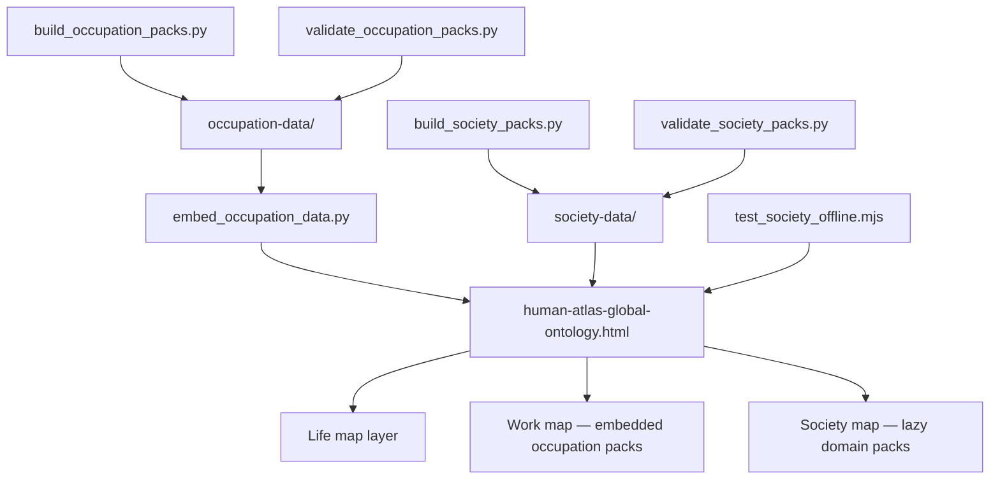

# Human Atlas: Offline Research Workspace Architecture

## What Was Built

[Human Atlas](https://github.com/okfriansyah-moh/human-atlas) is a standalone research
workspace for exploring human contexts across life, work, and society. The primary
interface is a single HTML file (`human-atlas-global-ontology.html`, roughly 12 MB)
that runs in a modern browser without an application server. The repository ships a
dated snapshot (**2026-08-17**) containing:

- **Life map** — 15 life stages and 190 linked observations.
- **Work map** — the full ISCO-08 hierarchy: 10 major groups, 43 sub-major groups,
  130 minor groups, and 436 unit occupation profiles.
- **Society map** — 312 contexts across eight domains (religion, civic, culture,
  language, ethnicity, socioeconomic, migration, household).
- **Research guardrails** — field-level evidence status, source metadata, geographic
  scope, privacy rules, and validation experiments.

Occupation data is embedded directly into the HTML so Work mode is fully self-contained.
Society data uses classic JavaScript companion files for progressive, offline loading.

## The Problem

Product brainstorming and solo-founder research need structured human context — life
stages, occupations, cultural settings — but most tools either hide uncertainty behind
confident UI copy or require a live backend. A research atlas must:

1. Run offline from a checked-in snapshot (including `file://` opens).
2. Separate **source-backed facts** from **hypotheses** at field level, not page level.
3. Load large datasets progressively without blocking first paint.
4. Enforce privacy boundaries (no inferred religion, no private member lists).
5. Prove integrity with reproducible build and validation scripts.

## Why This Problem Is Difficult

1. **Scale without a server** — 436 occupation units plus 312 society nodes exceed
   practical single-JSON download sizes for offline use.
2. **Evidence heterogeneity** — some fields trace to ILO spreadsheets, others are
   structured hypotheses that must never appear as established facts.
3. **Sensitive domains** — religion, ethnicity, and civic data require explicit privacy
   rules and recommendation boundaries.
4. **Offline correctness** — progressive loading, URL state restoration, and missing-pack
   recovery must work without `fetch()`, ES modules, or HTTP.
5. **Reproducible snapshots** — every generated pack carries SHA-256 checksums recorded
   in manifests so tampering or partial rebuilds are detectable.

## Beginner Mental Model

Think of Human Atlas as a **library with color-coded sticky notes**:

- The **HTML file** is the reading room — it opens anywhere, no librarian (server) required.
- **Work shelves** (occupation packs) are glued inside the front cover so you always have
  the job taxonomy at hand.
- **Society shelves** stay in separate folders; the reading room fetches one folder at a
  time as you browse a domain.
- Every fact carries a **colored note** (`source_backed`, `market_inferred`,
  `ai_hypothesis`, or `evidence_gap`) so you know whether to cite it, validate it, or
  treat it as an open question.

## Requirements and Constraints

| Requirement | Implementation |
| ----------- | -------------- |
| No application server | Single HTML + sibling `society-data/` directory |
| Work mode offline-complete | Occupation manifest, index, and 10 major packs embedded via `<script type="application/json">` |
| Society progressive load | Lazy-loaded `.js` companion files per domain pack |
| Field-level evidence | Four `evidence_status` values on generated records |
| Integrity verification | SHA-256 checksums in `manifest.json` for every pack |
| Privacy enforcement | `privacy_rules` and `recommendation_rules` in society manifest |
| Reproducible rebuild | Python builders + validators; Node smoke test for `file://` |
| Safe JSON embedding | `<` escaped as `\u003c` when inlining JSON into HTML |

## Architecture Overview



The checked-in snapshot embeds occupation data at build time. Society packs remain
external companion scripts so the browser loads only the active domain.

## Execution Flow

1. **Rebuild occupation layer** (optional) — `build_occupation_packs.py` reads ISCO-08
   structure, ESCO/O\*NET/KBJI supplements, and emits indexed JSON + JS packs under
   `occupation-data/packs/`.
2. **Embed occupation data** — `embed_occupation_data.py` replaces the
   `HA_OCCUPATION_DATA_START/END` block in the HTML with manifest, index, and ten
   major-group JSON script tags.
3. **Rebuild society layer** (optional) — `build_society_packs.py` generates eight
   domain packs with nodes, edges, opportunities, and source registries.
4. **Validate packs** — Python validators recompute SHA-256 checksums and walk every
   field for valid evidence status, geography, and verification dates.
5. **Offline smoke test** — `test_society_offline.mjs` executes Atlas scripts inside
   Node's `vm` module against a DOM contract, proving progressive load and URL
   restoration without HTTP.
6. **User opens atlas** — browser loads HTML; Work mode reads embedded JSON; Society
   mode injects domain companion scripts on demand.

## Important Components

| Component | Responsibility |
| --------- | -------------- |
| `human-atlas-global-ontology.html` | Standalone UI, embedded work data, Atlas application logic |
| `occupation-data/manifest.json` | Pack inventory, checksums, source registry, validation counts |
| `occupation-data/packs/major-*.json` | ISCO-08 major-group occupation units with profile dimensions |
| `society-data/manifest.json` | Domain pack metadata, privacy rules, recommendation boundaries |
| `society-data/packs/domain-*.js` | Lazy-loadable society graph per domain |
| `scripts/build_occupation_packs.py` | Generates occupation index and packs from source snapshots |
| `scripts/build_society_packs.py` | Generates society nodes, edges, and opportunities |
| `scripts/embed_occupation_data.py` | Inlines occupation JSON into HTML with `<` escaping |
| `scripts/validate_*_packs.py` | Checksum + schema + evidence gate validation |
| `scripts/test_society_offline.mjs` | Deterministic offline behaviour smoke test |

## Simplified Implementation Examples

Occupation embedding escapes `<` to keep inlined JSON inside inert script tags:

```python
# simplified from scripts/embed_occupation_data.py
def safe_json(path: Path) -> str:
    return path.read_text(encoding="utf-8").replace("<", "\\u003c")

blocks.append(
    f'<script type="application/json" id="ha-occ-manifest">'
    f'{safe_json(DATA / "manifest.json")}</script>'
)
```

Society validation rejects unknown evidence statuses and missing geography:

```python
# simplified from scripts/validate_society_packs.py
VALID_STATUS = {"source_backed", "market_inferred", "ai_hypothesis", "evidence_gap"}

def validate_fact(value, path, source_ids, errors):
    if value["evidence_status"] not in VALID_STATUS:
        errors.append(f"{path}: invalid evidence status")
    if not value.get("geography"):
        errors.append(f"{path}: missing geography")
```

## Reliability and Idempotency

- **Checksum manifests** — each pack records `checksum` and `script_checksum`; validators
  recompute SHA-256 and fail on mismatch.
- **Release-ready flag** — manifests include `"release_ready": true` only after validation
  passes with zero errors.
- **Idempotent embed** — `embed_occupation_data.py` replaces the marked HTML block between
  `HA_OCCUPATION_DATA_START` and `HA_OCCUPATION_DATA_END`, so re-running does not duplicate
  data.
- **Offline smoke test** — Node script simulates missing domain packs and verifies graceful
  error recovery without network access.

## Failure Modes

| Failure | Detection | Recovery |
| ------- | --------- | -------- |
| Checksum mismatch after edit | `validate_*_packs.py` exits non-zero | Rebuild affected pack from source snapshots |
| Invalid evidence status on field | Validator walk reports path | Fix builder or source mapping; rebuild pack |
| Society pack moved away from HTML | UI cannot load domain script | Keep `society-data/` sibling to HTML (documented in README) |
| Missing pack at runtime | Smoke test injects `onerror` handler | UI shows missing-pack state; user restores file |
| Unsafe recommendation from hypothesis | `recommendation_rules.evidence_order` | Hypotheses visible in research but excluded from recommendations |

## Trade-offs and Rejected Alternatives

| Decision | Rationale | Rejected alternative |
| -------- | --------- | -------------------- |
| Embed Work data in HTML | Guarantees offline Work mode in one file | Fetch occupation packs at runtime (breaks `file://`) |
| Lazy-load Society packs | Eight domains × ~300 KB–2 MB each; load on demand | Single monolithic society JSON (slow first open) |
| Classic `<script src>` companions | Works offline without modules or bundler | ES module graph requiring HTTP server |
| Four evidence statuses | Makes uncertainty visible to researchers | Binary true/false flags hiding hypothesis layer |
| Dated snapshot, not live API | Reproducible research baseline | Live Wikidata/API calls (non-deterministic, online-only) |

## Testing

| Test | Command | What it proves |
| ---- | ------- | -------------- |
| Occupation pack integrity | `python3 scripts/validate_occupation_packs.py` | Checksums, hierarchy counts (10/43/130/436), required dimensions |
| Society pack integrity | `python3 scripts/validate_society_packs.py` | Evidence gates, privacy fields, opportunity schema |
| Offline society behaviour | `node scripts/test_society_offline.mjs` | Progressive load, URL state, missing-pack recovery without HTTP |

The society validator refreshes `society-data/validation-report.json` with results.

## Operations and Observability

**Open the atlas:** open `human-atlas-global-ontology.html` in a current desktop browser.
No package installation required for the checked-in snapshot. Google Fonts load when
online; data and application logic remain local.

**Validate checked-in data** from repository root:

```sh
python3 scripts/validate_occupation_packs.py
python3 scripts/validate_society_packs.py
node scripts/test_society_offline.mjs
```

**Rebuild generated data** only when intentionally updating the snapshot — rebuild
overwrites indexes, manifests, packs, JS companions, and validation reports.

## Lessons Learned

1. **Field-level evidence beats page-level disclaimers** — researchers stop trusting a
   system when one confident sentence hides a hypothesis three sections earlier.
2. **Offline-first constrains architecture early** — embedding Work data and using classic
   script tags avoids retrofitting `file://` support later.
3. **Checksum manifests turn snapshots into contracts** — validators catch partial edits
   that manual review would miss.
4. **Sensitive domains need machine-readable privacy rules** — manifest-level
   `privacy_rules` and `recommendation_rules` scale better than prose warnings.

## Related

- [Human Atlas (project)](/docs/projects/human-atlas)
- [LLM Guardrails](/docs/concepts/llm-guardrails)

## Sources

- Repository: [okfriansyah-moh/human-atlas](https://github.com/okfriansyah-moh/human-atlas)
- Initial public snapshot: commit `7d61cc0` (2026-08-17) — GitHub Pages `index.html` + atlas HTML
- Key files: `README.md`, `society-data/manifest.json`, `occupation-data/manifest.json`,
  `scripts/build_society_packs.py`, `scripts/test_society_offline.mjs`
