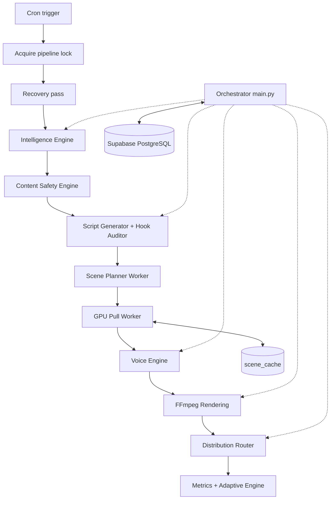

# MD-AME: Autonomous Media Engine

## What Was Built

[MD-AME](https://github.com/okfriansyah-moh/md-ame) (Multi-Dimensional Autonomous Media
Engine) is a fully autonomous media production and distribution pipeline. The system
ingests trend signals, generates structured video scripts, renders platform-compliant
assets via FFmpeg, and publishes to social platforms without human intervention during
nominal operations. Every pipeline run is a discrete execution unit backed by
**Supabase PostgreSQL** as the single source of truth.

## The Problem

Autonomous content production at scale requires unattended operation across days or
weeks. A crash mid-run must not corrupt state, duplicate published videos, or leave
work permanently stuck. Local filesystem state, sequential read-modify-write patterns,
and non-idempotent workers all break recovery. The system must support multiple
content dimensions (niches) from one codebase without duplicating pipeline logic.

## Why This Problem Is Difficult

1. **Long-running pipelines** — script generation, voice synthesis, GPU rendering, and
   upload can span many minutes per video.
2. **Multi-dimensional parameterization** — each dimension has distinct config, safety
   profiles, and account bindings.
3. **Distributed GPU work** — visual generation uses a pull-worker model separate from
   the orchestrator cron.
4. **Atomic state transitions** — partial updates to job rows or quota counters cause
   race conditions under concurrent workers.
5. **Content safety** — LLM-generated scripts and topics must pass firewall and
   classifier gates before persistence.

## Beginner Mental Model

Think of a factory with one foreman (orchestrator) and a central ledger (PostgreSQL).
Each work order carries a **fingerprint** (`idempotency_key`). The foreman acquires a
**global lock** before starting, checks for stalled jobs from previous shifts, then
walks each dimension through fixed stations: trends → script → voice → render → publish.
If power fails, the next cron shift reads the ledger and resumes exactly where work
stopped — no duplicate outputs.

## Requirements and Constraints

| Requirement | Implementation |
|-------------|----------------|
| Crash-safe recovery | Cron-triggered state machine replay; recovery pass before new work |
| Idempotent runs | SHA-256 `idempotency_key` on every work-unit row |
| Atomic transitions | PostgreSQL RPC functions — no app-level read-modify-write |
| Global exclusivity | `acquire_pipeline_lock` / `release_pipeline_lock` RPCs |
| Environment isolation | Strict `ENV=dev` or `ENV=prod`; separate Supabase projects |
| No local persistence | All state in PostgreSQL; no SQLite or JSON files across runs |
| Quality gates | Hook audit threshold, safe-zone validation, voice HALT on failure |

## Architecture Overview



The orchestrator runs daily via GitHub Actions cron. GPU workers poll for
`visual_generation` jobs independently using `FOR UPDATE SKIP LOCKED` claiming.

## Execution Flow

1. **Pipeline entry** — generate `execution_id`, validate `ENV`, acquire global lock.
2. **Recovery pass** — identify stalled scripts (`voice_queued`, `render_queued`) and
   resume or fail before generating new work.
3. **Intelligence Engine** — ingest trends per active dimension, score, deduplicate,
   apply volume gate and Prompt Firewall.
4. **Content Safety** — Gemini-based classifier on topics and scripts; rejected items
   logged to `safety_audit_logs`.
5. **Script + Hook Audit** — three temperature-varied hook candidates, adversarial
   scoring, advance only if above `HOOK_PASS_THRESHOLD` (0.72).
6. **Scene Planner** — decompose script into 5–10 scenes; dispatch GPU jobs per scene.
7. **GPU Pull Worker** — cache lookup by `scene_hash`; on miss, generate via SVD or
   AnimateDiff path; upload to Supabase Storage.
8. **Voice Synthesis** — Edge-TTS primary → Gemini TTS fallback → HALT on failure.
9. **Rendering** — FFmpeg subprocess with safe-zone enforcement; no MoviePy.
10. **Distribution** — resolve `dimension_accounts`, decrypt credentials in-memory at
    edge, reserve quota via RPC, resumable upload.
11. **Lock release** — `release_pipeline_lock` RPC on completion or fatal error.

## Important Components

| Component | Responsibility |
| --------- | -------------- |
| `src/main.py` | Pipeline entry, lock acquire/release, execution_id |
| `src/intelligence/` | Trend ingestion, scoring, volume gate, deduplication |
| `src/script/` | LLM script generation, hook audit, adversarial pass |
| `src/voice/` | Edge-TTS, Gemini TTS fallback, `VoiceSynthesisFailure` HALT |
| `src/render/` | FFmpeg subprocess wrapper, safe-zone validator |
| `src/distribution/` | Router, platform adapters, quota reservation RPC |
| `src/db/` | Supabase client, RPC wrappers, state machine helpers |
| `src/utils/idempotency.py` | Deterministic `idempotency_key` and `scene_hash` derivation |
| `supabase/migrations/` | Versioned, append-only schema changes |

## Simplified Implementation Examples

Idempotency key derivation (simplified):

```python
# simplified — pattern from md-ame idempotency utilities
idempotency_key = sha256(f"{dimension_id}:{topic_id}:{stage}").hexdigest()
```

Atomic job claiming (simplified):

```sql
-- simplified — FOR UPDATE SKIP LOCKED pattern
SELECT * FROM jobs
WHERE status = 'queued' AND job_type = 'visual_generation'
ORDER BY created_at
FOR UPDATE SKIP LOCKED
LIMIT 1;
```

Scene cache lookup (simplified):

```python
# simplified — cache hit skips GPU generation
scene_hash = sha256(scene_prompt + style + dimension_id).hexdigest()
cached = db.lookup_scene_cache(scene_hash)
if cached and cached.ttl_expires_at > now():
    mark_scene_cached(scene_id, cached.asset_url)
else:
    dispatch_gpu_job(scene_id)
```

## Reliability and Idempotency

- **State storage:** Supabase PostgreSQL exclusively; RLS enabled; service role only.
- **Global lock:** One pipeline instance per environment at a time via `system_locks`.
- **Idempotency:** Every work-unit row carries a deterministic `idempotency_key`;
  double-runs produce zero duplicate outputs.
- **Crash recovery:** Interrupted runs resume on next cron tick via state machine replay.
- **Scene cache:** Hash-based reuse eliminates redundant GPU compute for identical prompts.

## Failure Modes

| Failure | Behaviour |
| ------- | --------- |
| Voice synthesis failure | Pipeline HALT — no degraded output |
| Hook audit below threshold | Topic rejected after 2 retries |
| Safety classifier rejection | Topic/script skipped; audit log written |
| GPU worker crash | Job remains claimable; another worker picks it up |
| Lock held by stale run | Recovery pass identifies stalled work before new generation |
| Quota exhausted | Distribution skipped for account; no partial publish |

## Trade-offs and Rejected Alternatives

| Choice | Why | Rejected alternative |
| ------ | --- | -------------------- |
| PostgreSQL RPC transitions | Atomic multi-row updates | App-level transactions |
| Pull GPU workers | No inbound ports; natural backpressure | HTTP push to GPU machine |
| FFmpeg subprocess only | Deterministic encoding flags | MoviePy / wrapper libraries |
| Edge-TTS → Gemini fallback → HALT | Quality over availability | gTTS degraded fallback |
| GitHub Actions cron (Phase 1) | Zero VPS cost during validation | Always-on VPS orchestrator |
| Dimension parameterization | Add niche without code changes | Per-niche pipeline forks |

## Testing

The repository includes `tests/unit/` (mock-only, no real credentials) and
`tests/integration/` (dev Supabase credentials). Mock flags (`MOCK_YOUTUBE_API`,
`MOCK_EDGE_TTS`, etc.) enable local development without live API calls.

## Operations and Observability

- **Schedule:** Daily cron at 10:00 UTC via `.github/workflows/pipeline.yml`
- **Manual trigger:** `workflow_dispatch` for supervised test runs
- **Logging:** Structured stdout with `execution_id`, `dimension_id`, `stage`, `status`
- **Weekly reports:** Strategic Auditor delivers Telegram summary; Adaptive Engine
  adjusts bounded parameters on Sunday cadence
- **Environment:** Strict `ENV=dev|prod` with separate Supabase projects

## Lessons Learned

1. **RPC-gated transitions** — application-level state machines drift under concurrency;
   PostgreSQL RPC functions enforce invariants at the database boundary.
2. **Idempotency is correctness** — crash recovery, manual reruns, and duplicate cron
   triggers must all converge to the same terminal state.
3. **Fail safe, not graceful** — voice failure halts the pipeline rather than publishing
   degraded content that damages channel standing.
4. **Scene decomposition enables scale** — breaking scripts into cacheable scene units
   unlocks GPU parallelism and asset reuse across dimensions.

## Related

- [MD-AME Project Overview](/docs/projects/md-ame)
- [Deterministic AI Pipelines](/docs/concepts/deterministic-ai-pipelines)
- [Database-Backed State Machines](/docs/concepts/database-state-machines)
- [LLM Guardrails](/docs/concepts/llm-guardrails)

## Sources

- Repository: [okfriansyah-moh/md-ame](https://github.com/okfriansyah-moh/md-ame)
- Architecture reference: `README.md`, `IMPLEMENTATION_ROADMAP.md` in source repo
