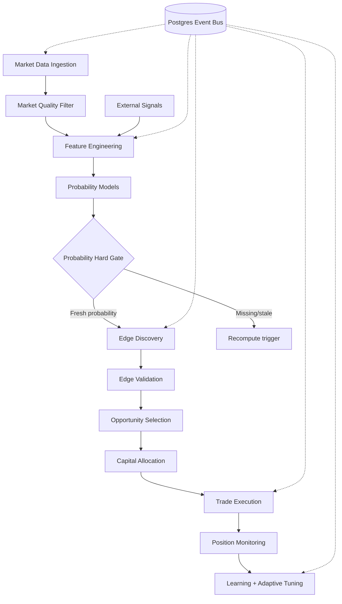

# Polymarket Trading Agent

## What Was Built

The [Polymarket Autonomous Trading Engine](https://github.com/okfriansyah-moh/edge-polymarket-agent)
is a modular monolith that discovers, validates, and executes prediction-market trades.
Phases 0–15 implement a full pipeline from market data ingestion through trade execution,
position monitoring, learning analytics, and adaptive parameter tuning. All modules
communicate through a **Postgres event bus** with deterministic worker claiming via
`FOR UPDATE SKIP LOCKED`.

## The Problem

Prediction markets have fragmented liquidity, stale quotes, and slow information
propagation — but turning structural edges into profit requires more than signal
detection. A trading system must enforce **probability estimates before execution**,
capitalize safely under hard risk limits, and recover from worker failures without
duplicate orders or lost events.

## Why This Problem Is Difficult

1. **Event ordering** — market data, signals, and execution events must flow through
   a consistent pipeline without race conditions.
2. **Probability dependency** — trading without a fair-value estimate is speculation,
   not edge exploitation.
3. **Capital safety** — drawdown, exposure, and daily loss limits must be enforced
   atomically before order submission.
4. **Strategy lifecycle** — underperforming strategies must auto-disable without
   manual intervention.
5. **AI isolation** — advisory LLM recommendations must never block or alter execution.

## Beginner Mental Model

Think of a factory assembly line where each station reads from a shared conveyor belt
(Postgres events). Workers claim one package at a time, process it, and place the
result back on the belt. Before the final station (execution), a **quality inspector**
checks that a probability estimate exists and is fresh — **no probability, no trade**.
A separate **risk officer** caps position sizes and can pull the emergency stop.

## Requirements and Constraints

| Requirement | Implementation |
|-------------|----------------|
| Deterministic processing | `WorkerLoop`: claim → process → complete/fail |
| Event durability | Postgres-backed event bus with retry and dead-letter |
| Probability gate | Phase 12.5 hard gate: staleness checks before execution |
| Risk limits | 7 hard limits enforced by capital allocation engine |
| Strategy isolation | Plugin surface via `BaseStrategy` implementations |
| AI advisory isolation | Read-only advisor; failures do not affect execution path |
| DRY_RUN default | Observe pipeline before live trading |

## Architecture Overview



All workers run inside one Python process (modular monolith) and communicate
exclusively through the event bus — no direct cross-module calls.

## Execution Flow

1. **Market data ingestion** — Polymarket client normalizes orderbooks; scanner persists
   market records and price snapshots.
2. **Market quality filter** — liquidity, spread, activity, and depth checks; rejects
   emit `market_filtered_event`.
3. **External signals** — weather, crypto, RSS, and calendar ingestors produce
   `external_signal_event` with source-health telemetry.
4. **Feature engineering** — versioned `feature_computed_event` with spread, momentum,
   volatility, and optional signal fields.
5. **Probability modeling** — Bayesian, Monte Carlo, and domain-specific models emit
   `probability_computed_event`.
6. **Probability hard gate** — lookup persisted probability; staleness thresholds
   (5 min arbitrage/informational, 15 min speculative); trigger recomputation if stale.
7. **Edge discovery** — spread, liquidity imbalance, information-lag, and microstructure
   detectors with deduplication.
8. **Edge validation** — EV gating, fee/slippage estimation, latency decay, ranking.
9. **Opportunity selection** — composite ranking (EV 35%, edge score 25%, confidence
   20%, market quality 10%, urgency 10%); top-K filter.
10. **Capital allocation** — Kelly sizing, 40/40/20 category budgets, adaptive risk
    engine with drawdown clamps.
11. **Trade execution** — Polymarket CLOB adapter with approval verification before
    build/sign/submit.
12. **Position monitoring + learning** — P&L tracking, strategy metrics, edge decay
    detection, adaptive tuning (±20% per-cycle caps).

## Important Components

| Component | Responsibility |
| --------- | -------------- |
| `core/event_bus.py` | Postgres event publish, claim, complete/fail API |
| `core/worker_runtime.py` | Deterministic worker loop lifecycle |
| `modules/probability_engine/` | Feature builder + probability hard gate |
| `modules/edge_discovery/` | Edge detectors with event-contract validation |
| `modules/capital/allocator.py` | Kelly sizing, category budgets, concentration modes |
| `modules/capital/adaptive_risk_engine.py` | Dynamic `effective_risk` computation |
| `modules/execution/trade_executor.py` | Order orchestration via CLOB adapter |
| `modules/safety/kill_switch.py` | Circuit breaker and daily loss triggers |
| `modules/analytics/ai_advisor.py` | Read-only advisory layer (Phase 14) |
| `strategies/base_strategy.py` | Plugin interface for concrete strategies |

## Simplified Implementation Examples

Worker claim pattern (simplified):

```python
# simplified — deterministic claim → process → complete
event = event_bus.claim_next("edge_validation")  # uses FOR UPDATE SKIP LOCKED
if event:
    result = validator.process(event.payload)
    event_bus.complete(event.id, result)
```

Probability hard gate (simplified):

```python
# simplified — NO PROBABILITY → NO TRADE
prob = repo.get_probability(market_id)
if prob is None or prob.age_seconds > STALENESS_THRESHOLD:
    trigger_recomputation(market_id)
    raise ProbabilityGateBlocked(market_id)
```

Adaptive risk sizing (simplified):

```python
# simplified — bounded effective risk
effective_risk = (
    base_risk
    * strategy_weight
    * performance_multiplier
    * market_condition_multiplier
    * edge_confidence
)
effective_risk = min(effective_risk, HARD_CEILING_0_20)
```

## Reliability and Idempotency

- **State storage:** PostgreSQL event bus with versioned schema migrations.
- **Worker claiming:** `FOR UPDATE SKIP LOCKED` prevents double-processing.
- **Retry/dead-letter:** Failed events retry with backoff; persistent failures route
  to dead-letter queue.
- **Strategy auto-disable:** `strategy_killer` disables strategies on configurable
  win-rate/ROI/drawdown thresholds with cooldown and re-enable.
- **Kill switch:** Daily loss and drawdown triggers halt execution immediately.

## Failure Modes

| Failure | Behaviour |
| ------- | --------- |
| Missing probability | Trade blocked; recomputation triggered |
| Stale probability | Blocked per staleness threshold by strategy type |
| Risk limit exceeded | Allocation rejected; audit log entry |
| CLOB approval missing | Execution blocked; `approval_missing` logged |
| Strategy underperforming | Auto-disabled via strategy killer |
| AI advisor failure | Isolated; execution path unaffected |
| Worker crash | Unclaimed events remain; next worker claims them |

## Trade-offs and Rejected Alternatives

| Choice | Why | Rejected alternative |
| ------ | --- | -------------------- |
| Modular monolith | Shared Postgres; no network overhead | Microservices per phase |
| Postgres event bus | Durable, queryable, transactional claims | Redis/Kafka message queues |
| Probability hard gate | Enforces edge-based trading discipline | Trade on signals without fair value |
| Kelly + hard ceilings | Mathematical sizing with safety bounds | Fixed position sizes |
| AI advisor isolation | Prevents LLM latency/failures from blocking trades | LLM in execution path |
| DRY_RUN default | Safe observation before capital risk | Live trading on first deploy |

## Testing

The repository includes mirrored pytest suites under `tests/modules/` and
`tests/workers/` for every merged module. `make quality` runs lint, import-boundary
checks, and full test suite. Economic validation runs via `make validation-run`.

## Operations and Observability

- **Deployment:** Docker Compose on VPS (poly-agent + postgres containers)
- **Log collection:** `scripts/collect_logs.sh` produces PRS (Production Readiness Score)
- **Control:** Telegram kill switch and circuit-breaker commands
- **Health:** `utils/health_check.py` and structured JSON logging
- **Default mode:** `DRY_RUN=true` — observe before enabling live execution

## Lessons Learned

1. **NO PROBABILITY → NO TRADE** — enforcing fair-value estimates before execution
   separates edge exploitation from speculation.
2. **Event bus as integration layer** — module boundaries stay clean when all
   communication flows through persisted events.
3. **Hard risk limits are architecture contracts** — drawdown clamps and exposure caps
   must be enforced in code, not configuration suggestions.
4. **Isolate advisory AI** — LLM recommendations belong in analytics, not the execution
   critical path.

## Related

- [Polymarket Agent Project Overview](/docs/projects/polymarket-agent)
- [Database-Backed State Machines](/docs/concepts/database-state-machines)
- [AI Orchestration Patterns](/docs/concepts/ai-orchestration-patterns)
- [LLM Guardrails](/docs/concepts/llm-guardrails)

## Sources

- Repository: [okfriansyah-moh/edge-polymarket-agent](https://github.com/okfriansyah-moh/edge-polymarket-agent)
- Architecture docs: `docs/ARCHITECTURE.md`, `docs/TRADING_EDGE_STRATEGY.md` in source repo
