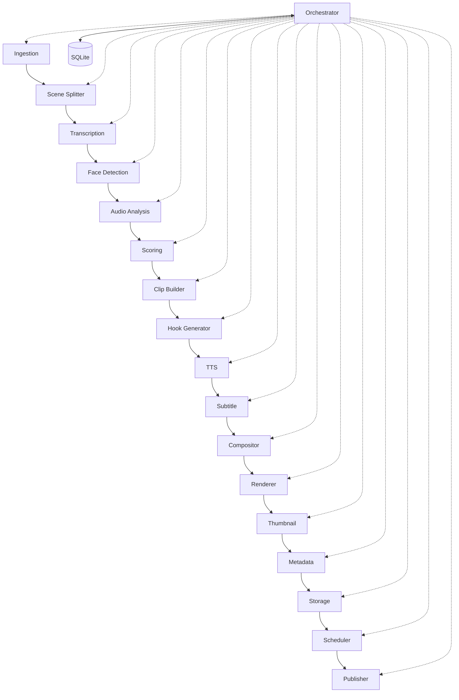

# Building a Restartable Long-Video Processing Pipeline

## What Was Built

[Shorts Factory](https://github.com/okfriansyah-moh/shorts-generator) is a local-only
content production system that ingests a 5–120 minute video and produces 10–15
vertical short clips with narration, subtitles, thumbnails, metadata, and scheduled
multi-platform publishing. The core is a **16-stage sequential pipeline** orchestrated
by a single Python process, with **SQLite as the authority** for all pipeline state.

## The Problem

Long-form video processing is expensive: transcription, face detection, compositing,
and rendering can take 20–30 minutes for a one-hour input on consumer hardware. If the
process crashes at stage 12, restarting from stage 1 wastes compute and duplicates
work. Cloud orchestrators add cost; this system targets **zero cloud cost** with
local execution only.

## Why This Problem Is Difficult

1. **Stage dependencies** — later stages need outputs from earlier ones (transcript
   before scoring, clips before rendering).
2. **Partial failure** — a crash mid-pipeline must not corrupt already-completed work.
3. **Idempotent reruns** — operators rerun pipelines safely after config changes.
4. **Multi-account fan-out** — one global database serves multiple content channels
   with per-account config overrides.
5. **Upload scheduling** — generation (CPU-heavy) and publishing (API calls) run on
   different schedules.

## Beginner Mental Model

Think of the pipeline as an assembly line with 16 stations. Each station receives a
**frozen package** (a dataclass DTO) from the previous station and hands a new package
to the next. A **foreman** (the orchestrator) is the only worker allowed to open the
**ledger** (SQLite). If the factory loses power, the foreman reads the ledger, finds
the last completed station, and resumes from the next one.

## Requirements and Constraints

| Requirement                | How it is met                                                        |
| -------------------------- | -------------------------------------------------------------------- |
| Deterministic output       | No randomness; rule-based scoring; same input + config = same output |
| Idempotent reruns          | Content-addressable `video_id` from SHA256; `ON CONFLICT DO NOTHING` |
| Module isolation           | Modules communicate only via frozen DTOs in `contracts/`             |
| Orchestrator authority     | Only `core/orchestrator.py` calls modules and writes to DB           |
| Zero cloud cost            | Local FFmpeg, faster-whisper, Edge TTS, SQLite                       |
| Platform failure isolation | One platform upload failure does not block others                    |

## Architecture Overview



The orchestrator executes stages in strict order. Every module is stateless between
calls; persistence happens through the database adapter in `database/adapter.py`.

## Execution Flow

1. **Ingestion** validates the video file and computes a content-addressable `video_id`.
2. **Scene Splitter** detects 3–20 second segments via PySceneDetect.
3. **Transcription** produces word-level timestamps with faster-whisper.
4. **Face Detection** samples frames at 2fps with MediaPipe (optional).
5. **Audio Analysis** extracts per-scene RMS energy via FFmpeg.
6. **Scoring** ranks scenes with rule-based weights (keywords, audio, face, motion).
7. **Clip Builder** merges top scenes into 30–60 second clips.
8. **Hook Generator** creates template-based narration scripts.
9. **TTS** synthesizes speech with Edge TTS (cached by text hash).
10. **Subtitle** generates ASS karaoke subtitles from word timings.
11. **Compositor** builds 9:16 layouts (gameplay, podcast speaker-crop, or sports crops).
12. **Renderer** merges layers into final MP4 via FFmpeg.
13. **Thumbnail** selects a frame and overlays text with Pillow.
14. **Metadata** assigns title, description, and tags.
15. **Storage** persists clip records and filesystem paths.
16. **Scheduler** assigns publish dates; **Publisher** fans out to enabled platforms.

## Important Components

| Component                             | Responsibility                                |
| ------------------------------------- | --------------------------------------------- |
| `core/orchestrator.py`                | Stage ordering, checkpointing, error handling |
| `contracts/*.py`                      | Frozen dataclass DTOs between stages          |
| `database/adapter.py`                 | Sole database access layer                    |
| `core/account_loader.py`              | Deep-merge per-account config overrides       |
| `modules/publisher/multi_platform.py` | Concurrent per-platform upload threads        |
| `scripts/upload_scheduler.py`         | Cron-driven publish runner                    |
| `scripts/generation_scheduler.py`     | Picks next raw video and runs pipeline        |

## Simplified Implementation Examples

Content-addressable video ID (simplified):

```python
# simplified — pattern from shorts-generator ingestion
video_id = sha256(first_10_mb + file_size)[:16]
```

Checkpoint resume concept (simplified):

```python
# simplified — orchestrator reads last completed stage from SQLite
last_stage = db.get_last_completed_stage(video_id)
for stage in STAGES[last_stage_index + 1:]:
    result = stage.run(previous_dto)
    db.record_stage_complete(video_id, stage.name)
```

## Reliability and Idempotency

- **State storage:** `shorts_factory.db` (SQLite) is the single source of truth.
- **Synchronous stages:** All 16 pipeline stages run sequentially in one process.
- **Asynchronous uploads:** Publisher spawns one thread per platform; scheduler runs
  via cron independently of generation.
- **Idempotency:** Content-addressable IDs and `ON CONFLICT DO NOTHING` make reruns
  safe. Stage outputs cached in DB prevent redundant computation on resume.

## Failure Modes

| Failure                   | Behaviour                                                        |
| ------------------------- | ---------------------------------------------------------------- |
| Crash mid-pipeline        | Resume from last recorded stage in SQLite                        |
| One platform upload fails | Other platforms continue; clip marked `published` if any succeed |
| All platforms fail        | Clip status → `failed`; error logged                             |
| Missing credentials       | Platform skipped entirely (no auth attempt)                      |
| GPU unavailable           | Automatic CPU fallback for transcription and encoding            |

## Trade-offs and Rejected Alternatives

| Choice                                | Why                                        | Rejected alternative                                  |
| ------------------------------------- | ------------------------------------------ | ----------------------------------------------------- |
| Modular monolith                      | Zero orchestration overhead, shared SQLite | Microservices — adds network cost and complexity      |
| SQLite                                | Single-file, local, no server              | PostgreSQL — unnecessary for single-machine pipeline  |
| Rule-based scoring                    | Deterministic, reproducible                | LLM scoring — non-deterministic, adds API cost        |
| Separate generation/upload schedulers | CPU work vs lightweight API calls          | Single cron — cannot optimize for different workloads |

## Testing

The repository includes `tests/unit/` and `tests/integration/` covering module
contracts, compositor layouts, and publisher behaviour. Quality is enforced through
deterministic DTO validation and integration tests against sample media fixtures.

## Operations and Observability

- **Generation:** `python scripts/generation_scheduler.py --account <name>`
- **Upload:** `python scripts/upload_scheduler.py --account <name>` (3 cron waves/day)
- **Logs:** Per-video `pipeline.log` under `output/<account>/<video_folder>/`
- **DB rebuild:** `python scripts/rebuild_db.py` reconstructs state from filesystem

## Lessons Learned

1. **Checkpoint at stage boundaries** — coarse-grained resume points beat fine-grained
   sub-step recovery for video pipelines.
2. **Frozen DTO contracts** — module isolation enables parallel development and testing.
3. **Separate heavy generation from lightweight publishing** — different schedules,
   different failure domains.
4. **Fan-out with failure isolation** — multi-platform publishing needs per-thread
   error capture, not fail-fast semantics.

## Sources

- Repository: [okfriansyah-moh/shorts-generator](https://github.com/okfriansyah-moh/shorts-generator)
- Pull requests: [#8 scheduler mechanism](https://github.com/okfriansyah-moh/shorts-generator/pull/8), [#10 multi-platform publish](https://github.com/okfriansyah-moh/shorts-generator/pull/10), [#11 sports video type](https://github.com/okfriansyah-moh/shorts-generator/pull/11)
- Architecture docs: `docs/architecture.md`, `docs/orchestrator_spec.md` in source repo
