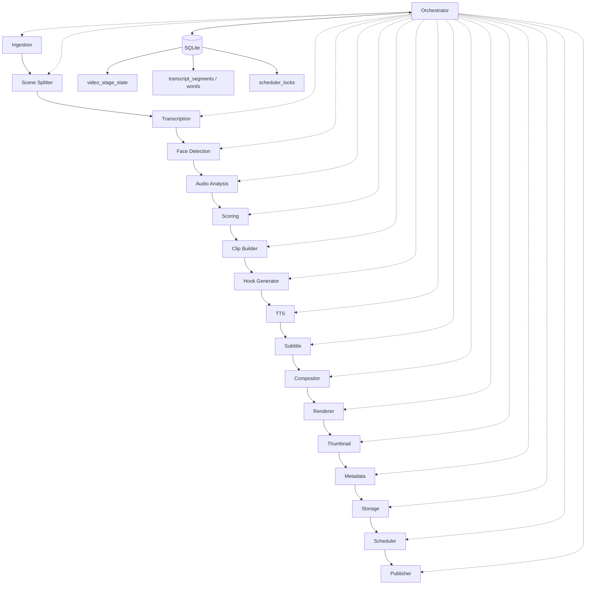

# Building a Restartable Long-Video Processing Pipeline

## What Was Built

[Shorts Factory](https://github.com/okfriansyah-moh/shorts-generator) is a local-only
content production system that ingests long-form video (duration cap removed in
[PR #12](https://github.com/okfriansyah-moh/shorts-generator/pull/12)) and produces
10–15 vertical short clips with narration, subtitles, thumbnails, metadata, and
scheduled multi-platform publishing. The core is a **16-stage sequential pipeline**
orchestrated by a single Python process, with **SQLite as the authority** for all
pipeline state — including **per-stage cache rows**, **chunk-level transcript
persistence**, and **scheduler locks** for hands-off generation loops.

## The Problem

Long-form video processing is expensive: transcription, face detection, compositing,
and rendering can take 20–30 minutes for a one-hour input on consumer hardware. If the
process crashes at stage 12, restarting from stage 1 wastes compute and duplicates
work. Cloud orchestrators add cost; this system targets **zero cloud cost** with
local execution only.

## Why This Problem Is Difficult

1. **Stage dependencies** — later stages need outputs from earlier ones (transcript
   before scoring, clips before rendering).
2. **Partial failure** — a crash mid-pipeline must not corrupt already-completed work.
3. **Idempotent reruns** — operators rerun pipelines safely after config changes.
4. **Multi-account fan-out** — one global database serves multiple content channels
   with per-account config overrides.
5. **Upload scheduling** — generation (CPU-heavy) and publishing (API calls) run on
   different schedules.
6. **Very long inputs** — hour-plus videos need chunked transcription with resumable
   progress, not a single in-memory pass.
7. **Concurrent schedulers** — cron jobs on the same machine must not run two
   generation pipelines at once.

## Beginner Mental Model

Think of the pipeline as an assembly line with 16 stations. Each station receives a
**frozen package** (a dataclass DTO) from the previous station and hands a new package
to the next. A **foreman** (the orchestrator) is the only worker allowed to open the
**ledger** (SQLite). If the factory loses power, the foreman reads the ledger, finds
the last completed station, and resumes from the next one.

## Requirements and Constraints

| Requirement                | How it is met                                                        |
| -------------------------- | -------------------------------------------------------------------- |
| Deterministic output       | No randomness; rule-based scoring; same input + config = same output |
| Idempotent reruns          | Content-addressable `video_id` from SHA256; `ON CONFLICT DO NOTHING` |
| Module isolation           | Modules communicate only via frozen DTOs in `contracts/`             |
| Orchestrator authority     | Only `core/orchestrator.py` calls modules and writes to DB           |
| Zero cloud cost            | Local FFmpeg, faster-whisper, Edge TTS, SQLite                       |
| Platform failure isolation | One platform upload failure does not block others                    |
| Long video support         | `max_duration_seconds: 0` disables cap; renderer allows up to 250 MB   |
| Sub-stage resume           | `video_stage_state` caches formal stages and analysis sub-stages     |
| Scheduler mutual exclusion | `scheduler_locks` with TTL + heartbeat during generation           |

## Architecture Overview


```mermaid
flowchart TD
  IN[Ingestion] --> SS[Scene Splitter]
  SS --> TR[Transcription]
  TR --> FD[Face Detection]
  FD --> AA[Audio Analysis]
  AA --> SC[Scoring]
  SC --> CB[Clip Builder]
  CB --> HG[Hook Generator]
  HG --> TTS[TTS]
  TTS --> SUB[Subtitle]
  SUB --> CMP[Compositor]
  CMP --> REN[Renderer]
  REN --> TH[Thumbnail]
  TH --> MD[Metadata]
  MD --> ST[Storage]
  ST --> SCH[Scheduler]
  SCH --> PUB[Publisher]

  ORCH[Orchestrator] -.-> IN & SS & TR & FD & AA & SC & CB & HG & TTS & SUB & CMP & REN & TH & MD & ST & SCH & PUB
  ORCH <--> DB[(SQLite)]
  DB --> STC[video_stage_state]
  DB --> TSEG[transcript_segments / words]
  DB --> SLK[scheduler_locks]
```

The orchestrator executes stages in strict order. Every module is stateless between
calls; persistence happens through the database adapter in `database/adapter.py`.
Since PR #12, the adapter also owns **stage-cache CRUD** (`StageState` DTO in
`contracts/stage_state.py`), **transcript chunk tables**, and **scheduler lock**
acquire/heartbeat/release — so resume and cron automation share one SQLite file.

## Execution Flow

1. **Ingestion** validates the video file and computes a content-addressable `video_id`.
2. **Scene Splitter** detects 3–20 second segments via PySceneDetect.
3. **Transcription** splits audio into configurable chunks (default 300 s with 2 s
   overlap), persists each chunk to `transcript_segments` / `transcript_words`, and
   resumes from the last completed chunk index on retry.
4. **Face Detection** samples frames at 2fps with MediaPipe (optional).
5. **Audio Analysis** extracts per-scene RMS energy via FFmpeg.
6. **Scoring** ranks scenes with rule-based weights (keywords, audio, face, motion).
7. **Clip Builder** merges top scenes into 30–60 second clips.
8. **Hook Generator** creates template-based narration scripts.
9. **TTS** synthesizes speech with Edge TTS (cached by text hash).
10. **Subtitle** generates ASS karaoke subtitles from word timings.
11. **Compositor** builds 9:16 layouts (gameplay, podcast speaker-crop, or sports crops).
12. **Renderer** merges layers into final MP4 via FFmpeg.
13. **Thumbnail** selects a frame and overlays text with Pillow.
14. **Metadata** assigns title, description, and tags.
15. **Storage** persists clip records and filesystem paths.
16. **Scheduler** assigns publish dates; **Publisher** fans out to enabled platforms.

**Hands-off generation loop (PR #12):** when `upload_scheduler.py` drains the publish
queue, it spawns `generation_scheduler.py`, which acquires a DB-backed
`generation:<account>` lock (15-minute TTL, heartbeat while running), picks the next
unprocessed file in `raw/`, runs the full pipeline, exports `pending_ai_metadata.json`
for scheduled AI enrichment, and marks the source processed.

## Important Components

| Component                             | Responsibility                                |
| ------------------------------------- | --------------------------------------------- |
| `core/orchestrator.py`                | Stage ordering, checkpointing, error handling |
| `contracts/*.py`                      | Frozen dataclass DTOs between stages          |
| `database/adapter.py`                 | Sole database access layer                    |
| `core/account_loader.py`              | Deep-merge per-account config overrides       |
| `modules/publisher/multi_platform.py` | Concurrent per-platform upload threads        |
| `contracts/stage_state.py`            | Frozen `StageState` DTO for cache rows        |
| `video_stage_state` table             | Per-stage cache with config hash + progress   |
| `scheduler_locks` table               | Mutual exclusion for generation cron jobs     |
| `scripts/generation_scheduler.py`     | Lock-guarded raw-video picker + pipeline run  |
| `scripts/upload_scheduler.py`         | Cron publish runner; spawns generation when empty |

## Simplified Implementation Examples

Content-addressable video ID (simplified):

```python
# simplified — pattern from shorts-generator ingestion
video_id = sha256(first_10_mb + file_size)[:16]
```

Stage-cache invalidation (simplified):

```python
# simplified — config_hash mismatch invalidates this stage and all downstream cache
if state.config_hash != current_config_hash(stage_name):
    adapter.invalidate_stage_states(video_id, stages_from_here_onward)
```

Chunked transcription resume (simplified):

```python
# simplified — skip chunks already persisted; update units_done on video_stage_state
cached = adapter.get_transcript_chunk_indexes(video_id)
for chunk_index, audio_slice in enumerate(chunks):
    if chunk_index in cached:
        continue
    adapter.save_transcript_chunk(video_id, chunk_index, transcribe_chunk(audio_slice))
```

## Reliability and Idempotency

- **State storage:** `shorts_factory.db` (SQLite) is the single source of truth.
- **Synchronous stages:** All 16 pipeline stages run sequentially in one process.
- **Asynchronous uploads:** Publisher spawns one thread per platform; scheduler runs
  via cron independently of generation.
- **Idempotency:** Content-addressable IDs and `ON CONFLICT DO NOTHING` make reruns
  safe. Stage outputs cached in `video_stage_state` (keyed by `stage_name` +
  `config_hash`) prevent redundant computation on resume; changing config invalidates
  downstream cache rows in dependency order.
- **Generation lock:** Only one `generation_scheduler` run holds
  `scheduler_locks.generation:<account>` at a time; TTL expiry plus heartbeat loss
  aborts the run rather than risking overlapping pipelines.
- **Duplicate source guard:** Generation scheduler fingerprints the first 10 MB +
  file size and skips raw files whose `video_id` already exists in the database,
  even if the filename differs.

## Failure Modes

| Failure                   | Behaviour                                                        |
| ------------------------- | ---------------------------------------------------------------- |
| Crash mid-pipeline        | Resume from last recorded stage in SQLite                        |
| One platform upload fails | Other platforms continue; clip marked `published` if any succeed |
| All platforms fail        | Clip status → `failed`; error logged                             |
| Missing credentials       | Platform skipped entirely (no auth attempt)                      |
| GPU unavailable           | Automatic CPU fallback for transcription and encoding            |
| Lost generation lock      | Scheduler aborts; lock released on exit; retry on next cron     |
| Renamed duplicate raw file| Content hash match → mark processed without re-running pipeline  |
| Rendered clip too large   | `max_file_size_mb: 250` cap (≤ 0 disables) rejects oversized MP4 |

## Trade-offs and Rejected Alternatives

| Choice                                | Why                                        | Rejected alternative                                  |
| ------------------------------------- | ------------------------------------------ | ----------------------------------------------------- |
| Modular monolith                      | Zero orchestration overhead, shared SQLite | Microservices — adds network cost and complexity      |
| SQLite                                | Single-file, local, no server              | PostgreSQL — unnecessary for single-machine pipeline  |
| Rule-based scoring                    | Deterministic, reproducible                | LLM scoring — non-deterministic, adds API cost        |
| Separate generation/upload schedulers | CPU work vs lightweight API calls          | Single cron — cannot optimize for different workloads |
| DB stage cache vs filesystem-only   | Fine-grained resume + config invalidation  | Filesystem-only checkpoints — harder to query progress |
| Chunked transcription               | Bounded memory for multi-hour sources    | Single-pass whisper — OOM risk on very long audio     |
| Upload queue triggers generation    | Pipeline stays fed without manual drops    | Fixed-time generation cron — may idle when queue empty |

## Testing

The repository includes `tests/unit/` and `tests/integration/` covering module
contracts, compositor layouts, publisher behaviour, database adapter stage-cache APIs,
renderer size limits, and upload/generation scheduler locking. PR #12 added
`test_adapter.py`, `test_upload_scheduler.py`, and `test_renderer.py` coverage for
the new persistence and lock paths.

## Operations and Observability

- **Generation:** `python scripts/generation_scheduler.py --account <name>` (or auto-spawned when upload queue empties)
- **Upload:** `python scripts/upload_scheduler.py --account <name>` (3 cron waves/day)
- **Scheduled skills:** `docs/claude_scheduled_tasks/shorts-generator-8am.SKILL.md` (AI metadata enrichment) and `shorts-generator-8pm.SKILL.md` (generation cron) document operator procedures
- **Logs:** Per-video `pipeline.log` under `output/<account>/<video_folder>/`; generation scheduler also logs to `output/generation_scheduler.log`
- **DB rebuild:** `python scripts/rebuild_db.py` reconstructs state from filesystem

## Lessons Learned

1. **Checkpoint at stage boundaries** — coarse-grained resume points beat fine-grained
   sub-step recovery for video pipelines.
2. **Frozen DTO contracts** — module isolation enables parallel development and testing.
3. **Separate heavy generation from lightweight publishing** — different schedules,
   different failure domains.
4. **Fan-out with failure isolation** — multi-platform publishing needs per-thread
   error capture, not fail-fast semantics.
5. **Cache at sub-stage granularity** — transcription chunks and analysis metrics
   (`audio_rms_raw`, `scene_activity_raw`, `image_quality_raw`) belong in SQLite, not
   only in ephemeral DTOs, so resume survives process death mid-chunk.
6. **DB locks beat file locks for cron** — a TTL + heartbeat row in `scheduler_locks`
   is easier to inspect and expire than PID files on a single machine.

## Sources

- Repository: [okfriansyah-moh/shorts-generator](https://github.com/okfriansyah-moh/shorts-generator)
- Pull requests: [#8 scheduler mechanism](https://github.com/okfriansyah-moh/shorts-generator/pull/8), [#10 multi-platform publish](https://github.com/okfriansyah-moh/shorts-generator/pull/10), [#11 sports video type](https://github.com/okfriansyah-moh/shorts-generator/pull/11), [#12 large video + stage cache + dynamic generation](https://github.com/okfriansyah-moh/shorts-generator/pull/12)
- Architecture docs: `docs/architecture.md`, `docs/orchestrator_spec.md` in source repo
