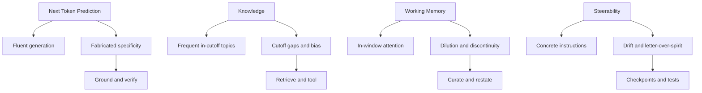
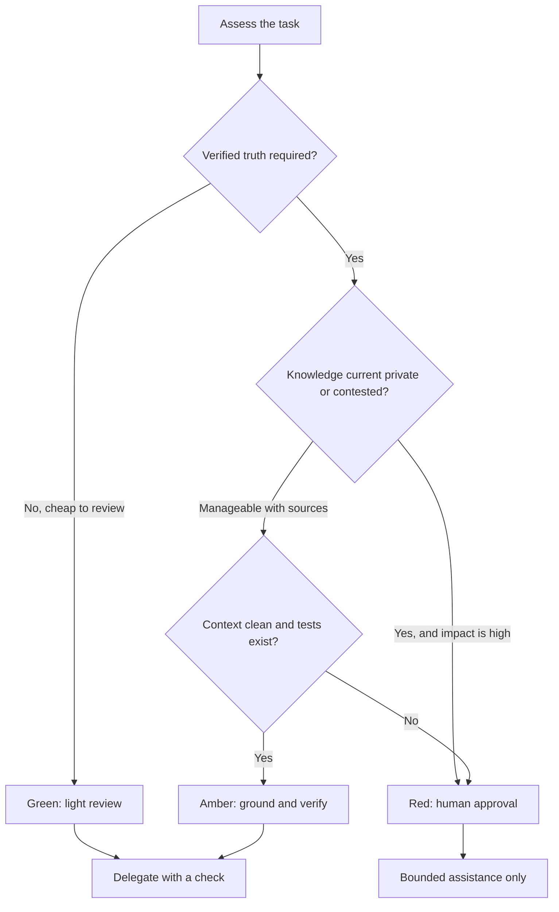

# Empat Sifat AI Generatif: Kerangka Praktis untuk Kepercayaan yang Terkalibrasi

Saya bisa minta model merefaktor handler Go dan mendapat kode idiomatis dalam hitungan
detik. Sepuluh menit kemudian, sesi yang sama mengarang nomor issue GitHub, tanggal
changelog, atau field API yang tidak pernah ada. Keduanya sama-sama fasih. Kontradiksi
itulah masalah praktis yang dibahas artikel ini.

Ini adalah pembacaan engineering saya atas kursus Claude Academy
[AI Capabilities and Limitations](https://academy.claude.com/courses/ai-capabilities-and-limitations).
Kerangka empat sifat, gagasan bahwa setiap sifat adalah kontinum dari kemampuan ke
batasan, sidik jari perilaku pasca-pelatihan, diagnostik tabrakan antar-sifat, dan
kaitan ke [AI Fluency 4D Framework](https://academy.claude.com/courses/ai-fluency-framework-foundations)
berasal dari kursus itu. Yang saya tambahkan di sini adalah cara saya memakai model
itu untuk software delivery: kapan mendelegasikan, bagaimana merancang konteks, cek
mana yang harus deterministik, dan di mana manusia tetap harus menyetujui.

Kursus pendampingnya,
[AI Fluency: Framework & Foundations](https://academy.claude.com/courses/ai-fluency-framework-foundations),
mengajar empat kompetensi manusia — Delegation, Description, Discernment, dan Diligence.
Artikel ini membahas sifat mesin yang direspons kompetensi itu. Saya tidak mengklaim
taksonomi ini sebagai karya original, dan ini bukan dokumen resmi Anthropic.

## Masalah

Kebanyakan tim masih bertanya secara biner: "Bisakah kita percaya AI?" Pertanyaan itu
menghasilkan model operasi yang salah. Orang terlalu mendelegasikan lalu mengirim
sitasi fiktif, atau terlalu menahan diri dan memperlakukan setiap draf fasih sebagai
mainan.

Pertanyaan yang berguna lebih sempit. Untuk *tugas ini*, sifat mana yang sedang bekerja,
di mana sifat itu mendekati tepinya, dan bukti apa yang akan menangkap kegagalan sebelum
berdampak? Itulah yang disebut kursus sebagai **calibrated trust** (kepercayaan yang
terkalibrasi): kepercayaan per tugas, bukan percaya menyeluruh dan bukan curiga
menyeluruh.

Kemampuan dan batasan biasanya datang dari mekanisme yang sama. Next-token prediction
adalah alasan model menulis ringkasan yang koheren *sekaligus* alasan ia bisa mengarang
judul paper yang terdengar masuk akal. Knowledge cutoff adalah alasan pola bahasa umum
murah *sekaligus* alasan halaman harga minggu lalu tidak terlihat kecuali diambil
kembali. Working memory adalah alasan prompt yang ringkas diikuti ketat *sekaligus*
alasan paste sepanjang dua puluh halaman kehilangan constraint yang terkubur di
halaman 11.

## Mengapa Masalah Ini Sulit

1. **Kefasihan menyembunyikan ketidakpastian.** Paragraf yang yakin bukan klaim yang
   terverifikasi.
2. **Sifat yang sama memungkinkan dan menggagalkan.** Mekanisme yang membuat draf
   pertama bagus bisa membuat draf kedua lebih buruk.
3. **Kegagalan nyata adalah tabrakan.** Sitasi halusinasi adalah pelengkapan fasih yang
   bertemu celah knowledge, bukan glitch acak.
4. **Fitur produk menggeser batas, bukan sifatnya.** Window yang lebih besar, search,
   memory, dan tools menggeser tepi. Mereka tidak menghapus porosnya.
5. **Pekerjaan delivery irreversibel secara potongan.** Komentar review yang buruk
   murah. Rencana rollback produksi yang buruk tidak.

## Model Mental untuk Pemula

Perlakukan model generatif sebagai pelengkap pola berbandwidth tinggi dengan empat
kendala operasi, bukan sebagai engineer junior yang "tahu," "mengerti," atau "ingat"
seperti rekan kerja.

| Sifat | Yang dimungkinkan | Batasan khas | Tanda peringatan | Kontrol terbaik | Kaitan 4D |
| --- | --- | --- | --- | --- | --- |
| Next Token Prediction (Prediksi Token Berikutnya) | Draf fasih, ringkasan, transformasi, pelengkapan pola | Teks yang masuk akal bukan kebenaran terverifikasi; spesifisitas mudah dikarang | Nama, tanggal, statistik, kutipan, URL, API, sitasi fiktif | Retrieval, schema, tools, loop generator-verifier, ketidakpastian eksplisit | Discernment, Diligence |
| Knowledge | Jawaban kuat pada topik yang sering, konsisten, dan dalam cutoff | Cutoff, kedaluwarsa, cakupan timpang, default yang diwariskan, atribusi sumber lemah | Jawaban yakin pada fakta langka, lokal, diperdebatkan, atau pasca-cutoff | Search, retrieval, konteks privat, tools deterministik | Delegation, Discernment, Diligence |
| Working Memory (Memori Kerja) | Perhatian pada isi context window saat ini | Lebih banyak konteks tidak otomatis lebih baik; sesi tidak persist secara default | Constraint terlupakan, miss di tengah paste, amnesia lintas sesi | Kurasi, taruh di depan, ulangi, sumber kebenaran eksternal, sesi baru | Description, Diligence |
| Steerability (kemampuan untuk diarahkan) | Instruksi konkret dan dapat diuji cenderung berhasil | Tujuan ambigu, rantai panjang, dan konflik menghasilkan drift atau letter-over-spirit | Kepatuhan literal yang meleset dari niat; error kecil yang menumpuk | Tujuan, constraint, non-goals, checkpoint, tes, schema | Description, Discernment, Diligence |

Setiap baris adalah kontinum. Tugas yang jauh di zona kemampuan bisa diserahkan dengan
review ringan. Tugas di dekat tepi butuh grounding, checkpoint, dan manusia di critical
path.



## Bagaimana Asisten Mendapat Perilakunya

Cerita sederhana yang berguna punya dua tahap. Saat **pretraining**, model belajar
memprediksi token berikutnya di korpus besar. Tahap itu menghasilkan kompetensi bahasa:
sintaksis, fakta umum, konvensi kode, dan bentuk statistik dokumen. Setelah pretraining,
sistem adalah pelengkap dokumen. Ia belum asisten yang membantu. Ia belum punya
pengertian bawaan "pengguna bertanya, jadi saya harus menjawab."

**Post-training** lalu membentuk perilaku asisten. Kursus menyajikannya sebagai
fine-tuning pada preferensi manusia. Itu model pengajaran yang adil. Di sistem modern
tahap yang sama sering mencakup supervised fine-tuning, preference optimization,
reinforcement learning, dan safety training — lihat misalnya
[InstructGPT](https://arxiv.org/abs/2203.02155) dan
[Constitutional AI](https://www.anthropic.com/research/constitutional-ai-harmlessness-from-ai-feedback)
Anthropic. Poin engineering-nya tetap: kompetensi bahasa mentah dan perilaku asisten
yang helpful adalah lapisan berbeda. Kesopanan, gaya penolakan, dan kecenderungan
terdengar yakin dilatih masuk. Itu bukan bukti bahwa model memeriksa sumber.

Weights menyimpan keteraturan statistik, bukan "tahu" ala manusia. Sebagian keteraturan
cocok dengan fakta. Sebagian cocok dengan kesalahan umum, halaman usang, atau filler
fasih. Lapisan asisten hanya mengubah *cara* prediksi itu disajikan.

## Sifat 1 — Next Token Prediction (Prediksi Token Berikutnya)

AI generatif menulis dengan melanjutkan pola. Itu lebih dekat ke autocomplete raksasa
ketimbang mesin pencari. Itulah alasan model kuat di ringkasan, reformat, penjelasan
konsep umum, dan pelengkapan kode yang mirip kode yang sering dilihatnya.

Mekanisme yang sama adalah alasan teks yang masuk akal bukan kebenaran terverifikasi.
Fabrikasi menumpuk di spesifisitas: nama, tanggal, statistik, kutipan, URL, field API,
dan sitasi. Penjelasan generik tentang HTTP timeout bisa berguna. Kalimat "RFC 9110
section 15.5.1 mensyaratkan status 473" adalah jenis klaim lain dan butuh jenis cek
yang lain.

Kontrol yang memang saya pakai:

- **Source grounding.** Taruh teks primer di konteks, atau ambil kembali, lalu minta
  model bekerja *dari teks itu*.
- **Constrained output.** JSON schema, enum, dan daftar identifier yang diizinkan
  menyempitkan ruang tempat karangan bersembunyi.
- **Tools deterministik.** Biarkan kode, bukan model, menghitung hash, parse tanggal,
  query API, dan menjalankan tes.
- **Loop generator-verifier.** Satu pass menyusun draf; pass kedua, sebaiknya kode,
  memeriksa schema, sitasi, dan invariant. Fail closed.
- **Ketidakpastian eksplisit.** Minta asumsi dan yang tidak diketahui. Klaim presisi
  tanpa bukti diperlakukan sebagai belum terverifikasi, bukan fakta.

Saya tidak meminta hidden chain-of-thought. Saya meminta artefak yang bisa saya
periksa: rencana, diff, tes, kutipan bersumber, output perintah. Sifat ini terutama
berpeta ke **Discernment** dan **Diligence**.

## Sifat 2 — Knowledge

Apa yang bisa diingat model tanpa tools berasal dari data pelatihan dan membeku pada
sebuah cutoff. Topik yang sering, konsisten, dan dalam cutoff berada di zona kemampuan.
Topik langka, lokal, diperdebatkan, atau pasca-cutoff berada di zona batasan. Staleness
adalah kegagalan terpisah: fakta bisa benar saat pelatihan dan salah sekarang, dan
model tidak punya jam internal yang membatalkannya.

Cakupan timpang. Bahasa populer dan API yang terdokumentasi lebih murah daripada
regulasi daerah atau nama service internal. Default yang diwariskan mengisi "normal"
dengan apa pun yang umum di korpus. "Saya pernah baca di suatu tempat" bukan sitasi.

Empat kanal ini perlu dibedakan:

| Kanal | Apa itu | Apa yang bukan |
| --- | --- | --- |
| Parametric knowledge | Pola yang tersimpan di weights model | Database hidup |
| Web search | Halaman publik terkini yang diambil saat merespons | Bukti bahwa halaman itu otoritatif |
| Retrieval / RAG | Dokumen eksternal yang dipilih dan ditaruh ke konteks inference | Pembaruan weights model |
| Tools deterministik | Kalkulator, database, compiler, API | Pengganti judgment manusia pada pertanyaan yang diperdebatkan |

[Retrieval-augmented generation](https://arxiv.org/abs/2005.11401) (RAG) **tidak**
memperkaya "otak" model. Ia mengambil teks relevan dan mengondisikan generasi pada
teks itu. Embeddings adalah representasi vektor untuk kemiripan semantik. Mereka
membantu menemukan kandidat chunk. Mereka tidak menuliskan fakta baru ke weights.

[Model Context Protocol](https://modelcontextprotocol.io/docs/getting-started/intro)
adalah **protokol koneksi** untuk mengekspos tools dan sumber data ke aplikasi. MCP
bukan vector database dan bukan algoritma retrieval. Produk bisa memakai MCP untuk
mencapai wiki, database SQL, atau indeks embeddings. Backend itulah yang melakukan
retrieval.

Untuk pekerjaan delivery, saya memperlakukan celah knowledge sebagai keputusan
Delegation. Jika jawaban harus terkini, privat, langka, atau diperdebatkan, saya
menyuplai sumber atau tools dulu. Saya tidak minta model mengingat halaman harga
kuartal lalu. Sifat ini berpeta ke **Delegation**, **Discernment**, dan **Diligence**.

## Sifat 3 — Working Memory (Memori Kerja)

Segala yang bisa diperhatikan model pada giliran ini hidup di **context window** yang
terbatas: instruksi sistem, riwayat percakapan, dokumen yang diambil, definisi tools,
hasil tools, dan output yang akan ditulis. Dokumentasi
[context window](https://platform.claude.com/docs/en/build-with-claude/context-windows)
Anthropic tegas pada dua poin yang saya andalkan: window bukan korpus pelatihan, dan
lebih banyak konteks tidak otomatis lebih baik. Seiring jumlah token bertambah, recall
bisa menurun — pola yang disebut Anthropic dan pihak lain *context rot*. Lihat juga
[Effective context engineering for AI agents](https://www.anthropic.com/engineering/effective-context-engineering-for-ai-agents).

Produk tidak menangani overflow dengan cara yang sama. API bisa menolak prompt yang
terlalu besar. UI chat bisa membuang giliran lama, meringkas, atau melakukan compact.
Saya **tidak** mengasumsikan silent truncation selalu terjadi. Asumsi saya: begitu
working set yang berguna tidak muat dengan bersih, perilaku menurun, dan saya mungkin
tidak mendapat alarm yang keras.

[Lost in the Middle](https://arxiv.org/abs/2307.03172) (Liu et al., TACL 2024) mengukur
pola retrieval konteks panjang yang teramati: pada tanya-jawab multi-dokumen dan
key-value lookup, beberapa model lebih kuat saat fakta relevan ada di awal atau akhir
input panjang, dan lebih lemah saat ada di tengah. Kurva berbentuk U itu temuan
empiris. Ia bervariasi menurut model dan setup. Itu bukan bukti bahwa transformer
hanya bisa memberi perhatian pada tepi.

Saya juga memisahkan tiga istilah:

- **Context** adalah window saat ini.
- **Product memory / projects / compaction** menyimpan, memilih, meringkas, atau
  memasukkan kembali informasi. [Compaction](https://platform.claude.com/docs/en/build-with-claude/compaction)
  meringkas giliran lama agar percakapan bisa berlanjut; itu tidak memperbesar window
  native model.
- **Training** adalah cara weights dibentuk. Mengoreksi model di chat tidak mengajar
  weights. Itu hanya mengubah apa yang ada di konteks sekarang.

Alur multi-agent tidak memberi satu model window yang lebih besar. Mereka membagi
pekerjaan ke konteks terpisah dan menambah biaya merge, koordinasi, dan konsistensi.
Itu bisa sepadan. Itu bukan konteks gratis.

Yang saya lakukan di praktik:

1. Kurasi. Jangan dump seluruh repo "untuk jaga-jaga."
2. Taruh tujuan dan constraint keras di awal.
3. Ulangi acceptance criteria dekat instruksi terakhir.
4. Simpan sumber kebenaran di luar chat: tiket, spek, file tes, `PLAN.md`.
5. Pakai ringkasan terstruktur dan file state eksplisit untuk kerja yang panjang.
6. Mulai sesi baru saat thread yang menumpuk sudah berisik.
7. Pecah ke sub-agent hanya jika partisi punya manfaat jelas, lalu anggarkan merge-nya.

Sifat ini terutama berpeta ke **Description** dan **Diligence**.

## Sifat 4 — Steerability (kemampuan untuk diarahkan)

Model mengikuti instruksi dengan cara yang sama seperti ia melakukan segala hal: dengan
melanjutkan pola. Permintaan pendek, konkret, dan dapat diuji mendarat dengan baik:
"kembalikan tabel," "jangan ubah public API," "gagalkan build jika `go test ./...`
merah." Tujuan abstrak, rantai panjang tanpa pengawasan, serta aritmetika atau logika
native adalah tempat steering mulai longgar.

Dua mode kegagalan muncul terus di delivery:

- **Reasoning drift.** Miss kecil di awal menumpuk. Di langkah kedelapan rencana
  konsisten secara internal dan salah.
- **Letter over spirit.** Instruksi diikuti; hasilnya tidak berguna. "Jadilah ringkas"
  menghapus satu caveat yang penting. "Tambah tes" menghasilkan tes yang mengafirmasi
  perilaku yang buggy.

Mengulang instruksi yang sama dengan lebih keras jarang menutup celah itu. Mengulang
hasil yang diinginkan justru menutupnya. Saya menulis tujuan, constraint, non-goals,
dan definition of done. Saya pecah eksekusi ke tahap pendek dengan checkpoint. Saya
minta output terstruktur. Saya serahkan aritmetika, transformasi, dan akses data ke
tools. Saya menahan tes dan validator di loop. Jika pembacaan literal menghasilkan
hasil yang tidak berguna, saya katakan seperti apa "selesai" itu, bukan apa yang
seharusnya dimaksud kalimat sebelumnya.

Saya tetap tidak memperlakukan "tunjukkan reasoning-mu" sebagai kontrol kecuali
reasoning itu adalah artefak yang bisa dicek: rencana berurutan, tes yang gagal,
tool call yang terlacak. Jejak internal yang tersembunyi bukan permukaan review.

Sifat ini berpeta ke **Description**, **Discernment**, dan **Diligence**.

## Empat Perilaku Bayangan dari Post-Training

Pelatihan asisten meninggalkan sidik jari. Itu bukan cacat khas satu provider, dan
kekuatannya bervariasi menurut model dan campuran post-training. Saya mengawasi empat.

| Sidik jari | Tanda peringatan | Respons pengguna |
| --- | --- | --- |
| Sycophancy | Model setuju pada premis buruk setelah sanggahan ringan, meski jawaban pertama lebih baik | Minta ia berargumen sebaliknya dan tunjukkan bukti |
| Verbosity | Jawaban panjang yang mengubur keputusan | Batasi panjang dan minta rekomendasi di depan |
| Over-caution | Penolakan atau hedging berat pada permintaan yang sebenarnya dalam kebijakan | Sempitkan permintaan dan nyatakan konteks yang diizinkan |
| Loose confidence calibration | "Saya yakin" tanpa dukungan yang bisa dicek | Abaikan kata sifatnya; minta artefak, tes, atau sumber |

Ini alasan untuk menambah proses, bukan alasan untuk memanusiakan model sebagai tidak
percaya diri atau ingin menyenangkan. Data preferensi memberi imbalan pada sebagian
bentuk ini. Workflow kita yang harus mengompensasi.

## Ketika Sifat-Sifat Bertabrakan

Sebagian besar kejutan produksi adalah dua sifat yang bertemu. Menamai pasangannya
memberi tahu kontrol mana yang harus dipakai. Memperpanjang prompt biasanya langkah
pertama yang salah.

| Kegagalan yang teramati | Sifat yang berinteraksi | Penyebab yang mungkin | Respons yang tepat |
| --- | --- | --- | --- |
| Sitasi atau fakta presisi yang dihalusinasi | Next Token Prediction + Knowledge | Pelengkapan fasih bertemu bukti yang hilang atau usang | Ambil sumber primer, wajibkan sitasi, verifikasi mandiri |
| Constraint terlupakan di akhir tugas panjang | Working Memory + Steerability | Instruksi kritis terdilusi, teringkas, atau tergeser | Isi ulang state ringkas dan acceptance criteria; mulai konteks eksekusi baru jika perlu |
| Rekomendasi yakin tetapi salah | Knowledge + kalibrasi post-training | Knowledge timpang plus bahasa keyakinan yang lemah | Minta asumsi dan bukti, pakai tools, bandingkan dengan judgment domain |
| Format benar tetapi hasil salah | Steerability + Next Token Prediction | Kepatuhan pola literal meleset dari niat | Ulangi tujuan dan tambah tes berbasis hasil |

Prinsip diagnostik: namai sifatnya, lalu pilih kontrol yang menyasar sifat itu. Nomor
issue fiktif tidak diperbaiki dengan "jadilah akurat." Ia diperbaiki dengan retrieval
plus verifier yang fail closed. Non-goal yang terlupakan tidak diperbaiki dengan
ceramah yang lebih panjang. Ia diperbaiki dengan kontrak ringkas yang diulang di titik
aksi.

Ini Discernment yang diterapkan pada jenis kegagalan, bukan pada vibe.

## Cek Pra-Penerbangan Praktis

Sebelum saya menyerahkan pekerjaan ke model, saya menjalankan checklist pendek.

1. Ini terutama generasi atau transformasi, atau butuh kebenaran terverifikasi?
2. Knowledge yang dibutuhkan terkini, privat, langka, lokal, atau diperdebatkan?
3. Apakah konteks yang perlu muat dengan bersih, dan apakah sumber kebenaran eksplisit
   di luar chat?
4. Apakah tujuan, constraint, non-goals, dan tes penerimaan konkret?
5. Bisakah output divalidasi oleh kode, schema, sitasi, tes, atau ahli domain?
6. Apa konsekuensinya jika jawaban salah, atau jika aksi irreversibel?

Saya lalu memetakan jawaban ke model delegasi tiga tingkat. Green bukan bebas risiko.
Artinya kegagalan yang diharapkan murah dan terdeteksi.

| Tingkat | Kapan | Mode operasi |
| --- | --- | --- |
| Green | Generasi/transformasi, knowledge in-distribution, konteks kecil, kesalahan murah, review mudah | Delegasikan dengan review ringan |
| Amber | Klaim kebenaran campuran, sebagian data privat atau terkini, konteks sedang, aksi reversibel | Delegasikan dengan grounding, checkpoint, dan verifikasi |
| Red | Fakta diperdebatkan atau berdampak tinggi, aksi irreversibel, knowledge tipis, konteks berisik | Pertahankan persetujuan manusia di critical path; pakai AI hanya untuk bantuan terbatas |



Ini Delegation dengan anggaran. Insting yang sama saya pakai di
[LLM Guardrails](/docs/concepts/llm-guardrails): isolasi output advisory dari aksi
irreversibel. Bedanya, checklist ini memutuskan *apakah* arsitektur itu perlu untuk
suatu tugas, bukan bagaimana mengimplementasikan checkpoint-nya.

## Contoh Engineering Terapan

### Menghasilkan atau merefaktor kode backend rutin

Risiko dominan: Next Token Prediction plus Steerability. Model akan menghasilkan kode
yang tampak seperti package di sekitarnya dan tetap melewatkan invariant tersembunyi.

Batas aman: Green sampai Amber. Biarkan ia menyusun perubahan. Jangan biarkan ia merge.

Bukti yang wajib: `go test`, typecheck, dan review diff terhadap daftar invariant.

Judgment manusia: concurrency, authz, dan "ini cocok dengan failure mode kita," bukan
gaya koma.

### Mereview proposal system design

Risiko dominan: Knowledge plus Steerability. Review bisa lengkap secara retoris dan
tetap mengasumsikan database yang tidak kita jalankan.

Batas aman: Amber. Pakai AI untuk enumerasi pertanyaan, failure mode, dan diagram yang
hilang.

Bukti yang wajib: proposal aktual, inventori service saat ini, dan non-goals yang
eksplisit.

Judgment manusia: trade-off, constraint organisasi, dan apa yang akan kita sesali dalam
enam bulan. Lihat [Pola Orkestrasi AI](/docs/concepts/ai-orchestration-patterns) untuk
cara saya menjaga kritik berpemisahan peran agar tidak menimpa canonical state.

### Menganalisis bukti insiden produksi atau menyusun RCA

Risiko dominan: Working Memory plus Knowledge. Log panjang. Baris yang menarik sering
ada di tengah. Topologi pasca-cutoff akan dikarang jika dibiarkan.

Batas aman: Amber sampai Red, tergantung dampak ke pelanggan.

Bukti yang wajib: cuplikan log mentah, dashboard, timestamp deploy, dan linimasa yang
Anda jaga di luar chat.

Judgment manusia: blast radius, komunikasi pelanggan, dan apakah usulan perbaikan
menyerang mekanisme yang sebenarnya. Untuk tulisan panjang, generate per bagian lalu
audit keseluruhan — gagasan yang sama dengan
[koherensi dokumen](/docs/concepts/ai-document-coherence).

### Meneliti harga, regulasi, API, atau spek produk terkini

Risiko dominan: Knowledge. Memori parametrik adalah penyimpan yang salah.

Batas aman: Red untuk klaim, Amber untuk sintesis. Ambil halaman, spek, atau undang-undang
dulu.

Bukti yang wajib: sumber primer tertaut dengan cuplikan yang dikutip. Tidak ada URL,
tidak ada klaim.

Judgment manusia: apakah sumber masih berlaku, wilayah mana yang tercakup, dan risiko
legal atau komersial apa yang benar-benar kita ambil.

### Generator-verifier Go yang disederhanakan

Sketsa di bawah **bukan** kode production-ready. Ia hanya menunjukkan kontrolnya:
perlakukan output model sebagai input tidak terpercaya, validasi schema, cek bukti yang
dikutip, dan fail closed.

```go
// simplified — generator-verifier treating model output as untrusted input
package review

import (
	"encoding/json"
	"errors"
	"fmt"
	"net/url"
	"strings"
)

type Draft struct {
	Summary   string   `json:"summary"`
	Findings  []string `json:"findings"`
	Citations []string `json:"citations"`
}

func Verify(raw []byte, evidence string) (*Draft, error) {
	var draft Draft
	if err := json.Unmarshal(raw, &draft); err != nil {
		return nil, fmt.Errorf("fail closed: invalid JSON: %w", err)
	}
	if strings.TrimSpace(draft.Summary) == "" || len(draft.Findings) == 0 {
		return nil, errors.New("fail closed: missing required fields")
	}
	if len(draft.Citations) == 0 {
		return nil, errors.New("fail closed: no citations")
	}
	for _, cite := range draft.Citations {
		parsed, err := url.Parse(cite)
		if err != nil || parsed.Scheme == "" || parsed.Host == "" {
			return nil, fmt.Errorf("fail closed: malformed citation %q", cite)
		}
		if !strings.Contains(evidence, cite) {
			return nil, fmt.Errorf("fail closed: citation not in evidence set: %s", cite)
		}
	}
	return &draft, nil
}
```

Orchestrator coding bisa membungkus gagasan yang sama di sekitar tes dan checkpoint
Git. Itu loop di
[Merancang Orchestrator Coding Agentik yang Deterministik](/docs/concepts/deterministic-agentic-orchestrator):
generate, validasi, retry dalam batas, atau rollback.

## Batas Kerangka Ini

Keempat sifat ini adalah model mental praktis yang diajarkan
[Claude Academy](https://academy.claude.com/courses/ai-capabilities-and-limitations).
Mereka bukan taksonomi ilmiah lengkap tentang transformer, alignment, atau evals. Saya
menerapkan model itu ke pekerjaan engineering. Saya tidak mengklaim saya yang
menciptakannya.

Kerangka ini tidak menggantikan evaluasi spesifik model, security review, kontrol
privasi, keahlian domain, atau pengujian produksi. Ia juga tidak memberi tahu apakah
fitur memory vendor menyimpan data dengan cara yang diterima threat model Anda. Itu
review terpisah.

Jika model nanti menggeser batas — retrieval konteks panjang yang lebih baik, tool use
yang lebih baik, cutoff yang lebih baru — porosnya tetap berguna. Saya tetap bertanya
sifat mana yang diandalkan tugas itu.

## Pengujian, Verifikasi, dan Operasi

Calibrated trust hanya sebaik cek yang sudah dinamai di muka. Kode butuh tes dan diff
yang direview. Fakta butuh sumber primer. Kritik desain butuh proposal aktual. Narasi
insiden butuh timestamp dari system of record. Ekstraksi terstruktur butuh schema dan
jalur penolakan. Jika saya tidak bisa menamai ceknya, tugas itu Red. "Kedengarannya
benar" bukan tes.

Di luar model saya menyimpan tiga artefak: sumber kebenaran, definition of done, dan
batas persetujuan. Saat sesi menjadi usang, saya mulai thread baru dengan kontrak
pendek dan pointer bukti.

## Pelajaran

1. Nilai tugas terhadap empat sifat, bukan model sebagai orang.
2. Kefasihan adalah default; verifikasi adalah pengecualian yang harus saya rancang.
3. Tabrakan lebih cepat didiagnosis daripada vibe: namai pasangannya, lalu pilih kontrol.
4. Konteks adalah anggaran. Menambah token bisa menyembunyikan instruksi yang penting.
5. Green tetap mendapat sekilas. Review murah tetap review.

Saya tidak bertanya apakah AI dapat dipercaya secara umum. Saya bertanya sifat mana
yang diandalkan tugas ini, di mana sifat itu dekat batasnya, dan bukti apa yang akan
menangkap kegagalan sebelum ikut terkirim.

## Bacaan Terkait

- [LLM Guardrails](/docs/concepts/llm-guardrails) — pola produksi untuk sanitasi input,
  validasi output, revert perbaikan yang gagal, dan isolasi AI advisory
- [Pola Orkestrasi AI](/docs/concepts/ai-orchestration-patterns) — pipeline sekuensial
  berperan tetap dengan canonical state yang immutable
- [Cara Mencegah Kontradiksi dalam Dokumen yang Dihasilkan AI](/docs/concepts/ai-document-coherence)
  — generasi per bagian dan micro-fix terjaga
- [Merancang Orchestrator Coding Agentik yang Deterministik](/docs/concepts/deterministic-agentic-orchestrator)
  — retry terbatas, checkpoint, dan quality gate

## Sumber

- Claude Academy / Anthropic,
  [AI Capabilities and Limitations](https://academy.claude.com/courses/ai-capabilities-and-limitations)
  — kerangka empat sifat, model pengajaran tahap pelatihan, sidik jari perilaku,
  tabrakan sifat, calibrated trust, dan kaitan 4D. Sumber konseptual otoritatif artikel
  ini.
- Claude Academy / Anthropic, bersama Rick Dakan dan Joseph Feller,
  [AI Fluency: Framework & Foundations](https://academy.claude.com/courses/ai-fluency-framework-foundations)
  — Delegation, Description, Discernment, Diligence.
- Catatan belajar pribadi, "AI Capabilities and Limitation.md" — catatan mentah penulis
  dari kursus; bukan otoritas independen.
- Nelson F. Liu et al.,
  [Lost in the Middle: How Language Models Use Long Contexts](https://arxiv.org/abs/2307.03172),
  TACL 2024.
- Patrick Lewis et al.,
  [Retrieval-Augmented Generation for Knowledge-Intensive NLP Tasks](https://arxiv.org/abs/2005.11401),
  NeurIPS 2020.
- [Model Context Protocol](https://modelcontextprotocol.io/docs/getting-started/intro) —
  protokol terbuka untuk menghubungkan aplikasi ke tools dan sumber data.
- Anthropic,
  [Context windows](https://platform.claude.com/docs/en/build-with-claude/context-windows)
  dan
  [Compaction](https://platform.claude.com/docs/en/build-with-claude/compaction).
- Anthropic,
  [Effective context engineering for AI agents](https://www.anthropic.com/engineering/effective-context-engineering-for-ai-agents)
  (29 Sep 2025).
- Long Ouyang et al., [Training language models to follow instructions with human
  feedback](https://arxiv.org/abs/2203.02155) (InstructGPT), 2022.
- Anthropic,
  [Constitutional AI: Harmlessness from AI Feedback](https://www.anthropic.com/research/constitutional-ai-harmlessness-from-ai-feedback).
