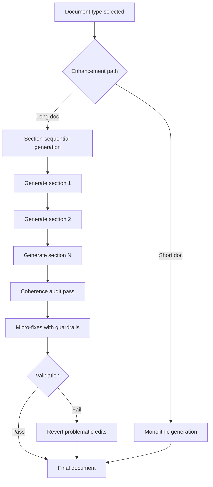

# Cara Mencegah Kontradiksi dalam Dokumen yang Dihasilkan AI

## Apa yang Dibangun

[A2A Brainstorm](https://github.com/okfriansyah-moh/a2a-brainstormer) mengonversi ide produk mentah menjadi artefak Markdown terstruktur (`architecture.md`, `plan.md`, `readme.md`) melalui pipeline multi-agent. Peningkatan berikutnya menambahkan **generasi per-seksi** dengan **pass audit koherensi** yang mendeteksi kontradiksi antar-seksi dan menerapkan **micro-fix terjaga** — edit kecil yang dikembalikan jika gagal validasi guardrail.

## Masalah

Ketika LLM menghasilkan dokumen panjang dalam satu kali jalan, seksi dapat saling bertentangan: seksi arsitektur mungkin menentukan PostgreSQL sementara seksi rencana merujuk MongoDB. Regenerasi seluruh dokumen mahal dan dapat memperkenalkan error baru. Anda membutuhkan cara untuk menghasilkan secara inkremental **dan** memverifikasi konsistensi antar seksi.

## Mengapa Masalah Ini Sulit

1. **Batas context window** — generasi monolitik menurun pada dokumen panjang.
2. **Isolasi seksi** — setiap seksi dihasilkan dengan kesadaran parsial terhadap seksi lain.
3. **Risiko over-correction** — memperbaiki satu kontradiksi dapat merusak konten tidak terkait.
4. **Output LLM non-deterministik** — perbaikan harus divalidasi, tidak diterapkan secara membabi buta.

## Model Mental untuk Pemula

Bayangkan menulis buku satu bab demi bab. Setelah setiap bab, editor membaca **semua bab bersama** dan menandai kalimat yang bertentangan dengan bab sebelumnya. Editor membuat **koreksi kecil** (satu kata di sini, nama teknologi di sana) — tetapi jika koreksi memperburuk keadaan, koreksi tersebut **otomatis dibatalkan**.

## Persyaratan dan Kendala

| Persyaratan             | Implementasi                                                     |
| ----------------------- | ---------------------------------------------------------------- |
| Generasi inkremental    | Jalur enhancement per-seksi per tipe dokumen                     |
| Konsistensi antar-seksi | Modul `coherence.go` dengan `runCoherencePass`                   |
| Perbaikan aman saja     | Guardrail mengembalikan edit yang gagal validasi                 |
| Progress dapat diamati  | Struct `ProgressMeta` dengan enum langkah seksi dan koherensi    |
| Cakupan test            | Unit test `coherence_test.go` + integration test `aigen_test.go` |

## Gambaran Arsitektur



Backend memilih antara jalur monolitik dan per-seksi di `enhanceOneWithOpts` berdasarkan tipe dokumen.

## Alur Eksekusi

1. Pengguna memfinalisasi sesi brainstorming dengan state kanonik yang konvergen.
2. Backend memilih jalur enhancement (monolitik atau per-seksi).
3. Untuk per-seksi: setiap body seksi dihasilkan secara independen menggunakan temuan rubrik tingkat seksi dari `rubric.go`.
4. Setelah semua seksi ada, `runCoherencePass` mengaudit dokumen penuh untuk inkonsistensi antar-seksi.
5. Modul koherensi mengusulkan micro-fix untuk kontradiksi yang terdeteksi.
6. Guardrail memvalidasi setiap perbaikan; edit bermasalah dikembalikan.
7. Event progress distream ke frontend via SSE dengan metadata langkah granular.

## Komponen Penting

| Komponen             | Tanggung jawab                                               |
| -------------------- | ------------------------------------------------------------ |
| `coherence.go`       | Audit antar-seksi, penerapan micro-fix, revert guardrail     |
| `rubric.go`          | Ekstraksi body seksi, validasi, temuan rubrik                |
| `enhanceOneWithOpts` | Pemilihan jalur antara monolitik dan per-seksi               |
| `ProgressMeta`       | Pelaporan progress kaya untuk UI (langkah seksi + koherensi) |
| Convergence engine   | Menilai stabilitas desain sebelum generasi dokumen dimulai   |

## Contoh Implementasi yang Disederhanakan

Pemilihan jalur (disederhanakan):

```go
// simplified — enhanceOneWithOpts concept
func enhanceOneWithOpts(docType string, state CanonicalState) (string, error) {
    if usesSectionSequential(docType) {
        body := generateSectionsSequentially(state)
        return runCoherencePass(body)
    }
    return generateMonolithic(state)
}
```

Revert guardrail (disederhanakan):

```go
// simplified — if micro-fix fails validation, restore previous section body
if !validateSection(fixedBody) {
    revertToSnapshot(sectionID)
}
```

## Keandalan dan Idempotensi

- **Penyimpanan state:** PostgreSQL menyimpan state sesi, state desain kanonik, dan riwayat iterasi. Generasi dokumen membaca dari snapshot state yang difinalisasi.
- **Generasi sinkron:** Jalur per-seksi dan pass koherensi berjalan berurutan dalam proses backend.
- **Update UI asinkron:** Progress distream via Server-Sent Events.
- **Perbaikan terjaga:** Micro-fix bersifat transaksional di tingkat seksi — perbaikan gagal dikembalikan ke snapshot pra-perbaikan daripada meninggalkan korupsi parsial.

## Mode Kegagalan

| Kegagalan                               | Perilaku                                                |
| --------------------------------------- | ------------------------------------------------------- |
| Audit koherensi tidak menemukan masalah | Dokumen lolos tanpa perubahan                           |
| Micro-fix gagal guardrail               | Edit dikembalikan; body seksi asli dipertahankan        |
| Generasi seksi gagal                    | Error dilaporkan via SSE; sesi tetap dapat dilanjutkan  |
| Provider LLM tidak tersedia             | Agent ditandai tidak tersedia; tanpa fallback diam-diam |

## Trade-off dan Alternatif yang Ditolak

| Pilihan                         | Alasan                                                         | Alternatif yang ditolak                                      |
| ------------------------------- | -------------------------------------------------------------- | ------------------------------------------------------------ |
| Per-seksi                       | Kualitas lebih baik pada dokumen panjang; sesuai batas context | Selalu monolitik — kontradiksi meningkat seiring panjang     |
| Micro-fix                       | Koreksi terarah mempertahankan seksi yang baik                 | Regenerasi penuh — mahal dan memperkenalkan error baru       |
| Revert guardrail                | Mencegah kaskade fix-dari-fix                                  | Terapkan membabi buta — satu perbaikan buruk merusak dokumen |
| Koherensi sebagai pass terpisah | Mengaudit dokumen lengkap dengan konteks penuh                 | Self-check per-seksi saja — melewatkan konflik antar-seksi   |

## Pengujian

- `coherence_test.go` — unit test untuk parser audit dan logika revert guardrail.
- `aigen_test.go` — integration test untuk jalur monolitik dan per-seksi.
- Quality gate backend: `make test` → `make lint` → `make check`.

## Operasi dan Observabilitas

- Langkah progress menyertakan enum eksplisit untuk generasi seksi dan operasi koherensi.
- Halaman sesi frontend (`/session/:id`) menampilkan progress pipeline via SSE.
- Riwayat dokumen tersedia di route `/history`.

## Pelajaran yang Dipetik

1. **Hasilkan per bagian, verifikasi secara keseluruhan** — generasi per-seksi plus pass koherensi global menggabungkan strategi terbaik keduanya.
2. **Guardrail mengalahkan kepercayaan** — jangan pernah menerapkan perbaikan yang diusulkan LLM tanpa validasi.
3. **Micro-fix daripada rewrite** — edit kecil terarah mempertahankan investasi pada seksi yang baik.
4. **Granularitas progress penting** — pengguna toleran terhadap generasi panjang jika mereka melihat seksi mana dan langkah audit mana yang berjalan.

## Sumber

- Repository: [okfriansyah-moh/a2a-brainstormer](https://github.com/okfriansyah-moh/a2a-brainstormer)
- Pull requests: [#12 section-per-section coherence audit](https://github.com/okfriansyah-moh/a2a-brainstormer/pull/12) (open), [#8 output quality improvements](https://github.com/okfriansyah-moh/a2a-brainstormer/pull/8)
- Arsitektur: `docs/A2A-agent-Brainstorm.md` di repo sumber

:::note
PR #12 masih open pada saat penulisan. Modul koherensi dijelaskan di body PR dan file test terkait; verifikasi status merge sebelum mengutip sebagai terbukti di produksi.
:::
