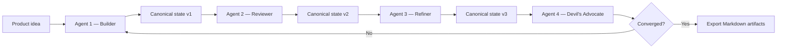

# Pola Orkestrasi AI

## Apa yang Dibangun

[A2A Brainstorm](https://github.com/okfriansyah-moh/a2a-brainstormer) mengorkestrasi
**pipeline berurutan peran tetap** di mana agent khusus (builder, reviewer, refiner,
devil's advocate) masing-masing menerima **canonical state** lengkap, menambahkan kontribusinya,
dan meneruskannya ke agent berikutnya. Backend Go modular monolith menjalankan pipeline ini dengan
persistensi PostgreSQL dan streaming progress ke frontend via Server-Sent Events.

Pola ini berbeda dari orkestrasi coding berbasis tugas (lihat
[Orchestrator Coding Agentik Deterministik](/docs/concepts/deterministic-agentic-orchestrator))
dan dari audit koherensi dokumen (lihat
[Koherensi Dokumen AI](/docs/concepts/ai-document-coherence)).

## Masalah

Sistem AI multi-agent sering berubah menjadi chat tidak terstruktur: agent saling berbicara tanpa
konteks, membatalkan keputusan sebelumnya, dan menghasilkan output yang tidak dapat direproduksi.
Untuk sesi desain yang harus konvergen pada dokumen arsitektur, Anda membutuhkan orkestrasi di mana
**peran tetap**, **state immutable antar agent dalam satu pass**, dan **iterasi terbatas**.

## Mengapa Masalah Ini Sulit

1. **Otonomi agent vs konvergensi** — terlalu banyak kebebasan mencegah stabilisasi.
2. **Konsistensi state** — setiap agent harus melihat konteks penuh sebelumnya, bukan ringkasan.
3. **Batas peran** — reviewer tidak boleh menulis ulang seluruh output builder.
4. **Kontrol iterasi** — sesi membutuhkan sinyal konvergensi, bukan loop tak terbatas.
5. **Fleksibilitas provider** — agent dapat memakai provider LLM berbeda tanpa merusak pipeline.

## Model Mental untuk Pemula

Bayangkan rapat tinjauan desain dengan **dokumen bersama di layar**. Setiap peserta
memiliki peran tetap: satu orang menyusun draf, berikutnya mengkritik, ketiga menyempurnakan, keempat
menantang asumsi. Semua orang membaca dokumen yang sama. Setelah satu putaran penuh, Anda memeriksa
apakah desain sudah stabil. Jika belum, Anda menjalankan putaran lain — hingga batas maksimum.

## Persyaratan dan Kendala

| Persyaratan | Implementasi |
|-------------|----------------|
| Pipeline peran tetap | Builder → Reviewer → Refiner → Devil's Advocate |
| Canonical state | Objek state bersama diteruskan berurutan; setiap agent menambahkan |
| Determinisme | Input sama + config sama = output identik |
| Deteksi konvergensi | Skor confidence setelah setiap pass penuh |
| Iterasi terbatas | Batas iterasi maksimum dengan override pengguna |
| Netralitas provider | Interface `LLMProvider`; kredensial hanya via env ref |
| Streaming progress | SSE ke frontend (tanpa WebSocket, tanpa polling) |

## Gambaran Arsitektur



Backend menjalankan agent secara berurutan dalam setiap iterasi. Setelah setiap pass penuh,
convergence engine menilai delta. Progress pipeline di-stream melalui SSE.

## Alur Eksekusi

1. **Pembuatan sesi** — pengguna memberikan ide produk, memilih ≥ 2 agent, constraint teknis opsional
   dan jawaban klarifikasi.
2. **Mulai iterasi** — backend memuat canonical state dari PostgreSQL.
3. **Pass agent berurutan** — setiap agent menerima state lengkap, menambahkan kontribusi via
   binary executor A2A.
4. **Pemeriksaan konvergensi** — engine menilai confidence; jika di bawah ambang dan di bawah iterasi
   maksimum, pengguna memicu pass berikutnya.
5. **Injeksi feedback** — pengguna dapat menyuntikkan catatan antar iterasi; digabungkan ke state.
6. **Finalisasi** — pengguna memfinalisasi sesi; backend menghasilkan `architecture.md`,
   `plan.md`, `readme.md`.
7. **Peningkatan dokumen** — generasi berurutan per-seksi opsional dengan audit koherensi
   (lihat [Koherensi Dokumen AI](/docs/concepts/ai-document-coherence)).

## Komponen Penting

| Komponen | Tanggung jawab |
| -------- | -------------- |
| `backend/` (Go) | REST API, pipeline engine, manajemen sesi |
| `agent/` (Go) | Binary executor A2A — satu instance per slot agent |
| `frontend/` (SvelteKit) | UI sesi, kontrol iterasi, ekspor dokumen |
| Convergence engine | Menilai delta desain setelah setiap pass penuh |
| Interface `LLMProvider` | Panggilan LLM netral provider (DeepSeek, Claude, Copilot) |
| `migrations/` | Perubahan skema SQL append-only |
| PostgreSQL 16 | Persistensi sesi, iterasi, agent, dan state |

## Contoh Implementasi yang Disederhanakan

Pass pipeline berurutan (disederhanakan):

```go
// simplified — each agent receives and returns canonical state
func (p *Pipeline) RunIteration(ctx context.Context, state CanonicalState) (CanonicalState, error) {
    for _, agent := range p.agentsInOrder {
        contribution, err := agent.Execute(ctx, state)
        if err != nil {
            return state, err
        }
        state = state.Append(agent.Role, contribution)
    }
    return state, nil
}
```

Konfigurasi LLM netral provider (disederhanakan):

```env
# simplified — credential ref, not the key itself
GLOBAL_LLM_PROVIDER=deepseek
GLOBAL_LLM_CREDENTIAL_REF=DEEPSEEK_API_KEY
DEEPSEEK_API_KEY=your-key-here
```

## Keandalan dan Idempotensi

- **Persistensi state:** Setiap snapshot iterasi disimpan di PostgreSQL; sesi bertahan dari
  restart backend.
- **Resolusi agent card:** Retry dengan exponential backoff untuk error A2A transient.
- **Ekstraksi JSON:** Parsing toleran terhadap respons LLM (markdown fence, trailing comma).
- **Tanpa fallback diam-diam:** API key hilang membuat agent tidak tersedia — tanpa switch provider terdegradasi.

## Mode Kegagalan

| Kegagalan | Perilaku |
| --------- | -------- |
| Timeout LLM agent | Iterasi gagal; pengguna dapat retry |
| JSON tidak valid dari LLM | Logika ekstraksi retry; prompt menegakkan JSON murni |
| Konvergensi tidak tercapai | Pengguna memutuskan finalisasi atau melanjutkan iterasi |
| API key hilang | Agent ditandai tidak tersedia; sesi tidak dapat memakai agent tersebut |
| Crash backend | State sesi terpersist; resume dari iterasi terakhir |

## Trade-off dan Alternatif yang Ditolak

| Pilihan | Alasan | Alternatif yang ditolak |
| ------- | ------ | ----------------------- |
| Berurutan peran tetap | Kontribusi dapat diprediksi dan diaudit | Chat multi-agent bebas |
| Objek canonical state | Konteks penuh untuk setiap agent | Memori terisolasi per agent |
| Streaming progress SSE | Sederhana, unidirectional | Kompleksitas WebSocket |
| Skoring konvergensi | Kondisi berhenti objektif | Pengguna menebak kapan selesai |
| Binary executor A2A | Slot agent dapat diskalakan | Panggilan LLM inline di modul backend |

## Pengujian

Repositori menyertakan test Go untuk ekstraksi JSON, pemilihan provider LLM, logika retry agent card,
dan integrasi pipeline. Frontend memiliki type checking via `make lint`.

## Operasi dan Observabilitas

- **Mulai:** `make start` (Docker Compose: postgres, backend, agent, frontend)
- **Log:** `make docker-logs`
- **Quality gate:** `make test` → `make lint` → `make check`
- **Skala agent:** `make docker-scale SCALE=2`

## Pelajaran yang Dipetik

1. **Orkestrasi bukan percakapan** — peran tetap dan pass berurutan menghasilkan
   output yang dapat ditinjau dan konvergen.
2. **Canonical state adalah kontrak** — setiap agent membaca dan menambahkan ke objek yang sama.
3. **Konvergensi membutuhkan metrik** — tanpa skor confidence, iterasi tidak pernah berakhir dengan bersih.
4. **Pisahkan orkestrasi coding dari orkestrasi desain** — tugas skeleton-parallel
   dan sesi A2A brainstorm menyelesaikan masalah berbeda.

## Terkait

- [Cara Mencegah Kontradiksi dalam Dokumen yang Dihasilkan AI](/docs/concepts/ai-document-coherence)
- [Merancang Orchestrator Coding Agentik yang Deterministik](/docs/concepts/deterministic-agentic-orchestrator)
- [LLM Guardrails](/docs/concepts/llm-guardrails)

## Sumber

- Repository: [okfriansyah-moh/a2a-brainstormer](https://github.com/okfriansyah-moh/a2a-brainstormer)
- Pull requests: [#7 e2e MVP](https://github.com/okfriansyah-moh/a2a-brainstormer/pull/7), [#8 output quality](https://github.com/okfriansyah-moh/a2a-brainstormer/pull/8)
- Dokumentasi arsitektur: `docs/A2A-agent-Brainstorm.md` di repo sumber
