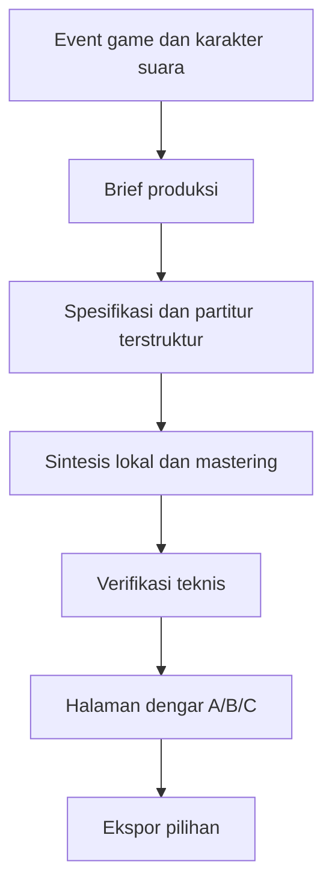

import audio0 from '@site/docs/concepts/audio/codex-game-audio-synthesis/tile_place_A.wav';
import audio1 from '@site/docs/concepts/audio/codex-game-audio-synthesis/tile_place_B.wav';
import audio2 from '@site/docs/concepts/audio/codex-game-audio-synthesis/tile_place_C.wav';
import audio3 from '@site/docs/concepts/audio/codex-game-audio-synthesis/puzzle_victory_C.wav';
import audio4 from '@site/docs/concepts/audio/codex-game-audio-synthesis/bg_gameplay_A.wav';

# Cara Saya Menggunakan Codex untuk Menyintesis Audio Game: Pelajaran dari Padu

Saat membangun Padu, game puzzle saya, saya membutuhkan suara yang terasa selaras dengan tile keramik dan permukaan enamel. Tekanan tombol, tile yang masuk ke slot, dan kemenangan puzzle harus menyampaikan hal berbeda, tetapi tetap terasa berasal dari dunia yang sama.

Saya menggunakan Codex untuk membuat alur produksi aset kecil: mendeskripsikan suara, menerjemahkannya menjadi kode sintesis yang bisa diedit, merender alternatif, memeriksa file, lalu membandingkannya di halaman dengar. Artikel ini membagikan metode tersebut, lima contoh asli, dan prompt yang bisa saya gunakan saat membuat game berikutnya.

## Yang Dibangun

Paket kandidat mandiri ini berisi **33 peran efek suara dan sembilan komposisi latar, masing-masing dengan tiga alternatif**: 99 efek ditambah 27 trek musik, atau **126 kandidat WAV**. A memakai keramik/marimba, B kayu/tembaga, dan C elektronik/keramik. File pilihan yang kemudian disimpan mencatat satu alternatif untuk masing-masing dari 42 peran audio.

Ini adalah studi kasus tahap produksi kandidat. Bukti bertanggal 28 September 2026 mencakup pembuatan aset dan alat untuk mencoba suara; bukti itu belum membuktikan perilaku game produksi atau pemutaran di perangkat. Repositori Padu bersifat privat, sehingga saya membagikan audio terpilih, brief produksi, dan penjelasan cuplikan kode di sini. Hubungi saya melalui tautan di akhir artikel jika ingin membahas implementasi lengkapnya.

## Masalahnya

Saya membutuhkan kosakata suara yang konsisten, bukan sekadar kumpulan bunyi menarik. Suara penempatan mengonfirmasi sebuah langkah. Suara kesalahan perlu jelas tanpa terasa menghukum. Frasa kemenangan boleh lebih panjang, tetapi tetap harus nyaman ketika sering terdengar.

Musik latar memiliki tugas lain: menjaga momentum sambil memberi ruang untuk berpikir dan mendengar efek. Komposisi Home memakai 80 BPM; komposisi permainan memakai 150 BPM. Definisi peran ini memberi Codex arahan konkret untuk dikerjakan.

## Mengapa Masalah Ini Sulit

“Buat suara yang bagus” masih menyisakan hampir semua keputusan. Waktu, attack, nada, resonansi, volume, dan pengulangan menentukan rasa sebuah cue. Efek yang nyaman didengar sekali bisa melelahkan setelah puluhan penempatan. Melodi yang bagus pun dapat terdengar terputus saat diulang.

File yang valid secara teknis juga berbeda dari suara yang saya inginkan dalam game. Skrip bisa mengukur clipping atau durasi. Memilih apakah keramik, tembaga, atau petikan elektronik cocok dengan adegan tetap membutuhkan pendengaran.

## Cara Membayangkannya

Bayangkan Codex sebagai rekan yang membangun bengkel instrumen kecil. Saya menjelaskan material dan aksinya; Codex menulis instrumen dan partitur; komputer menghitung gelombang suara; saya mendengarkan lalu memilih.

Codex dapat membaca file, menulis kode, dan menjalankan alat yang sudah tersedia, seperti dijelaskan dalam [dokumentasi resmi Codex](https://learn.chatgpt.com/docs/codex/cli). Dalam proyek ini, sampel audio berasal dari sintesis numerik lokal. Python dan NumPy menghasilkan gelombang suara, sedangkan FFmpeg mengukur loudness dan memverifikasi decoding. Alur ini tidak memakai layanan pembuat musik eksternal atau rekaman sumber.

Prompt bahasa alami yang tersimpan adalah **brief produksi**. Codex menerjemahkan maksudnya menjadi algoritma instrumen, pola nada, dan spesifikasi terstruktur. Renderer membaca spesifikasi tersebut; mengubah paragraf prompt saja tidak mengubah suara.

## Kebutuhan dan Batasan

| Aset | Kebutuhan yang tercatat |
| --- | --- |
| Efek | Satu cue terpisah, attack langsung, peluruhan singkat dan alami, mono |
| Musik | Instrumental, pengulangan berbasis birama utuh, 90–120 detik, stereo |
| Master | WAV PCM bertanda, 48 kHz dan 24-bit |
| Mastering efek | Target RMS per kategori dan batas puncak sampel −5 dBFS |
| Mastering musik | Target loudness terintegrasi −20 LUFS; true peak di bawah −1 dBTP |
| Input | Osilator hasil perhitungan dan noise dengan seed; tanpa sampel unduhan, ucapan, atau peniruan artis |
| Hasil serah terima | Sumber yang bisa diedit, partitur persis, prompt, metadata, hash, dan pilihan dengar |

Kebutuhan ini berasal dari brief Padu. Game lain mungkin memerlukan tempo, durasi, atau target loudness berbeda.

## Gambaran Arsitektur



## Alur Pengerjaan

1. **Jelaskan event.** Tentukan pemicu, makna, durasi, dan mode game yang diizinkan.
2. **Tentukan tiga arah.** Pertahankan peran yang sama, sambil memvariasikan instrumen, nada, waktu, dan aransemen.
3. **Susun dan sintesis.** Buat partitur event, campurkan suara instrumen, lalu ekspor master.
4. **Ukur hasilnya.** Periksa file aktual terhadap brief.
5. **Dengarkan dan pilih.** Bandingkan alternatif, lalu ekspor catatan pilihan yang bisa dipindahkan.

### Dengarkan lima contoh asli

Ini adalah master WAV asli, 48 kHz dan 24-bit. Ketiga alternatif penempatan tile masing-masing berdurasi 0,24 detik; bandingkan bunyi kontak dan peluruhannya. Pilihan yang tersimpan adalah B. Efek kemenangan berdurasi 1,25 detik. Loop permainan berdurasi 102,4 detik: 64 birama dalam 4/4 pada 150 BPM.

Tekan Play untuk mendengarkan. Audio tidak diputar atau diunduh otomatis; ukuran file musik lengkap sekitar 29,5 MB. Setiap blok di bawah memuat **brief produksi lengkap yang tersimpan**, disalin persis dari metadata kandidat. Prompt asli tetap dalam bahasa Inggris. Brief ini menjelaskan hasil yang diinginkan; renderer memakai spesifikasi terstruktur dan kode komposisi, bukan membaca paragraf prompt saat dijalankan.

#### Penempatan tile A: keramik / marimba

<p id="demo-0">S07 · 0.24 detik</p>

<audio controls preload="none" aria-label="Penempatan tile A: keramik / marimba" style={{width: '100%', maxWidth: '36rem'}}>
  <source src={audio0} type="audio/wav" />
  <a href={audio0}>Buka audio WAV</a>
</audio>

**Brief produksi tersimpan:**

> One isolated original Padu effect with a ceramic/enamel character. No speech, vocals, background music, ambience, borrowed melodies or artist imitation. Immediate clean attack and natural short decay; comfortable on headphones and clear on phone speakers. No harsh treble, excessive bass, distortion or long reverb. One effect only. 48 kHz, 24-bit PCM mono WAV. Ceramic tile settling in a fitted recess, contact click then rounded clack, short decay.

#### Penempatan tile B: kayu / tembaga — pilihan tersimpan

<p id="demo-1">S07 · 0.24 detik</p>

<audio controls preload="none" aria-label="Penempatan tile B: kayu / tembaga — pilihan tersimpan" style={{width: '100%', maxWidth: '36rem'}}>
  <source src={audio1} type="audio/wav" />
  <a href={audio1}>Buka audio WAV</a>
</audio>

**Brief produksi tersimpan:**

> One isolated original Padu effect with a ceramic/enamel character. No speech, vocals, background music, ambience, borrowed melodies or artist imitation. Immediate clean attack and natural short decay; comfortable on headphones and clear on phone speakers. No harsh treble, excessive bass, distortion or long reverb. One effect only. 48 kHz, 24-bit PCM mono WAV. Wooden block knock with tiny copper ping; weight and confirmation, no melody.

#### Penempatan tile C: elektronik / keramik

<p id="demo-2">S07 · 0.24 detik</p>

<audio controls preload="none" aria-label="Penempatan tile C: elektronik / keramik" style={{width: '100%', maxWidth: '36rem'}}>
  <source src={audio2} type="audio/wav" />
  <a href={audio2}>Buka audio WAV</a>
</audio>

**Brief produksi tersimpan:**

> One isolated original Padu effect with a ceramic/enamel character. No speech, vocals, background music, ambience, borrowed melodies or artist imitation. Immediate clean attack and natural short decay; comfortable on headphones and clear on phone speakers. No harsh treble, excessive bass, distortion or long reverb. One effect only. 48 kHz, 24-bit PCM mono WAV. Tight electronic snap then one warm note; accurate lock-in, suitable for rapid placements.

#### Kemenangan puzzle C — pilihan tersimpan

<p id="demo-3">S25 · 1.25 detik</p>

<audio controls preload="none" aria-label="Kemenangan puzzle C — pilihan tersimpan" style={{width: '100%', maxWidth: '36rem'}}>
  <source src={audio3} type="audio/wav" />
  <a href={audio3}>Buka audio WAV</a>
</audio>

**Brief produksi tersimpan:**

> One isolated original Padu effect with a ceramic/enamel character. No speech, vocals, background music, ambience, borrowed melodies or artist imitation. Immediate clean attack and natural short decay; comfortable on headphones and clear on phone speakers. No harsh treble, excessive bass, distortion or long reverb. One effect only. 48 kHz, 24-bit PCM mono WAV. Punchy ascending electronic phrase with ceramic clicks and bright chord; no bass drop.

#### Musik permainan A — pilihan tersimpan

<p id="demo-4">B02 · 102.4 detik · 150 BPM</p>

<audio controls preload="none" aria-label="Musik permainan A — pilihan tersimpan" style={{width: '100%', maxWidth: '36rem'}}>
  <source src={audio4} type="audio/wav" />
  <a href={audio4}>Buka audio WAV</a>
</audio>

**Brief produksi tersimpan:**

> Original instrumental Padu puzzle background. No vocals, lyrics, speech, borrowed melodies, artist imitation, downloaded samples or environmental recordings. Sparse melodic space for concentration and effects. Consistent energy, no dramatic introduction, breakdown, final cadence or fade-out. Seamless repeating arrangement, 90–120 seconds. 48 kHz, 24-bit PCM stereo WAV. Fast driving puzzle groove, strong drums and bass, short hooks, no relaxed sections. Instrumental at 150 BPM. Primarily ceramic and marimba: quick mallet attacks, warm modal resonance, dry wooden support and clear tactile contacts. Maintain energy and leave melodic space for thought and short effects. No breakdown, final cadence or fade-out.


## Komponen Penting

| Komponen | Tanggung jawab |
| --- | --- |
| Spesifikasi yang bisa diedit | Daftar event, palet, durasi, BPM, birama, motif, dan harmoni |
| Composer | Mengubah setiap peran terstruktur menjadi event instrumen dengan waktu tertentu |
| Synthesizer | Menghitung sampel keramik, kayu, tembaga, marimba, petikan, bass, dan drum |
| Mastering dan verifier | Mengatur gain dan memeriksa format, puncak, loudness, sambungan loop, serta kompatibilitas |
| Katalog dan halaman dengar | Menghubungkan file aktual dengan brief, pemicu, dan perbandingan A/B/C |
| Ekspor pilihan | Mencatat ID aset, varian terpilih, lokasi file, dan hash SHA-256 |

Halaman dengar dapat mencari nama dan mode, memfilter kategori, memainkan satu kandidat pada satu waktu, menghentikan suara, dan mengulang musik latar. Preferensi disimpan di penyimpanan browser jika tersedia; ekspor JSON membuat pilihan mudah dipindahkan. Jika penyimpanan gagal, pilihan tetap tersedia dalam sesi berjalan dan pengguna diarahkan untuk mengekspornya.

## Contoh Implementasi Sederhana

Osilator adalah sinyal matematis yang berulang. Gabungkan beberapa osilator dengan rasio frekuensi dan peluruhan berbeda, dan hasilnya dapat menyerupai material yang dipukul. Renderer asli memakai rasio seperti 1, 2,73, 4,18, dan 6,27 untuk keramik; marimba memakai 1, 4, dan 10. Ini adalah instrumen bergaya, bukan rekaman benda fisik.

Cuplikan berikut **disederhanakan dari renderer** untuk menjelaskan sintesis aditif/modal dan envelope. Ini adalah penjelasan, bukan kode produksi master lengkap:

```python
# Disederhanakan: osilator dengan attack dan peluruhan.
t = np.arange(round(seconds * sample_rate)) / sample_rate
attack = 1 - np.exp(-t / 0.0007)
x = np.zeros_like(t)
for ratio, weight, decay in partials:
    x += weight * np.sin(2 * np.pi * frequency * ratio * t) * np.exp(-t * decay)
x *= attack
```

**Envelope** mengatur seberapa cepat suara mulai dan memudar. Noise singkat yang difilter menambahkan bunyi kontak. Seed pada noise membuat input teksturnya bisa diulang. Petikan elektronik memakai **FM**: osilator lain mengubah fase osilator utama untuk menghasilkan attack yang lebih kaya. Mixer menempatkan setiap event sesuai jadwalnya, mengatur gain, dan menentukan posisi stereo instrumen.

Dalam sebuah loop, nada dekat akhir bisa masih beresonansi ketika pengulangan berikutnya dimulai. Mixer memindahkan ekor nada tersebut ke awal loop, bukan memotongnya. Birama utuh menentukan durasi musik:

```python
# Perhitungan durasi sederhana untuk komposisi permainan.
duration_seconds = 64 * 4 * 60 / 150  # 102.4 detik
```

Mastering kemudian menentukan level keluaran. Efek memakai gain linear yang dibatasi target RMS dan puncak. Musik memakai saturasi ringan tanpa memori, lalu gain linear berdasarkan pengukuran. FFmpeg mengukur loudness; alat itu tidak menyusun nada. Master musik tidak memiliki fade pada ujung file yang akan membuat volume turun setiap kali loop diulang.

## Keandalan dan Idempotensi

Alur ini menyimpan maksud dan implementasinya: brief produksi, spesifikasi terstruktur, partitur event persis, kode sintesis, dan metadata. Hash mengidentifikasi file hasil. Seed yang stabil membuat input noise prosedural bisa diulang ketika input dan alat tetap sama.

Pengujian reproduksi historis menghasilkan ulang **satu efek dan satu loop stereo lengkap** dengan byte identik. Itu membuktikan dua kasus tersebut dalam lingkungan yang tercatat, bukan menjamin setiap versi alat akan menghasilkan setiap master secara identik.

## Bentuk Kegagalan

| Kegagalan | Deteksi dan respons |
| --- | --- |
| Sampel clipping atau tidak valid | Tolak nilai non-finite atau di luar rentang sebelum ekspor; verifikasi puncak sesudahnya |
| Durasi atau kanal salah | Periksa sampel hasil decoding dan format WAV terhadap metadata |
| Klik pada sambungan loop | Ukur diskontinuitas batas dan tinjau pemutaran berulang; pertahankan ekor nada |
| Alternatif hanya berbeda volume | Bandingkan gelombang dan periksa perubahan instrumen, nada, waktu, serta aransemen |
| Pemutaran atau penyimpanan browser gagal | Tampilkan kegagalan atau status sesi saja dan pertahankan akses file/ekspor yang bisa digunakan |
| Konversi menambah padding atau mengubah sambungan | Periksa ulang waktu hasil decoding dan pemutaran pada backend tujuan |

Pengukuran sambungan tidak menjamin pemutaran mulus pada setiap browser atau backend audio game. Format distribusi, decoder, penjadwalan, dan sesi audio tetap memerlukan pemeriksaan tersendiri.

## Pertimbangan dan Alternatif

Sintesis lokal cocok untuk material bergaya dalam brief ini serta mempertahankan kode dan partitur yang bisa diedit. Saya mendapat kendali langsung atas attack, waktu nada, dan konstruksi loop. Namun, pendekatan ini juga membutuhkan pekerjaan komposisi dan DSP; model keramik tidak otomatis terdengar seperti tile keramik asli yang meyakinkan.

Paket yang tercatat tidak memakai pustaka sampel atau layanan generasi eksternal. Itu menjelaskan implementasi ini, bukan membuktikan pendekatan lain tidak cocok untuk game berbeda. Proyek dengan musik orkestra, suara realistis, atau rekaman lapangan akan membutuhkan alur aset lain beserta peninjauan sumber dan hak penggunaannya.

## Pengujian

Laporan verifikasi tanggal 28 September 2026 mencatat **126 master yang diharapkan dan tersedia, 126 hash unik, serta tidak ada file hilang atau tambahan**. Semua file lolos pemeriksaan decoding, format, durasi, audibilitas, dan kompatibilitas yang berlaku.

Ringkasan bukti historis akhir mencatat loudness musik terintegrasi **−20,02 hingga −19,99 LUFS**, true peak musik tertinggi **−6,59 dBTP**, dan puncak sampel efek tertinggi **−5,00 dBFS**. Setiap sambungan musik yang diukur lolos pemeriksaan yang ditentukan. Ini adalah hasil tercatat untuk batch produksi tersebut, bukan pengukuran baru saat artikel ini ditulis.

Antarmuka dengar asli diperiksa di Chromium pada lebar 320, 390, dan 900 piksel. Bukti itu mencakup kontrol dan tata letaknya. Bukti tersebut tidak menyatakan preferensi artistik, realisme akustik, pengujian dengar di perangkat fisik, atau perilaku game produksi.

## Operasional dan Observabilitas

Di paket privat asli, alur dijalankan dengan:

```sh
# Dari folder kandidat; skrip ini tidak dibagikan bersama artikel.
python3 sources/render.py
python3 sources/verify_audio.py
python3 sources/build_index.py
```

Catatan produksi menyebut Python 3.13.2, NumPy 2.4.4, dan FFmpeg 8.1. Verifier menghasilkan pengukuran dan kegagalan per file, bukan hanya mengandalkan renderer yang selesai tanpa error. Untuk mengubah suara, edit brief terstruktur atau composer, buat ulang kandidat, lalu periksa keluaran dan metadata. Gunakan folder keluaran terpisah untuk eksperimen agar master terpilih tetap terjaga.

## Pelajaran yang Saya Ambil

**Mulai dari event game.** Material dan suasana penting, tetapi aksi memberi suara sebuah tugas. Tentukan pemicu cue dan apa yang ingin dikomunikasikan.

**Minta alternatif yang bermakna.** Tiga timbre atau aransemen memberi saya bahan perbandingan. Tiga salinan dengan gain berbeda tidak membantu menentukan arah.

**Simpan resepnya.** WAV adalah hasil akhir. Spesifikasi, kode, partitur, seed, dan brief membuat iterasi bisa dipahami serta diulang.

**Gabungkan pemeriksaan dan pendengaran.** Verifikasi teknis menemukan keluaran rusak. Pendengaran menentukan apakah hasilnya cocok dengan game. Keduanya saling melengkapi.

**Anggap distribusi sebagai tahap lain.** Master PCM yang valid tetap memerlukan pemeriksaan konversi, backend, loop, dan perangkat sebelum diterima untuk produksi.

Pola yang sama dapat membantu membuat aset lain: jelaskan peran dan batasan, pilih alat yang sesuai, hasilkan alternatif yang bisa diedit, bandingkan, lalu simpan asal-usulnya. Bentuk prosedural atau tekstur partikel mungkin cocok dibuat lewat kode; ilustrasi mungkin memerlukan alat gambar. Yang bisa dipakai kembali adalah alurnya, bukan klaim bahwa satu synthesizer dapat membuat semua aset.

### Prompt untuk game berikutnya

Ini adalah **prompt tugas baru yang bisa digunakan kembali**, ditulis untuk artikel ini. Ini bukan transkrip sesi asli atau salah satu brief kandidat yang tersimpan di atas. Ganti bagian dalam tanda kurung siku dengan kebutuhan game Anda. Prompt tetap dalam bahasa Inggris agar mudah digunakan bersama contoh aslinya:

```text
You are helping me create audio assets for a new game.

First inspect the existing game brief, visual style, asset conventions,
and installed tools. Propose a sound-event inventory before rendering.

Game: [name and one-sentence description]
Sound character: [materials, mood, energy, and sounds to avoid]
Events: [UI click, tile placement, mistake, victory, and game-specific cues]
Timing: [duration range for each effect; BPM, meter, and bars for music]

Create three meaningfully different timbre/arrangement alternatives per
event. Use local procedural synthesis with Python/NumPy and FFmpeg when
appropriate. Do not use downloaded samples or imitate an artist. Inspect
dependencies first; explain any missing tools before adding them.

Deliver 48 kHz, 24-bit PCM WAV masters: mono effects and stereo music.
For music, use complete bars and wrap note tails across the loop boundary.
Use category-appropriate loudness; document targets and measure the output.
Keep effects immediate and comfortable, with clean short tails.

Keep editable specifications, synthesis/composition code, exact event
scores, deterministic seeds, full production briefs, and SHA-256 hashes.
Create a local listening page with search, category filters, A/B/C playback,
one active player, a music-loop option, and exportable selections.

Verify decoding, inventory, duration, channels, clipping, loudness, loop
joins, mono compatibility, and source records. Report actual results and
limitations. Test reproducibility in a separate output directory.
Leave final artistic selection to me. Keep candidates separate from the
game until selected, and verify converted delivery assets separately.
```

### Ingin membahas lebih jauh?

Jika ingin membahas synthesizer lengkap, katalog dengar, atau penerapan metode ini untuk game lain, hubungi saya lewat [email](mailto:okfriansyah@gmail.com) atau [LinkedIn](https://www.linkedin.com/in/muhammad-okfriansyah-74092671). Saya membagikan contoh dan penjelasan cuplikan di sini; implementasi lengkap tetap privat.

## Terkait

- [Pipa AI yang Deterministik](/id/docs/concepts/deterministic-ai-pipelines)
- [State Machine Berbasis Database](/id/docs/concepts/database-state-machines)
- [Merancang Orchestrator Coding Agentik yang Deterministik](/id/docs/concepts/deterministic-agentic-orchestrator)
- [LLM Guardrails](/id/docs/concepts/llm-guardrails)

## Sumber

- [Dokumentasi resmi Codex](https://learn.chatgpt.com/docs/codex/cli): membaca repositori, mengedit kode, dan menjalankan alat lokal.
- Repositori privat penulis: `okfriansyah-moh/padu`, diperiksa pada revisi `5746ab7c04828d6b382de8a132a2332a18480ee9`. Contoh audio di sini bisa didengarkan tanpa akses ke repositori sumber.
- Catatan kandidat bertanggal 28 September 2026: `artifacts/audio/padu-candidates/README.md`, `sources/specification.json`, `sources/render.py`, dan catatan `sources/metadata/*.json` untuk lima kandidat.
- Bukti historis: `evidence/audio-verification-all.json`, `evidence/reproducibility.json`, `evidence/FINAL_REPORT.md`, dan `PROVENANCE.json` dalam paket tersebut.
- Pilihan tersimpan: `selected/padu-audio-choices.json`; B untuk penempatan S07, C untuk kemenangan S25, dan A untuk musik permainan B02. Kelima file audio yang dimuat di sini mempertahankan hash SHA-256 tercatat.
