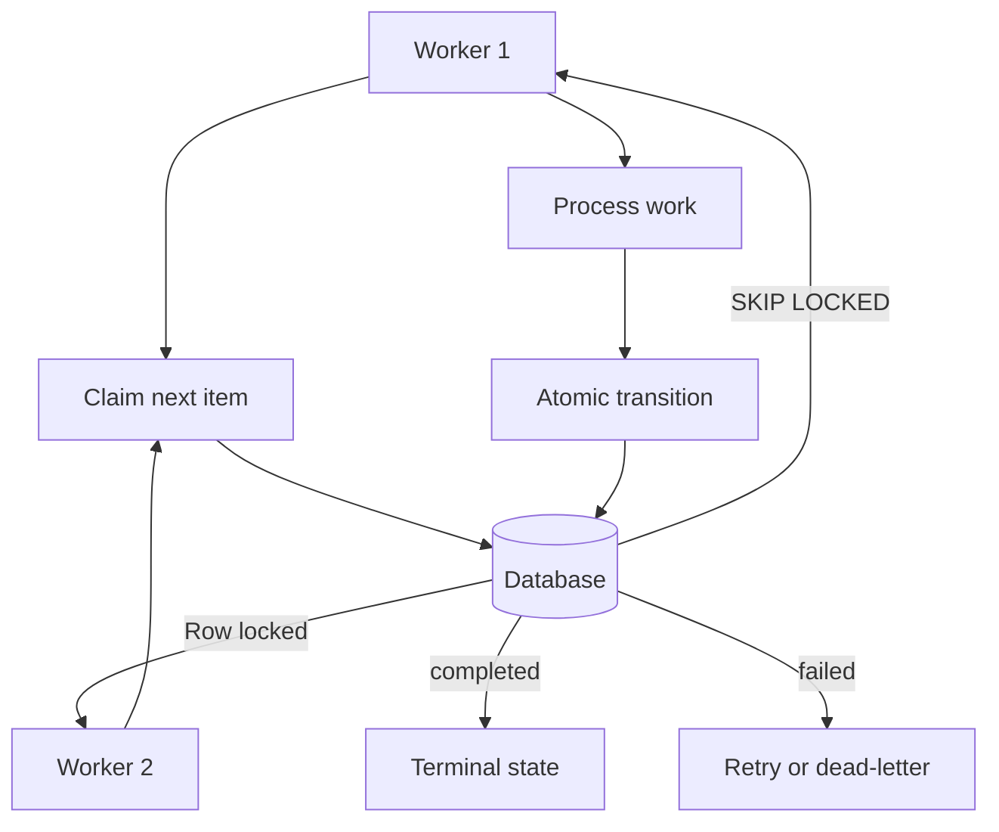

# State Machine Berbasis Database

## Apa yang Dibangun

Artikel ini mendokumentasikan pola state machine berbasis database sebagaimana diimplementasikan di
[shorts-generator](https://github.com/okfriansyah-moh/shorts-generator) (checkpoint tahap
SQLite), [md-ame](https://github.com/okfriansyah-moh/md-ame) (transisi RPC PostgreSQL dengan
`FOR UPDATE SKIP LOCKED`), dan
[edge-polymarket-agent](https://github.com/okfriansyah-moh/edge-polymarket-agent)
(event bus Postgres dengan siklus hidup klaim worker). Di setiap sistem, database adalah
**single source of truth** untuk progress workflow.

## Masalah

Workflow AI terdistribusi harus bertahan dari crash, mendukung worker konkuren, dan mencegah
pemrosesan duplikat. State machine in-memory kehilangan semuanya saat proses mati. State
berbasis file (checkpoint JSON, file log) berlomba di bawah konkurensi dan tidak memiliki
jaminan transisi atomik. Anda membutuhkan store yang mendukung **transisi state atomik**
dengan riwayat yang dapat di-query.

## Mengapa Masalah Ini Sulit

1. **Tulisan parsial** — memperbarui status dan output dalam query terpisah meninggalkan state tidak konsisten.
2. **Klaim konkuren** — dua worker mengambil job yang sama menyebabkan panggilan LLM atau trade duplikat.
3. **Crash di tengah transisi** — proses mati di antara read dan write.
4. **Ambiguitas recovery** — tanpa state eksplisit, Anda tidak dapat membedakan "sedang berjalan"
   dari "gagal" dari "macet".
5. **Idempotensi dalam skala** — retry tidak boleh membuat side effect duplikat.

## Model Mental untuk Pemula

State machine berbasis database adalah **buku besar dengan aturan**. Setiap baris adalah item
pekerjaan dengan status saat ini. Transisi mengikuti jalur yang diizinkan (`queued` → `processing` → `completed`).
Hanya database (via RPC atau satu adapter) yang boleh mengubah status. Worker membaca
buku besar, mengklaim satu item, melakukan pekerjaan, dan menulis hasil kembali — secara atomik.

## Persyaratan dan Kendala

| Persyaratan | shorts-generator | md-ame | polymarket-agent |
|-------------|------------------|--------|------------------|
| State store | SQLite (satu file) | Supabase PostgreSQL | Event bus PostgreSQL |
| Atomisitas transisi | Tulisan lapisan adapter | Fungsi RPC PostgreSQL | API claim/complete event |
| Klaim konkuren | Orchestrator single-process | `FOR UPDATE SKIP LOCKED` | `FOR UPDATE SKIP LOCKED` |
| Idempotensi | ID content-addressable | idempotency_key SHA-256 | Deduplikasi event |
| Recovery | Resume dari tahap terakhir | Cron replay + recovery pass | Event tidak terklaim diklaim ulang |
| Perubahan skema | Migrasi Python | Migrasi SQL append-only | Migrasi DB berversi |

## Gambaran Arsitektur



## Alur Eksekusi

1. **Buat item pekerjaan** — insert baris dengan status awal dan `idempotency_key`.
2. **Klaim** — worker memilih baris eligible berikutnya dengan row-level lock (`FOR UPDATE SKIP LOCKED`).
3. **Proses** — worker mengeksekusi logika tahap (dapat mencakup panggilan LLM).
4. **Transisi** — perbarui status, output, dan timestamp secara atomik dalam satu operasi.
5. **Selesai atau gagal** — state terminal eksplisit; item gagal dapat di-retry dengan backoff.
6. **Recovery** — orchestrator memindai item macet (processing terlalu lama) dan melanjutkan atau gagalkan.

## Komponen Penting

| Komponen | Tanggung jawab |
| -------- | -------------- |
| Tabel state / event bus | Menyimpan status dan payload saat ini per item pekerjaan |
| Query klaim | `FOR UPDATE SKIP LOCKED` mencegah double-claiming |
| Lapisan RPC / adapter | Satu-satunya otoritas untuk transisi multi-baris |
| Idempotency key | Unique constraint mencegah unit pekerjaan duplikat |
| Recovery scanner | Menemukan item terhenti sebelum generasi pekerjaan baru |
| Dead-letter queue | Menangkap item gagal permanen untuk inspeksi |

## Contoh Implementasi yang Disederhanakan

Checkpoint tahap SQLite (disederhanakan):

```python
# simplified — shorts-generator pattern
def record_stage_complete(video_id: str, stage: str, output: dict):
    db.execute(
        "INSERT INTO stage_results (video_id, stage, output, completed_at) "
        "VALUES (?, ?, ?, ?) ON CONFLICT DO NOTHING",
        (video_id, stage, json.dumps(output), now()),
    )
```

Transisi RPC PostgreSQL (disederhanakan):

```sql
-- simplified — md-ame pattern: atomic status update via RPC
CREATE FUNCTION transition_job_status(
  p_job_id UUID, p_from TEXT, p_to TEXT
) RETURNS BOOLEAN AS $$
  UPDATE jobs SET status = p_to, updated_at = now()
  WHERE id = p_job_id AND status = p_from
  RETURNING id IS NOT NULL;
$$ LANGUAGE sql;
```

Klaim event bus (disederhanakan):

```python
# simplified — polymarket pattern
def claim_next(event_type: str) -> Event | None:
    return db.fetchone("""
        UPDATE events SET status = 'processing', claimed_at = now()
        WHERE id = (
            SELECT id FROM events
            WHERE event_type = %s AND status = 'pending'
            ORDER BY created_at
            FOR UPDATE SKIP LOCKED LIMIT 1
        ) RETURNING *
    """, (event_type,))
```

## Keandalan dan Idempotensi

- **Transisi atomik:** Perubahan status dan tulisan output terjadi dalam satu operasi database
  (RPC, transaksi, atau `UPDATE ... RETURNING`).
- **Isolasi klaim:** `SKIP LOCKED` memungkinkan worker konkuren melanjutkan tanpa memblokir
  klaim satu sama lain.
- **Idempotency keys:** `ON CONFLICT DO NOTHING` atau unique constraint mencegah unit pekerjaan
  duplikat saat retry.
- **Recovery:** Deteksi macet memakai timestamp — item dalam `processing` melebihi ambang
  dilanjutkan atau ditandai gagal.

## Mode Kegagalan

| Kegagalan | Perilaku |
| --------- | -------- |
| Worker crash setelah klaim | Item tetap `processing`; recovery scanner mengklaim ulang |
| Insert duplikat | Idempotency key menolak duplikat |
| Race transisi RPC | Guard `WHERE status = p_from` gagal dengan aman |
| Database tidak tersedia | Worker fail fast; tanpa fallback in-memory diam-diam |
| Error migrasi skema | Migrasi append-only; rollback via migrasi baru |

## Trade-off dan Alternatif yang Ditolak

| Store | Terbaik untuk | Keterbatasan |
| ----- | ------------- | ------------ |
| SQLite | Pipeline satu mesin (shorts-generator) | Tidak ada writer konkuren antar proses |
| PostgreSQL RPC | Multi-worker, cloud-hosted (md-ame, polymarket) | Membutuhkan DB terkelola dan disiplin migrasi |
| State in-memory | Hanya prototyping | Hilang saat crash |
| Checkpoint file JSON | Script sederhana | Race condition di bawah konkurensi |
| Redis | Antrian ephemeral cepat | Bukan otoritatif untuk graf state kompleks |

## Pengujian

Uji state machine dengan menegaskan transisi yang diizinkan, menolak transisi tidak valid, dan
memverifikasi perilaku klaim konkuren. Ketiga repo sumber menyertakan test untuk lapisan adapter/RPC
dan logika klaim worker.

## Operasi dan Observabilitas

- Query item macet: `SELECT * FROM jobs WHERE status = 'processing' AND updated_at < now() - interval '30 minutes'`
- Pantau kedalaman dead-letter queue untuk event gagal permanen
- Gunakan structured logging dengan ID item pekerjaan yang dikorelasikan ke baris database

## Pelajaran yang Dipetik

1. **Database adalah state machine** — jangan mencerminkan state di memori aplikasi.
2. **Fungsi RPC menegakkan invariant** — pindahkan logika multi-baris ke batas database.
3. **`SKIP LOCKED` esensial** — untuk worker konkuren tanpa dispatcher pusat.
4. **State terminal eksplisit** — setiap item pekerjaan harus berakhir di `completed`, `failed`, atau
   `cancelled`; tidak pernah `processing` selamanya yang ambigu.

## Terkait

- [Pipeline AI Deterministik](/docs/concepts/deterministic-ai-pipelines)
- [Membangun Pipeline Pemrosesan Video Panjang yang Dapat Dilanjutkan](/docs/systems/shorts-generator-pipeline)
- [MD-AME: Autonomous Media Engine](/docs/systems/md-ame-autonomous-media-engine)
- [Polymarket Trading Agent](/docs/systems/polymarket-trading-agent)

## Sumber

- Repository: [okfriansyah-moh/shorts-generator](https://github.com/okfriansyah-moh/shorts-generator)
- Repository: [okfriansyah-moh/md-ame](https://github.com/okfriansyah-moh/md-ame)
- Repository: [okfriansyah-moh/edge-polymarket-agent](https://github.com/okfriansyah-moh/edge-polymarket-agent)
