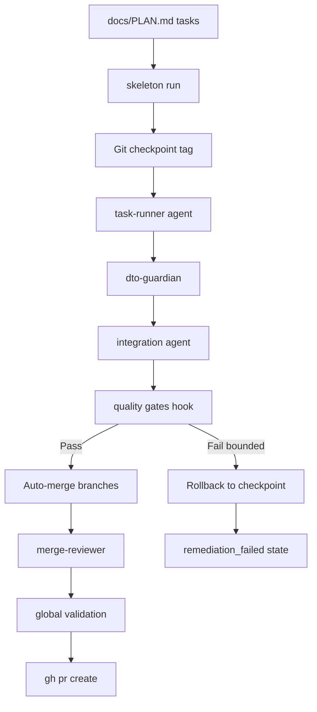

# Merancang Orchestrator Coding Agentik yang Deterministik

## Apa yang Dibangun

[skeleton-parallel](https://github.com/okfriansyah-moh/skeleton-parallel) adalah baseline yang dapat digunakan kembali untuk membangun perangkat lunak deterministik dengan agent AI. Versi 1.0 menggantikan **orchestrator paralel berbasis fase** (`run_parallel.sh` + `config/phases.yaml`) dengan **CLI agentik berbasis tugas** (`skeleton run` + `docs/PLAN.md`). Sistem menjalankan tugas implementasi otonom melalui pipeline retry terbatas dengan rollback checkpoint Git dan quality gate otomatis.

## Masalah

Agent AI dapat mengimplementasikan fitur perangkat lunak, tetapi loop agent tanpa batas bersifat non-deterministik, mahal, dan rentan retry tak terbatas. Anda membutuhkan orchestrator yang:

- Mendefinisikan pekerjaan sebagai tugas diskret yang dapat diverifikasi.
- Menjalankan agent dengan retry terbatas dan rollback eksplisit.
- Memvalidasi aturan arsitektur (immutabilitas DTO, batas modul).
- Berakhir dalam state yang diketahui — sukses, rollback, atau `remediation_failed`.

## Mengapa Masalah Ini Sulit

1. **Paralelisme vs konteks** — agent paralel cepat tetapi merge conflict mahal.
2. **Non-determinisme agent** — prompt yang sama dapat menghasilkan kode berbeda.
3. **Drift arsitektur** — agent melanggar batas modul tanpa penegakan.
4. **Retry tak terbatas** — agent gagal dapat loop selamanya tanpa rollback checkpoint.
5. **Migrasi** — proyek yang memakai konfigurasi berbasis fase membutuhkan jalur kompatibilitas.

## Model Mental untuk Pemula

Bayangkan manajer lokasi konstruksi dengan daftar tugas (`docs/PLAN.md`). Untuk setiap tugas, manajer mengirim pekerja (agent AI) melalui **checklist tetap**: build → validasi DTO → cek integrasi → jalankan quality gate. Sebelum memulai setiap tugas, manajer menempatkan **bendera checkpoint** (Git tag). Jika pekerja gagal setelah 5 percobaan, manajer reset ke bendera dan menandai tugas gagal. Lokasi **selalu** berakhir dalam state yang diketahui.

## Persyaratan dan Kendala

| Persyaratan            | Implementasi v1.0                                                        |
| ---------------------- | ------------------------------------------------------------------------ |
| Definisi pekerjaan     | `docs/PLAN.md` dengan seksi `### Task N`                                 |
| Orchestrator           | CLI `skeleton run` membaca `config/skeleton.yaml`                        |
| Retry terbatas         | Batas per tahap di YAML (`retries.task_runner`, dll.)                    |
| Rollback checkpoint    | Git tag sebelum setiap tugas; `git reset --hard` saat gagal              |
| Quality gate           | `scripts/hooks/quality-gates.sh` (spesifik proyek)                       |
| Fleksibilitas provider | Driver `router_http`, `cli_subscription`, `sdk_cursor`                   |
| Kompatibilitas mundur  | Shim `run_parallel.sh` mendelegasikan ke `skeleton run` untuk satu rilis |

## Gambaran Arsitektur



Tiga mode eksekusi menyeimbangkan kecepatan dan biaya:

| Mode             | Paralelisme                        | Terbaik untuk                      |
| ---------------- | ---------------------------------- | ---------------------------------- |
| `--parallel`     | Penuh (worktree terpisah)          | Tugas independen, tekanan deadline |
| `--sequential`   | Tidak ada (konteks bersama)        | Sensitif biaya, tugas dependen     |
| Default (hybrid) | Grup paralel, berurutan dalam grup | Sebagian besar sesi                |

## Alur Eksekusi

1. Operator mendefinisikan tugas di `docs/PLAN.md` dengan dependensi dan kompleksitas.
2. `skeleton run <task-ids>` membuat branch/worktree Git per mode.
3. Tag checkpoint ditempatkan: `checkpoint-<task>-pre`.
4. Pipeline agent dieksekusi per tugas:
   - **task-runner** — mengimplementasikan tugas (hingga N retry).
   - **dto-guardian** — memvalidasi immutabilitas `contracts/` (STRICT).
   - **integration** — memeriksa wiring antar-modul.
   - **refactor** — memperbaiki kegagalan quality gate (retry terbatas).
5. Saat retry habis: `git reset --hard` ke checkpoint; tugas ditandai `failed`.
6. Tugas sukses di-merge otomatis via strategi union; agent `conflict-resolver` menangani merge.
7. Pasca-merge: `merge-reviewer` memvalidasi alur DTO dan batas modul.
8. Validasi global menjalankan `quality-gates.sh`; agent remediation memperbaiki kegagalan.
9. `gh pr create` membuka pull request yang dapat direview.

## Komponen Penting

| Komponen                         | Tanggung jawab                              |
| -------------------------------- | ------------------------------------------- |
| `skeleton run`                   | Titik masuk CLI orkestrasi tugas            |
| `config/skeleton.yaml`           | Batas retry, routing model, driver eksekusi |
| `.skeleton-dev/run-status.json`  | Pelacakan state per tugas                   |
| `.skeleton-dev/events.jsonl`     | Log event append-only (rollback, kegagalan) |
| `scripts/hooks/quality-gates.sh` | Lint, test, cek arsitektur spesifik proyek  |
| `scripts/hooks/setup-env.sh`     | Instalasi dependensi per worktree           |
| `run_parallel.sh`                | Shim deprecated → `skeleton run`            |

## Contoh Implementasi yang Disederhanakan

Pola retry universal (dari dokumentasi proyek):

```text
execute → validate → fix → re-validate → bounded retry → success OR rollback
```

Nilai state tugas:

```json
{
  "task-1": {
    "state": "complete",
    "model": "claude-sonnet-4.6",
    "exit_code": 0
  }
}
```

State: `running` → `complete` | `failed` | `timed_out`

## Keandalan dan Idempotensi

- **Penyimpanan state:** `.skeleton-dev/run-status.json` dan `events.jsonl`.
- **Tahap agent sinkron:** Setiap tahap pipeline selesai sebelum yang berikutnya dimulai.
- **Grup tugas paralel:** Worktree independen mengisolasi konflik file.
- **Rollback checkpoint:** Git tag menyediakan undo deterministik — tanpa state file parsial.
- **Terminasi terjamin:** Semua batas retry terbatas; sistem tidak dapat loop selamanya.

## Mode Kegagalan

| Kegagalan                            | Perilaku                                                              |
| ------------------------------------ | --------------------------------------------------------------------- |
| Tugas melebihi batas retry           | Rollback ke checkpoint; tugas paralel lain melanjutkan                |
| Validasi DTO gagal (STRICT)          | Rollback; perubahan DTO tidak pernah di-merge parsial                 |
| Merge conflict                       | Agent `conflict-resolver` (hingga 5 retry)                            |
| Validasi global gagal                | Remediation `refactor` (hingga 5 retry) → `remediation_failed`        |
| Timeout agent (default 30 menit)     | Tugas ditandai `timed_out`; diperlakukan sebagai kegagalan            |
| Kegagalan grup parsial (mode hybrid) | Auto-merge dilewati; operator menjalankan `skeleton run merge` manual |

## Trade-off dan Alternatif yang Ditolak

| Pilihan                     | Alasan                                                  | Alternatif yang ditolak                                  |
| --------------------------- | ------------------------------------------------------- | -------------------------------------------------------- |
| Berbasis tugas (`PLAN.md`)  | Mudah dibaca manusia; memetakan ke unit kerja ukuran PR | Phase YAML — lebih sulit dibaca dan dimigrasi            |
| Rollback checkpoint Git     | Sederhana, terbukti, dapat diaudit                      | Snapshot filesystem — tidak ter-version-control          |
| Quality gate berbasis hook  | Orchestrator agnostik bahasa                            | Cek Python/Go hardcoded di orchestrator                  |
| Retry terbatas di mana-mana | Terminasi terjamin                                      | Retry tak terbatas — loop tak terbatas, pemborosan token |
| Shim satu rilis             | Migrasi mulus untuk pengguna existing                   | Hard cutover — merusak pipeline CI                       |

## Pengujian

Rantai quality gate: `make test` → `make lint` → `make check`. Orchestrator mendelegasikan semua validasi spesifik bahasa ke script hook, menjaga orchestrator inti agnostik proyek.

## Operasi dan Observabilitas

```bash
skeleton run 1 2 3               # hybrid mode (default)
skeleton run --parallel 1 2 3     # full parallel
skeleton run --sequential 1 2 3   # token-optimized
skeleton run --full               # entire PLAN
skeleton doctor                   # verify installation
```

Status disimpan ke `.skeleton-dev/run-status.json` dengan model per tugas, exit code, dan timestamp. Log event di `.skeleton-dev/events.jsonl` mencatat rollback.

## Pelajaran yang Dipetik

1. **Tugas mengalahkan fase** — `### Task N` di Markdown lebih portabel daripada konfigurasi fase YAML dan memetakan secara alami ke cakupan PR.
2. **Checkpoint sebelum agent, bukan sesudah** — rollback harus instan dan dapat dipercaya.
3. **Penegakan DTO ketat** — pelanggaran arsitektur yang tertangkap awal menghemat debugging integrasi mahal.
4. **Migrasi shim** — shim kompatibilitas satu rilis mencegah merusak otomasi existing sementara CLI baru distabilkan.

## Sumber

- Repository: [okfriansyah-moh/skeleton-parallel](https://github.com/okfriansyah-moh/skeleton-parallel)
- Pull requests: [#1 Agentic loop migration](https://github.com/okfriansyah-moh/skeleton-parallel/pull/1), [#2 Arch-aware scaffolding](https://github.com/okfriansyah-moh/skeleton-parallel/pull/2)
- Dokumentasi: `docs/PARALLEL_DEV.md` §11 Migration Guide di repo sumber
