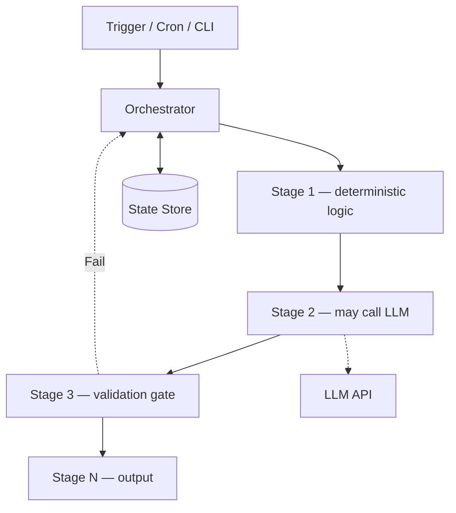

# Pipeline AI Deterministik

## Apa yang Dibangun

Artikel ini mensintesis pola pipeline deterministik yang digunakan di tiga repositori
publik: [shorts-generator](https://github.com/okfriansyah-moh/shorts-generator)
(pipeline video 16 tahap dengan checkpoint SQLite),
[md-ame](https://github.com/okfriansyah-moh/md-ame) (autonomous media engine dengan
state machine RPC PostgreSQL), dan
[skeleton-parallel](https://github.com/okfriansyah-moh/skeleton-parallel) (loop agent
berbasis tugas dengan rollback checkpoint Git). Bersama-sama, ketiganya menunjukkan
cara membangun sistem AI di mana **input sama + config sama = output yang dapat diprediksi
dan dipulihkan**.

## Masalah

Kebanyakan pipeline AI gagal di produksi karena memperlakukan panggilan LLM sebagai
lapisan orkestrasi. Agent memutuskan langkah berikutnya, retry tidak terbatas, dan state
tinggal di memori atau tersebar di file log. Ketika run crash atau operator menjalankan
ulang job, Anda mendapat output duplikat, state parsial yang rusak, atau hasil yang tidak
dapat direproduksi.

## Mengapa Masalah Ini Sulit

1. **Non-determinisme LLM** — output model bervariasi meskipun prompt identik.
2. **Tahap berjalan lama** — transkripsi, rendering, dan panggilan API memakan waktu menit.
3. **Kegagalan parsial** — crash di tahap 12 dari 16 tidak boleh memulai ulang dari tahap 1.
4. **Konkurensi** — beberapa worker mengklaim job yang sama menyebabkan pekerjaan duplikat.
5. **Drift konfigurasi** — override per-akun atau per-dimensi memperbanyak ruang state.

## Model Mental untuk Pemula

Pipeline AI deterministik adalah **resep dengan checklist**, bukan percakapan.
Orchestrator memegang checklist (state store). Setiap langkah menerima input yang
terdefinisi, menghasilkan output yang terdefinisi, dan mencatat penyelesaian sebelum
langkah berikutnya dimulai. Jika dapur kebakaran, Anda membaca checklist dan melanjutkan
pada item pertama yang belum dicentang — Anda tidak memasak ulang dari awal.

## Persyaratan dan Kendala

| Persyaratan | shorts-generator | md-ame | skeleton-parallel |
|-------------|------------------|--------|-------------------|
| State store | SQLite | Supabase PostgreSQL | Git tags + PLAN.md |
| Urutan tahap | 16 tahap tetap | Fase pipeline tetap | Daftar tugas di PLAN.md |
| Idempotensi | video_id content-addressable | idempotency_key SHA-256 | Rollback checkpoint |
| Isolasi modul | Kontrak DTO beku | Transisi DB berbasis RPC | Script quality gate |
| Batas retry | Resume dari tahap terakhir | Cron replay + recovery pass | Maks 5 percobaan per tugas |
| Otoritas orchestrator | Satu proses Python | Cron + global lock | CLI `skeleton run` |

## Gambaran Arsitektur



Orchestrator adalah satu-satunya komponen yang memajukan state. Panggilan LLM adalah
**worker di dalam tahap**, bukan control plane.

## Alur Eksekusi

1. **Trigger** — cron, scheduler, atau perintah CLI memulai run dengan execution ID yang diketahui.
2. **Muat state** — orchestrator membaca state store untuk pekerjaan yang sedang berjalan atau terhenti.
3. **Recovery pass** — identifikasi dan lanjutkan atau gagalkan job yang macet sebelum menghasilkan pekerjaan baru.
4. **Eksekusi tahap** — jalankan setiap tahap secara berurutan; catat penyelesaian di state store.
5. **Tahap LLM** — perlakukan output LLM sebagai data untuk divalidasi, bukan keputusan routing.
6. **Quality gate** — tahap validasi menolak output buruk sebelum menyebar ke downstream.
7. **State terminal** — run berakhir di `completed`, `failed`, atau `rolled_back` — tidak pernah ambigu.

## Komponen Penting

| Pola | Tanggung jawab |
| ---- | -------------- |
| Orchestrator | Urutan tahap, checkpointing, penanganan error |
| State store | Single source of truth untuk progress dan output |
| Kontrak beku | DTO atau skema RPC antar tahap/modul |
| Idempotency keys | Mencegah output duplikat saat retry |
| Quality gate | Memvalidasi output LLM sebelum melanjutkan |
| Recovery pass | Menangani pekerjaan terhenti sebelum generasi baru |

## Contoh Implementasi yang Disederhanakan

Pola checkpoint orchestrator (disederhanakan):

```python
# simplified — resume from last completed stage
last_stage = db.get_last_completed_stage(run_id)
for stage in STAGES[index_of(last_stage) + 1:]:
    output = stage.run(input_dto)
    db.record_stage_complete(run_id, stage.name, output)
```

Insert idempoten (disederhanakan):

```sql
-- simplified — safe rerun
INSERT INTO work_units (idempotency_key, status, payload)
VALUES ($1, 'queued', $2)
ON CONFLICT (idempotency_key) DO NOTHING;
```

## Keandalan dan Idempotensi

- **Di mana state tinggal:** Selalu di store yang tahan lama (SQLite, PostgreSQL, atau Git), tidak pernah hanya di memori proses.
- **Apa yang terjadi saat retry:** Tahap yang selesai dilewati; tahap yang sedang berjalan dilanjutkan atau gagal secara eksplisit.
- **Panggilan LLM:** Di-cache berdasarkan hash konten jika memungkinkan (TTS di shorts-generator, scene cache di md-ame).
- **Konkurensi:** `FOR UPDATE SKIP LOCKED` (md-ame, polymarket) atau orchestrator single-process (shorts-generator) mencegah klaim duplikat.

## Mode Kegagalan

| Kegagalan | Perilaku |
| --------- | -------- |
| Crash di tengah pipeline | Resume dari tahap terakhir yang tercatat |
| LLM mengembalikan output tidak valid | Quality gate menolak; retry terbatas |
| Trigger cron duplikat | Idempotency keys mencegah output duplikat |
| Job in-progress yang macet | Recovery pass mengidentifikasi dan melanjutkan atau gagalkan |
| Perubahan config di tengah run | Run baru mendapat idempotency key baru; run lama selesai atau gagal |

## Trade-off dan Alternatif yang Ditolak

| Pilihan | Alasan | Alternatif yang ditolak |
| ------- | ------ | ----------------------- |
| Tahap dikendalikan orchestrator | Alur dapat diprediksi dan diuji | Agent memutuskan langkah berikutnya secara dinamis |
| State store tahan lama | Pemulihan crash | State in-memory + harapan |
| Retry terbatas | Terminasi yang diketahui | Loop agent tak terbatas |
| Quality gate pada output LLM | Menangkap error sebelum menyebar | Mempercayai output LLM secara membabi buta |
| Idempotency keys | Rerun aman | Hapus-dan-buat ulang saat retry |

## Pengujian

Ketiga repositori sumber menyertakan unit dan integration test. Tahap deterministik
diuji dengan fixture; tahap LLM memakai mock atau respons yang direkam. Quality gate
memiliki test case eksplisit untuk jalur pass/fail/revert.

## Operasi dan Observabilitas

- **shorts-generator:** `pipeline.log` per video; state SQLite dapat di-query; cron scheduler
- **md-ame:** Stdout terstruktur dengan `execution_id`; laporan mingguan Telegram
- **skeleton-parallel:** Git tags sebagai titik rollback; output script quality gate

## Pelajaran yang Dipetik

1. **Pisahkan control plane dari LLM** — orchestrator memutuskan *kapan*; LLM memutuskan
   *teks/kode apa* dalam tahap yang terbatas.
2. **Checkpoint di batas tahap** — resume kasar mengalahkan recovery sub-langkah halus
   untuk sebagian besar pipeline.
3. **Idempotensi bukan opsional** — sistem apa pun yang dapat di-retry harus menghasilkan
   outcome yang sama dengan input state yang sama.
4. **Kekacauan agent adalah design smell** — jika pipeline Anda tidak dapat digambar sebagai
   flowchart, pipeline tersebut belum cukup deterministik untuk produksi.

## Terkait

- [Membangun Pipeline Pemrosesan Video Panjang yang Dapat Dilanjutkan](/docs/systems/shorts-generator-pipeline)
- [MD-AME: Autonomous Media Engine](/docs/systems/md-ame-autonomous-media-engine)
- [Merancang Orchestrator Coding Agentik yang Deterministik](/docs/concepts/deterministic-agentic-orchestrator)
- [State Machine Berbasis Database](/docs/concepts/database-state-machines)

## Sumber

- Repository: [okfriansyah-moh/shorts-generator](https://github.com/okfriansyah-moh/shorts-generator)
- Repository: [okfriansyah-moh/md-ame](https://github.com/okfriansyah-moh/md-ame)
- Repository: [okfriansyah-moh/skeleton-parallel](https://github.com/okfriansyah-moh/skeleton-parallel)
- Pull requests: [shorts-generator#8](https://github.com/okfriansyah-moh/shorts-generator/pull/8), [skeleton-parallel#1](https://github.com/okfriansyah-moh/skeleton-parallel/pull/1)
