# 8 Pola LeetCode yang Wajib Dikuasai


Anda tidak butuh 2.000 trik unik untuk lolos coding interview. Anda butuh sekelompok kecil
**pola yang dipakai ulang** yang muncul terus-menerus. Begitu Anda bisa menamai polanya,
bentuk kodenya biasanya sama: dua indeks yang bergerak di array terurut, window yang
membesar dan menyusut di string, min-heap berukuran `k`, atau queue yang memproses
satu level pohon dalam satu waktu.

Panduan ini mencakup **delapan pola LeetCode**. Untuk setiap pola Anda mendapat:

- **Kapan dipakai** — pemicu yang harus menyala saat Anda membaca soal baru
- **Model mental pemula** — apa yang algoritma lakukan, dalam bahasa biasa
- **Contoh kerja** dengan diagram
- **Soal kanonik** (pertanyaan yang memang diulang pewawancara)
- **Kode disederhanakan** yang bisa diketik dari ingatan
- **Soal latihan** untuk mengunci pola

Katalog Java pendamping ada di
[Katalog Belajar Struktur Data & Algoritma](/docs/projects/data-structure-and-algorithm).
Pakai halaman ini untuk **mengenali** pola; pakai repo itu untuk **menjalankan**
implementasi terkait.

## Apa isi panduan ini

Katalog pola untuk problem-solving interview. Delapan pola ini mencakup sebagian besar
soal array, string, tree, dan graph yang muncul di ronde 45 menit. Catatan belajar asli
di balik halaman ini dipertahankan sebagai aturan **kapan dipakai** — dipoles agar
lebih jelas, tetapi dengan maksud yang sama.

## Masalah

Menyelesaikan LeetCode satu soal per waktu terasa produktif sampai Anda kena prompt
baru dan mulai dari nol. Pertanyaannya jarang “sudah pernah lihat input persis ini?”
Melainkan “ini termasuk **keluarga** yang mana?”

Tanpa nama keluarga, Anda brute-force nested loop, lalu kehabisan waktu. Dengan nama
keluarga, Anda sudah tahu struktur datanya (dua indeks, queue, heap ukuran `k`) dan
hanya perlu mengisi kondisinya.

## Mengapa ini sulit

1. **Prompt menyembunyikan pola.** “Longest substring with at most `k` distinct
   characters” tidak pernah menulis “sliding window.”
2. **Dua pola bisa terlihat mirip.** DFS dan BFS sama-sama mengunjungi setiap node.
   Two Pointer dan Sliding Window sama-sama memakai dua indeks. _Soalnya_ yang
   memutuskan mana yang dipakai.
3. **Edge case adalah ujian sebenarnya.** Duplikat, array yang dirotasi, cycle di
   graph, tree kosong — polanya tetap, tetapi kondisinya berubah.
4. **Interview menghargai kecepatan pengenalan.** Anda punya menit, bukan jam, untuk
   memilih arah.

## Model mental pemula

Anggap pola sebagai **perkakas di sabuk**, bukan 2.000 resep terpisah:

| Kalau prompt bunyinya…                                     | Ambil…                 |
| ---------------------------------------------------------- | ---------------------- |
| Dua indeks di array **terurut**, satu pass                 | Two Pointer            |
| Kunjungi tree **level demi level**                         | Binary Tree BFS        |
| Tugas dengan **prasyarat**, tanpa loop                     | Topological Sort       |
| Jalan di tree **satu cabang dalam satu waktu**             | Binary Tree DFS        |
| **Peringkat teratas** `k` item di list                     | Top K Elements (heap)  |
| Ruang pencarian yang **terurut tapi dirotasi / berisik**   | Modified Binary Search |
| **Semua kombinasi / susunan** dari sebuah himpunan         | Subset                 |
| **Substring / subarray** yang harus memenuhi suatu kondisi | Sliding Window         |

Sisa halaman ini adalah tabel itu, diperluas, dengan gambar dan soal.

## 8 pola dalam satu pandang

| #   | Pola                   | Struktur data inti               | Keluaran tipikal                          |
| --- | ---------------------- | -------------------------------- | ----------------------------------------- |
| 1   | Two Pointer            | Dua indeks di array terurut      | Pasangan, triplet, atau rewrite in-place  |
| 2   | Binary Tree BFS        | Queue                            | Nilai dikelompokkan per level             |
| 3   | Topological Sort       | Graph + indegree / state DFS     | Urutan valid, atau “mustahil”             |
| 4   | Binary Tree DFS        | Rekursi (call stack)             | Depth, path, atau ya/tidak di satu cabang |
| 5   | Top K Elements         | Heap berukuran `k`               | Elemen ke-k terbesar, atau k terbesar     |
| 6   | Modified Binary Search | Lo / hi di search space          | Indeks, batas, atau minimum               |
| 7   | Subset                 | Rekursi + pilih / lewati         | Semua kombinasi atau susunan              |
| 8   | Sliding Window         | Left / right di list atau string | Window valid terpendek atau terpanjang    |

---

## Pola 1 — Two Pointer

### Kapan dipakai

Pakai Two Pointer ketika Anda perlu **mengiterasi array yang sudah terurut**. Mengambil
petunjuk dari namanya sendiri, kita akan memakai **2 pointer** dalam pola ini. Setiap
pointer mencatat sebuah indeks di array. Dengan menggerakkan pointer ini secara cerdas,
kita sering bisa menyelesaikan soal dalam **satu pass**, sehingga algoritmanya lebih
efisien.

Itu seluruh idenya: dua jari yang bergerak, bukan nested `for` loop.


Di diagram, Pointer 1 duduk di `1` dan Pointer 2 duduk di `7` pada
`[1, 3, 4, 7, 8]`. Anda membandingkan (atau menjumlahkan) kedua nilai, lalu
menggerakkan **satu** pointer. Anda tidak pernah mengulang dari kiri di setiap langkah
— itulah yang membuatnya `O(n)` setelah sorting.

### Model mental pemula

Bayangkan kamus yang sudah terurut A→Z. Anda ingin dua kata yang nomor halamannya
berjumlah suatu target. Satu jari mulai di halaman pertama, yang lain di halaman
terakhir. Jika jumlahnya terlalu kecil, geser jari kiri ke kanan. Jika terlalu besar,
geser jari kanan ke kiri. Anda bertemu di tengah setelah satu pass.

### Cara kerja

1. **Sort** jika input belum terurut (beberapa soal sudah terurut).
2. Taruh `left` di indeks `0` dan `right` di indeks `n - 1`.
3. Selama `left < right`:
   - Jika pasangan (atau jumlahnya) **cocok** dengan target, selesai (atau catat,
     lalu lewati duplikat).
   - Jika hasilnya **terlalu kecil**, `left += 1`.
   - Jika hasilnya **terlalu besar**, `right -= 1`.
4. Berhenti ketika pointer bersilangan.

Dua rasa lain memakai dua indeks yang sama, dengan aturan gerak berbeda:

- **Arah sama** (26. Remove Duplicates): `slow` menulis nilai unik berikutnya, `fast` membaca di depan
- **Tinggi / luas** (11. Container With Most Water): gerakkan pointer di dinding yang **lebih pendek**

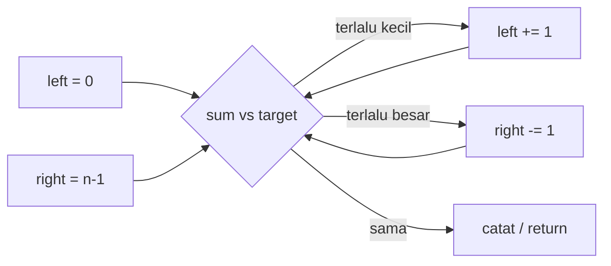

### Soal: Two Sum II — Input Array Is Sorted

Ini soal Two Pointer yang paling bersih. Array **sudah terurut**, Anda harus memakai
**constant extra space**, dan tepat ada satu solusi.

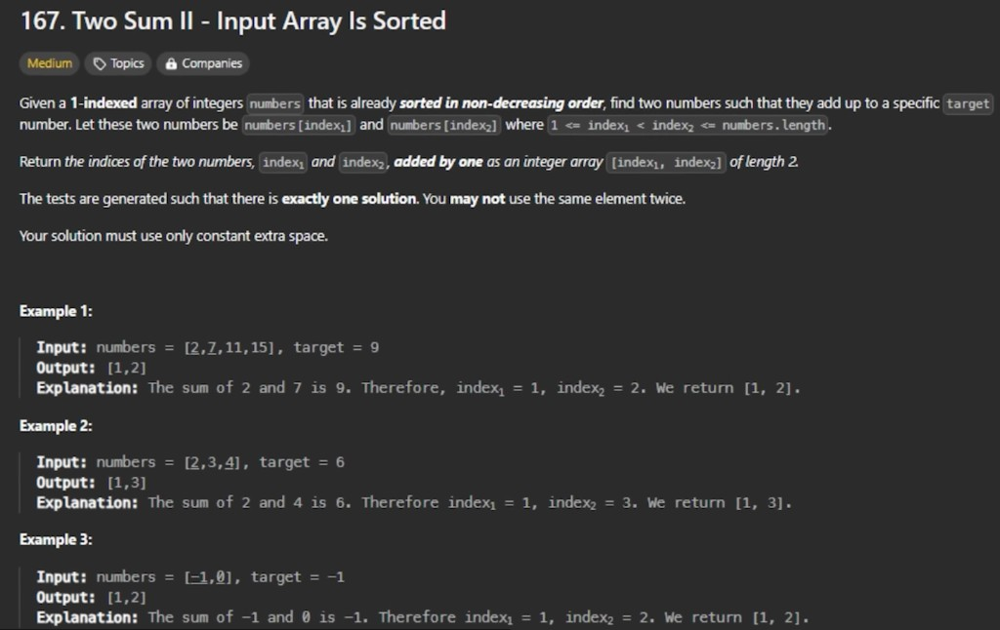

**Prompt (maksud yang sama dengan soalnya):** diberikan array 1-indexed `numbers`
yang sudah terurut non-decreasing, cari dua angka yang jumlahnya `target`. Kembalikan
indeks **berbasis 1**. Anda tidak boleh memakai elemen yang sama dua kali.

| Contoh | Input                                    | Output   | Alasan        |
| ------ | ---------------------------------------- | -------- | ------------- |
| 1      | `numbers = [2, 7, 11, 15]`, `target = 9` | `[1, 2]` | `2 + 7 = 9`   |
| 2      | `numbers = [2, 3, 4]`, `target = 6`      | `[1, 3]` | `2 + 4 = 6`   |
| 3      | `numbers = [-1, 0]`, `target = -1`       | `[1, 2]` | `-1 + 0 = -1` |

Hash map juga bisa menemukan pasangan itu, tetapi memakai extra space `O(n)`. Prompt
melarang itu. Two Pointer adalah pola yang tetap di extra space `O(1)`.

### Contoh kerja: target = 18


Jalan di `[2, 7, 11, 15]` dengan `target = 18`:

1. `left` di `2`, `right` di `15`. Jumlah = `17` — terlalu kecil, geser `left`.
2. `left` di `7`, `right` di `15`. Jumlah = `22` — terlalu besar, geser `right`.
3. `left` di `7`, `right` di `11`. Jumlah = `18` — cocok.

Kembalikan indeks berbasis 1 `[2, 3]`.

### Kode disederhanakan

```python
def two_sum_sorted(numbers: list[int], target: int) -> list[int]:
    left, right = 0, len(numbers) - 1
    while left < right:
        total = numbers[left] + numbers[right]
        if total == target:
            return [left + 1, right + 1]  # 1-based
        if total < target:
            left += 1
        else:
            right -= 1
    return []
```

Waktu `O(n)`. Extra space `O(1)`.

### Soal: 3Sum

Two Pointer juga bisa dinaikkan ke **triplet**. Anda mengunci satu angka, lalu
menjalankan Two Sum di sisa array yang sudah terurut. Aturan tambahannya: **jangan
mengembalikan triplet duplikat**.


**Prompt (maksud yang sama):** diberikan `nums`, kembalikan semua triplet
`[nums[i], nums[j], nums[k]]` sedemikian rupa sehingga `i`, `j`, dan `k` adalah
indeks berbeda dan ketiga nilai jumlahnya `0`. Himpunan solusi tidak boleh berisi
triplet duplikat.

| Contoh | Input                   | Output                      |
| ------ | ----------------------- | --------------------------- |
| 1      | `[-1, 0, 1, 2, -1, -4]` | `[[-1, -1, 2], [-1, 0, 1]]` |
| 2      | `[0, 1, 1]`             | `[]`                        |
| 3      | `[0, 0, 0]`             | `[[0, 0, 0]]`               |

Mengapa sort dulu? Setelah `[-4, -1, -1, 0, 1, 2]`, Anda bisa melewati nilai ketika
nilainya sama dengan yang sebelumnya. Begitulah cara membunuh triplet duplikat tanpa
set of tuples.

```python
def three_sum(nums: list[int]) -> list[list[int]]:
    nums.sort()
    result: list[list[int]] = []
    for i in range(len(nums)):
        if i > 0 and nums[i] == nums[i - 1]:
            continue  # skip duplicate anchors
        left, right = i + 1, len(nums) - 1
        while left < right:
            total = nums[i] + nums[left] + nums[right]
            if total == 0:
                result.append([nums[i], nums[left], nums[right]])
                left += 1
                right -= 1
                while left < right and nums[left] == nums[left - 1]:
                    left += 1
                while left < right and nums[right] == nums[right + 1]:
                    right -= 1
            elif total < 0:
                left += 1
            else:
                right -= 1
    return result
```

### Soal latihan

| Soal                                                                                                          | Yang harus diperhatikan                               |
| ------------------------------------------------------------------------------------------------------------- | ----------------------------------------------------- |
| [167. Two Sum II](https://leetcode.com/problems/two-sum-ii-input-array-is-sorted/)                            | Terurut + space `O(1)` → Two Pointer, bukan hash map  |
| [15. 3Sum](https://leetcode.com/problems/3sum/)                                                               | Sort, lalu Two Pointer di dalam loop; lewati duplikat |
| [11. Container With Most Water](https://leetcode.com/problems/container-with-most-water/)                     | Gerakkan pointer di dinding yang **lebih pendek**     |
| [26. Remove Duplicates from Sorted Array](https://leetcode.com/problems/remove-duplicates-from-sorted-array/) | Pointer lambat menulis, pointer cepat membaca         |

### Kesalahan umum

- Memakai Two Pointer di array **belum terurut** tanpa sorting dulu (kecuali prompt
  adalah linked-list / in-place partition, yang merupakan rasa berbeda).
- Lupa bahwa Two Sum II mengembalikan indeks **berbasis 1**.
- Di 3Sum, hanya melewati duplikat di satu sisi, sehingga `[-1, -1, 2]` hilang atau
  terulang.

---

## Pola 2 — Binary Tree BFS

### Kapan dipakai

Perbedaan DFS dan BFS: **DFS masuk dalam**, mulai dari sisi kiri dulu, dan
menyelesaikan semua node yang lebih dalam di cabang itu. **BFS maju satu per satu
di level yang sama**, di cabang yang berbeda dulu.

Untuk BFS kita butuh **queue**. Dengan cara ini, elemen di level yang sama pada
tree akan selalu tetap bersebelahan di queue. Dengan begitu kita bisa memprosesnya
satu demi satu. Soalnya biasanya disebut **level order traversal** dari binary tree.

### Model mental pemula

DFS adalah orang yang menyusuri satu koridor sampai ujung, lalu mundur. BFS adalah
petugas pemadam yang menyemprot **setiap pintu di lantai ini** sebelum naik tangga.
Queue adalah antrean pintu di lantai saat ini.

### Cara kerja

1. Masukkan root ke queue.
2. Selama queue tidak kosong:
   - Baca `size = queue.length` — itu **lebar level ini**.
   - Pop `size` node, kumpulkan nilainya, dan enqueue anak-anaknya.
3. Setiap loop dalam adalah satu level. Tambahkan list level itu ke jawaban.

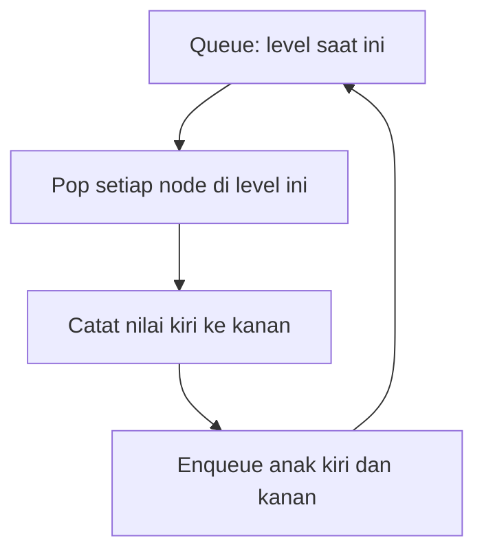

### Soal: Binary Tree Level Order Traversal

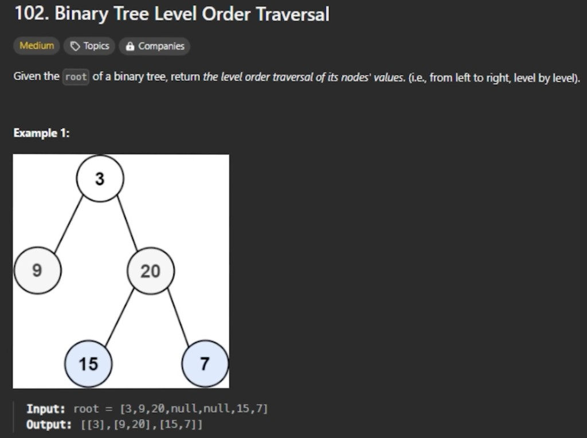

**Prompt (maksud yang sama):** diberikan `root` dari binary tree, kembalikan level
order traversal nilai node-nya — dari kiri ke kanan, level demi level.

**Input:** `root = [3, 9, 20, null, null, 15, 7]`  
**Output:** `[[3], [9, 20], [15, 7]]`

| Level | Node di queue (kiri ke kanan) | Terkumpul |
| ----- | ----------------------------- | --------- |
| 0     | `3`                           | `[3]`     |
| 1     | `9`, `20`                     | `[9, 20]` |
| 2     | `15`, `7`                     | `[15, 7]` |

Daun yang disorot `15` dan `7` duduk di level yang sama meski bergantung pada parent
berbeda. Queue-lah yang membuat mereka tetangga.

### Kode disederhanakan

```python
from collections import deque

def level_order(root) -> list[list[int]]:
    if not root:
        return []
    result = []
    queue = deque([root])
    while queue:
        level = []
        for _ in range(len(queue)):
            node = queue.popleft()
            level.append(node.val)
            if node.left:
                queue.append(node.left)
            if node.right:
                queue.append(node.right)
        result.append(level)
    return result
```

Waktu `O(n)`. Extra space `O(w)` di mana `w` adalah level terlebar.

Loop queue yang sama menyelesaikan “zigzag level order,” “right side view,” dan
“minimum depth” — Anda hanya mengubah **apa yang dicatat** per level, bukan
traversalnya.

### Soal latihan

| Soal                                                                                                             | Yang harus diperhatikan                                 |
| ---------------------------------------------------------------------------------------------------------------- | ------------------------------------------------------- |
| [102. Binary Tree Level Order Traversal](https://leetcode.com/problems/binary-tree-level-order-traversal/)       | Template di atas                                        |
| [107. Binary Tree Level Order Traversal II](https://leetcode.com/problems/binary-tree-level-order-traversal-ii/) | BFS yang sama, balik list of levels                     |
| [199. Binary Tree Right Side View](https://leetcode.com/problems/binary-tree-right-side-view/)                   | Node terakhir di setiap level                           |
| [111. Minimum Depth of Binary Tree](https://leetcode.com/problems/minimum-depth-of-binary-tree/)                 | Berhenti di daun pertama — BFS menemukannya paling awal |

### Kesalahan umum

- Memakai stack, bukan queue (itu jadi DFS).
- Lupa mengambil snapshot `len(queue)` sebelum loop dalam, sehingga anak dari level
  ini bocor ke list level ini.
- Mengembalikan list datar `[3, 9, 20, 15, 7]` padahal prompt ingin level yang
  **dikelompokkan**.

---

## Pola 3 — Topological Sort

### Kapan dipakai

Pakai Topological Sort untuk **menyusun elemen dalam urutan tertentu ketika mereka
saling bergantung**. Ini sangat berguna untuk **directed acyclic graph** (DAG).
Pakai kapan pun node-node graph punya **koneksi satu arah** dan **tidak ada cycle
/ loop**.

Pikirkan DAG ketika Anda punya **rantai prasyarat**. Bayangkan kita sedang
membangun program yang kompleks: sebagian kode mungkin bergantung pada modul lain
yang harus ditulis dan diuji dulu, dan modul-modul itu bisa bergantung lagi pada
modul lain. Topological sort membantu mencari urutan menulis modul dengan
menganalisis dependensi. Ia membuat sekuens di mana **setiap modul diproses hanya
setelah semua prasyaratnya selesai**.


Dua fakta yang mendefinisikan graph:

1. **Koneksi satu arah** — setiap sisi adalah panah, bukan garis tak berarah.
2. **Tidak ada cycle / loop** — mengikuti panah tidak pernah mengembalikan Anda ke
   node yang sudah ditinggalkan.

Urutan `[1, 3, 5, 4]` adalah satu perataan yang valid: `1` sebelum `3` dan `5`,
dan `3` serta `5` sebelum `4`. `[1, 5, 3, 4]` juga valid. Jika ada cycle,
**tidak ada** urutan yang valid.

### Model mental pemula

Pendaftaran kuliah: Anda tidak bisa mengambil _Compilers_ sebelum _Data
Structures_, dan tidak bisa mengambil _Data Structures_ sebelum _Intro to
Programming_. Topological sort mencetak rencana semester. Jika dua mata kuliah
saling mensyaratkan, rencananya mustahil — itu cycle.

### Cara kerja (algoritma Kahn)

1. Bangun adjacency list dan hitungan **indegree** (berapa prasyarat yang masih
   dibutuhkan setiap node).
2. Masukkan setiap node dengan indegree `0` ke queue (tidak ada prasyarat tersisa).
3. Pop sebuah node, tambahkan ke urutan, dan kurangi indegree tetangganya.
4. Tetangga mana pun yang indegreenya menjadi `0` masuk queue.
5. Jika Anda menyelesaikan lebih sedikit node daripada `numCourses`, ada **cycle**.

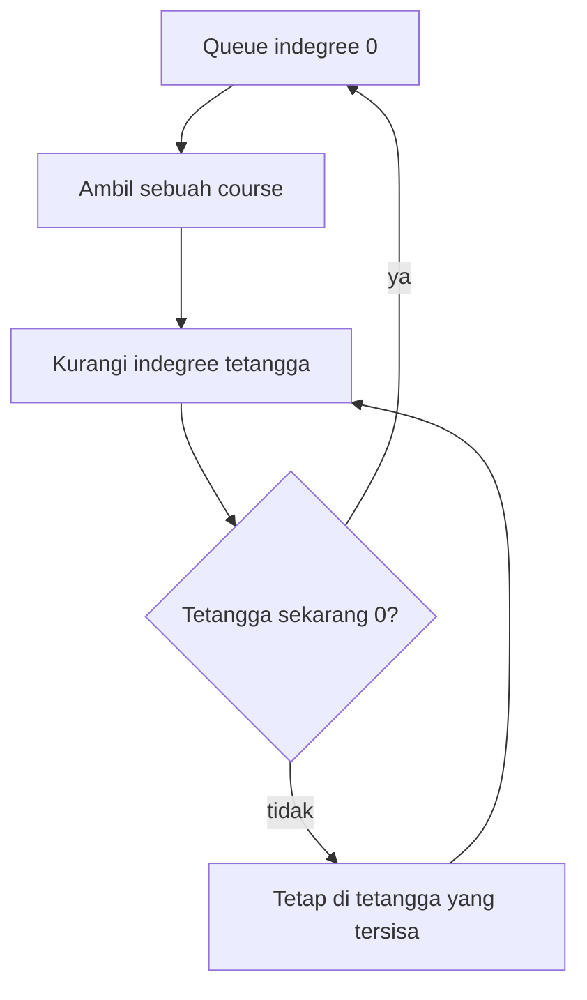

### Soal: Course Schedule

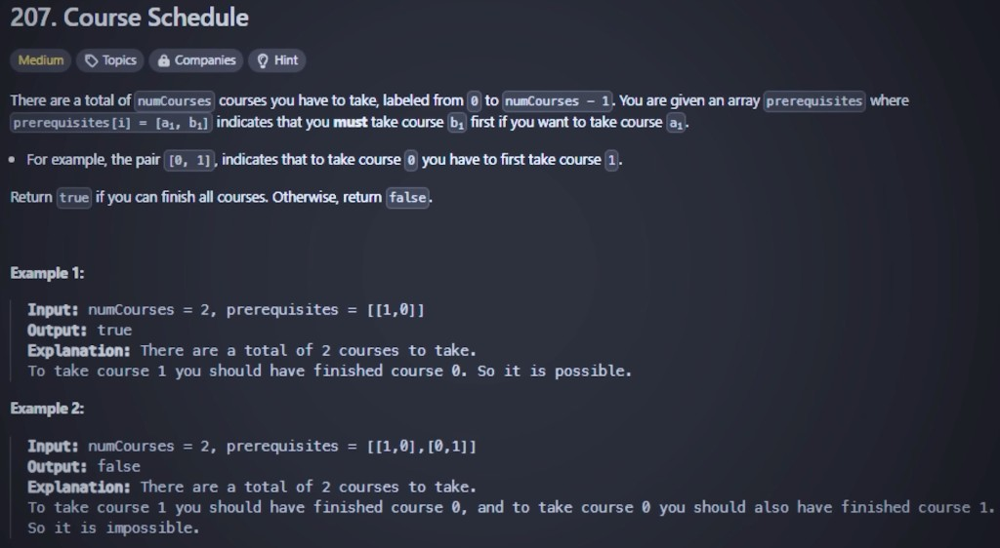

**Prompt (maksud yang sama):** ada `numCourses` mata kuliah berlabel `0` sampai
`numCourses - 1`. `prerequisites[i] = [ai, bi]` berarti Anda **harus** mengambil
`bi` sebelum `ai`. Kembalikan `true` jika semua mata kuliah bisa diselesaikan,
selain itu `false`.

| Contoh | Input                                                | Output  | Alasan                                  |
| ------ | ---------------------------------------------------- | ------- | --------------------------------------- |
| 1      | `numCourses = 2`, `prerequisites = [[1, 0]]`         | `true`  | Ambil `0`, lalu `1`                     |
| 2      | `numCourses = 2`, `prerequisites = [[1, 0], [0, 1]]` | `false` | Cycle: masing-masing menunggu yang lain |

Contoh 2 adalah kasus “dua modul yang saling membutuhkan” dari model mental.
Topological sort adalah cara **mendeteksi** kemustahilan itu, bukan hanya cara
mencetak urutan.

### Kode disederhanakan

```python
from collections import deque, defaultdict

def can_finish(num_courses: int, prerequisites: list[list[int]]) -> bool:
    graph: dict[int, list[int]] = defaultdict(list)
    indegree = [0] * num_courses
    for course, pre in prerequisites:
        graph[pre].append(course)
        indegree[course] += 1

    queue = deque([i for i in range(num_courses) if indegree[i] == 0])
    taken = 0
    while queue:
        node = queue.popleft()
        taken += 1
        for nxt in graph[node]:
            indegree[nxt] -= 1
            if indegree[nxt] == 0:
                queue.append(nxt)
    return taken == num_courses
```

Jika Anda butuh urutan sebenarnya (Course Schedule II), append `node` ke list
alih-alih hanya menghitung `taken`.

### Soal latihan

| Soal                                                                         | Yang harus diperhatikan                              |
| ---------------------------------------------------------------------------- | ---------------------------------------------------- |
| [207. Course Schedule](https://leetcode.com/problems/course-schedule/)       | Deteksi cycle = “bisakah selesai?”                   |
| [210. Course Schedule II](https://leetcode.com/problems/course-schedule-ii/) | Kembalikan satu urutan valid, atau `[]`              |
| [269. Alien Dictionary](https://leetcode.com/problems/alien-dictionary/)     | Huruf sebagai node, “sebelum” sebagai edge (premium) |

### Kesalahan umum

- Membalik edge: `[ai, bi]` berarti `bi → ai` (ambil `bi` dulu), bukan sebaliknya.
- Mengembalikan `true` begitu queue kosong, tanpa cek `taken == numCourses`. Node
  terisolasi valid; indegree yang tersisa tidak.
- Memakai pola ini di graph **tak berarah**, atau di graph yang boleh punya cycle
  tanpa bertanya “apakah mungkin?”

---

## Pola 4 — Binary Tree DFS

### Kapan dipakai

Binary Tree DFS membantu Anda **mengunjungi setiap node di tree**, dengan fokus
pada **satu cabang dalam satu waktu**. Kita memakai **rekursi** untuk ini.

Ia mulai dari sisi kiri dulu sampai tidak ada child node. Setelah selesai di bagian
paling kiri, ia **backtrack** dan cek apakah ada right node. Jika ada, rekursi
diterapkan lagi: dari right node itu, cari left node dulu. Dengan cara ini, kita
menjelajahi seluruh tree.


Node bernomor `1 → 2 → 3 → 4 → 5 → 6 → 7` adalah kunjungan **pre-order**: parent
sebelum children, cabang kiri sebelum kanan. Rekursi adalah mesinnya; call stack
adalah “backtrack.”

### Model mental pemula

Labirin dengan satu senter. Anda selalu mengambil koridor kiri sampai menabrak
dinding, lalu berjalan kembali ke persimpangan terakhir dan mencoba koridor kanan.
Anda tidak meloncat ke lantai lain seperti BFS.

### Cara kerja

DFS di binary tree adalah tiga baris plus base case:

```text
dfs(node):
    if node is null: return <identity>
    left  = dfs(node.left)
    right = dfs(node.right)
    return combine(node, left, right)
```

Di mana Anda menaruh `combine` menentukan rasanya:

| Rasa       | Kapan node diproses        | Soal tipikal                             |
| ---------- | -------------------------- | ---------------------------------------- |
| Pre-order  | Sebelum panggilan rekursif | Serialize, copy, “cetak path sejauh ini” |
| In-order   | Di antara kiri dan kanan   | Urutan terurut BST                       |
| Post-order | Setelah kedua anak kembali | Depth, diameter, “tinggi subtree ini”    |

Maximum depth adalah **post-order**: Anda tidak bisa tahu depth node ini sampai
kedua subtree melaporkan miliknya.

### Soal: Maximum Depth of Binary Tree

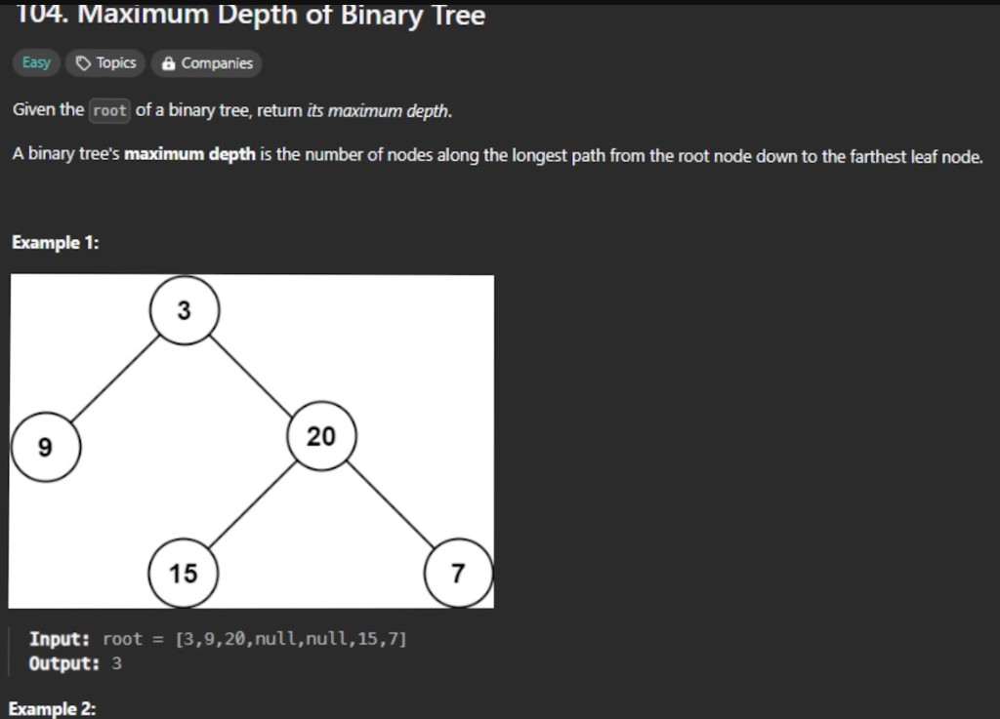

**Prompt (maksud yang sama):** diberikan `root` dari binary tree, kembalikan
maximum depth-nya. Maximum depth adalah jumlah node di sepanjang path terpanjang
dari root ke daun terjauh.

**Input:** `root = [3, 9, 20, null, null, 15, 7]`  
**Output:** `3`


Path `3 → 20 → 15` dan `3 → 20 → 7` keduanya punya 3 node. Node `9` adalah daun di
depth 2, jadi ia tidak menang. Rekursi mengembalikan `1 + max(left, right)` di
setiap node; di root nilainya `3`.

### Kode disederhanakan

```python
def max_depth(root) -> int:
    if not root:
        return 0
    return 1 + max(max_depth(root.left), max_depth(root.right))
```

Waktu `O(n)`. Extra space `O(h)` untuk call stack (`h` = tinggi).

Kerangka yang sama menjadi Path Sum (`need remaining == 0` di daun), Invert Binary
Tree (tukar, lalu rekursi), dan Diameter (`left_height + right_height` sebagai
efek samping).

### Soal latihan

| Soal                                                                                             | Yang harus diperhatikan              |
| ------------------------------------------------------------------------------------------------ | ------------------------------------ |
| [104. Maximum Depth of Binary Tree](https://leetcode.com/problems/maximum-depth-of-binary-tree/) | Tinggi post-order                    |
| [112. Path Sum](https://leetcode.com/problems/path-sum/)                                         | Bawa running total turun satu cabang |
| [226. Invert Binary Tree](https://leetcode.com/problems/invert-binary-tree/)                     | Tukar children, rekursi              |
| [543. Diameter of Binary Tree](https://leetcode.com/problems/diameter-of-binary-tree/)           | Depth kedua anak, plus max global    |

### Kesalahan umum

- Mengembalikan `1` untuk node `null` (depth kosong adalah `0`).
- Mencampur “hitungan level” BFS dengan “tinggi subtree” DFS tanpa jelas mana yang
  diinginkan. Keduanya bisa menyelesaikan max depth; interview sering mengharapkan
  one-liner rekursif untuk 104.
- Lupa bahwa “ada right node atau tidak” adalah langkah **backtrack** — jika Anda
  tidak return dari panggilan kiri, Anda tidak pernah mengunjungi anak kanan.

---

## Pola 5 — Top K Elements

### Kapan dipakai

Pakai Top K ketika Anda perlu menemukan **elemen berperingkat teratas** dari
sebuah dataset. Input biasanya **array atau list**.

Untuk menyelesaikan soal ini, Anda perlu **mencatat `k` angka paling penting yang
sudah Anda lihat sejauh ini**. Karena yang Anda pedulikan adalah K elemen terbesar,
K elemen terbesar yang sudah Anda lihat sejauh ini yang penting. Struktur datanya
disebut **heap**.

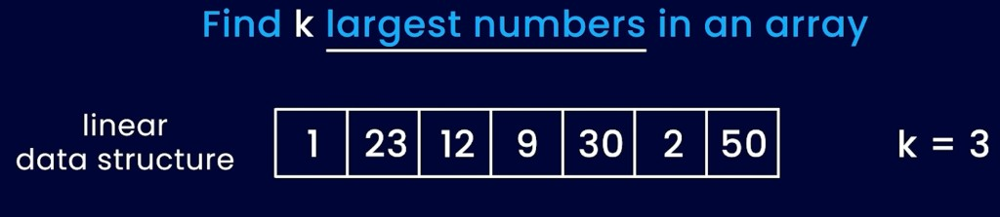

Untuk `[1, 23, 12, 9, 30, 2, 50]` dan `k = 3`, himpunan elit adalah `{50, 30, 23}`.
Di min-heap berukuran 3, root-nya `23`, ke-3 terbesar.

### Model mental pemula

Papan skor yang hanya punya `k` slot. Pemain **terburuk** yang sedang di papan
duduk di puncak min-heap. Pemain baru menendangnya keluar hanya jika ia lebih baik
dari pemain terburuk itu. Di akhir, pemain terburuk yang masih di papan adalah
**ke-k terbesar** secara keseluruhan.

Itulah mengapa kita memakai **min-heap berukuran `k`** untuk mencari nilai
**terbesar**: root adalah yang terkecil dari grup elit — persis ke-k terbesar.

### Cara kerja

1. Push `k` angka pertama ke min-heap.
2. Untuk setiap angka `x` yang tersisa:
   - Jika `x` lebih besar dari root, pop root dan push `x`.
   - Selain itu abaikan `x` — ia tidak bisa bergabung ke top `k`.
3. Root adalah ke-k terbesar.

Waktu `O(n log k)`, yang mengalahkan full sort `O(n log n)` ketika `k` jauh lebih
kecil dari `n`. Follow-up di soal klasik: **bisakah Anda menyelesaikannya tanpa
sorting?** Heap (atau Quickselect) adalah jawabannya.

### Soal: Kth Largest Element in an Array

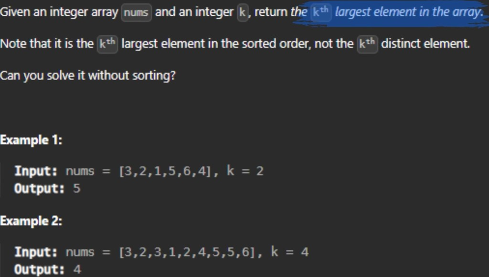

**Prompt (maksud yang sama):** diberikan array integer `nums` dan integer `k`,
kembalikan elemen ke-k terbesar di array. Ini adalah ke-k terbesar dalam **urutan
terurut**, bukan elemen ke-k yang distinct.

| Contoh | Input                                         | Output | Terurut menurun      |
| ------ | --------------------------------------------- | ------ | -------------------- |
| 1      | `nums = [3, 2, 1, 5, 6, 4]`, `k = 2`          | `5`    | `[6, 5, 4, 3, 2, 1]` |
| 2      | `nums = [3, 2, 3, 1, 2, 4, 5, 5, 6]`, `k = 4` | `4`    | `[6, 5, 5, 4, …]`    |

Duplikat dihitung. Di contoh 2, kedua `5` adalah “terbesar,” jadi slot ke-4 adalah
`4`.

### Contoh kerja: k = 3 pada `[3, 2, 1, 5, 6, 4]`

**Mulai.** Heap kosong. Kita hanya menyimpan 3 angka. Array masih `[3, 2, 1, 5, 6, 4]`.


**Setelah mengonsumsi `3, 2, 1`.** Sisa `5, 6, 4`. Min-heap `{1, 3, 2}` dengan `1`
di root: yang terkecil dari grup elit sejauh ini.

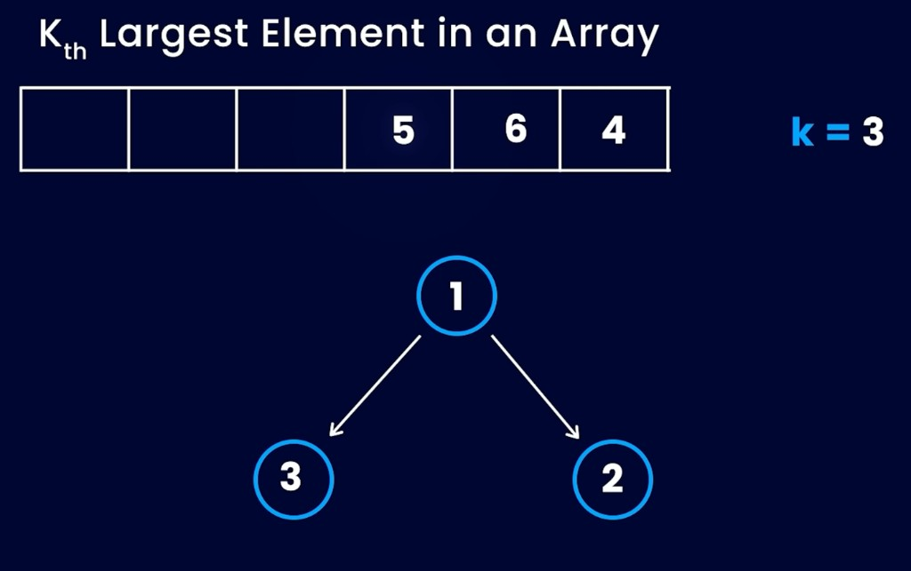

**Setelah mengonsumsi `5` dan `6`.** `1` dan `2` dikeluarkan. Heap `{3, 6, 5}`
dengan `3` di root. Strip array mungkin masih menampilkan nilai yang dibuang;
percayai node heap-nya.

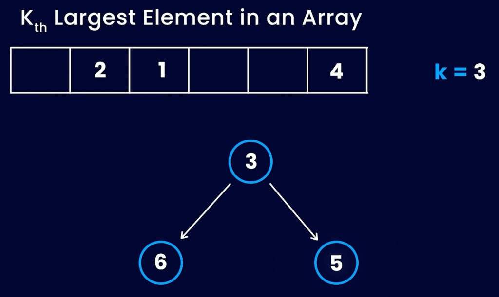

**Setelah `4`:** `4 > 3`, jadi `3` di-pop dan `4` di-push. Heap `{4, 6, 5}`.
Root `4` adalah ke-3 terbesar. Nilai yang dibuang `3, 2, 1` tidak masuk lagi.


**Jawaban = 4.**

### Kode disederhanakan

```python
import heapq

def find_kth_largest(nums: list[int], k: int) -> int:
    heap: list[int] = []
    for x in nums:
        heapq.heappush(heap, x)
        if len(heap) > k:
            heapq.heappop(heap)  # drop the smallest of the elite
    return heap[0]
```

`heapq` Python adalah min-heap, yang persis diinginkan pola ini untuk “k terbesar.”

### Soal latihan

| Soal                                                                                                   | Yang harus diperhatikan               |
| ------------------------------------------------------------------------------------------------------ | ------------------------------------- |
| [215. Kth Largest Element in an Array](https://leetcode.com/problems/kth-largest-element-in-an-array/) | Min-heap ukuran `k`, atau Quickselect |
| [347. Top K Frequent Elements](https://leetcode.com/problems/top-k-frequent-elements/)                 | Heap `(frequency, value)`             |
| [703. Kth Largest Element in a Stream](https://leetcode.com/problems/kth-largest-element-in-a-stream/) | Heap yang sama, hidup lintas `add`    |
| [973. K Closest Points to Origin](https://leetcode.com/problems/k-closest-points-to-origin/)           | Heap berdasarkan jarak, ukuran `k`    |

### Kesalahan umum

- Memakai **max-heap** berukuran `k` untuk ke-k **terbesar** (Anda ingin yang
  _terkecil_ dari yang besar di root).
- Menganggap “ke-k terbesar” sebagai “ke-k **distinct**.” Catatan di 215 mengatakan
  sebaliknya.
- Mengurutkan seluruh array ketika `k` kecil — itu jalan, tetapi mengabaikan
  follow-up.

---

## Pola 6 — Modified Binary Search

### Kapan dipakai

Ide intinya adalah **membagi search space menjadi dua berulang-ulang**.

Binary search klasik butuh array yang sepenuhnya terurut dan sebuah target.
**Modified** binary search mempertahankan ide “potong jadi dua” ketika search space
masih terurut _dengan cara tertentu_: dirotasi, punya duplikat, atau Anda mencari
di **rentang jawaban** (kapasitas minimum, first true / last false) alih-alih di
indeks array.

Jika Anda ingin memahaminya betul-betul, **implementasikan dalam bahasa lain yang
Anda pilih** logika `bisect` Python. Lalu Anda akan paham modified binary search.


`bisect_left` dan `bisect_right` adalah versi industri dari “lo / hi / mid.” Mereka
tidak peduli array Anda list angka — mereka peduli predikat “apakah slot ini masih
terlalu kecil?” berbalik dari false ke true **sekali**. Satu balik itu alasan
halving bekerja.

### Model mental pemula

Anda menebak angka dari 1 sampai 100. Setiap tebakan, orang lain bilang “lebih
tinggi” atau “lebih rendah.” Anda membuang setengah sisa rentang. Modified binary
search adalah permainan yang sama di rentang **dirotasi** atau **berisik**: Anda
dulu bertanya “setengah mana yang masih terurut / masih valid?” baru membuang
setengah yang lain.

### Cara kerja: potong ruang jadi dua

Loop yang belum dimodifikasi sudah mengerjakan tugas asli: **membagi search space
menjadi dua berulang-ulang**. Dua kotak di bawah adalah sisa rentang, dipotong di
`mid`.


Loop klasik `lo` / `hi` / `mid` terlihat seperti ini. Duplikat dan target yang
hilang hanya mengubah cara pointer bergerak, bukan ide membagi dua.

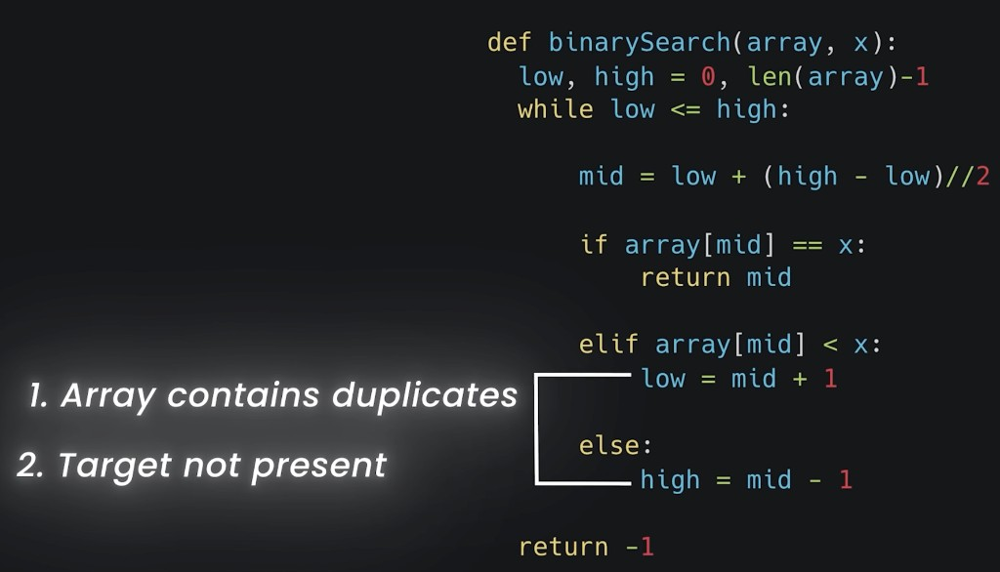

Jika Anda butuh duplikat **pertama** atau **terakhir**, jangan return pada
`array[mid] == x`. Pakai `bisect_left` / `bisect_right` (indeks pertama tempat `x`
bisa masuk, dan indeks pertama setelah `x` yang sudah ada). Jika target hilang,
`lo` dan `hi` bersilangan dan Anda return `-1`.

### Soal: Search in Rotated Sorted Array

Array terurut yang dirotasi adalah dua run terurut yang dilem:
`[4, 5, 6, 7, 0, 1, 2]`. Salah satu dari dua setengah di sekitar `mid` selalu
terurut. Cek setengah mana yang terurut, lalu tanya apakah target tinggal di
setengah itu.

| Contoh | Input                                        | Output |
| ------ | -------------------------------------------- | ------ |
| 1      | `nums = [4, 5, 6, 7, 0, 1, 2]`, `target = 0` | `4`    |
| 2      | `nums = [4, 5, 6, 7, 0, 1, 2]`, `target = 3` | `-1`   |

**Jejak untuk target `0`:**

1. `lo = 0`, `hi = 6`, `mid = 3`, `nums[mid] = 7`
2. Setengah kiri `[4, 5, 6, 7]` terurut. `0` tidak di `[4, 7)`, jadi cari kanan:
   `lo = 4`
3. `lo = 4`, `hi = 6`, `mid = 5`, `nums[mid] = 1`
4. Setengah kiri `[0, 1]` terurut (`nums[4] = 0 <= 1`). `0` ada di `[0, 1)`, jadi
   cari kiri: `hi = 4`
5. `lo = hi = 4`, `nums[4] = 0`. Return `4`

Cuplikan `search_rotated` di bawah adalah **LeetCode 33 (nilai distinct)**. Jika
`nums[lo] == nums[mid] == nums[hi]` (LeetCode 81), Anda tidak bisa tahu setengah
mana yang terurut: susutkan kedua ujung satu langkah lalu lanjut.

```python
# extra shrink for rotated arrays with duplicates (LeetCode 81)
if nums[lo] == nums[mid] == nums[hi]:
    lo += 1
    hi -= 1
    continue
```

```python
def search_rotated(nums: list[int], target: int) -> int:
    lo, hi = 0, len(nums) - 1
    while lo <= hi:
        mid = (lo + hi) // 2
        if nums[mid] == target:
            return mid
        if nums[lo] <= nums[mid]:  # left half sorted
            if nums[lo] <= target < nums[mid]:
                hi = mid - 1
            else:
                lo = mid + 1
        else:  # right half sorted
            if nums[mid] < target <= nums[hi]:
                lo = mid + 1
            else:
                hi = mid - 1
    return -1
```

### Latihan: port `bisect` sendiri

Lakukan drill aslinya. Pilih bahasa yang **bukan** Python (Java cocok dengan
[katalog DSA](/docs/projects/data-structure-and-algorithm)). Implementasikan:

- `bisect_left(arr, x)` — indeks pertama di mana `x` bisa disisipkan agar urutan
  tetap
- `bisect_right(arr, x)` — indeks pertama **setelah** `x` yang sudah ada

Anda akan menemukan loop yang sama: `while lo < hi`, pilih `mid`, geser `lo` atau
`hi`. Setiap soal modified binary search adalah loop itu dengan kondisi berbeda.

```python
def bisect_left(arr: list[int], x: int) -> int:
    lo, hi = 0, len(arr)
    while lo < hi:
        mid = (lo + hi) // 2
        if arr[mid] < x:
            lo = mid + 1
        else:
            hi = mid
    return lo
```

Ini **versi pengajaran yang disederhanakan**, bukan salinan CPython. Screenshot di
atas adalah referensi untuk _idenya_ (bagi rentang dengan `lo` / `hi` / `mid`).
Ketik loop itu di Java, Go, atau C sampai Anda tidak perlu melihatnya lagi.

### Soal latihan

| Soal                                                                                                                                                  | Yang harus diperhatikan          |
| ----------------------------------------------------------------------------------------------------------------------------------------------------- | -------------------------------- |
| [33. Search in Rotated Sorted Array](https://leetcode.com/problems/search-in-rotated-sorted-array/)                                                   | Setengah mana yang terurut?      |
| [81. Search in Rotated Sorted Array II](https://leetcode.com/problems/search-in-rotated-sorted-array-ii/)                                             | Duplikat: susutkan `lo` dan `hi` |
| [153. Find Minimum in Rotated Sorted Array](https://leetcode.com/problems/find-minimum-in-rotated-sorted-array/)                                      | Min adalah pivot rotasi          |
| [34. Find First and Last Position of Element in Sorted Array](https://leetcode.com/problems/find-first-and-last-position-of-element-in-sorted-array/) | `bisect_left` + `bisect_right`   |

### Kesalahan umum

- Memakai `(lo + hi) // 2` seolah array **tidak** dirotasi, lalu membuang setengah
  yang salah.
- Infinite loop: ketika `lo` dan `hi` bertemu, Anda tetap harus menggerakkan salah
  satunya.
- Pada duplikat, menganggap `nums[lo] <= nums[mid]` selalu berarti “kiri strictly
  increasing.”

---

## Pola 7 — Subset

### Kapan dipakai

Pola Subset dipakai ketika kita perlu menemukan **semua kombinasi yang mungkin dari
elemen-elemen suatu himpunan**. Pengulangan boleh atau tidak, tergantung soalnya.

Dalam pola Subset, kita perlu menemukan **kemungkinan susunan elemen** dari suatu
himpunan.

Jadi pola ini mencakup dua keluarga yang berdekatan:

- **Kombinasi / subset** — urutan tidak penting: `{1, 2}` sama dengan `{2, 1}`
- **Susunan / permutasi** — urutan penting: `[1, 2]` berbeda dari `[2, 1]`

Keduanya dibangun dari ide yang sama: di setiap elemen, **masukkan atau lewati**
(dan jika urutan penting, **elemen belum terpakai mana yang berikutnya**).

### Susunan: urutan penting, pengulangan opsional

Catatan asli mencakup kombinasi dan susunan. Pengulangan boleh atau tidak,
tergantung soalnya.

![Kombinasi dari Set [1, 2]: tanpa pengulangan memberi (1,2) dan (2,1); dengan pengulangan menambah (1,1) dan (2,2)](./img/leetcode-patterns/subset-empty-set.png)

`(1, 2)` dan `(2, 1)` adalah **subset yang sama** `{1, 2}` dan **permutasi yang
berbeda**. Cabang kanan adalah permutasi **dengan replacement**.

Anda bisa menumbuhkan susunan level demi level (gambar ini menuliskan “similar to
BFS”): mulai dari `{}`, sisipkan angka berikutnya yang belum terpakai ke setiap
posisi di setiap list parsial.

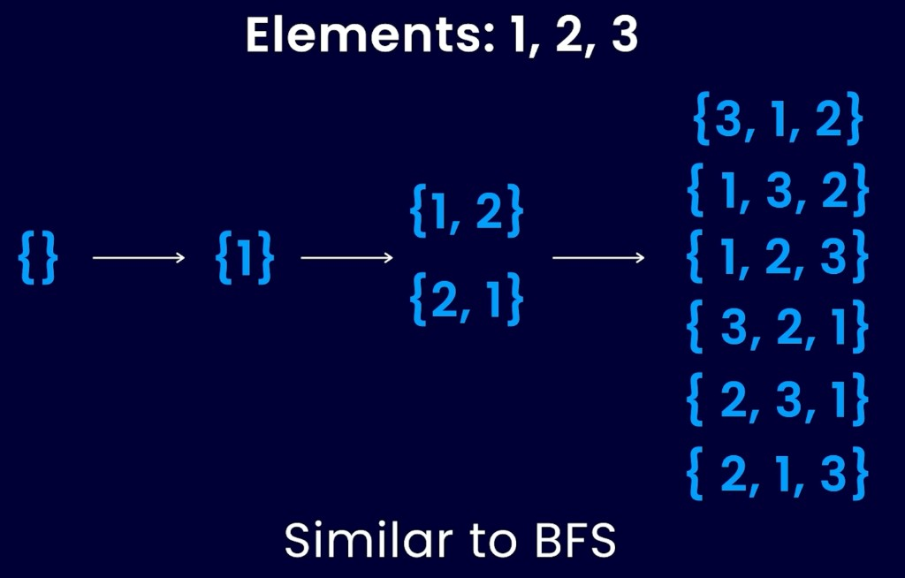

Kolom terakhir adalah `3! = 6` permutasi, bukan `2^3 = 8` subset.

### Subset: urutan tidak penting

Setiap soal **subset** mulai dari `{}`. Setiap elemen baru **menggandakan**
koleksi: salin setiap subset yang ada dan tambahkan elemen baru ke salinannya.

Untuk `{1, 2, 3}` power set-nya adalah:

| Subset                       | Bagaimana ia lahir |
| ---------------------------- | ------------------ |
| `{}`                         | Mulai              |
| `{1}`, `{2}`, `{3}`          | Ambil satu elemen  |
| `{1, 2}`, `{1, 3}`, `{2, 3}` | Ambil dua          |
| `{1, 2, 3}`                  | Ambil semua        |

Itu `2^n` subset, termasuk yang kosong. Jika prompt minta permutasi, hitungannya
`n!`.

### Model mental pemula

Deretan saklar lampu, satu per elemen. Setiap saklar ON (ambil) atau OFF (lewati).
Menyusuri setiap kombinasi ON/OFF **adalah** power set. Jika soal melarang duplikat
di input, lewati saklar ketika nilainya sama dengan yang sebelumnya dan yang
sebelumnya OFF.

### Cara kerja (backtracking)

```text
dfs(start, path):
    record a copy of path          # every path is a valid subset
    for i from start to n - 1:
        path.append(nums[i])
        dfs(i + 1, path)           # i+1: each element at most once
        path.pop()                 # backtrack
```

Permutasi mengganti loop `for` menjadi “setiap indeks yang belum terpakai,” bukan
`i + 1`.

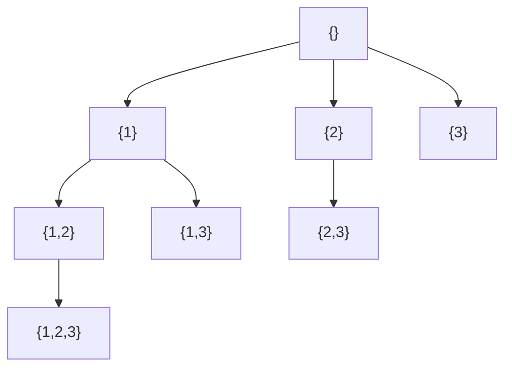

Pohon parsial: `{2,3}` dan `{1,3}` juga tumbuh ke `{1,2,3}`; diagram ini
menunjukkan satu jalur agar ide include/skip tetap mudah dibaca.

Untuk permutasi, ganti loop `for` menjadi setiap indeks yang belum terpakai:

```python
def permute(nums: list[int]) -> list[list[int]]:
    result: list[list[int]] = []
    used = [False] * len(nums)

    def dfs(path: list[int]) -> None:
        if len(path) == len(nums):
            result.append(path.copy())
            return
        for i, x in enumerate(nums):
            if used[i]:
                continue
            used[i] = True
            path.append(x)
            dfs(path)
            path.pop()
            used[i] = False

    dfs([])
    return result
```

### Soal: Subsets

**Prompt (maksud yang sama dengan LeetCode 78):** diberikan himpunan integer
**distinct**, kembalikan semua subset yang mungkin (power set). Solusi tidak boleh
berisi subset duplikat.

**Contoh:** `nums = [1, 2, 3]` →
`[[], [1], [2], [1, 2], [3], [1, 3], [2, 3], [1, 2, 3]]`

Jika input bisa berisi duplikat (Subsets II), sort dulu dan lewati
`nums[i] == nums[i - 1]` di kedalaman yang sama agar `{1, 2}` tidak dihasilkan dua
kali dari dua `1` yang identik.

### Kode disederhanakan

```python
def subsets(nums: list[int]) -> list[list[int]]:
    result: list[list[int]] = []

    def dfs(start: int, path: list[int]) -> None:
        result.append(path.copy())
        for i in range(start, len(nums)):
            path.append(nums[i])
            dfs(i + 1, path)
            path.pop()

    dfs(0, [])
    return result
```

Waktu `O(n · 2^n)` — Anda menghabiskan `O(n)` menyalin masing-masing dari `2^n`
subset.

### Soal latihan

| Soal                                                                  | Yang harus diperhatikan                                   |
| --------------------------------------------------------------------- | --------------------------------------------------------- |
| [78. Subsets](https://leetcode.com/problems/subsets/)                 | Include / skip, tidak ada duplikat di input               |
| [90. Subsets II](https://leetcode.com/problems/subsets-ii/)           | Sort + lewati duplikat di kedalaman yang sama             |
| [46. Permutations](https://leetcode.com/problems/permutations/)       | Susunan: used-mask alih-alih `i + 1`                      |
| [39. Combination Sum](https://leetcode.com/problems/combination-sum/) | Pengulangan **diizinkan** — rekursi ke `i`, bukan `i + 1` |

Yang terakhir itu catatan asli: **pengulangan boleh atau tidak tergantung soalnya**.
Combination Sum mengizinkan reuse; Subsets tidak.

### Kesalahan umum

- Mengubah `path` dan meng-append `path` itu sendiri ke `result` (Anda butuh
  **salinan**).
- Memakai kode permutasi untuk prompt kombinasi (lalu mendapat himpunan duplikat
  dengan urutan berbeda).
- Lupa sort sebelum melewati duplikat.

---

## Pola 8 — Sliding Window

### Kapan dipakai

Pakai Sliding Window ketika Anda perlu **memproses serangkaian elemen data** seperti
list atau string. Dalam pola sliding window, Anda mencari list tertentu di dalam
string (atau subarray di dalam array) dengan melihat **list yang lebih kecil dari
list yang lebih besar**. Window **bergulir 1 per waktu** sampai list yang lebih
besar selesai dipindai.

Jadi, **ketika soalnya adalah memenuhi suatu kondisi (satisfy a given condition)**,
pakai pola sliding window.

Biasanya dipakai untuk mencari **substring terpendek** di bawah kondisi tertentu.
Mesin yang sama juga mencari window valid **terpanjang** — hanya aturan susut /
expand yang berubah.

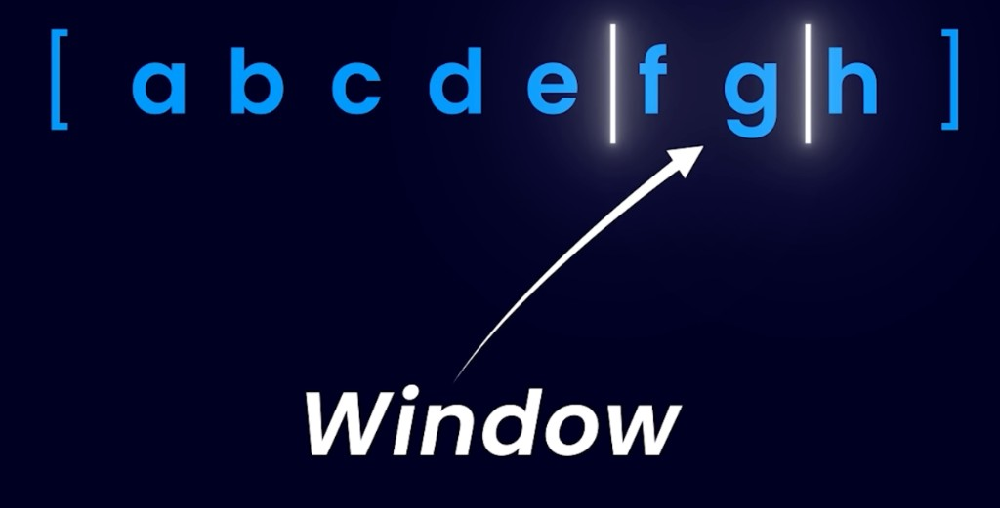


### Model mental pemula

Gerbang metal detector di stadion. Orang masuk dari kanan (`right += 1`). Jika
gerbang mulai berbunyi (window **melanggar** kondisi), Anda mengeluarkan orang dari
kiri (`left += 1`) sampai sunyi lagi. Anda tidak pernah membangun antrean dari nol
— Anda hanya menyesuaikan dua ujung.

### Cara kerja

1. `left = 0`. Perbesar `right` dari `0` sampai `n - 1`.
2. Tambahkan `s[right]` ke counter / sum / set.
3. Selama window **melanggar** kondisi, buang `s[left]` dan `left += 1`.
4. Setelah window valid lagi, catat jawaban (panjang, slice, min sum, …).
5. Window selalu bergulir maju. `left` tidak pernah mundur.

**Terpanjang** dicatat **setelah** menyusutkan window yang **tidak valid**.
**Terpendek** dicatat **di dalam** loop susut selama window **tetap valid**.

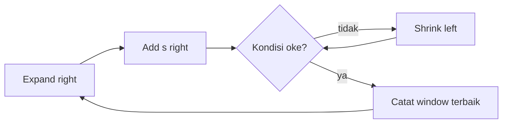

### Soal: longest substring with k unique characters

Screenshot di bawah adalah prompt gaya GFG: **linear data structure**,
**substring**, dan **condition**. Tiga tag itu alasan Sliding Window dipakai.


Judulnya **k unique characters**. Contoh `aabbcc` cocok untuk **exactly k** dan
**at most k** pada string ini. Mereka berbeda jika string punya kurang dari k
karakter distinct: `aaabbb` dengan `k = 3` panjangnya `6` untuk at-most-k dan `0`
untuk exactly-k. Kode di bawah adalah **at most k** (LeetCode 340). Untuk exactly
k, catat `best` hanya ketika `len(count) == k`.

| Input                   | At most k            | Exactly k |
| ----------------------- | -------------------- | --------- |
| `s = "aabbcc"`, `k = 1` | `2` (`"aa"`)         | `2`       |
| `s = "aabbcc"`, `k = 2` | `4` (`"aabb"`)       | `4`       |
| `s = "aabbcc"`, `k = 3` | `6` (`"aabbcc"`)     | `6`       |
| `s = "aaabbb"`, `k = 3` | `6` (seluruh string) | `0`       |

Jejak kedua: `s = "aabacbebebe"`, `k = 3`. Satu window at-most-k yang valid adalah
`"cbebebe"` (panjang 7) dengan himpunan unik `{c, b, e}`. Karakter distinct
keempat memaksa susut dari kiri sampai window kembali ke 3.

### Kode disederhanakan (terpanjang, at most k)

```python
from collections import defaultdict

def longest_at_most_k_unique(s: str, k: int) -> int:
    count: dict[str, int] = defaultdict(int)
    left = 0
    best = 0
    for right, ch in enumerate(s):
        count[ch] += 1
        while len(count) > k:  # invalid: too many uniques
            count[s[left]] -= 1
            if count[s[left]] == 0:
                del count[s[left]]
            left += 1
        best = max(best, right - left + 1)  # record after the window is valid
    return best
```

Waktu `O(n)`. Extra space `O(k)` untuk peta karakter.

### Kasus yang biasa: window terpendek yang memenuhi kondisi

Catatan asli biasanya menunjuk **substring terpendek** di bawah suatu kondisi.
Expand sampai window valid, lalu susutkan sejauh mungkin **selama tetap valid**,
dan simpan panjang terkecil.

```python
def min_subarray_len(target: int, nums: list[int]) -> int:
    left = 0
    total = 0
    best = len(nums) + 1
    for right, x in enumerate(nums):
        total += x
        while total >= target:  # valid: record, then shrink
            best = min(best, right - left + 1)
            total -= nums[left]
            left += 1
    return 0 if best == len(nums) + 1 else best
```

Contoh: `nums = [2, 3, 1, 2, 4, 3]`, `target = 7` mengembalikan `2` (`[4, 3]`).

### Soal latihan

| Soal                                                                                                                                             | Yang harus diperhatikan                                                 |
| ------------------------------------------------------------------------------------------------------------------------------------------------ | ----------------------------------------------------------------------- |
| [3. Longest Substring Without Repeating Characters](https://leetcode.com/problems/longest-substring-without-repeating-characters/)               | Tidak ada karakter berulang: jumlah distinct sama dengan panjang window |
| [209. Minimum Size Subarray Sum](https://leetcode.com/problems/minimum-size-subarray-sum/)                                                       | Window terpendek yang **jumlahnya** ≥ target                            |
| [76. Minimum Window Substring](https://leetcode.com/problems/minimum-window-substring/)                                                          | Window terpendek yang **menutupi** string lain                          |
| [340. Longest Substring with At Most K Distinct Characters](https://leetcode.com/problems/longest-substring-with-at-most-k-distinct-characters/) | At most k (premium); contoh screenshot memakai `aabbcc`                 |

### Kesalahan umum

- Mereset `left` ke `0` di setiap `right` — itu `O(n²)`, bukan window.
- Meng-update `best` saat kondisi masih **rusak**.
- Memakai Sliding Window untuk soal yang butuh **subsequence** (bukan contiguous).
  Window hanya menutupi slice yang **contiguous**.

---

## Cara memilih pola

Baca prompt sekali, lalu tanya pertanyaan ini berurutan. Ini daftar kapan-dipakai
asli, dijadikan jalur keputusan.

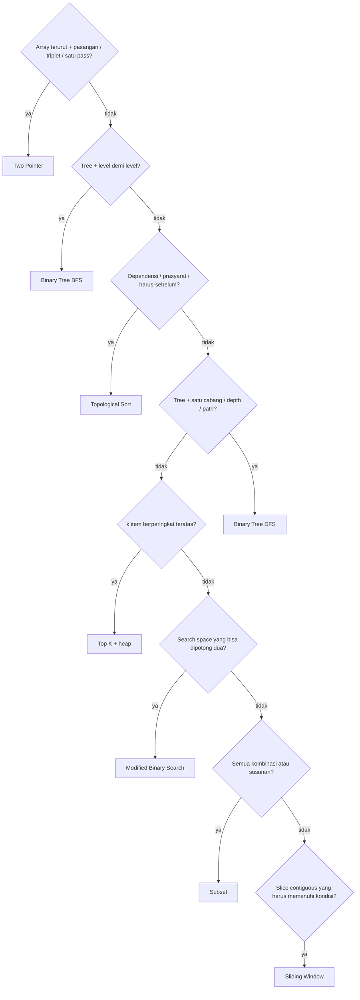

| Sinyal di prompt                                 | Pola                   |
| ------------------------------------------------ | ---------------------- |
| Array terurut, dua indeks, satu pass             | Two Pointer            |
| Level order, zigzag, right side view             | Binary Tree BFS        |
| Edge satu arah, tanpa cycle, rantai prasyarat    | Topological Sort       |
| Rekursi turun satu cabang, lalu backtrack        | Binary Tree DFS        |
| ke-k terbesar / top k / k terdekat               | Top K Elements         |
| Bagi search space dua kali, berulang             | Modified Binary Search |
| Semua kombinasi; pengulangan mungkin diizinkan   | Subset                 |
| Substring / subarray yang memenuhi suatu kondisi | Sliding Window         |

Jika dua pola sama-sama cocok, pilih yang sesuai **bentuk keluaran**. “Kembalikan
setiap subset” adalah Subset, meski Anda bisa brute-force dengan nested loop.
“Kembalikan substring valid terpanjang” adalah Sliding Window, meski Two Pointer
juga memakai dua indeks.

## Peta latihan

Kerjakan satu **pemanasan** dan satu soal **inti** per pola sebelum mencampur.
Tingkat di bawah mengikuti label LeetCode.

| Pola                   | Pemanasan                           | Inti                                         |
| ---------------------- | ----------------------------------- | -------------------------------------------- |
| Two Pointer            | 26 Remove Duplicates (Easy)         | 167 Two Sum II / 15 3Sum (Medium)            |
| Binary Tree BFS        | 111 Minimum Depth (Easy)            | 102 Level Order (Medium)                     |
| Topological Sort       | 207 Course Schedule (Medium)        | 210 Course Schedule II (Medium)              |
| Binary Tree DFS        | 104 Max Depth (Easy)                | 112 Path Sum (Easy) lalu 543 Diameter (Easy) |
| Top K Elements         | 215 Kth Largest (Medium)            | 347 Top K Frequent (Medium)                  |
| Modified Binary Search | 704 Binary Search (Easy)            | 33 Search in Rotated Array (Medium)          |
| Subset                 | 78 Subsets (Medium)                 | 90 Subsets II (Medium)                       |
| Sliding Window         | 3 Longest Unique Substring (Medium) | 209 Min Size Subarray Sum (Medium)           |

Setelah itu, implementasikan Python `bisect` di **bahasa lain** (drill asli). Lalu
selesaikan ulang 215 **tanpa sorting**, hanya dengan heap berukuran `k`.

## Trade-off

| Pola                   | Yang Anda dapat                         | Yang Anda bayar                                |
| ---------------------- | --------------------------------------- | ---------------------------------------------- |
| Two Pointer            | `O(n)` setelah sort, extra space `O(1)` | Butuh urutan, atau rasa two-index yang berbeda |
| BFS                    | Pengelompokan “per level” yang alami    | Memori queue di tree yang lebar                |
| Topological Sort       | Urutan + deteksi cycle                  | Hanya DAG; arah edge salah gagal diam-diam     |
| DFS                    | Kode kecil, path/state di stack         | Kedalaman rekursi di tree yang miring          |
| Top K (heap)           | `O(n log k)` tanpa full sort            | Mudah salah pilih max-heap vs min-heap         |
| Modified Binary Search | `O(log n)` di rentang besar             | Off-by-one; duplikat butuh penyusutan ekstra   |
| Subset                 | Enumerasi lengkap                       | Waktu eksponensial — n harus tetap kecil       |
| Sliding Window         | `O(n)` di string/array                  | Hanya contiguous; kondisi harus monoton        |

## Pelajaran

- **Namai pola sebelum menulis loop.** Kalimat kapan-dipakai adalah skill interview;
  kodenya hanya isian.
- **Dua indeks tidak selalu Two Pointer.** Jika mereka membentuk window
  **contiguous** yang harus **memenuhi suatu kondisi**, itu Sliding Window.
- **DFS vs BFS adalah pilihan struktur data.** Rekursi (atau stack) vs queue. Tree-nya
  sama.
- **Top K adalah papan skor berbatas.** Simpan `k` angka paling penting yang sudah
  Anda lihat sejauh ini di heap.
- **Modified binary search adalah bisect dengan predikat berbeda.** Port `bisect`
  sekali, keluarga sisanya jadi lebih mudah.
- **Subset adalah include-or-skip.** Pengulangan diizinkan atau tidak adalah
  perubahan satu baris (`dfs(i)` vs `dfs(i + 1)`).
- **Topological sort adalah rencana prasyarat.** Edge satu arah, tanpa loop, setiap
  modul setelah dependensinya.

## Sumber

- Catatan belajar: _8 leetcode pattern_ (aturan kapan-dipakai untuk kedelapan pola)
- Repositori: [`okfriansyah-moh/data-structure-and-algorithm`](https://github.com/okfriansyah-moh/data-structure-and-algorithm) — katalog Java yang bisa dijalankan (search, tree, array) untuk berlatih ide yang sama
- Artikel terkait: [Katalog Belajar Struktur Data & Algoritma](/docs/projects/data-structure-and-algorithm)
- Soal kanonik: LeetCode 167, 15, 102, 207, 104, 215, 33, 78, dan 3
