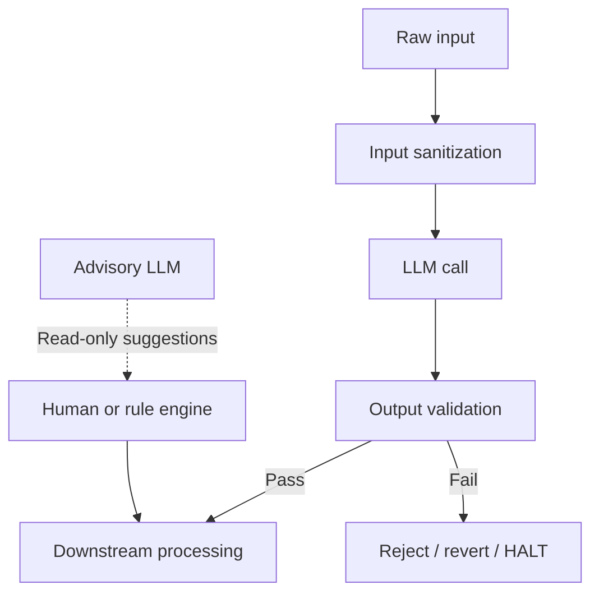

# LLM Guardrails

## Apa yang Dibangun

Artikel ini mensintesis pola LLM guardrail dari tiga sistem produksi:
[A2A Brainstorm](https://github.com/okfriansyah-moh/a2a-brainstormer) (audit koherensi
dengan micro-fix terjaga dan revert-on-failure),
[MD-AME](https://github.com/okfriansyah-moh/md-ame) (Prompt Firewall + classifier keamanan Gemini
pada setiap topik dan skrip), dan
[edge-polymarket-agent](https://github.com/okfriansyah-moh/edge-polymarket-agent)
(AI advisor terisolasi dari critical path eksekusi).

## Masalah

LLM berhalusinasi, membatalkan dirinya sendiri, menyuntikkan konten tidak aman, dan menghasilkan
output malformed. Di sistem produksi, Anda tidak dapat mempercayai respons LLM mentah. Anda membutuhkan
lapisan yang **menyanitasi input**, **memvalidasi output**, **menolak atau mengembalikan hasil buruk**, dan
**mengisolasi AI advisory** dari aksi yang memiliki konsekuensi dunia nyata.

## Mengapa Masalah Ini Sulit

1. **Over-correction** — memperbaiki satu masalah dapat merusak konten tidak terkait.
2. **False positive** — filter terlalu agresif memblokir output valid.
3. **Latensi** — classifier keamanan menambah panggilan API per item.
4. **Advisory creep** — saran LLM perlahan menjadi ketergantungan eksekusi.
5. **Non-determinisme** — guardrail yang sama harus menangani bentuk output LLM yang bervariasi.

## Model Mental untuk Pemula

Guardrail adalah **pos pemeriksaan keamanan bandara**, bukan tujuan. Setiap item melewati
inspeksi sebelum melanjutkan. Jika inspeksi gagal, item ditolak atau dikembalikan — tidak mendapat
stempel "cukup oke". AI advisory seperti pemandu wisata: saran berguna, tetapi tidak pernah diizinkan
menerbangkan pesawat.

## Persyaratan dan Kendala

| Jenis guardrail | A2A Brainstorm | MD-AME | Polymarket agent |
|----------------|----------------|--------|------------------|
| Sanitasi input | Toleransi ekstraksi JSON | Prompt Firewall (`sanitize_trend_input`) | N/A (data pasar terstruktur) |
| Validasi output | Audit koherensi + guardrails | Classifier keamanan pada topik/skrip | Hard gate probabilitas |
| Revert on failure | Revert micro-fix jika validasi gagal | ContentSafetyRejection HALT | Blokir trade, tanpa fallback |
| Isolasi advisory | N/A | N/A | AI advisor read-only, failure-isolated |
| Audit trail | State sesi di PostgreSQL | `safety_audit_logs` trail immutable | Log audit alokasi |
| Keamanan kredensial | Env ref `*_CREDENTIAL_REF` saja | Master Key Crypto, zero-logging | Rahasia env-only |

## Gambaran Arsitektur



## Alur Eksekusi

### Guardrail input (Prompt Firewall MD-AME)

1. Potong input ke panjang maksimum.
2. Hapus frasa injeksi, tag HTML, dan token peran LLM.
3. Teruskan input tersanitasi ke pemrosesan downstream.

### Guardrail output (Safety Classifier MD-AME)

1. Evaluasi topik atau skrip terhadap `safety_profile` dimensi.
2. Tulis hasil ke `safety_audit_logs` immutable.
3. Tolak item jika classifier mengembalikan unsafe; pipeline skip atau HALT.

### Guardrail koherensi (A2A Brainstorm)

1. Hasilkan dokumen per-seksi.
2. Jalankan audit koherensi di semua seksi.
3. Terapkan micro-fix untuk kontradiksi.
4. Validasi setiap perbaikan; revert jika validasi gagal.

### Isolasi advisory (Polymarket)

1. AI advisor menghasilkan rekomendasi read-only dengan struktur insight wajib.
2. Jalur eksekusi tidak pernah menunggu respons advisor.
3. Kegagalan advisor dicatat tetapi tidak memblokir trade.

## Komponen Penting

| Komponen | Tanggung jawab |
| -------- | -------------- |
| Prompt Firewall | Sanitasi input sebelum panggilan LLM atau tulisan DB |
| Safety classifier | Evaluasi output terhadap profil kebijakan |
| Audit koherensi | Deteksi kontradiksi antar-seksi |
| Guardrail revert | Batalkan micro-fix yang gagal validasi |
| Hard gate | Blokir aksi downstream tanpa prasyarat valid |
| Lapisan advisory | Saran saja — tanpa side effect eksekusi |
| Audit log | Trail immutable keputusan keamanan |

## Contoh Implementasi yang Disederhanakan

Sanitasi input (disederhanakan):

```python
# simplified — md-ame Prompt Firewall pattern
def sanitize_trend_input(raw: str) -> str:
    text = truncate(raw, MAX_TREND_INPUT_LENGTH)
    text = strip_html_tags(text)
    text = remove_injection_phrases(text)
    text = remove_role_tokens(text)
    return text
```

Micro-fix terjaga dengan revert (disederhanakan):

```go
// simplified — a2a-brainstormer coherence pattern
fix := proposeMicroFix(sections, contradiction)
patched := applyFix(sections, fix)
if !validateDocument(patched) {
    return sections // revert — original preserved
}
return patched
```

Isolasi advisory (disederhanakan):

```python
# simplified — polymarket pattern: advisor never blocks execution
try:
    insight = ai_advisor.suggest(context)  # read-only
    log_advisory(insight)
except AdvisorError as e:
    log_warning("advisor_unavailable", error=str(e))
    # execution continues without advisor input
```

## Keandalan dan Idempotensi

- **Default fail safe:** MD-AME HALT pada kegagalan suara; polymarket memblokir tanpa probabilitas.
- **Audit log immutable:** Keputusan keamanan append-only untuk tinjauan pasca-insiden.
- **Tanpa fallback diam-diam:** API key hilang menonaktifkan agent, bukan beralih ke model lebih lemah secara diam-diam.
- **Cakupan perbaikan terbatas:** Micro-fix koherensi adalah edit kecil, bukan regenerasi penuh.

## Mode Kegagalan

| Kegagalan | Perilaku |
| --------- | -------- |
| API classifier keamanan down | Topik/skrip ditolak; dicatat ke audit |
| Perbaikan koherensi memperburuk keadaan | Revert otomatis ke state pra-perbaikan |
| Percobaan prompt injection | Dihapus firewall; dapat ditolak sepenuhnya |
| Timeout AI advisor | Eksekusi melanjutkan tanpa input advisory |
| Filter terlalu agresif | Penolakan palsu dicatat; sesuaikan safety_profile per dimensi |

## Trade-off dan Alternatif yang Ditolak

| Pilihan | Alasan | Alternatif yang ditolak |
| ------- | ------ | ----------------------- |
| Classifier per item | Menangkap konten tidak aman lebih awal | Mempercayai self-moderation LLM |
| Micro-fix bukan regenerasi | Mempertahankan konten baik; lebih murah | Regenerasi seluruh dokumen |
| HALT pada kegagalan suara | Kualitas di atas ketersediaan | Publikasikan video tanpa audio |
| Isolasi advisory | Keandalan eksekusi | LLM di jalur keputusan trade |
| Audit log immutable | Akuntabilitas | Timpa keputusan keamanan |

## Pengujian

- **A2A Brainstorm:** `coherence_test.go`, `aigen_test.go` untuk jalur audit dan revert
- **MD-AME:** Unit test dengan mock classifier; integration test untuk alur penolakan keamanan
- **Polymarket:** Test memverifikasi eksekusi melanjutkan saat advisor gagal

## Operasi dan Observabilitas

- Tinjau `safety_audit_logs` untuk pola penolakan dan tingkat false positive
- Pantau latensi API classifier — menambah 2 panggilan Gemini per video di MD-AME
- Lacak ketersediaan advisor terpisah dari tingkat keberhasilan eksekusi

## Pelajaran yang Dipetik

1. **Guardrail adalah arsitektur, bukan prompt** — "tolong aman" di system prompt bukan guardrail.
2. **Revert sama pentingnya dengan perbaikan** — selalu validasi dan batalkan koreksi yang gagal.
3. **Isolasi AI advisory** — latensi dan kegagalan LLM tidak boleh memblokir critical path.
4. **Audit semuanya** — keputusan keamanan membutuhkan log immutable untuk tuning dan compliance.

## Terkait

- [Cara Mencegah Kontradiksi dalam Dokumen yang Dihasilkan AI](/docs/concepts/ai-document-coherence)
- [Pola Orkestrasi AI](/docs/concepts/ai-orchestration-patterns)
- [MD-AME: Autonomous Media Engine](/docs/systems/md-ame-autonomous-media-engine)
- [Polymarket Trading Agent](/docs/systems/polymarket-trading-agent)

## Sumber

- Repository: [okfriansyah-moh/a2a-brainstormer](https://github.com/okfriansyah-moh/a2a-brainstormer)
- Repository: [okfriansyah-moh/md-ame](https://github.com/okfriansyah-moh/md-ame)
- Repository: [okfriansyah-moh/edge-polymarket-agent](https://github.com/okfriansyah-moh/edge-polymarket-agent)
- Pull requests: [a2a-brainstormer#8](https://github.com/okfriansyah-moh/a2a-brainstormer/pull/8), [a2a-brainstormer#12](https://github.com/okfriansyah-moh/a2a-brainstormer/pull/12)
