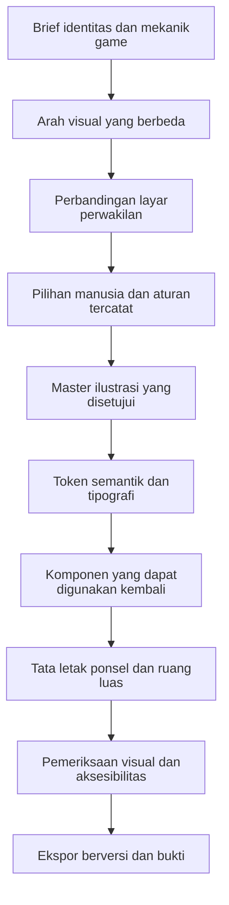

import {AssetGallery, Palette, StyleComparison, SizeComparison, HistoricalHome} from '@site/docs/concepts/images/visual-identity-before-development/Visuals';
import articleStyles from '@site/docs/concepts/images/visual-identity-before-development/visuals.module.css';

# Identitas Visual Sebelum Pengembangan: Pelajaran dari Padu

<div className={articleStyles.article}>

Saat membuat game berikutnya, saya ingin memikirkan identitas visualnya sebelum memulai pengembangan utama. Tema, maskot, logo, ikon, dan warna akan memengaruhi hampir semua layar. Menentukan fungsi masing-masing sejak awal memberi arah pada implementasi dan membantu merek tetap mudah dikenali saat game berkembang.

Padu, game puzzle angka saya, menjadi contoh konkret: permukaan enamel hangat, ubin keramik, wordmark membulat, serta karakter 6 dan 7 yang terhubung. Identitasnya menunjukkan metode yang bisa saya gunakan lagi bersama Codex, dengan ruang penyempurnaan melalui prototipe dan pengujian.

## Apa yang Dibangun

Padu memiliki beberapa aset merek yang saling berkaitan dengan tanggung jawab berbeda. Wordmark menampilkan namanya. Maskot lengkap menambah ekspresi melalui wajah, tangan, kaki, dan sepatu oranye. Mark ringkas mempertahankan pasangan ubin serta penghubungnya tanpa anggota tubuh. Ikon aplikasi menempatkan identitas sederhana itu pada bidang krem.

<AssetGallery locale="id" />

Repositori privat Padu juga mencatat aturan merek, token tema produksi, komponen layar bersama, dan manifest aset. Catatan tersebut membuat identitas bisa diterapkan dalam implementasi. Di sini saya membagikan beberapa ilustrasi dan cuplikan yang dijelaskan. Contoh ini tidak menetapkan cara setiap gambar asli dihasilkan atau mereproduksi percakapan Codex yang pertama.

## Masalah yang Diselesaikan

Game membutuhkan identitas visual yang mudah dikenali pada permainan, menu, ikon launcher, dan materi yang dilihat orang sebelum memasang aplikasi. Setiap tempat memiliki batasan berbeda. Ilustrasi terperinci yang cocok di samping pesan sambutan dapat kehilangan kejelasan ketika menjadi ikon kecil.

Memulai pengembangan fitur dengan gaya placeholder yang terpisah-pisah bisa menyebarkan keputusan tersebut ke banyak komponen. Perubahan belakangan akan menyentuh bentuk tombol, gaya teks, jarak antarelemen, ekspor aset, dan pembaruan tangkapan layar. Brief identitas sejak awal memberi semua pilihan itu acuan yang sama. Review juga menjadi konkret: apakah layar baru terasa berasal dari game yang sama, dan apakah pemain memahami aksi utamanya?

## Mengapa Masalah Ini Sulit

Kata seperti “ramah”, “premium”, atau “berani” bisa ditafsirkan dengan banyak cara. Maskot berwarna cerah dapat memberi kesan game anak-anak meskipun audiensnya orang dewasa. Bentuk membulat bisa terasa seperti benda yang dapat disentuh atau seperti kartun, bergantung pada proporsi, pencahayaan, dan tipografi di sekitarnya.

Arah yang tercatat untuk Padu adalah game logika angka bagi orang dewasa dengan suasana tenang. Karakter keramik yang ramah harus berdampingan dengan persamaan yang terbaca dan kontrol yang segera bisa digunakan. Identitas harus bertahan pada papan padat, jendela ponsel pendek, serta komposisi tablet yang luas. Gambar yang menarik hanya menyelesaikan sebagian persoalan tersebut.

“Kuat dan berani” dapat diwujudkan melalui siluet khas, hierarki jelas, dan penekanan aksi yang konsisten. Memenuhi semua permukaan dengan warna pekat atau membesarkan maskot di setiap tempat akan mempersulit pembacaan puzzle. Pemain tetap perlu melihat angka dan memahami langkah berikutnya.

## Gambaran untuk Pemula

Bayangkan identitas visual sebagai sekumpulan keputusan yang berjalan bersama. Tema menjelaskan dunia dan suasananya. Aset memperkenalkan game. Token menyimpan nilai yang digunakan berulang, misalnya warna permukaan. Komponen menerapkan nilai tersebut pada kontrol dan tata letak.

Logo dapat memperkenalkan sebuah layar sementara bagian lain menggunakan material dan hierarki yang tidak konsisten. Perbandingan edukasi berikut mempertahankan persamaan yang sama dan mengubah tampilannya. Perhatikan hubungan antara permukaan, sudut, dan penekanan aksinya.

<StyleComparison locale="id" />

## Kebutuhan dan Batasan

Identitas Padu berkaitan dengan mekaniknya: ubin dalam jumlah terbatas menyatukan persamaan yang terhubung. Nama Padu berarti menyatu dalam bahasa Indonesia. Simbol yang disetujui menampilkan ubin ivory bernomor 6 di kiri dan 7 di kanan dengan penghubung copper-oranye. Keduanya memiliki wajah ramah. Maskot lengkap menambahkan anggota tubuh; mark ringkas tidak.

Implementasi memiliki pilihan tipografi yang ditentukan: DM Sans untuk antarmuka dan JetBrains Mono untuk nilai ubin. Wordmark Padu yang membulat adalah aset gambar yang disetujui, terpisah dari font teks tersebut. Keterbacaan angka perlu diputuskan tersendiri karena pemain terus memeriksa nilai dan operator.

Tentukan jarak, sudut, kepadatan ilustrasi, ikon, gerak, dan nada bahasa. Tema Padu memuat sudut tombol 18dp dan token target minimum 48dp. Aturannya juga mencatat ikon bergaya Material Symbols, kalimat ringkas, serta dukungan pengurangan gerak.

## Gambaran Arsitektur



Brief mengarahkan ilustrasi sekaligus implementasi. Review dapat kembali ke tahap sebelumnya jika arah tersebut gagal ketika ditempatkan dalam konteks. Setelah satu arah disetujui, aturan bersama menjaga konsistensi layar berikutnya.

## Alur Pelaksanaan

Untuk game berikutnya, saya akan memakai urutan ini bersama Codex:

1. Jelaskan mekanik, audiens, suasana, dan tempat identitas akan muncul. Sertakan referensi serta batasan yang sudah disetujui.
2. Minta arah yang berbeda secara bermakna. Bandingkan material, siluet, fungsi tipografi, dan hierarki; mengganti warna aksen saja memberi sedikit informasi.
3. Tempatkan setiap arah pada konteks perwakilan: layar sambutan, permainan aktif, hasil, serta pratinjau ikon aplikasi kecil.
4. Pilih arahnya sebagai pemilik, lalu catat aset dan aturan yang dipilih. Pisahkan alternatif dari materi produksi yang disetujui.
5. Terjemahkan pilihan menjadi token semantik, kontrol yang dapat digunakan kembali, dan ekspor aset. Periksa layar nyata pada ukuran sempit dan luas.

Ini proses yang bisa diulang, bukan rekonstruksi sesi pembuatan gambar pertama. [Dokumentasi resmi Codex](https://learn.chatgpt.com/docs/codex/cli) menjelaskan kemampuan membaca berkas, mengubah kode, dan menjalankan alat lokal. Kemampuan tersebut mendukung pembacaan brief, pembuatan perbandingan, penurunan token, dan verifikasi ekspor. Pembuatan ilustrasi raster juga membutuhkan alat gambar yang tersedia atau ilustrasi yang disediakan; sesi pemrograman saja tidak menjamin kemampuan itu. Pemilihan oleh manusia tetap menjadi bagian proses.

### Melihat identitas dalam konteks

<HistoricalHome locale="id" />

Tangkapan Home historis menggabungkan beberapa keputusan: wordmark oranye, maskot ramah, latar hangat, kartu fitur kuning, judul teal, dan aksi utama copper. Ikon mode menyampaikan fungsi, sementara maskot menyampaikan karakter.

Tata letaknya telah berkembang sejak pengambilan gambar pada 17 September itu. Gunakan gambar ini untuk mempelajari hubungan visual, bukan sebagai spesifikasi layar saat ini. Implementasi sekarang memakai chrome responsif bersama dan pengecualian Home yang terdokumentasi.

## Komponen Penting

| Elemen | Fungsi | Pertanyaan desain |
| --- | --- | --- |
| Tema | Menentukan material, suasana, dan bentuk | Dunia seperti apa yang menaungi interaksi ini? |
| Wordmark | Membuat nama produk mudah dikenali | Apakah namanya terbaca pada tempat penggunaannya? |
| Mark ringkas | Membawa identitas dengan sedikit detail | Ciri mana yang bertahan saat ukurannya diperkecil? |
| Maskot | Memberi karakter pada momen yang sesuai | Apakah ia mendukung adegan tanpa menghalangi tugas? |
| Ikon aplikasi | Mengenalkan aplikasi di launcher dan toko | Apakah ilustrasi bertahan pada ukuran kecil dan mask platform? |
| Ikon antarmuka | Menjelaskan aksi dan tujuan navigasi | Apakah pemain memahami aksi bersama labelnya? |
| Token dan komponen | Mengulang keputusan antarlayar | Apakah fitur baru mewarisi perlakuan yang disetujui? |

### Warna memiliki fungsi

<Palette locale="id" />

Nilai ini berasal dari `AppTheme` produksi pada revisi sumber yang tercantum di bawah. Secara khusus, ivory bernilai `#FFFDF7`; referensi tertulis yang lebih lama memuat nilai ivory berbeda. Untuk implementasi, baca sumber token yang berlaku dan catat perbedaannya agar palet tidak tercampur tanpa penjelasan.

Fungsi warna perlu dapat diprediksi. Copper menekankan aksi utama; teal tersedia untuk keadaan aktif; jejak netral memiliki token sendiri. Tentukan label, simbol, atau bentuk pendamping untuk keadaan penting. W3C menjelaskan mengapa [warna tidak boleh menjadi satu-satunya cara menyampaikan informasi](https://www.w3.org/WAI/WCAG22/Understanding/use-of-color.html).

Periksa teks terhadap latar yang benar-benar digunakan. Minimum WCAG umumnya 4,5:1 untuk teks biasa dan 3:1 untuk teks besar yang memenuhi ketentuannya. Pengecualian logo tidak berlaku untuk kontrol atau instruksi game. Palet saja belum membuktikan hasil kontras; nilai kombinasi dan keadaan dalam konteksnya. Lihat [panduan kontras W3C](https://www.w3.org/WAI/WCAG22/Understanding/contrast-minimum.html).

### Penyederhanaan memerlukan ilustrasi tersendiri

<SizeComparison locale="id" />

Pada ukuran kecil, maskot lengkap menggunakan ruang untuk tangan dan sepatu. Mark ringkas memberi porsi lebih besar kepada pasangan ubin. Keduanya bagian dari Padu, tetapi tempat penggunaannya berbeda. Ikon aplikasi memiliki komposisi tersendiri dengan latar; ikon pengaturan antarmuka melayani fungsi lain lagi.

Pertahankan proporsi dan periksa padding transparan saat membandingkan ukuran. Kotak gambar 24 piksel tidak menjamin ilustrasi terlihat selebar 24 piksel. Tinjau berkas ekspor di bawah mask platform sasaran dan pada tempat sebenarnya sebelum menyetujui ukuran minimum reproduksi.

## Contoh Implementasi Sederhana

Cuplikan ini mempertahankan konstanta produksi yang sebenarnya dari `AppTheme` Padu; bagian tema Flutter di sekitarnya tidak ditampilkan:

```dart
static const Color parchment = Color(0xFFFFF9EE);
static const Color ivory = Color(0xFFFFFDF7);
static const Color copper = Color(0xFFC44921);
static const Color verdigris = Color(0xFF176B59);
static const String bodyFontFamily = 'DM Sans';
static const String tileFontFamily = 'JetBrains Mono';
```

Langkah berikutnya adalah menggunakan nilai tersebut melalui komponen bersama. Fitur perlu memakai kontrol aksi dan chrome layar yang sudah ditentukan agar koreksi identitas memiliki tempat yang jelas. Catat perilaku komponen, area sentuh, serta nama aksesibel bersama aturan visualnya.

### Tugas yang bisa disalin untuk game berikutnya

Berikut adalah **prompt edukasi baru** yang ditulis untuk artikel ini, bukan brief produksi Padu yang tersimpan. Ganti bagian dalam tanda kurung siku sebelum memberikannya kepada Codex.

```text
Bantu saya menentukan identitas visual [nama game]
sebelum mengimplementasikan layar utamanya.
Mekanik: [hal yang benar-benar dilakukan pemain].
Audiens: [siapa yang bermain dan di mana].
Suasana: [sifat spesifik dan referensi material].
Aset dan aturan yang disetujui: [lokasi, atau belum ada].

Baca instruksi proyek dan referensi desain yang ada.
Usulkan arah berbeda untuk tema, siluet, palet,
fungsi tipografi, maskot, wordmark, mark ringkas,
ikon aplikasi, ikon antarmuka, gerak, dan nada bahasa.
Jelaskan alasan tiap pilihan.

Tampilkan tiap arah pada sambutan, permainan, dan hasil,
serta pratinjau ikon kecil. Gunakan konten yang sama.
Beri label pada mockup edukasi dan aset belum disetujui.
Gunakan alat gambar yang tersedia untuk ilustrasi raster,
atau jelaskan aset yang perlu saya sediakan.
Pertahankan sumber yang dapat diedit.

Minta saya memilih sebelum memakai arah untuk produksi.
Lalu catat master, fungsi warna semantik, tipografi,
jarak, sudut, aturan ikon, dan komponen bersama.
Jaga konsistensi layar baru dengan pilihan tersebut.

Verifikasi pada 320px, 390px, dan ukuran tablet luas,
dengan teks diperbesar, keyboard atau interaksi non-drag,
kontras, petunjuk selain warna, dan reduced motion
bila relevan. Periksa ekspor, padding, mask, dan lisensi.
Catat nama berkas, asal sumber, dan bukti revisinya.
Serahkan diff yang dapat direview dan laporan penerimaan.
```

Untuk latihan edukasi menyerupai Padu, brief yang lebih kecil berikut menjaga fungsi aset tetap berbeda. Ini juga **contoh baru**, bukan prompt asli atau bukti cara gambar yang ada dibuat:

```text
Brief maskot: Eksplorasi pasangan ubin angka keramik ramah,
6 di kiri dan 7 di kanan, dengan penghubung copper-oranye.
Beri wajah pada keduanya; sertakan anggota tubuh
untuk ilustrasi lengkap. Tampilkan pada sambutan
atau hasil tanpa menutupi kontrol. Pertahankan material,
proporsi, dan palet yang disetujui.
```

```text
Brief logo: Pertahankan wordmark Padu membulat yang disetujui.
Eksplorasi lockup bersama mark ringkas pasangan 6 dan 7.
Pertahankan wajah, penghubung, dan proporsi, tanpa anggota tubuh.
Tampilkan ruang kosong dan penempatan terbaca pada latar hangat.
```

```text
Brief ikon aplikasi: Susun mark ringkas 6 dan 7 yang disetujui
pada bidang krem, tanpa wordmark atau anggota tubuh.
Pratinjau ekspor kecil dan mask platform sebelum memilih.
Simpan master serta catat padding dan pengaturan ekspor.
```

## Keandalan dan Idempotensi

Untuk aset, kemampuan mengulang hasil dimulai dengan menyimpan master yang dipilih beserta asalnya. Manifest merek Padu menunjuk master lengkap dan ringkas; skrip pengemasan ikon menurunkan ekspor platform dari ilustrasi yang disetujui. Pemeriksaan ekspor dapat merujuk kembali ke input yang dikenal.

Simpan arah yang dipilih, revisi, hash berkas, dan pengaturan ekspor bersama hasil pekerjaan. Menjalankan ulang prompt generatif bisa menghasilkan gambar berbeda, sehingga prompt saja tidak cukup untuk mereproduksi pilihan. Ekspor ulang perlu memakai master yang tercatat tanpa diam-diam memilih ilustrasi baru.

## Bentuk Kegagalan

| Gejala | Yang perlu diperiksa | Koreksi praktis |
| --- | --- | --- |
| Layar terasa terpisah | Warna hard-coded, tipografi lokal, kontrol berbeda | Gunakan token dan komponen yang disetujui |
| Ikon kehilangan kejelasan | Detail dan padding pada ukuran akhir | Pilih ilustrasi ringkas dan periksa ekspor |
| Maskot bersaing dengan permainan | Penempatan, ukuran, tumpang tindih kontrol | Tempatkan ilustrasi pada komposisi yang sesuai |
| Keadaan tidak jelas tanpa warna | Label atau simbol yang hilang | Tambahkan petunjuk nonwarna yang dapat dipahami |
| Ponsel cocok, tablet terasa kosong | Hierarki dan pengelompokan di ruang luas | Susun area terkoordinasi, jangan hanya meregangkan kolom |

## Kompromi dan Alternatif yang Ditolak

Identitas Padu yang terdokumentasi melarang palet kedua, pasangan font yang tidak berkaitan, dan perlakuan merek berbeda. Batasan tersebut membantu fitur baru tetap mudah dikenali. Mark ringkas juga sengaja tidak memakai anggota tubuh maskot lengkap. Ini keputusan yang tercatat, bukan cerita rekaan tentang mockup historis yang ditolak.

Pekerjaan identitas awal perlu memiliki batas selesai yang berguna: arah yang cukup untuk beberapa layar perwakilan dan komponen yang dapat digunakan kembali. Penyempurnaan dapat berlanjut setelah prototipe menunjukkan batasan nyata. Membuka ulang setiap aset pada setiap fitur akan membuat aturan sulit diandalkan.

## Pengujian

Tinjau makna sebelum memoles: apakah seseorang mengenali game, membaca angka, dan menemukan aksi utama? Kemudian periksa ekspor serta tata letak sebenarnya. Gunakan ponsel sempit, ponsel standar, tablet portrait, landscape, dan jendela terbatas. Perbesar teks dan pastikan kontrol tetap terjangkau.

Periksa kontras, label ikon, reduced motion, serta jalur interaksi secara terpisah dari daya tarik ilustrasinya. Tangkapan layar menarik belum membuktikan aksesibilitas atau perilaku. Perbandingan ukuran kecil dalam artikel ini adalah alat belajar, bukan sertifikasi hasil launcher native.

## Operasi dan Pengamatan

Simpan referensi desain ringkas di samping kode: master yang disetujui, token semantik, fungsi tipografi, aturan kontrol, dan tangkapan layar bertanggal. Jelaskan referensi mana yang mengatur implementasi saat ini. Catat pengecualian tata letak agar kontributor berikutnya tidak “memperbaiki” komposisi yang memang disengaja.

Untuk artikel ini, kelima gambar yang disalin diperiksa terhadap hash sumber. Tangkapan historis tetap diberi tanggal, dan warna produksi dikaitkan dengan revisi sumber tertentu. Terapkan pemisahan serupa pada pekerjaan berikutnya: aset sumber, ekspor hasil pemrosesan, dan bukti layar memiliki fungsi berbeda.

## Pelajaran yang Dipetik

Sebelum membangun antarmuka utama game berikutnya, saya ingin memeriksa:

- Brief menyebutkan mekanik, audiens, dan suasana yang dituju.
- Setiap aset memiliki fungsi dan perlakuan ukuran kecil yang sesuai.
- Layar perwakilan menunjukkan arah yang dipilih.
- Token dan komponen mencatat aturan yang disetujui.
- Sumber ilustrasi, pengaturan ekspor, dan bukti review tersimpan.

Metode yang dapat digunakan kembali adalah menyimpan aset terpilih, menerjemahkan keputusan menjadi token dan komponen, lalu memeriksanya di tempat pemain akan menjumpainya. [Artikel audio Padu sebelumnya](./codex-game-audio-synthesis.mdx) menggunakan pola yang sama: tentukan fungsi, bandingkan alternatif, pilih, dan simpan sumber beserta buktinya.

Jika ingin membahas alur lengkap untuk game Anda berikutnya, hubungi saya melalui [email](mailto:okfriansyah@gmail.com) atau [LinkedIn](https://www.linkedin.com/in/muhammad-okfriansyah-74092671).

## Sumber

- Sumber privat: `okfriansyah-moh/padu`, revisi `6e1d0e836c2741f64bd47b35aef1d44d8919a1e0`, diperiksa 10 Oktober 2026. Ilustrasi terpilih dibagikan dengan persetujuan pemilik; repositori dan alur lengkap tetap privat.
- Referensi Padu: `docs/PADU_BRAND.md`, `docs/GAME_DESIGN_GUIDELINES.md`, `docs/CURRENT_UI_VISUAL_REFERENCE.md`, produksi `apps/mobile_flutter/lib/core/theme/app_theme.dart`, `apps/mobile_flutter/assets/brand/brand-manifest.json`, serta `apps/mobile_flutter/tool/render_padu_icons.py`.
- Ilustrasi: `docs/brand/padu/wordmark.png`, `mascot-full-6-7.png`, `mark-6-7-master.png`, dan `icon-1024.png`. Tangkapan historis: `docs/brand/padu/visual-evidence/home.png`, diberi tanggal 17 September 2026 oleh README pendampingnya.
- Referensi primer eksternal ditautkan di dekat klaim kemampuan Codex dan aksesibilitas di atas. Artikel ini tidak mengklaim prompt atau transkrip pembuatan gambar asli.

</div>
