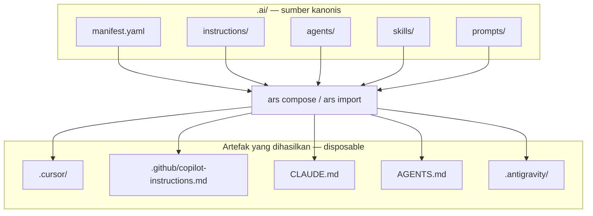

# Pengetahuan AI Coding Portabel dengan ARES

## Apa yang Dibangun

[ARES](https://github.com/okfriansyah-moh/ares) (AI Repository Standard) adalah CLI Go
yang memungkinkan repositori mendefinisikan pengetahuan AI coding yang tahan lama sekali
di `.ai/`, lalu menghasilkan file spesifik provider untuk Cursor, GitHub Copilot, Claude
Code, OpenAI Codex, dan Antigravity. Aturan emas: hapus file provider yang dihasilkan,
jalankan `ars compose`, dan semuanya ter-regenerasi dari `.ai/`.

## Masalah

Tim yang mengadopsi alat AI coding mengakumulasi pengetahuan terfragmentasi: aturan di
`.cursor/`, instruksi di `.github/copilot-instructions.md`, `CLAUDE.md`, `AGENTS.md` —
masing-masing drift secara independen. Berganti alat berarti menulis ulang pengetahuan.
Tim multi-alat memelihara salinan duplikat dan tidak konsisten.

## Ringkasan Arsitektur



ARES adalah CLI lokal berbasis file — bukan runtime agen, workflow engine, atau web app.

## Evolusi dan Milestone

| Milestone | Yang dirilis |
| --------- | ------------ |
| Spesifikasi ARS v1 | Format direktori `.ai/` didefinisikan di `SPEC.md` |
| CLI inti | `ars init`, `ars validate`, `ars compose`, `ars import` |
| Compose multi-provider | Target Cursor, Copilot, Claude, Codex |
| Refactor skills (PR #7) | Format dan validasi `.ai/skills/` direstrukturisasi |
| Dukungan Antigravity (PR #8) | Compose dan import untuk provider Antigravity |
| Binary release | macOS, Linux, Windows via GitHub Releases |

## Keputusan Kunci

| Keputusan | Alasan |
| -------- | ------ |
| `.ai/` sebagai satu sumber kebenaran | File provider dihasilkan, tidak pernah dipelihara manual |
| Simetri import + compose | Tim bisa migrasi dari format provider yang ada |
| CLI lokal saja | Tanpa server, tanpa database, tanpa runtime agen |
| `ars validate` di CI | Tangkap drift struktural sebelum merge |
| Pertahankan `AGENTS.md` yang ada | Compose Codex melewati overwrite jika file sudah ada |

## Format Repositori

```text
.ai/
  manifest.yaml                 metadata proyek
  instructions/<name>.md         instruksi seluruh repositori
  agents/<name>/AGENT.md         peran agen, tanggung jawab, batasan
  skills/<name>/SKILL.md         pengetahuan reusable
  prompts/<name>.md              template prompt reusable
```

## Pelajaran yang Dipetik

1. **Artefak yang dihasilkan bersifat disposable** — jika Anda mengedit manual `.cursor/rules/`,
   perubahan hilang pada compose berikutnya. Edit `.ai/` sebagai gantinya.
2. **Import sebelum compose saat migrasi** — `ars import cursor` membawa aturan yang ada
   ke `.ai/` tanpa menulis ulang dari awal.
3. **Validasi di CI** — `ars validate --json` menangkap referensi rusak sebelum mencapai
   mesin setiap developer.
4. **Paritas provider adalah tujuan** — satu pohon pengetahuan, banyak output alat.

## Terkait

- [Deterministic Agentic Orchestrator](/docs/concepts/deterministic-agentic-orchestrator)
- [LLM Guardrails](/docs/concepts/llm-guardrails)

## Sumber

- Repositori: [okfriansyah-moh/ares](https://github.com/okfriansyah-moh/ares)
- Pull request: [#7 skills refactor](https://github.com/okfriansyah-moh/ares/pull/7), [#8 Antigravity support](https://github.com/okfriansyah-moh/ares/pull/8)
- Spesifikasi: `SPEC.md` di repo sumber
