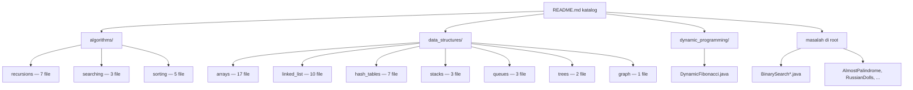

# Katalog Pembelajaran Struktur Data & Algoritma

## Apa yang Dibangun

[data-structure-and-algorithm](https://github.com/okfriansyah-moh/data-structure-and-algorithm)
adalah repositori pembelajaran pribadi jangka panjang dengan **70+ file sumber Java** yang
mencakup algoritma fundamental, struktur data klasik, dynamic programming, dan masalah
bergaya wawancara. Setiap implementasi bisa dijalankan via method `main` atau eksekusi
bergaya JUnit, diorganisir di bawah `src/main/java/zero/to/mastery/` per topik.

**Katalog README** komprehensif (diperbarui Agustus 2026) memetakan setiap file ke
kategorinya, kompleksitas (jika relevan), dan deskripsi satu baris — mengubah repo menjadi
referensi yang bisa dinavigasi, bukan tumpukan solusi datar.

## Masalah

Mempelajari struktur data dan algoritma dari submission LeetCode acak atau gist tersebar
membuat sulit untuk:

- Melihat hubungan antar implementasi (mis. linked list singly vs doubly vs circular).
- Membandingkan keluarga algoritma (bubble vs merge vs quick sort berdampingan).
- Mengunjungi kembali topik bulan kemudian tanpa mencari ulang.

Repositori pembelajaran yang tahan lama membutuhkan **taksonomi + kode yang bisa dijalankan + satu indeks**.

## Mengapa Masalah Ini Sulit

Pengetahuan DSA mencakup banyak topik independen dengan model mental berbeda — base case
rekursi, manipulasi pointer di linked list, state traversal graf, dan tabel memoization
dynamic programming. Tanpa layout package konsisten dan indeks README, konsep yang sama
diimplementasikan ulang dengan nama tidak konsisten dan hilang di pohon direktori.

## Model Mental untuk Pemula

Bayangkan **perpustakaan dengan rak berlabel**:

- **Rak algoritma** — resep yang mentransformasi atau mencari data (sort, search, recurse).
- **Rak struktur data** — wadah yang menyimpan data (array, list, stack, tree).
- **Rak problem solving** — pola wawancara yang menggabungkan keduanya.

README adalah katalog kartu. Setiap file Java adalah satu buku yang bisa dibuka dan dijalankan.

## Persyaratan dan Batasan

| Persyaratan | Cara repo memenuhi |
| ----------- | ------------------ |
| Implementasi bisa dijalankan | Method `main` di kelas algoritma |
| Kategori progresif | Package per topik di bawah `zero.to.mastery` |
| Mudah ditemukan | Tabel README menaut ke setiap file |
| Build standar | Maven `pom.xml` dengan Java 11 |
| Cakupan wawancara | Masalah klasik (two sum, trapping rain water, dll.) |

## Ringkasan Arsitektur



## Alur Eksekusi

1. Pembaca membuka `README.md` dan memilih topik (mis. Merge Sort).
2. README menaut ke `src/main/java/zero/to/mastery/algorithms/sorting/MergeSort.java`.
3. Pembaca menjalankan method `main` kelas (IDE atau `mvn compile exec:java`).
4. Implementasi mencetak langkah perantara (mis. trace split/merge di merge sort).
5. Pembaca membandingkan dengan algoritma tetangga di package yang sama (bubble, quick, dll.).

## Komponen Penting

| Kategori | Jumlah | File representatif |
| -------- | -----: | ------------------ |
| Masalah array | 17 | `TwoPairSum.java`, `TrappingRainWater.java`, `RotateMatrix90d.java` |
| Linked list | 10 | Varian singly, doubly, circular di bawah `linked_list/` |
| Sorting | 5 | `BubbleSort`, `MergeSort`, `QuickSort`, `InsertionSort`, `SelectionSort` |
| Rekursi | 7 | `Factorial`, `Fibonacci`, `GreatestCommonDivision` |
| Searching | 3 | `BreadthFirstSearch`, `DepthFirstSearch`, `SearchNode` |
| Hash table | 7 | Implementasi hash map kustom dan penanganan collision |
| Stack / Queue | 6 | `Stack`, varian queue dengan backing array dan linked |
| Tree / Graph | 3 | Traversal tree, dukungan pencarian graf |
| Dynamic programming | 1 | `DynamicFibonacci.java` |
| Masalah di root | 8+ | `BinarySearchTargetInArray`, `AlmostPalindrome`, dll. |

## Contoh Implementasi yang Disederhanakan

Merge sort dengan merge stabil (disederhanakan dari sumber — menggunakan `<=` untuk stabilitas):

```java
public static List<Integer> merge(List<Integer> left, List<Integer> right) {
    List<Integer> merged = new ArrayList<>();
    int leftIndex = 0, rightIndex = 0;
    while (leftIndex < left.size() && rightIndex < right.size()) {
        if (left.get(leftIndex) <= right.get(rightIndex)) {
            merged.add(left.get(leftIndex++));
        } else {
            merged.add(right.get(rightIndex++));
        }
    }
    merged.addAll(left.subList(leftIndex, left.size()));
    merged.addAll(right.subList(rightIndex, right.size()));
    return merged;
}
```

README mengkatalogkan kompleksitas untuk algoritma sorting:

| Algoritma | Waktu | Ruang |
| --------- | ----- | ----- |
| Bubble Sort | O(n²) | O(1) |
| Merge Sort | O(n log n) | O(n) |
| Quick Sort | O(n log n) avg | O(log n) |

## Reliabilitas dan Idempotensi

Setiap kelas mandiri dengan method `main` sendiri. Menjalankan satu file tidak memutasi
state bersama di file lain. Tidak ada database atau layanan bersama — kebenaran lokal pada
setiap implementasi.

## Mode Kegagalan

| Kegagalan | Deteksi | Pemulihan |
| --------- | ------- | --------- |
| Link README usang | 404 di UI GitHub | Perbarui README saat memindah/mengganti nama file |
| Off-by-one di binary search | Indeks salah dikembalikan | Bandingkan dengan varian `BinarySearchStartAndEndOfTarget` |
| Merge sort tidak stabil | Elemen sama berubah urutan | Gunakan `<=` bukan `<` di perbandingan merge |
| Siklus linked list | Loop tak terbatas | Contoh circular list mendokumentasikan deteksi siklus |

## Trade-off dan Alternatif yang Ditolak

| Keputusan | Alasan | Alternatif yang ditolak |
| --------- | ------ | ----------------------- |
| Satu kelas per konsep | Mudah dijalankan dan dibagikan individual | Satu mega-kelas dengan semua algoritma |
| README sebagai katalog | Tanpa langkah build untuk menelusuri topik | Situs docs ter-generate (setup lebih berat) |
| Java 11 + Maven | Bahasa wawancara yang familiar | Repo poliglot multi-bahasa |
| Trace println verbose | Mengajarkan langkah algoritma | Implementasi senyap |
| Dependensi Lombok | Lebih sedikit boilerplate di data class | POJO Java murni di mana-mana |

## Pengujian

JUnit 4 tercantum sebagai dependensi di `pom.xml`. Banyak file menggunakan method `main`
untuk demonstrasi daripada kelas test formal. Repo memprioritaskan **trace eksekusi yang
mudah dibaca** daripada cakupan test komprehensif.

## Operasi dan Observabilitas

```bash
git clone https://github.com/okfriansyah-moh/data-structure-and-algorithm.git
cd data-structure-and-algorithm
mvn compile
# Jalankan kelas individual dari IDE atau:
mvn -q exec:java -Dexec.mainClass="zero.to.mastery.algorithms.sorting.MergeSort"
```

Membutuhkan Java 11+ dan Maven.

## Pelajaran yang Dipetik

1. **Katalog README adalah lapisan navigasi termurah** — 70 file tetap usable ketika setiap
   file punya baris tabel dengan link dan deskripsi.
2. **Package per topik, bukan per tanggal** — `algorithms/sorting/` mengalahkan `week3/`
   untuk mengingat kembali.
3. **Cetak state perantara** — log split/merge merge sort mengajarkan divide-and-conquer
   lebih baik daripada array terurut akhir saja.
4. **Simpan masalah wawancara dekat struktur datanya** — `TwoPairSum` berada di bawah
   `arrays/`, bukan dump "leetcode" terpisah.

## Sumber

- Repositori: [okfriansyah-moh/data-structure-and-algorithm](https://github.com/okfriansyah-moh/data-structure-and-algorithm)
- Commit: [`d1b8540`](https://github.com/okfriansyah-moh/data-structure-and-algorithm/commit/d1b854098c96aa9ff22f8deea853953fe7a0477c), [`af6f156`](https://github.com/okfriansyah-moh/data-structure-and-algorithm/commit/af6f1568259904663cb9ff08b41e811d7930f744) (pembaruan katalog README, Agustus 2026)
