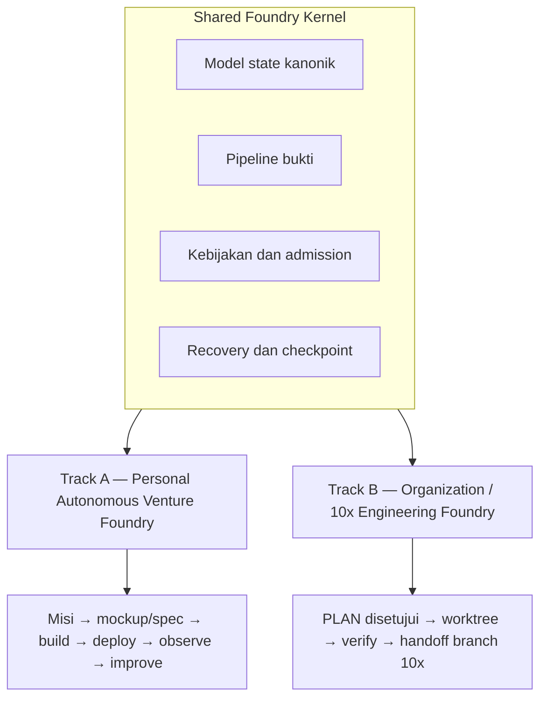

# Delivery Foundry: Loop Pengiriman Perangkat Lunak Otonom

## Apa yang Dibangun

[Delivery Foundry](https://github.com/okfriansyah-moh/the-foundry) mengemas arsitektur V12
untuk **pengiriman perangkat lunak berbasis loop**: berikan `PLAN.md`, mockup, atau pernyataan
misi — sistem berloop build → verify → deploy → observe → improve sampai pekerjaan
selesai secara jujur atau terbukti terblokir.

Repositori publik (dibuat 2026-07-20) berisi:

- **Arsitektur normatif** — indeks master `delivery_foundry.md` plus kontrak modular di
  `docs/architecture/`, `docs/workflows/`, `docs/autonomy/`, `docs/security/`, dan
  `docs/operations/`
- **Roadmap implementasi** — 83 task bernomor berurutan di `PLAN_7.md` dengan artikel
  konstitusi C1–C22
- **Bootstrap Task 1** — Makefile berbasis Docker, CI, modul Go, dan scaffold paket
  untuk kernel bersama

Implementasi di luar scaffolding sedang berjalan; halaman ini mendeskripsikan intent
desain dan roadmap proyek sebagaimana didokumentasikan di sumber.

## Masalah

Tim engineering ingin agen AI mengirim perangkat lunak secara otonom — dari sketsa mockup
ke produk terdeploy, atau dari rencana disetujui ke commit terverifikasi di branch
bersama. Dua konteks membutuhkan tata kelola berbeda:

- **Builder solo** menginginkan otonomi terbatas: discover, build, deploy, amati revenue,
  dan self-improve di dalam envelope eksplisit dengan touchpoint minimal.
- **Organisasi** menginginkan kontrol lebih ketat: rencana terverifikasi provenance,
  eksekusi multi-repositori, dan handoff ke workflow branch 10x yang ada tanpa kepercayaan
  implisit pada agen.

Keduanya membutuhkan kernel tahan lama yang sama — state, bukti, recovery, kebijakan —
bukan dua stack orchestration terpisah.

## Ringkasan Arsitektur



**Track A** menerima misi (contoh terdokumentasi: capai net monthly recurring revenue
terverifikasi), menjalankan venture loop dengan verifikasi sintetis dan self-adaptation
terbatas, serta menggunakan tier admission A0/A1/A2/H plus Mission Setup Ceremony
sebelum operasi tanpa pengawasan.

**Track B** menerima file `PLAN.md` disetujui manusia, mengeksekusi di satu atau banyak
repositori, dan dapat berhenti di `TEN_X_BRANCH_HANDOFF_READY` — grup atomik terverifikasi
di branch 10x bersama tanpa PR, merge, atau deployment dalam workflow itu.

## Evolusi dan Milestone

| Milestone | Apa yang dibuktikan / dikirim |
| --------- | ----------------------------- |
| Set dokumen V12 | Kontrak normatif modular; konten V11 dipertahankan via migration map |
| Task 1 (✅ 2026-07-20) | Toolchain dev Docker, CI, scaffold paket Go, fitness v0 |
| Shared Kernel Proof (direncanakan) | Admit satu rencana → satu repo → worktree → verify → bukti → lanjut setelah restart |
| Venture MLS (Track A) | Misi → produk deployable → observasi billing → satu siklus perbaikan terbatas |
| 10x MLS (Track B) | Rencana disetujui → provenance → grup atomik → push branch 10x langsung |
| Venture mission-capable | Perbaikan otonom dalam envelope drift governance |
| 10x org-production | Orkestrasi multi-repo dengan integrasi organisasi |

Estimasi roadmap dan asumsi builder didokumentasikan secara jujur di
`docs/architecture/overview.md` — rentang dengan tingkat keyakinan, bukan presisi palsu.

## Keputusan Kunci

| Keputusan | Alasan |
| --------- | ------ |
| Dua track, satu kernel | Menghindari serialisasi otonomi venture di belakang milestone org |
| Mockup sebagai entry kelas satu | `docs/workflows/mockup-to-delivery.md` dengan label Observed/Inferred/Assumed |
| Rename PEC dari "Forge" | Menghindari bentrok dengan Atlassian Forge; kernel mempertahankan otoritas |
| Persyaratan host hanya Docker | Docker + GNU make; tanpa instal Go/Node/Playwright lokal |
| Task gated konstitusi | Setiap task rencana dicek terhadap C1–C22; `make fitness` di exit milestone |
| Autonomous plan runner (Task 3) | Orchestrator ber-tier risiko menggantikan trigger task manual dari Task 4 |
| Empat lineage image container | Aturan anti-sprawl: dev, postgres/temporal, executor sandbox, release binary |

## Tipe Entry dan Workflow

Semua entry konvergen ke admission deterministik, lalu loop delivery standar:

| Tipe entry | Dokumen workflow tipikal |
| ---------- | ------------------------ |
| `PLAN.md` disetujui | `docs/workflows/direct-plan.md` |
| Mockup atau sketsa | `docs/workflows/mockup-to-delivery.md` |
| Pernyataan misi | `docs/workflows/venture-loop.md` |
| Rencana org multi-repo | `docs/workflows/multi-repository.md` |
| Branch bersama 10x | `docs/workflows/ten-x-branch.md` |

Semantik recovery, retry, dan penyelesaian jujur ada di `docs/workflows/recovery.md`.

## Layout Repositori (saat ini)

```text
delivery_foundry.md          indeks arsitektur master
docs/                      kontrak normatif (architecture, workflows, autonomy, security)
PLAN_7.md                  rencana implementasi 83 task
deploy/                    toolchain dev Docker (Dockerfile.dev, docker-compose.yaml)
internal/                  paket Go (kernel, pec, state, admission, evidence, …)
scripts/fitness.sh         constitution check v0
Makefile                   target docker-wrapped: bootstrap, test, lint, fitness
```

## Pelajaran

1. **Dokumentasikan otoritas sebelum kode** — V12 memindahkan prosa V11 ke kontrak modular
   sehingga agen implementasi hanya menerima bagian normatif yang relevan.
2. **Estimasi roadmap jujur** — Scope dual-track meningkatkan total effort; arsitektur
   menyatakan ini secara eksplisit alih-alih menyembunyikannya di balik estimasi single-track.
3. **Task bootstrap harus manual** — Task 1–3 membutuhkan trigger manusia (atau nanti,
   runner) sebelum autonomous plan runner ada.
4. **Fitness function memperoleh skor desain** — Spesifikasi menargetkan desain kualitas 10/10
   tetapi menyatakan skor diperoleh hanya saat fault-injection, keamanan, dan tes SLO lulus.
5. **Karantina legacy** — `docs/legacy/` ditandai sebagai riwayat superseded dan tidak
   boleh diberikan ke agen implementasi.

## Terkait

- [Arsitektur Control Plane Delivery Foundry](/id/docs/systems/delivery-foundry-control-plane)
- [Deterministic AI Pipelines](/id/docs/concepts/deterministic-ai-pipelines)
- [LLM Guardrails](/id/docs/concepts/llm-guardrails)

## Sumber

- Repository: [okfriansyah-moh/the-foundry](https://github.com/okfriansyah-moh/the-foundry)
- Commit: [`58632a0`](https://github.com/okfriansyah-moh/the-foundry/commit/58632a0), [`9409080`](https://github.com/okfriansyah-moh/the-foundry/commit/9409080)
- Review: `V12_REVIEW_REPORT.md` di repo sumber
- Changelog: `CHANGELOG.md` di repo sumber
