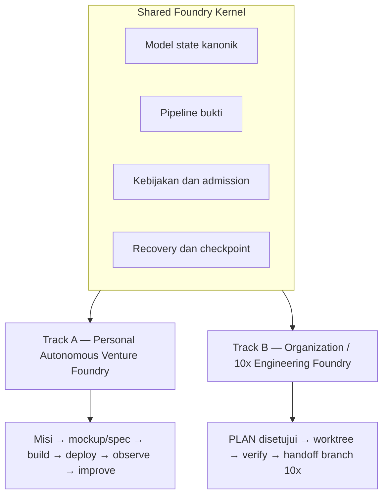

# Delivery Foundry: Loop Pengiriman Perangkat Lunak Otonom

## Apa yang Dibangun

[Delivery Foundry](https://github.com/okfriansyah-moh/the-foundry) mengemas arsitektur V12
untuk **pengiriman perangkat lunak berbasis loop**: berikan `PLAN.md`, mockup, atau pernyataan
misi — sistem berloop build → verify → deploy → observe → improve sampai pekerjaan
selesai secara jujur atau terbukti terblokir.

Repositori publik (dibuat 2026-07-20) berisi:

- **Arsitektur normatif** — indeks master `docs/foundry/delivery_foundry.md` plus kontrak modular di
  `docs/foundry/docs/` (architecture, workflows, autonomy, security, operations)
- **Roadmap implementasi** — 83 task bernomor berurutan di `docs/PLAN.md` dengan artikel
  konstitusi C1–C22
- **Task 1–22 selesai (2026-07-25)** — via [PR #1](https://github.com/okfriansyah-moh/the-foundry/pull/1):
  agent harness, plan runner otonom, workflow kernel Temporal, CLI/daemon, fitness suite,
  migrasi, profiles, dan policy compiler v1
- **Task 23–40 selesai (2026-07-27)** — via [PR #2](https://github.com/okfriansyah-moh/the-foundry/pull/2):
  OPA PDP, rantai provenance, auth OIDC/WebAuthn, ledger extops, SCM GitHub write, cost
  accounting, engine Telegram, stack observabilitas, sandbox OCI rootless, HTTP API, drill
  backup/restore, dan engine MissionContract — **exit M1 Production Foundation**
- **Task 41–60 selesai (2026-07-28)** — via [PR #4](https://github.com/okfriansyah-moh/the-foundry/pull/4) dan
  [PR #5](https://github.com/okfriansyah-moh/the-foundry/pull/5): Mission Setup Ceremony, template produk,
  siklus perbaikan terbatas, **exit venture MLS Track A**, paket tata kelola org, PEC v1, grup atomik,
  Branch Integrator, dan semantik terminal handoff 10x
- **Task 61–75 selesai (2026-07-28)** — via [PR #6](https://github.com/okfriansyah-moh/the-foundry/pull/6):
  bukti larangan TenX, adapter SCM Bitbucket, **exit 10x MLS Track B**, dan **exit M2 Operational Hardening**
  (chaos, retention, drill tamper audit, alert SLO, drill DR, hardening Telegram, release versioned)
- **Task 76–110 selesai (2026-07-28 – 2026-07-30)** — via [PR #7](https://github.com/okfriansyah-moh/the-foundry/pull/7) dan
  [PR #8](https://github.com/okfriansyah-moh/the-foundry/pull/8): registry kapabilitas executor, routing
  berbasis kebijakan, adapter multi-provider, UX CLI+API mission/plan, dan gate CI topologi PLAN
- **Task 111–120 selesai (2026-07-31)** — via [PR #9](https://github.com/okfriansyah-moh/the-foundry/pull/9):
  intake bertahap dapat dilanjutkan (`mission start --idea`), transport inbound Telegram, sandbox wajib,
  jalur kebijakan fail-closed, isolasi profil, dan rekonsiliasi actual-cost — **M5 gap-closure**
- **Shared Kernel Proof (exit M0)** — demo end-to-end membuktikan admit → worktree → verify →
  bukti → restart checkpoint

Milestone PLAN setelah Task 120 tetap di indeks sumber; kedua track produk kini
memiliki bukti exit MLS terdokumentasi.

## Masalah

Tim engineering ingin agen AI mengirim perangkat lunak secara otonom — dari sketsa mockup
ke produk terdeploy, atau dari rencana disetujui ke commit terverifikasi di branch
bersama. Dua konteks membutuhkan tata kelola berbeda:

- **Builder solo** menginginkan otonomi terbatas: discover, build, deploy, amati revenue,
  dan self-improve di dalam envelope eksplisit dengan touchpoint minimal.
- **Organisasi** menginginkan kontrol lebih ketat: rencana terverifikasi provenance,
  eksekusi multi-repositori, dan handoff ke workflow branch 10x yang ada tanpa kepercayaan
  implisit pada agen.

Keduanya membutuhkan kernel tahan lama yang sama — state, bukti, recovery, kebijakan —
bukan dua stack orchestration terpisah.

## Ringkasan Arsitektur


```mermaid
flowchart TD
  subgraph Kernel["Shared Foundry Kernel"]
    STATE[Model state kanonik]
    EVID[Pipeline bukti]
    POL[Kebijakan dan admission]
    REC[Recovery dan checkpoint]
  end

  Kernel --> TA["Track A — Personal Autonomous Venture Foundry"]
  Kernel --> TB["Track B — Organization / 10x Engineering Foundry"]

  TA --> TAFlow["Misi → mockup/spec → build → deploy → observe → improve"]
  TB --> TBFlow["PLAN disetujui → worktree → verify → handoff branch 10x"]
```

**Track A** menerima misi (contoh terdokumentasi: capai net monthly recurring revenue
terverifikasi), menjalankan venture loop dengan verifikasi sintetis dan self-adaptation
terbatas, serta menggunakan tier admission A0/A1/A2/H plus Mission Setup Ceremony
sebelum operasi tanpa pengawasan.

**Track B** menerima file `PLAN.md` disetujui manusia, mengeksekusi di satu atau banyak
repositori, dan dapat berhenti di `TEN_X_BRANCH_HANDOFF_READY` — grup atomik terverifikasi
di branch 10x bersama tanpa PR, merge, atau deployment dalam workflow itu.

## Evolusi dan Milestone

| Milestone | Apa yang dibuktikan / dikirim |
| --------- | ----------------------------- |
| Set dokumen V12 | Kontrak normatif modular; konten V11 dipertahankan via migration map |
| Task 1 (✅ 2026-07-20) | Toolchain dev Docker, CI, scaffold paket Go, fitness v0 |
| Task 2–22 (✅ 2026-07-25, PR #1) | Agent harness (`.ai/`), plan runner, kernel Temporal, CLI/daemon, SKP e2e, migrasi + policy compiler |
| M0 — Shared Kernel Proof (✅) | Admit satu rencana → worktree → verify → bukti → **lanjut setelah restart** |
| Task 23–40 (✅ 2026-07-27, PR #2) | OPA PDP, rantai provenance/audit, strong auth, ledger extops, SCM write, cost/anggaran, Telegram, observabilitas, sandbox OCI, API server, backup/restore, mission |
| M1 — Production Foundation (✅) | Acceptance `make m1-exit`: GitHub e2e, gate WebAuthn, soak notify, audit verify, drill brownout, backup/restore |
| Task 41–50 (✅ 2026-07-28, PR #4) | Mission Setup Ceremony, template produk, config pemetaan kebijakan/efek |
| Task 51–53 (✅ 2026-07-28, PR #5) | Siklus perbaikan terbatas, digest veto, **exit venture MLS Track A** (`make e2e-venture`) |
| Task 54–60 (✅ 2026-07-28, PR #5) | Paket tata kelola org, validasi provenance org, PEC v1, grup atomik, Branch Integrator, drift guard, terminal handoff 10x |
| Task 61–63 (✅ 2026-07-28, PR #6) | Bukti larangan TenX (C15), adapter SCM Bitbucket, **exit 10x MLS Track B** (`make e2e-tenx`) |
| M2 — Operational Hardening (✅) | Task 64–73: suite chaos, fairness backpressure, retention/PII, drill tamper audit, alert SLO, rekonsiliasi cost, red-team, drill DR, soak Telegram, goreleaser — `make m2-exit` |
| Bootstrap M3 (✅ parsial) | Task 74–75: pipeline auto-promosi L0 dan registry tunable (PR #6) |
| Task 76–93 (✅ 2026-07-28, PR #7) | Registry kapabilitas executor, routing berbasis kebijakan, adapter multi-provider |
| Task 100–110 (✅ 2026-07-30, PR #8) | UX CLI+API mission/plan, gate CI topologi/validasi/research-boundary PLAN |
| M5 gap-closure (✅ 2026-07-31, PR #9) | Task 111–120: intake dapat dilanjutkan, inbound Telegram, sandbox wajib, kebijakan fail-closed, isolasi profil, rekonsiliasi cost |
| Evolusi pasca-120 | Item indeks PLAN tersisa — dilacak di `docs/PLAN.md` sumber |

Estimasi roadmap dan asumsi builder didokumentasikan secara jujur di
`docs/architecture/overview.md` — rentang dengan tingkat keyakinan, bukan presisi palsu.

## Keputusan Kunci

| Keputusan | Alasan |
| --------- | ------ |
| Dua track, satu kernel | Menghindari serialisasi otonomi venture di belakang milestone org |
| Mockup sebagai entry kelas satu | `docs/workflows/mockup-to-delivery.md` dengan label Observed/Inferred/Assumed |
| Rename PEC dari "Forge" | Menghindari bentrok dengan Atlassian Forge; kernel mempertahankan otoritas |
| Persyaratan host hanya Docker | Docker + GNU make; tanpa instal Go/Node/Playwright lokal |
| Task gated konstitusi | Setiap task rencana dicek terhadap C1–C22; `make fitness` di exit milestone |
| Autonomous plan runner (Task 3) | Orchestrator AUTO/GATED ber-tier risiko; alat bootstrap pensiun setelah kernel admit backlog |
| Agent harness multi-provider (Task 2) | Sumber canonical ARES `.ai/` dikomposisi ke Claude/Codex; sebelas skill untuk enam peran |
| Constitution fitness (Task 18) | `fitlint` menegakkan aturan enum C1, batas import, dan doc link di CI |
| Empat lineage image container | Aturan anti-sprawl: dev, postgres/temporal, executor sandbox, release binary |

## Tipe Entry dan Workflow

Semua entry konvergen ke admission deterministik, lalu loop delivery standar:

| Tipe entry | Dokumen workflow tipikal |
| ---------- | ------------------------ |
| `PLAN.md` disetujui | `docs/workflows/direct-plan.md` |
| Mockup atau sketsa | `docs/workflows/mockup-to-delivery.md` |
| Pernyataan misi | `docs/workflows/venture-loop.md` |
| Rencana org multi-repo | `docs/workflows/multi-repository.md` |
| Branch bersama 10x | `docs/workflows/ten-x-branch.md` |

Semantik recovery, retry, dan penyelesaian jujur ada di `docs/workflows/recovery.md`.

## Layout Repositori (saat ini)

```text
docs/foundry/delivery_foundry.md   indeks arsitektur master
docs/PLAN.md                       rencana 120+ task (Task 1–120 ✅ melalui M5)
docs/architecture.md               konstitusi satu halaman + peta link
docs/notes/m1-exit-report.md       bukti acceptance M1
docs/notes/m2-exit-report.md       bukti exit hardening operasional M2
docs/notes/track-a-exit-report.md  bukti exit venture MLS Track A
docs/notes/track-b-exit-report.md  bukti exit 10x MLS Track B
config/executor-*.yaml             registry kapabilitas, routing, dan tabel model
config/profiles/                   paket tata kelola personal vs organization-10x
.ai/                               agent harness canonical (format ARES)
AGENTS.md / CLAUDE.md              tampilan provider terkomposisi (jangan edit manual)
api/openapi.yaml                   kontrak HTTP API /v1 (paritas CLI)
cmd/foundry/                       CLI operator (mission, intake, plan, cost, audit)
cmd/foundryd/                      worker kernel Temporal + HTTP API + sandbox runner
cmd/fitlint/                       linter konstitusi (capability, topology, env, subprocess)
tools/planrunner/                  orkestrator task otonom bootstrap
deploy/                            toolchain dev Docker, postgres/temporal, prometheus/grafana
internal/                          paket Go (kernel, pec, intake, integrator, retention, …)
scripts/backup.sh, restore.sh      backup/restore dengan verifikasi manifest
Makefile                           target dibungkus docker termasuk m1-exit, m2-exit, e2e-venture, e2e-tenx
```

## Pelajaran

1. **Dokumentasikan otoritas sebelum kode** — V12 memindahkan prosa V11 ke kontrak modular
   sehingga agen implementasi hanya menerima bagian normatif yang relevan.
2. **Estimasi roadmap jujur** — Scope dual-track meningkatkan total effort; arsitektur
   menyatakan ini secara eksplisit alih-alih menyembunyikannya di balik estimasi single-track.
3. **Bootstrap lalu kernel** — Task 1–3 membutuhkan trigger manual atau runner; PR #1
   mengirim runner dan workflow kernel pertama sehingga task berikutnya dapat dogfood Foundry.
4. **Fitness function memperoleh skor desain** — Spesifikasi menargetkan desain kualitas 10/10
   tetapi menyatakan skor diperoleh hanya saat fault-injection, keamanan, dan tes SLO lulus.
5. **Karantina legacy** — `docs/legacy/` ditandai sebagai riwayat superseded dan tidak
   boleh diberikan ke agen implementasi.

## Terkait

- [Arsitektur Control Plane Delivery Foundry](/id/docs/systems/delivery-foundry-control-plane)
- [Deterministic AI Pipelines](/id/docs/concepts/deterministic-ai-pipelines)
- [LLM Guardrails](/id/docs/concepts/llm-guardrails)

## Sumber

- Repository: [okfriansyah-moh/the-foundry](https://github.com/okfriansyah-moh/the-foundry)
- Pull request: [#9](https://github.com/okfriansyah-moh/the-foundry/pull/9), [#8](https://github.com/okfriansyah-moh/the-foundry/pull/8), [#7](https://github.com/okfriansyah-moh/the-foundry/pull/7), [#6](https://github.com/okfriansyah-moh/the-foundry/pull/6), [#5](https://github.com/okfriansyah-moh/the-foundry/pull/5), [#4](https://github.com/okfriansyah-moh/the-foundry/pull/4), [#2](https://github.com/okfriansyah-moh/the-foundry/pull/2), [#1](https://github.com/okfriansyah-moh/the-foundry/pull/1)
- Laporan exit: `docs/notes/m1-exit-report.md`, `docs/notes/m2-exit-report.md`, `docs/notes/track-a-exit-report.md`, `docs/notes/track-b-exit-report.md`
- Review: `docs/foundry/V12_REVIEW_REPORT.md` di repo sumber
- Changelog: `docs/foundry/CHANGELOG.md` di repo sumber
- Indeks rencana: `docs/PLAN.md` §D Master Task Index (Task 1–120 ✅)
