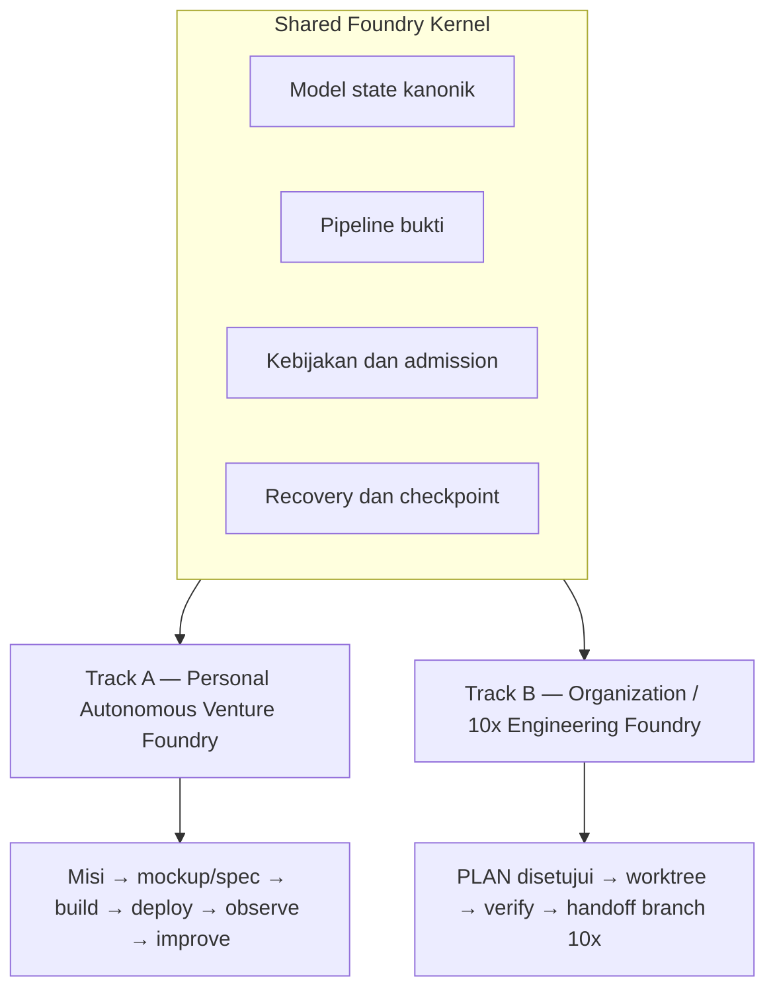

# Delivery Foundry: Loop Pengiriman Perangkat Lunak Otonom

## Apa yang Dibangun

[Delivery Foundry](https://github.com/okfriansyah-moh/the-foundry) mengemas arsitektur V12
untuk **pengiriman perangkat lunak berbasis loop**: berikan `PLAN.md`, mockup, atau pernyataan
misi — sistem berloop build → verify → deploy → observe → improve sampai pekerjaan
selesai secara jujur atau terbukti terblokir.

Repositori publik (dibuat 2026-07-20) berisi:

- **Arsitektur normatif** — indeks master `docs/foundry/delivery_foundry.md` plus kontrak modular di
  `docs/foundry/docs/` (architecture, workflows, autonomy, security, operations)
- **Roadmap implementasi** — 83 task bernomor berurutan di `docs/PLAN.md` dengan artikel
  konstitusi C1–C22
- **Task 1–22 selesai (2026-07-25)** — via [PR #1](https://github.com/okfriansyah-moh/the-foundry/pull/1):
  agent harness, plan runner otonom, workflow kernel Temporal, CLI/daemon, fitness suite,
  migrasi, profiles, dan policy compiler v1
- **Task 156–161 selesai (2026-08-08)** — via [PR #14](https://github.com/okfriansyah-moh/the-foundry/pull/14):
  store config operator berbasis Postgres (`operatorcfg.Store`), policy/kuota/model versi,
  jalur load katalog packaging DB, dan `-pg-dsn` pada perintah `foundry catalog`
- **Shared Kernel Proof (exit M0)** — demo end-to-end membuktikan admit → worktree → verify →
  bukti → restart checkpoint

Task 23–155 dan 162–83 (integrasi OPA, rantai provenance penuh, track venture dan 10x) masih terbuka;
halaman ini melacak evolusi proyek sebagaimana didokumentasikan di sumber.

## Masalah

Tim engineering ingin agen AI mengirim perangkat lunak secara otonom — dari sketsa mockup
ke produk terdeploy, atau dari rencana disetujui ke commit terverifikasi di branch
bersama. Dua konteks membutuhkan tata kelola berbeda:

- **Builder solo** menginginkan otonomi terbatas: discover, build, deploy, amati revenue,
  dan self-improve di dalam envelope eksplisit dengan touchpoint minimal.
- **Organisasi** menginginkan kontrol lebih ketat: rencana terverifikasi provenance,
  eksekusi multi-repositori, dan handoff ke workflow branch 10x yang ada tanpa kepercayaan
  implisit pada agen.

Keduanya membutuhkan kernel tahan lama yang sama — state, bukti, recovery, kebijakan —
bukan dua stack orchestration terpisah.

## Ringkasan Arsitektur


```mermaid
flowchart TD
  subgraph Kernel["Shared Foundry Kernel"]
    STATE[Model state kanonik]
    EVID[Pipeline bukti]
    POL[Kebijakan dan admission]
    REC[Recovery dan checkpoint]
  end

  Kernel --> TA["Track A — Personal Autonomous Venture Foundry"]
  Kernel --> TB["Track B — Organization / 10x Engineering Foundry"]

  TA --> TAFlow["Misi → mockup/spec → build → deploy → observe → improve"]
  TB --> TBFlow["PLAN disetujui → worktree → verify → handoff branch 10x"]
```

**Track A** menerima misi (contoh terdokumentasi: capai net monthly recurring revenue
terverifikasi), menjalankan venture loop dengan verifikasi sintetis dan self-adaptation
terbatas, serta menggunakan tier admission A0/A1/A2/H plus Mission Setup Ceremony
sebelum operasi tanpa pengawasan.

**Track B** menerima file `PLAN.md` disetujui manusia, mengeksekusi di satu atau banyak
repositori, dan dapat berhenti di `TEN_X_BRANCH_HANDOFF_READY` — grup atomik terverifikasi
di branch 10x bersama tanpa PR, merge, atau deployment dalam workflow itu.

## Evolusi dan Milestone

| Milestone | Apa yang dibuktikan / dikirim |
| --------- | ----------------------------- |
| Set dokumen V12 | Kontrak normatif modular; konten V11 dipertahankan via migration map |
| Task 1 (✅ 2026-07-20) | Toolchain dev Docker, CI, scaffold paket Go, fitness v0 |
| Task 2–22 (✅ 2026-07-25, PR #1) | Agent harness (`.ai/`), plan runner, kernel Temporal, CLI/daemon, SKP e2e, migrasi + policy compiler |
| Task 156–161 (✅ 2026-08-08, PR #14) | SoT config operator-hot Postgres: `operatorcfg.Store`, policy/kuota/katalog versi, `foundry catalog` berbasis DB |
| M0 — Shared Kernel Proof (✅) | Admit satu rencana → worktree → verify → bukti → **lanjut setelah restart** |
| M1 — Foundation (parsial) | Task 20–22 selesai; OPA PDP, rantai provenance penuh, ledger (Task 23–26) pending |
| Venture MLS (Track A) | Misi → produk deployable → observasi billing → satu siklus perbaikan terbatas |
| 10x MLS (Track B) | Rencana disetujui → provenance → grup atomik → push branch 10x langsung |
| Venture mission-capable | Perbaikan otonom dalam envelope drift governance |
| 10x org-production | Orkestrasi multi-repo dengan integrasi organisasi |

Estimasi roadmap dan asumsi builder didokumentasikan secara jujur di
`docs/architecture/overview.md` — rentang dengan tingkat keyakinan, bukan presisi palsu.

## Keputusan Kunci

| Keputusan | Alasan |
| --------- | ------ |
| Dua track, satu kernel | Menghindari serialisasi otonomi venture di belakang milestone org |
| Mockup sebagai entry kelas satu | `docs/workflows/mockup-to-delivery.md` dengan label Observed/Inferred/Assumed |
| Rename PEC dari "Forge" | Menghindari bentrok dengan Atlassian Forge; kernel mempertahankan otoritas |
| Persyaratan host hanya Docker | Docker + GNU make; tanpa instal Go/Node/Playwright lokal |
| Task gated konstitusi | Setiap task rencana dicek terhadap C1–C22; `make fitness` di exit milestone |
| Autonomous plan runner (Task 3) | Orchestrator AUTO/GATED ber-tier risiko; alat bootstrap pensiun setelah kernel admit backlog |
| Agent harness multi-provider (Task 2) | Sumber canonical ARES `.ai/` dikomposisi ke Claude/Codex; sebelas skill untuk enam peran |
| Constitution fitness (Task 18) | `fitlint` menegakkan aturan enum C1, batas import, dan doc link di CI |
| Empat lineage image container | Aturan anti-sprawl: dev, postgres/temporal, executor sandbox, release binary |
| Postgres operator config SoT (Task 156–161) | Policy, kuota, tarif model, dan katalog packaging berbagi satu store versi; YAML disk seed sekali saat boot daemon |

## Tipe Entry dan Workflow

Semua entry konvergen ke admission deterministik, lalu loop delivery standar:

| Tipe entry | Dokumen workflow tipikal |
| ---------- | ------------------------ |
| `PLAN.md` disetujui | `docs/workflows/direct-plan.md` |
| Mockup atau sketsa | `docs/workflows/mockup-to-delivery.md` |
| Pernyataan misi | `docs/workflows/venture-loop.md` |
| Rencana org multi-repo | `docs/workflows/multi-repository.md` |
| Branch bersama 10x | `docs/workflows/ten-x-branch.md` |

Semantik recovery, retry, dan penyelesaian jujur ada di `docs/workflows/recovery.md`.

## Layout Repositori (saat ini)

```text
docs/foundry/delivery_foundry.md   indeks arsitektur master
docs/PLAN.md                       rencana 83 task (Task 1–22 ✅)
docs/architecture.md               konstitusi satu halaman + peta link
.ai/                               agent harness canonical (format ARES)
AGENTS.md / CLAUDE.md              tampilan provider terkomposisi (jangan edit manual)
cmd/foundry/                       CLI operator
cmd/foundryd/                      worker kernel Temporal
cmd/fitlint/                       linter konstitusi
tools/planrunner/                  orkestrator task otonom bootstrap
deploy/                            toolchain dev Docker + compose postgres/temporal
internal/                          paket Go (kernel, state, admission, evidence, operatorcfg, …)
scripts/fitness.sh                 suite pemeriksaan konstitusi
Makefile                           target dibungkus docker
```

## Pelajaran

1. **Dokumentasikan otoritas sebelum kode** — V12 memindahkan prosa V11 ke kontrak modular
   sehingga agen implementasi hanya menerima bagian normatif yang relevan.
2. **Estimasi roadmap jujur** — Scope dual-track meningkatkan total effort; arsitektur
   menyatakan ini secara eksplisit alih-alih menyembunyikannya di balik estimasi single-track.
3. **Bootstrap lalu kernel** — Task 1–3 membutuhkan trigger manual atau runner; PR #1
   mengirim runner dan workflow kernel pertama sehingga task berikutnya dapat dogfood Foundry.
4. **Fitness function memperoleh skor desain** — Spesifikasi menargetkan desain kualitas 10/10
   tetapi menyatakan skor diperoleh hanya saat fault-injection, keamanan, dan tes SLO lulus.
5. **Karantina legacy** — `docs/legacy/` ditandai sebagai riwayat superseded dan tidak
   boleh diberikan ke agen implementasi.

## Terkait

- [Arsitektur Control Plane Delivery Foundry](/id/docs/systems/delivery-foundry-control-plane)
- [Deterministic AI Pipelines](/id/docs/concepts/deterministic-ai-pipelines)
- [LLM Guardrails](/id/docs/concepts/llm-guardrails)

## Sumber

- Repository: [okfriansyah-moh/the-foundry](https://github.com/okfriansyah-moh/the-foundry)
- Pull request: [#1 — Task 3–22](https://github.com/okfriansyah-moh/the-foundry/pull/1) (merge [`6efd492`](https://github.com/okfriansyah-moh/the-foundry/commit/6efd492d48d99672afea27da565699e8e8a3983d))
- Pull request: [#14 — Task 156–161 operator config Postgres SoT](https://github.com/okfriansyah-moh/the-foundry/pull/14) (merge [`5b01562`](https://github.com/okfriansyah-moh/the-foundry/commit/5b015620a5a676c47dfe806486e82137b7801834))
- Commit sebelumnya: [`58632a0`](https://github.com/okfriansyah-moh/the-foundry/commit/58632a0), [`9409080`](https://github.com/okfriansyah-moh/the-foundry/commit/9409080)
- Review: `docs/foundry/V12_REVIEW_REPORT.md` di repo sumber
- Changelog: `docs/foundry/CHANGELOG.md` di repo sumber
- Indeks rencana: `docs/PLAN.md` §D Master Task Index
