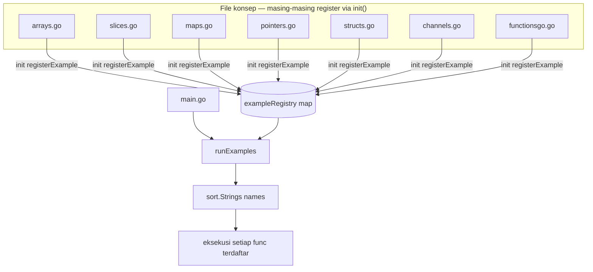

# Go Remembers: Fundamental Go yang Bisa Dijalankan

## Apa yang Dibangun

[go-remembers](https://github.com/okfriansyah-moh/go-remembers) adalah proyek Go kecil
yang mengajarkan konsep inti bahasa melalui contoh terisolasi yang bisa dijalankan. Setiap
konsep berada di file sendiri (`arrays.go`, `channels.go`, `pointers.go`, dan lainnya).
Menjalankan `go run .` mengeksekusi setiap contoh terdaftar dalam urutan alfabetis dan
mencetak output ke terminal.

Repositori ini dibuat pada **2026-08-13** dan berkembang dari array dasar hingga channel,
fungsi, dan komunikasi goroutine dalam satu hari commit iteratif.

## Masalah

Belajar Go dari potongan kode tersebar membuat sulit mengingat perbedaan slice dan array,
kapan menggunakan pointer, atau bagaimana channel mengoordinasikan goroutine.
Copy-paste ke `main.go` untuk setiap eksperimen menimbulkan konflik merge dan menyembunyikan
contoh yang tersedia. Repositori pembelajaran membutuhkan dua properti:

1. **Satu perintah menjalankan semuanya** — tanpa wiring manual saat menambah file topik baru.
2. **Setiap konsep tetap terisolasi** — pembaca bisa membuka satu file dan memahami satu ide.

## Mengapa Masalah Ini Sulit

Fungsi `init()` di Go berjalan sebelum `main()` tetapi tidak menjamin urutan eksekusi
antar file. Pendekatan naif — memanggil fungsi contoh langsung dari `main.go` — mengharuskan
mengedit entry point setiap kali file baru ditambahkan. Untuk repo yang dimaksudkan tumbuh
topik demi topik, friksi itu cepat menumpuk.

## Model Mental untuk Pemula

Bayangkan repositori sebagai **papan plugin**:

- Setiap file `.go` adalah kartu yang mengajarkan satu konsep.
- Setiap kartu punya hook `init()` yang menempelkan dirinya ke registry bersama.
- `main.go` hanya menekan tombol power — meminta registry menjalankan setiap kartu
  dalam urutan nama terurut.

Anda menambah konsep baru dengan membuat file baru; tidak perlu menyentuh `main.go` lagi.

## Persyaratan dan Batasan

| Persyaratan | Cara repo memenuhi |
| ----------- | ------------------ |
| Bisa dijalankan tanpa konfigurasi | `go run .` standar dari root repo |
| Contoh mudah ditemukan | Registry mengumpulkan semua panggilan `registerExample` otomatis |
| Urutan run deterministik | Nama diurutkan alfabetis sebelum eksekusi |
| File konsep terisolasi | Satu topik per file dengan `init()` sendiri |
| Output mudah dibaca pemula | `fmt.Printf` / `println` di setiap contoh |

## Ringkasan Arsitektur



## Alur Eksekusi

1. Go mengompilasi semua file dalam package `main`.
2. `init()` setiap file memanggil `registerExample(name, fn)` dan menyimpan fungsi di
   `exampleRegistry`.
3. `main()` memanggil `runExamples()`.
4. `runExamples()` mengumpulkan semua nama terdaftar, mengurutkannya, lalu memanggil
   setiap fungsi secara berurutan.
5. Setiap contoh mencetak output sendiri — array, slice, channel, dan seterusnya.

## Komponen Penting

| Komponen | File | Tanggung jawab |
| -------- | ---- | -------------- |
| Registry | `examples.go` | `registerExample`, `runExamples`, dispatch terurut |
| Entry point | `main.go` | Hanya memanggil `runExamples()` |
| Arrays | `arrays.go` | Koleksi ukuran tetap, array struct, array multi-dimensi |
| Slices | `slices.go` | Slice dinamis, append, slice struct |
| Maps | `maps.go` | Operasi key-value dan iterasi |
| Pointers | `pointers.go` | Alamat, dereference, mutasi via pointer |
| Structs | `structs.go` | Tipe kustom dan komposisi |
| Strings | `stringss.go` | Manipulasi string |
| Channels | `channels.go` | Channel buffered/unbuffered, goroutine, `select` |
| Functions | `functionsgo.go` | Closure, multi-return, pola higher-order |

## Contoh Implementasi yang Disederhanakan

Pola registry (disederhanakan dari `examples.go`):

```go
type exampleFunc func()

var exampleRegistry = make(map[string]exampleFunc)

func registerExample(name string, fn exampleFunc) {
    exampleRegistry[name] = fn
}

func runExamples() {
    names := make([]string, 0, len(exampleRegistry))
    for name := range exampleRegistry {
        names = append(names, name)
    }
    sort.Strings(names)
    for _, name := range names {
        exampleRegistry[name]()
    }
}
```

Setiap file konsep mendaftarkan diri sendiri:

```go
func init() {
    registerExample("channels", channels)
}

func channels() {
    ch := make(chan int)
    go func() {
        for i := 0; i < 5; i++ {
            ch <- i
        }
        close(ch)
    }()
    for val := range ch {
        println("Received value:", val)
    }
}
```

## Reliabilitas dan Idempotensi

Ini adalah runner pembelajaran tanpa state — tidak ada database, jaringan, atau state
persisten antar run. Menjalankan ulang `go run .` selalu menghasilkan output sama untuk
kode sumber yang sama. Contoh independen; panic di satu file akan menghentikan run
(dapat diterima untuk alat pembelajaran lokal).

## Mode Kegagalan

| Kegagalan | Deteksi | Pemulihan |
| --------- | ------- | --------- |
| Nama registry duplikat | Registrasi terakhir menimpa yang sebelumnya | Gunakan nama unik per file |
| Contoh panic | Proses keluar dengan stack trace | Perbaiki fungsi contoh |
| Registrasi `init()` hilang | Contoh tidak pernah dijalankan | Tambahkan `registerExample` di `init()` |
| Siklus import | Error kompilasi | Pertahankan semua file di `package main` |

## Trade-off dan Alternatif yang Ditolak

| Keputusan | Alasan | Alternatif yang ditolak |
| --------- | ------ | ----------------------- |
| Registrasi `init()` | Tanpa manifest pusat; file baru self-discover | Daftar manual di `main.go` |
| Sort alfabetis | Urutan prediktif di semua mesin | Urutan kompilasi file (non-deterministik) |
| Satu package `main` | Pengalaman `go run .` paling sederhana | Subpackage per topik (lebih sulit menjalankan semua) |
| Output berbasis print | Umpan balik langsung untuk pembelajar | Hanya table-driven test (kurang visual) |

## Pengujian

Repositori tidak menyertakan test suite. Kebenaran diverifikasi dengan menjalankan contoh
dan mengamati output tercetak. Setiap file efektif menjadi integration test manual untuk
satu fitur bahasa.

## Operasi dan Observabilitas

```bash
git clone https://github.com/okfriansyah-moh/go-remembers.git
cd go-remembers
go run .
```

Membutuhkan Go 1.16 atau lebih tinggi. Tanpa variabel lingkungan atau layanan eksternal.

## Pelajaran yang Dipetik

1. **Hook `init()` skalabel untuk repo plugin-style kecil** — menambah file sudah cukup;
   tidak perlu manifest pusat.
2. **Nama terurut mengalahkan urutan kompilasi** — pembelajar melihat urutan sama di setiap mesin.
3. **Satu konsep per file menurunkan beban kognitif** — pembaca bisa mempelajari `channels.go`
   tanpa parsing kode tidak terkait.
4. **Trace print mengajarkan alur kontrol** — terutama untuk goroutine dan `select` channel.

## Sumber

- Repositori: [okfriansyah-moh/go-remembers](https://github.com/okfriansyah-moh/go-remembers)
- Commit: [`a99a204`](https://github.com/okfriansyah-moh/go-remembers/commit/a99a204) (commit pertama), [`1bbb318`](https://github.com/okfriansyah-moh/go-remembers/commit/1bbb318) (channel dan fungsi)
