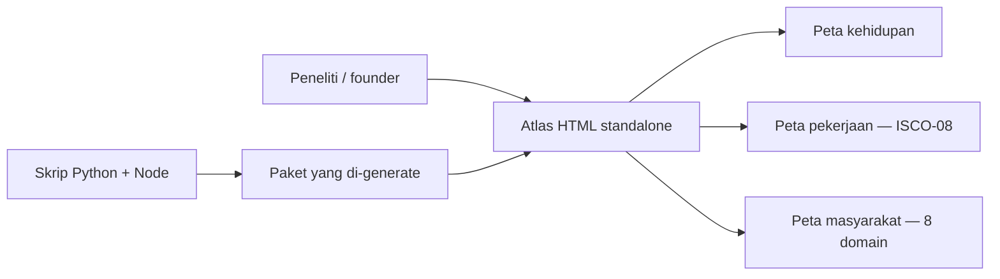

# Human Atlas

## Apa yang Dibangun

[Human Atlas](https://github.com/okfriansyah-moh/human-atlas) adalah workspace riset
publik untuk mengeksplorasi konteks manusia di tahap kehidupan, pekerjaan, dan masyarakat
— sambil menjaga evidence, geografis, ketidakpastian, dan batas etis tetap terlihat.
Deskripsi repositori memosisikannya sebagai **human atlas untuk sesi brainstorming
membuat produk dan untuk solo founder**.

Snapshot publik pertama mendarat pada **2026-08-17** dengan antarmuka browser standalone,
paket data occupation dan society yang di-generate, skrip build, dan tes validasi offline.

## Masalah

Riset produk dan venture sering loncat dari sticky note persona ke ide fitur tanpa konteks
terstruktur: Tahap kehidupan mana yang memicu pain? Workflow pekerjaan mana yang cocok
dengan buyer? Batas civic atau budaya apa yang berlaku di Indonesia versus global?
Template persona generik menyembunyikan **apa yang diketahui, diinferensi, atau masih
evidence gap**.

Human Atlas ada untuk memberi founder **snapshot bertanggal yang bisa diperiksa** yang bisa
dibuka offline, dikutip per field, dan di-rebuild saat sumber berubah — tanpa pura-pura
cakupan lengkap.

## Mengapa Masalah Ini Sulit

Riset yang mencakup agama, etnis, migrasi, dan aktor publik membawa risiko etis jika disajikan
sebagai kebenaran yang menyeluruh. Human Atlas secara eksplisit mendokumentasikan:

- Orang bernama dibatasi pada entri public-record bertanggal.
- Inferensi agama atau politik untuk individu pribadi dilarang.
- Klaim cakupan direktori **registri terbuka bertanggal, tidak menyeluruh**.
- Batas rekomendasi yang menjaga field `ai_hypothesis` dan `evidence_gap` terlihat di
  riset tetapi dikecualikan dari rekomendasi produk.

Membangun ini sebagai **snapshot statis tanpa server** menambah batasan engineering yang
didokumentasikan di [artikel arsitektur sistem](/id/docs/systems/human-atlas-research-workspace).

## Model Mental untuk Pemula

Human Atlas adalah **buku peta riset**, bukan CRM atau produk survei:

- **Life** menjawab "di tahap perjalanan mana kebutuhan ini muncul?"
- **Work** menjawab "keluarga pekerjaan mana yang mengalami workflow ini?"
- **Society** menjawab "konteks budaya, civic, atau rumah tangga apa yang membentuk kebutuhan?"
- Tag evidence berwarna memberi tahu apakah harus **mengutip**, **memvalidasi**, atau **terus riset**.

## Persyaratan dan Batasan

| Persyaratan | Cara repo memenuhi |
| ----------- | ------------------ |
| Buka tanpa setup | Satu file HTML + direktori data saudara |
| Snapshot reproduksibel | Manifest bertanggal (`build_date: 2026-08-17`) dengan checksum |
| Batas cakupan jujur | String `directory_coverage.gaps` per domain |
| Traceability sumber | Registry `sources` dengan URL, lisensi, dan scope |
| Validasi sebelum percaya | Validator Python + smoke test Node offline |
| Entry GitHub Pages | `index.html` redirect ke HTML atlas |

## Ringkasan Arsitektur

Lihat breakdown teknis lengkap di
[Arsitektur Sistem Human Atlas](/id/docs/systems/human-atlas-research-workspace).

## Isi Snapshot (2026-08-17)

| Layer | Skala | Catatan |
| ----- | ----: | ------- |
| Peta kehidupan | 15 tahap, 190 observasi | Riset tahap kehidupan terhubung |
| Peta pekerjaan | 436 profil unit | Backbone ISCO-08 + suplemen ESCO/O\*NET/KBJI |
| Peta masyarakat | 312 node, 343 edge | Delapan domain dengan hook opportunity domain-leader |
| Sumber | 17+ sumber society | Identifier Wikidata CC0, Pew, Kemenag, IDEA, KPU, UNESCO, ISO, UN |
| Validasi | Semua pack `release_ready: true` | Skrip checksum + gate evidence lulus pada snapshot yang di-commit |

## Evolusi dan Milestone

| Tanggal | Milestone |
| ------- | --------- |
| 2026-08-17 | Repositori dibuat; commit pertama dengan HTML atlas, pack occupation dan society |
| 2026-08-17 | `index.html` GitHub Pages ditambahkan untuk hosting publik |
| 2026-08-17 | Skrip validasi dan smoke test offline di-commit |

Pekerjaan masa depan yang diimplikasikan repositori (belum dibuktikan sebagai shipped):

- Direktori aktor publik diperluas di luar contoh Indonesia awal.
- Domain society tambahan atau pack negara lebih dalam.
- Snapshot di-rebuild saat spreadsheet atau PDF sumber diperbarui.

## Keputusan Kunci

| Keputusan | Alasan |
| --------- | ------ |
| Snapshot statis vs API live | Baseline riset reproduksibel untuk sesi brainstorming |
| ISCO-08 sebagai backbone Work | Interoperabilitas pekerjaan global |
| Hipotesis society dipisah dari fakta | Mencegah rekomendasi produk over-confident |
| Dukungan offline `file://` | Founder bisa arsip dan bagikan bundle bertanggal exact |
| Hook opportunity per domain | Menghubungkan node riset ke eksperimen validasi |

## Hubungan dengan Proyek Lain

Human Atlas melengkapi alat venture-building seperti
[Delivery Foundry](/id/docs/projects/delivery-foundry) — Foundry mengatur **bagaimana**
software dikirim dengan gate evidence, sementara Human Atlas menstrukturkan **siapa** dan
**dalam konteks apa** ide produk mungkin relevan. Tidak berbagi kode dengan Foundry;
hubungannya konseptual (intake riset → mission brief → loop delivery).

## Pelajaran yang Dipetik

1. **Alat riset butuh UI ketidakpastian eksplisit** — empat status evidence mengalahkan
   satu "confidence score."
2. **Snapshot bertanggal memungkinkan riset yang bisa di-diff** — skrip rebuild menjawab
   "apa yang berubah sejak Agustus?"
3. **Aturan privasi belong in data, bukan footnote README** — penegakan level manifest
   skala saat pack tumbuh.
4. **Mulai dengan skrip validasi sejak hari pertama** — checksum + smoke test melindungi
   file HTML 12 MB dari drift silent.

## Terkait

- [Arsitektur Sistem Human Atlas](/id/docs/systems/human-atlas-research-workspace)
- [LLM Guardrails](/id/docs/concepts/llm-guardrails) — pemisahan analog layer advisory vs authoritative

## Sumber

- Repositori: [okfriansyah-moh/human-atlas](https://github.com/okfriansyah-moh/human-atlas)
- Commit: `97f78f5` (commit pertama), `7d61cc0` (index GitHub Pages)
- README dan manifest bertanggal **2026-08-17**
