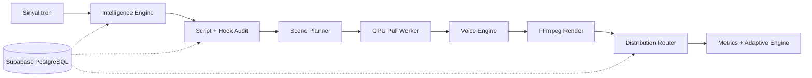

# MD-AME

## Apa yang Dibangun

[MD-AME](https://github.com/okfriansyah-moh/md-ame) (Multi-Dimensional Autonomous Media
Engine) adalah pipeline produksi dan distribusi media yang sepenuhnya otonom. Sistem
mengonsumsi sinyal tren, menghasilkan skrip video, merender aset via FFmpeg, dan
mempublikasikan ke platform sosial — dirancang untuk operasi tanpa pengawasan dengan
tinjauan strategis manusia mingguan.

## Masalah

Menjalankan banyak channel YouTube dalam skala membutuhkan otomatisasi loop penuh: pemilihan
topik, penulisan skrip, sintesis suara, rendering video, dan upload platform. Setiap
channel (dimensi) punya strategi konten, profil keamanan, dan akun publikasi berbeda —
tetapi menduplikasi kode pipeline per channel tidak scalable.

## Ringkasan Arsitektur

Semua state persisten berada di Supabase PostgreSQL. Tanpa state filesystem lokal antar run.
Lihat uraian sistem lengkap di [Arsitektur Sistem MD-AME](/docs/systems/md-ame-autonomous-media-engine).

## Evolusi dan Milestone

| Fase | Fokus |
| ---- | ----- |
| Infrastruktur inti | Migrasi skema, fungsi RPC, utilitas idempotensi |
| State machine | Klaim job, pemulihan crash, `FOR UPDATE SKIP LOCKED` |
| Suara + rendering | Edge-TTS, fallback Gemini, subprocess FFmpeg saja |
| Distribusi | Adapter YouTube, reservasi kuota, upload resumable |
| Intelligence + skrip | Scoring tren, hook audit, adversarial pass |
| Pipeline scene (4.5+) | Dekomposisi scene, GPU pull workers, scene cache |
| Keamanan konten (9) | Prompt Firewall + safety classifier Gemini |
| Adaptive engine | Umpan balik CTR/retention mingguan dengan delta terbatas |

## Keputusan Kunci

| Keputusan | Alasan |
| -------- | ------ |
| Parameterisasi dimensi | Tambah niche via baris DB, bukan fork kode |
| Transisi RPC PostgreSQL | Update multi-baris atomik; tanpa RMW di aplikasi |
| Fail safe, bukan graceful | Kegagalan suara HALT pipeline — tanpa output terdegradasi |
| Cron GitHub Actions (Fase 1) | Biaya VPS nol saat validasi |
| Pull GPU workers | Tanpa port inbound; backpressure alami |
| Dilarang: MoviePy, gTTS | Subprocess FFmpeg deterministik saja |

## Hubungan dengan Proyek Lain

MD-AME berbagi DNA pipeline deterministik dengan
[Shorts Factory](https://github.com/okfriansyah-moh/shorts-generator) (pemrosesan video
lokal dengan checkpoint SQLite) tetapi diskalakan ke PostgreSQL cloud-hosted, parameterisasi
multi-dimensi, dan generasi konten otonom berbasis tren.

## Pelajaran yang Dipetik

1. **Parameterisasi di atas duplikasi** — satu pipeline, banyak dimensi.
2. **Idempotensi adalah correctness** — pemulihan crash bergantung pada kunci deterministik.
3. **Quality gate tidak bisa ditawar** — satu video buruk bisa menekan standing channel berminggu-minggu.
4. **Kompleksitas ber-fase** — worker GPU dan scene cache datang setelah pipeline inti stabil.

## Terkait

- [Arsitektur Sistem MD-AME](/docs/systems/md-ame-autonomous-media-engine)
- [Deterministic AI Pipelines](/docs/concepts/deterministic-ai-pipelines)
- [Database-Backed State Machines](/docs/concepts/database-state-machines)
- [LLM Guardrails](/docs/concepts/llm-guardrails)

## Sumber

- Repositori: [okfriansyah-moh/md-ame](https://github.com/okfriansyah-moh/md-ame)
- Roadmap: `IMPLEMENTATION_ROADMAP.md`, `PROGRESS_REPORT.md` di repo sumber
