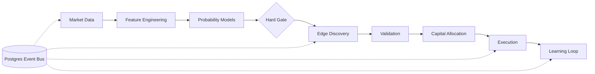

# Polymarket Agent

## Apa yang Dibangun

[Polymarket Autonomous Trading Engine](https://github.com/okfriansyah-moh/edge-polymarket-agent)
adalah sistem trading eksperimental untuk prediction market. Fase 0–15 mengimplementasikan
pipeline penuh dari ingest data pasar hingga eksekusi trade, monitoring posisi, analitik
pembelajaran, dan tuning parameter adaptif — semuanya sebagai **modular monolith**
yang berkomunikasi melalui event bus Postgres.

## Masalah

Prediction market punya inefisiensi struktural — likuiditas terfragmentasi, quote basi,
propagasi informasi lambat — tetapi mengeksploitasinya membutuhkan lebih dari deteksi
sinyal. Sistem trading produksi membutuhkan estimasi probabilitas sebelum eksekusi,
batas risiko keras, manajemen siklus hidup strategi, dan isolasi antara AI advisory
dan eksekusi trade.

## Ringkasan Arsitektur

Lihat uraian sistem lengkap di [Polymarket Trading Agent](/docs/systems/polymarket-trading-agent).

## Evolusi dan Milestone

| Fase | Yang dirilis |
| ---- | ------------ |
| 0–2 | Infrastruktur inti, event bus Postgres, worker runtime |
| 3–4 | Data pasar, filter kualitas, edge discovery, validasi |
| 4.5–5 | Opportunity selection, alokasi modal, adaptive risk |
| 6–7 | Eksekusi trade, monitoring posisi, profit vault |
| 8–9 | Learning loop, safety/alerting, kontrol Telegram |
| 11–12 | Sinyal eksternal, model probabilitas, ensemble domain |
| 12.5 | Hard gate probabilitas — TANPA PROBABILITAS → TANPA TRADE |
| 12.6 | Integrasi external alpha dengan strategy killer |
| 14 | Lapisan isolasi AI advisor (read-only) |
| 15 | Adaptive tuning engine dengan cap ±20% terbatas |

## Keputusan Kunci

| Keputusan | Alasan |
| -------- | ------ |
| Modular monolith | Postgres bersama; tanpa overhead jaringan antar fase |
| Integrasi event bus | Batas modul bersih via event yang persisten |
| Hard gate probabilitas | Menegakkan disiplin berbasis edge sebelum eksekusi |
| Kelly + plafon keras | Sizing matematis dengan batas keamanan |
| Default DRY_RUN | Observasi pipeline sebelum mempertaruhkan modal |
| Isolasi AI advisor | Kegagalan LLM tidak boleh memblokir trade |

## Pelajaran yang Dipetik

1. **Profit = Edge × Execution Quality × Capital Allocation** — ketiganya harus berfungsi.
2. **Event bus sebagai lapisan integrasi** — modul tetap terisolasi ketika komunikasi dipersistenkan.
3. **Auto-disable strategi sangat penting** — strategi underperform harus dimatikan otomatis.
4. **AI advisory tetap advisory** — jangan taruh latency LLM di jalur kritis eksekusi.

## Terkait

- [Polymarket Trading Agent](/docs/systems/polymarket-trading-agent)
- [Database-Backed State Machines](/docs/concepts/database-state-machines)
- [AI Orchestration Patterns](/docs/concepts/ai-orchestration-patterns)
- [LLM Guardrails](/docs/concepts/llm-guardrails)

## Sumber

- Repositori: [okfriansyah-moh/edge-polymarket-agent](https://github.com/okfriansyah-moh/edge-polymarket-agent)
- Arsitektur: `docs/ARCHITECTURE.md`, `docs/TRADING_EDGE_STRATEGY.md` di repo sumber
