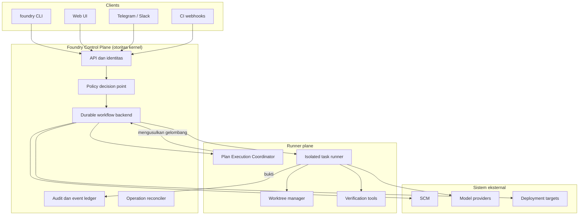

# Delivery Foundry: Control Plane Terkelola untuk Pengiriman Perangkat Lunak AI

## Apa yang Dibangun

[Delivery Foundry](https://github.com/okfriansyah-moh/the-foundry) adalah **control plane
terkelola** untuk pengiriman perangkat lunak berbasis loop. Arsitektur V12 mendefinisikan
model eksekusi yang tahan lama, dapat dilanjutkan, dan terverifikasi bukti untuk agen AI
yang beroperasi di bawah envelope kebijakan eksplisit, bukan kepercayaan implisit.

Per rilis publik awal repositori (2026-07-20), **Task 1** selesai: toolchain Makefile
berbasis Docker, workflow CI, scaffold modul Go, dan sembilan belas stub paket
`internal/*` masing-masing dengan `doc.go` batas otoritas. Arsitektur normatif dan
kontrak workflow ada di `delivery_foundry.md` dan pohon modular `docs/`; implementasi
runtime mengikuti rencana 83 task di `PLAN_7.md`.

## Masalah

Kebanyakan workflow AI coding memperlakukan agen sebagai executor tepercaya: membaca
rencana, memutasi repositori, dan melaporkan selesai sendiri. Model itu gagal saat retry
(duplikasi side effect), crash (progress hilang), drift kebijakan (agen memperluas izin
sendiri), dan state terminal ambigu (apakah pekerjaan benar-benar terverifikasi?).

Loop delivery tingkat produksi membutuhkan **control plane** yang memiliki state
otoritatif, mengurutkan side effect, menegakkan anggaran dan persetujuan, serta menerima
penyelesaian hanya jika didukung bukti bertipe — sambil tetap membiarkan koordinator
agen mengusulkan gelombang pekerjaan berikutnya.

## Mengapa Masalah Ini Sulit

1. **Pemisahan otoritas** — Agen harus menginterpretasi rencana dan merekomendasikan
   dispatch, tetapi tidak boleh menjadi mesin workflow kedua atau memutasi state
   otoritatif secara langsung.
2. **Enam status, nuansa tak terbatas** — Makna workflow harus hidup di field bertipe
   terkontrol registry (`phase`, `reason`, `result_code`), bukan enum status ad hoc.
3. **Dua track produk** — Otonomi venture personal dan engineering 10x organisasi
   berbagi satu kernel tetapi membutuhkan profil tata kelola dan semantik terminal berbeda.
4. **Penyelesaian jujur** — Outcome terminal seperti `PROVEN_BLOCKED` atau
   `TEN_X_BRANCH_HANDOFF_READY` harus mengenkode bukti nyata, bukan optimisme agen.
5. **Recovery tanpa improvisasi** — Self-healing harus menaiki tangga terbatas (retry →
   buat ulang sandbox → rollback → eskalasi manusia) tanpa menekan peringatan keamanan.

## Model Mental Pemula

Bayangkan ruang kontrol pabrik (**kernel**) dan supervisor lantai (**Plan Execution
Coordinator**, atau PEC). Supervisor membaca rencana produksi, mengusulkan stasiun
berikutnya, dan melaporkan progress — tetapi hanya ruang kontrol yang boleh
membalik saklar, menulis ke ledger, push ke Git, atau menyatakan batch selesai. Setiap
perubahan state membutuhkan bundel bukti distempel. Jika listrik padam, ruang kontrol
memutar ulang dari checkpoint terakhir; supervisor tidak merestart pabrik dari ingatan.

## Persyaratan dan Batasan

| Persyaratan | Kontrak arsitektural |
|-------------|---------------------|
| Tepat enam status workflow | `PENDING`, `RUNNING`, `WAITING`, `SUCCEEDED`, `FAILED`, `CANCELLED` |
| Makna lebih kaya di field bertipe | `phase`, `reason`, `result_code` terkontrol registry |
| Kernel memiliki side effect | SCM writes, anggaran, lease, checkpoint, penyelesaian |
| PEC hanya mengusulkan | Gelombang, dispatch, remediasi — diuji larangan di CI |
| Penyelesaian berbasis bukti | Tidak ada "selesai" laporan mandiri tanpa bundel verifikasi |
| Admission deterministik | Classifier versi; rencana tidak bisa mengotorisasi diri sendiri |
| Workspace terisolasi | Agen beroperasi di worktree, bukan clone kanonik |
| Operasi eksternal idempoten | Ledger operasi dengan kunci idempotency untuk setiap side effect |
| Paralelisme dual-track | Track venture dan 10x berbagi kernel, gate penerimaan independen |

Batasan ini dicantumkan sebagai artikel konstitusi C1–C22 di `PLAN_7.md`.

## Ringkasan Arsitektur

Delivery Foundry adalah **control plane**, bukan framework agen universal atau kumpulan
skrip shell. Klien (CLI, Web UI, Telegram, webhook CI) memanggil control plane; runner
plane mengeksekusi pekerjaan terbatas di sandbox terisolasi dan mengembalikan bukti
bertipe.



## Alur Eksekusi

1. **Entry** — Misi, mockup, requirement, spesifikasi, atau `PLAN.md` yang disetujui
   tiba di API control plane.
2. **Intake dan admission** — Classifier admission deterministik menetapkan tier
   (A0/A1/A2/H) dan memverifikasi provenance untuk rencana disetujui.
3. **Pembuatan workflow** — Kernel membuat workflow di `PENDING`, transisi ke
   `RUNNING` dengan phase `intake`, dan menetapkan checkpoint.
4. **Interpretasi PEC** — PEC membaca rencana yang diadmit, mengusulkan gelombang
   aware dependensi dan dispatch task terbatas dalam envelope yang diberikan kernel.
5. **Eksekusi terisolasi** — Runner membuat sandbox worktree ephemeral; agen
   mengeksekusi task dan mengembalikan ringkasan ke PEC (bukan langsung ke state kernel).
6. **Verifikasi** — Pemeriksaan deterministik menghasilkan bundel bukti; kernel
   maju phase (mis. `implementation` → `verifying` → `integrating`).
7. **Side effect** — Branch Integrator milik kernel melakukan SCM writes; operasi
   eksternal mencatat kunci idempotency di ledger.
8. **Keputusan terminal** — Kernel menetapkan `SUCCEEDED` atau `FAILED` dengan
   `result_code` terkontrol registry (mis. `MISSION_TARGET_REACHED`,
   `TEN_X_BRANCH_HANDOFF_READY`, `PROVEN_BLOCKED`).
9. **Recovery saat gagal** — Recovery Manager membaca klasifikasi kegagalan dan
   menaiki tangga L0–L7; gate manusia pause di batas yang dikonfigurasi.

## Komponen Penting

| Komponen | Tanggung jawab |
| -------- | --------------- |
| **Kernel** | State workflow otoritatif, sequencing, lease, checkpoint, kebijakan, anggaran, semua side effect |
| **Plan Execution Coordinator (PEC)** | Menginterpretasi rencana diadmit; mengusulkan gelombang, dispatch, remediasi, progress |
| **Admission classifier** | Penetapan tier deterministik; mencegah rencana mengotorisasi diri sendiri |
| **State projection (PostgreSQL)** | Model baca dapat dibangun ulang — bukan otoritas eksekusi |
| **Backend Temporal** | Riwayat eksekusi tahan lama, timer, sequencing (direncanakan Task 12) |
| **Pipeline bukti** | Bundel verifikasi bertipe wajib untuk kemajuan phase |
| **Operation ledger** | Kunci idempotency dan rekonsiliasi untuk side effect eksternal |
| **Recovery Manager** | Tangga self-healing terbatas dengan larangan eksplisit |
| **Branch Integrator** | SCM writes milik kernel ke worktree terisolasi dan branch 10x |

Layout paket Go (discaffold Task 1): `internal/kernel`, `internal/pec`, `internal/state`,
`internal/admission`, `internal/evidence`, `internal/recovery`, `internal/provenance`,
`internal/worktree`, dan lainnya — masing-masing dengan `doc.go` batas otoritas.

## Contoh Implementasi Disederhanakan

Representasi state kanonik (dari `docs/architecture/state-model.md`):

```yaml
status: RUNNING          # salah satu dari enam status kanonik
phase: implementation    # terkontrol registry
reason: null             # diisi saat WAITING atau FAILED
result_code: null        # hanya di transisi terminal
wake_at: null
next_action: verify
checkpoint_id: checkpoint-789
```

Batas otoritas PEC (disederhanakan dari `docs/architecture/authority-model.md`):

```text
PEC BOLEH:  mengusulkan gelombang, merekomendasikan dispatch, mengevaluasi ringkasan, mengusulkan remediasi
PEC TIDAK BOLEH: memutasi state workflow, melakukan SCM writes, memberi izin,
                  menaikkan anggaran, menyatakan penyelesaian terminal, override kebijakan
```

Entri tangga recovery (dari `docs/workflows/recovery.md`):

```text
L0 — retry operasi idempoten dengan backoff
L1 — buat ulang sandbox bersih dan ulangi
L2 — agen debugging fokus
...
L7 — pause dan eskalasi ke manusia
```

## Reliabilitas dan Idempotency

- **Checkpoint** — Kernel mencatat `checkpoint_id` pada setiap transisi bermakna;
  restart proses memutar ulang dari riwayat Temporal dan proyeksi PostgreSQL.
- **Ledger operasi eksternal** — Setiap push SCM, deployment, atau panggilan billing
  membawa kunci idempotency; reconciler mendeteksi operasi duplikat atau yatim.
- **Invariant enam status** — Aturan fitness CI menolak enum status kedua; label V11
  historis hanya dipetakan ke tuple kanonik `(status, phase, reason, result_code)`.
- **Supervisi liveness** — `ORPHANED` adalah kondisi supervisor, bukan status workflow;
  dokumen disaster-recovery mendefinisikan semantik checkpoint/restart.
- **Blocking jujur** — `PROVEN_BLOCKED` pada `FAILED` berarti bukti terverifikasi bahwa
  pekerjaan tidak dapat dipenuhi sesuai scope — bukan kode error generik.

## Mode Kegagalan

| Kegagalan | Deteksi | Recovery |
| --------- | ------- | -------- |
| Outage provider transient | `WAITING`, reason `provider-outage` | Backoff L0; timer wake |
| Kegagalan kode deterministik | klasifikasi `deterministic-failure` | Agen debug L2; max 1 retry agen sama |
| Pelanggaran kebijakan | `FAILED`, result `ADMISSION_REJECTED` | Tidak auto-retry; review manusia |
| Anggaran habis | `WAITING`, reason `budget` | Pause sampai reset anggaran atau override manusia |
| PEC overreach | Tes larangan CI | Build gagal sebelum merge |
| Crash proses mid-phase | Supervisor liveness | Replay dari checkpoint; lanjut di phase ter-commit terakhir |
| Security hold | `WAITING`, reason `security-hold` | Recovery Manager tidak boleh menekan alert |

## Trade-off dan Alternatif yang Ditolak

| Keputusan | Alasan |
| --------- | ------ |
| Pemisahan kernel vs PEC | Mencegah framework agen menjadi mesin workflow bayangan |
| Enam status + field bertipe | Phase extensible tanpa ledakan enum; dapat ditegakkan CI |
| Temporal + proyeksi PostgreSQL | Riwayat tahan lama terpisah dari model baca dapat dibangun ulang (C2/C3) |
| Bangun control plane (ADR-000) | Logika sequencing/kebijakan diferensiasi vs membeli orchestration generik |
| Modularisasi dok V12 | Mempertahankan konten V11 sambil menambah kontrak normatif |
| Toolchain dev hanya Docker | Host hanya butuh Docker + make; paritas dev/CI dari Task 1 |
| Handoff 10x tanpa PR | `TEN_X_BRANCH_HANDOFF_READY` adalah sukses — batas stop workflow org |

## Pengujian

Validasi Task 1 saat ini (diimplementasi):

- `make bootstrap test lint fitness` di dalam image Docker `dev`
- `scripts/fitness.sh` v0: `go vet ./...` dan kehadiran `doc.go` di setiap paket `internal/*`
- GitHub Actions CI saat push (`.github/workflows/ci.yaml`)

Validasi direncanakan (constitution check di exit milestone):

- Enum lint, superseded-term lint, pemeriksaan import-boundary
- Tes conformance larangan PEC (Task 56)
- E2e Shared Kernel Proof: admit satu rencana → worktree → verify → bukti → **lanjut setelah restart**
- Evaluasi fault-injection dan keamanan per spesifikasi V12

## Operasi dan Observabilitas

- **Entry CLI** — CLI `foundry` (direncanakan) dengan target `make`: `bootstrap`, `test`,
  `lint`, `fitness`, `skp-e2e`, `evidence-verify`, `projection-rebuild`
- **Notifikasi** — Mesin Telegram untuk digest batch dan approval gated; approval
  risiko tinggi membutuhkan OIDC + WebAuthn (bukan hanya Telegram)
- **Cost accounting** — Pola reserve → incur → reconcile dengan enforcement anggaran pre-execution
- **Observabilitas** — SLO, alert, dan batas payload didefinisikan di `docs/operations/observability-and-alerts.md`
- **Perlindungan diri control-plane** — Kontrak terpisah untuk capacity brokering dan disaster recovery

## Pelajaran

1. **Pisahkan "siapa memutuskan" dari "siapa mengeksekusi"** — PEC kuat dalam interpretasi
   rencana tetapi harus tetap proposal-only; retensi side effect kernel tidak bisa ditawar.
2. **Semantik terminal adalah fitur produk** — `TEN_X_BRANCH_HANDOFF_READY` mengenkode
   batas stop intentional untuk workflow organisasi, bukan kegagalan merge.
3. **Registry mengalahkan enum** — Registry phase, wait-reason, dan result-code memungkinkan
   evolusi tanpa melanggar invariant enam status.
4. **Bukti sebelum penyelesaian** — Ringkasan agen laporan mandiri adalah input PEC, bukan
   bukti penyelesaian; bundel verifikasi menggate kemajuan phase.
5. **Bootstrap arsitektur dulu** — Task 1 discaffold batas otoritas di `doc.go`
   sebelum kode implementasi, sehingga CI dapat menegakkan peran paket lebih awal.

## Terkait

- [Merancang Deterministic Agentic Coding Orchestrator](/id/docs/concepts/deterministic-agentic-orchestrator)
- [State Kanonik dalam Pipeline Desain Multi-Agen](/id/docs/concepts/ai-orchestration-patterns)
- [Ringkasan Proyek Delivery Foundry](/id/docs/projects/delivery-foundry)

## Sumber

- Repository: [okfriansyah-moh/the-foundry](https://github.com/okfriansyah-moh/the-foundry)
- Commit: [`58632a0`](https://github.com/okfriansyah-moh/the-foundry/commit/58632a0) (commit pertama), [`9409080`](https://github.com/okfriansyah-moh/the-foundry/commit/9409080) (scaffold Task 1)
- Arsitektur: `delivery_foundry.md`, `docs/architecture/state-model.md`, `docs/architecture/authority-model.md`
- Rencana implementasi: `PLAN_7.md` (Task 1 ✅, Task 2–83 pending)
