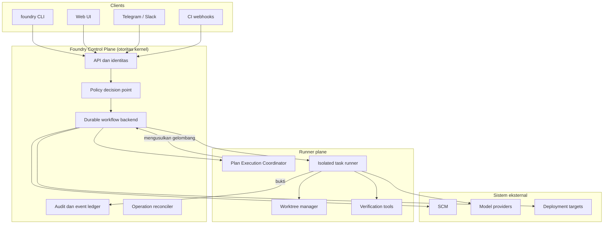

# Delivery Foundry: Control Plane Terkelola untuk Pengiriman Perangkat Lunak AI

## Apa yang Dibangun

[Delivery Foundry](https://github.com/okfriansyah-moh/the-foundry) adalah **control plane
terkelola** untuk pengiriman perangkat lunak berbasis loop. Arsitektur V12 mendefinisikan
model eksekusi yang tahan lama, dapat dilanjutkan, dan terverifikasi bukti untuk agen AI
yang beroperasi di bawah envelope kebijakan eksplisit, bukan kepercayaan implisit.

Repositori mengirim **Task 1** pada 2026-07-20 (Makefile berbasis Docker, CI, scaffold Go).
[Pull request #1](https://github.com/okfriansyah-moh/the-foundry/pull/1) (digabung
2026-07-25) menyelesaikan **Task 2–22** hingga milestone M0 (Shared Kernel Proof) dan
awal M1 (Foundation). [Pull request #2](https://github.com/okfriansyah-moh/the-foundry/pull/2)
(digabung 2026-07-27) menyelesaikan **Task 23–40** dan keluar dari **M1 — Production Foundation**:

- **Agent harness (Task 2)** — [`.ai/`](https://github.com/okfriansyah-moh/the-foundry/tree/main/.ai) canonical ARES dengan enam agen peran, sebelas skill, dan komposisi multi-provider ke `AGENTS.md` / `CLAUDE.md` / `.codex/` (provider Claude + Codex di `.ai/manifest.yaml`)
- **Plan runner otonom (Task 3)** — `tools/planrunner` dengan jalur AUTO vs GATED berbasis risiko dan gate persetujuan Telegram
- **Stack runtime (Task 4–5)** — `postgres` + `temporal` di compose; paket state enam-status canonical (`internal/state`)
- **Admission dan provenance (Task 6–8, 24)** — schema/parser PLAN, `AdmissionClassifier` deterministik v0, rantai `ApprovedPlan` bertanda tangan dengan audit log berantai hash
- **Substrat eksekusi (Task 9–11, 34)** — worktree manager, kontrak executor, penyimpanan evidence bundle, dan **sandbox executor OCI rootless** (jail filesystem, jaringan default-deny dengan egress gate, cap cgroup)
- **Workflow kernel (Task 12–16, 32)** — worker Temporal `foundryd` menghosting `DeliverPlan`; bukti resume checkpoint + forced-restart; supervisor liveness dan semantik terminal `PROVEN_BLOCKED` yang jujur
- **Permukaan operator (Task 13–15, 18–19, 36)** — validation runner, proyeksi status PostgreSQL, CLI `foundry`, **HTTP API `/v1`** dengan paritas CLI, dan pemeriksaan konstitusi `fitlint`
- **Lapisan foundation (Task 20–22, 23–29, 35–39)** — migrasi, profiles/principals/organizations, **PDP berbasis OPA**, ledger operasi eksternal, SCM GitHub write, cost accounting/anggaran, backend secrets file, **drill backup/restore**, projector v2 dengan alert lag
- **Integrasi produksi (Task 30–33, 38)** — engine notifikasi Telegram dengan flood control, baseline observabilitas Prometheus/Grafana, backpressure/brownout control-plane, lint dokumentasi (`make doclint`) di CI
- **Entry venture (Task 40)** — engine `MissionContract` dan schema misi untuk misi otonom Track A

[Pull request #4](https://github.com/okfriansyah-moh/the-foundry/pull/4) (digabung 2026-07-28)
mengirim **Task 41–50** — kesiapan venture dan scaffolding kebijakan:

- **Mission Setup Ceremony (VEN-02)** — `foundry mission ceremony` menjalani checklist deterministik,
  mengumpulkan bukti atau deferral, dan menyimpan `MissionReadinessArtifact` sebelum operasi tanpa pengawasan
- **Engine template produk** — `foundry product new --from-template` menginstansiasi scaffold venture
  dari `templates/product`
- **Config pemetaan kebijakan/efek** — `effect-mapping.yaml`, `mission-decide-policy.yaml`, dan
  `synthetic-canary-policy.yaml` menghubungkan tier admission ke side effect bertipe

[Pull request #5](https://github.com/okfriansyah-moh/the-foundry/pull/5) (digabung 2026-07-28)
menyelesaikan **Task 51–60** — **exit venture MLS Track A** dan **fondasi integrator Track B**:

- **Siklus perbaikan terbatas (VEN-12)** — `RunImproveCycle` berbasis cassette dengan lease promosi
  dan pemeriksaan envelope; digest veto mingguan dengan guard freeze-on-rollback-depth
- **Track A MLS e2e** — harness venture 12 langkah dengan assertion `HUMAN_TOUCHES=0` melalui deploy → observe → improve
- **Paket tata kelola organisasi (TX-01)** — profil `organization-10x.yaml` dengan bukti policy compiler tighten-only
- **PEC v1 (TX-03)** — proposal gelombang via sort topologi Kahn, proposal remediasi, dan tes larangan CI (`check_pec_boundary.sh`)
- **Grup atomik + Branch Integrator (TX-04–06)** — digest change-set deterministik, antrian integrasi, drift guard dengan semantik requeue `PROVEN_BLOCKED`
- **Terminal handoff 10x (TX-07)** — `TEN_X_BRANCH_HANDOFF_READY` dengan pernyataan larangan C15 wajib di notifikasi

[Pull request #6](https://github.com/okfriansyah-moh/the-foundry/pull/6) (digabung 2026-07-28)
mengirim **Task 61–75** — **exit 10x MLS Track B**, **M2 Operational Hardening**, dan bootstrap M3:

- **Bukti larangan 10x (TX-08)** — langkah fitness CI menolak simbol PR/merge/deploy di jalur panggilan TenX
- **Adapter SCM Bitbucket (TX-09)** — adapter CAS-push/read opsional berbagi tes kontrak dengan GitHub
- **Track B MLS e2e (TX-10)** — harness berbasis fixture melalui provenance org → grup atomik → integrator → push → terminal
- **Hardening M2 (HRD-01–10)** — suite chaos, fairness quota/backpressure, sweeper retention/PII, verifikasi hash-chain audit + drill tamper,
  alert SLO Prometheus, job rekonsiliasi cost, korpus red-team prompt-injection, drill DR otomatis, fuzz/soak Telegram,
  goreleaser + upgrade drill — **exit M2** via `docs/notes/m2-exit-report.md`
- **Pipeline auto-promosi L0 (EVO-01)** — registry tunable dan bootstrap pipeline promosi untuk M3

[Pull request #7](https://github.com/okfriansyah-moh/the-foundry/pull/7) (digabung 2026-07-28)
mengimplementasikan **Task 76–93** — **seleksi executor berbasis config**:

- **Registry kapabilitas executor** — `config/executor-capabilities.yaml` mencatat fitur adapter, ketersediaan, dan timestamp verifikasi
- **Routing berbasis kebijakan** — `executor-routing.yaml` dan `executor-models.yaml` memetakan kelas task ke executor/model preferen; `ExecutorSelector` kernel menggantikan nama hardcoded
- **Adapter multi-provider** — OpenCode, Gemini CLI, Cursor, Copilot, Windsurf, OpenAI, dan Local executor terdaftar di `foundryd`
- **Lint staleness kapabilitas** — `fitlint capability` gagal CI saat verifikasi provider melebihi 180 hari

[Pull request #8](https://github.com/okfriansyah-moh/the-foundry/pull/8) (digabung 2026-07-30)
menambahkan **Task 100–110** — UX operasional PLAN/mission dan gate CI:

- **CLI/API Mission** — `foundry mission start|resume|list|status`, perintah opportunity, dan endpoint OpenAPI `/missions`
- **Pengiriman PLAN** — `foundry plan run` dan API `/plans/{id}/deliver` terhubung ke workflow kernel
- **Gate fitness PLAN** — pemeriksaan research-boundary, validasi, dan topologi (DAG) `fitlint` ditegakkan sebagai job CI wajib

[Pull request #9](https://github.com/okfriansyah-moh/the-foundry/pull/9) (digabung 2026-07-31)
menutup **Task 111–120 (M5 gap-closure)** — intake, keamanan, dan hardening cost:

- **Intake bertahap dapat dilanjutkan (INT-03)** — `foundry mission start --idea` menjalankan opportunity → verdict → spec → PLAN → admission → approval → mission-start; REJECT/VALIDATE-MORE tidak membangun apa pun; tier H tidak pernah self-approve
- **Transport inbound Telegram (INT-04–05)** — pacing offset tahan lama, `/idea`→`/confirm` dengan proteksi nonce/replay; teks pesan diperlakukan sebagai data tidak tepercaya
- **Sandbox wajib + kebijakan fail-closed (SEC-01–02)** — kernel menolak eksekusi host saat sandbox tidak tersedia; loader kebijakan empat lapisan; allowlist URL kosong menolak
- **Isolasi kredensial + tenancy profil (SEC-03–04)** — env per-child untuk subprocess; profile-kind `ApprovedPlan` menegakkan step-up org dan root worktree scoped
- **Anggaran fail-closed + rekonsiliasi cost (COST-01–02)** — misi tanpa pengawasan tanpa envelope menolak; `RecordCost` terhubung ke `DeliverPlan` dengan tabel rate per-model dan `foundry cost reconcile`

Kontrak normatif tetap di `docs/foundry/delivery_foundry.md` dan pohon modular
`docs/foundry/docs/`; roadmap implementasi aktif ada di `docs/PLAN.md`
(Task 1–120 ✅ melalui M5 gap-closure; milestone berikutnya tetap di indeks PLAN).

## Masalah

Kebanyakan workflow AI coding memperlakukan agen sebagai executor tepercaya: membaca
rencana, memutasi repositori, dan melaporkan selesai sendiri. Model itu gagal saat retry
(duplikasi side effect), crash (progress hilang), drift kebijakan (agen memperluas izin
sendiri), dan state terminal ambigu (apakah pekerjaan benar-benar terverifikasi?).

Loop delivery tingkat produksi membutuhkan **control plane** yang memiliki state
otoritatif, mengurutkan side effect, menegakkan anggaran dan persetujuan, serta menerima
penyelesaian hanya jika didukung bukti bertipe — sambil tetap membiarkan koordinator
agen mengusulkan gelombang pekerjaan berikutnya.

## Mengapa Masalah Ini Sulit

1. **Pemisahan otoritas** — Agen harus menginterpretasi rencana dan merekomendasikan
   dispatch, tetapi tidak boleh menjadi mesin workflow kedua atau memutasi state
   otoritatif secara langsung.
2. **Enam status, nuansa tak terbatas** — Makna workflow harus hidup di field bertipe
   terkontrol registry (`phase`, `reason`, `result_code`), bukan enum status ad hoc.
3. **Dua track produk** — Otonomi venture personal dan engineering 10x organisasi
   berbagi satu kernel tetapi membutuhkan profil tata kelola dan semantik terminal berbeda.
4. **Penyelesaian jujur** — Outcome terminal seperti `PROVEN_BLOCKED` atau
   `TEN_X_BRANCH_HANDOFF_READY` harus mengenkode bukti nyata, bukan optimisme agen.
5. **Recovery tanpa improvisasi** — Self-healing harus menaiki tangga terbatas (retry →
   buat ulang sandbox → rollback → eskalasi manusia) tanpa menekan peringatan keamanan.

## Model Mental Pemula

Bayangkan ruang kontrol pabrik (**kernel**) dan supervisor lantai (**Plan Execution
Coordinator**, atau PEC). Supervisor membaca rencana produksi, mengusulkan stasiun
berikutnya, dan melaporkan progress — tetapi hanya ruang kontrol yang boleh
membalik saklar, menulis ke ledger, push ke Git, atau menyatakan batch selesai. Setiap
perubahan state membutuhkan bundel bukti distempel. Jika listrik padam, ruang kontrol
memutar ulang dari checkpoint terakhir; supervisor tidak merestart pabrik dari ingatan.

## Persyaratan dan Batasan

| Persyaratan | Kontrak arsitektural |
|-------------|---------------------|
| Tepat enam status workflow | `PENDING`, `RUNNING`, `WAITING`, `SUCCEEDED`, `FAILED`, `CANCELLED` |
| Makna lebih kaya di field bertipe | `phase`, `reason`, `result_code` terkontrol registry |
| Kernel memiliki side effect | SCM writes, anggaran, lease, checkpoint, penyelesaian |
| PEC hanya mengusulkan | Gelombang, dispatch, remediasi — diuji larangan di CI |
| Penyelesaian berbasis bukti | Tidak ada "selesai" laporan mandiri tanpa bundel verifikasi |
| Admission deterministik | Classifier versi; rencana tidak bisa mengotorisasi diri sendiri |
| Workspace terisolasi | Agen beroperasi di worktree, bukan clone kanonik |
| Operasi eksternal idempoten | Ledger operasi dengan kunci idempotency untuk setiap side effect |
| Paralelisme dual-track | Track venture dan 10x berbagi kernel, gate penerimaan independen |

Batasan ini dicantumkan sebagai artikel konstitusi C1–C22 di `PLAN_7.md`.

## Ringkasan Arsitektur

Delivery Foundry adalah **control plane**, bukan framework agen universal atau kumpulan
skrip shell. Klien (CLI, Web UI, Telegram, webhook CI) memanggil control plane; runner
plane mengeksekusi pekerjaan terbatas di sandbox terisolasi dan mengembalikan bukti
bertipe.


```mermaid
flowchart TB
  subgraph Clients
    CLI[foundry CLI]
    WEB[Web UI]
    CHAT[Telegram / Slack]
    CI[CI webhooks]
  end

  subgraph ControlPlane["Foundry Control Plane (otoritas kernel)"]
    API[API dan identitas]
    POLICY[Policy decision point]
    WF[Durable workflow backend]
    LEDGER[Audit dan event ledger]
    RECON[Operation reconciler]
  end

  subgraph RunnerPlane["Runner plane"]
    PEC[Plan Execution Coordinator]
    RUNNER[Isolated task runner]
    WORKTREE[Worktree manager]
    VERIFY[Verification tools]
  end

  subgraph External["Sistem eksternal"]
    SCM[SCM]
    MODEL[Model providers]
    DEPLOY[Deployment targets]
  end

  CLI --> API
  WEB --> API
  CHAT --> API
  CI --> API

  API --> POLICY
  POLICY --> WF
  WF --> PEC
  PEC -->|mengusulkan gelombang| WF
  WF --> RUNNER
  RUNNER --> WORKTREE
  RUNNER --> VERIFY
  RUNNER -->|bukti| LEDGER
  WF --> SCM
  WF --> DEPLOY
  RUNNER --> MODEL
```

## Alur Eksekusi

1. **Entry** — Misi, mockup, requirement, spesifikasi, `PLAN.md` yang disetujui, atau
   teks `--idea` tiba di API control plane atau transport inbound Telegram.
2. **Intake dan admission** — Untuk ide, pipeline intake bertahap menghasilkan opportunity →
   spec → PLAN sebelum admission; classifier deterministik menetapkan tier (A0/A1/A2/H),
   memverifikasi provenance untuk rencana org, dan menolak start tanpa pengawasan tanpa envelope anggaran.
3. **Pembuatan workflow** — Kernel membuat workflow di `PENDING`, transisi ke
   `RUNNING` dengan phase `intake`, dan menetapkan checkpoint.
4. **Interpretasi PEC** — PEC membaca rencana yang diadmit, mengusulkan gelombang
   aware dependensi dan dispatch task terbatas dalam envelope yang diberikan kernel.
5. **Eksekusi terisolasi** — Runner **wajib** memakai sandbox OCI wajib (`requires_sandbox`);
   eksekusi host ditolak saat sandbox tidak tersedia. Agen mengeksekusi di worktree
   ephemeral scoped ke tenancy profil dan mengembalikan ringkasan ke PEC (bukan state kernel).
6. **Verifikasi** — Pemeriksaan deterministik menghasilkan bundel bukti; kernel
   maju phase (mis. `implementation` → `verifying` → `integrating`).
7. **Side effect** — Branch Integrator milik kernel melakukan SCM writes; operasi
   eksternal mencatat kunci idempotency di ledger.
8. **Keputusan terminal** — Kernel menetapkan `SUCCEEDED` atau `FAILED` dengan
   `result_code` terkontrol registry (mis. `MISSION_TARGET_REACHED`,
   `TEN_X_BRANCH_HANDOFF_READY`, `PROVEN_BLOCKED`).
9. **Recovery saat gagal** — Recovery Manager membaca klasifikasi kegagalan dan
   menaiki tangga L0–L7; gate manusia pause di batas yang dikonfigurasi.

## Komponen Penting

| Komponen | Tanggung jawab |
| -------- | --------------- |
| **Kernel** | State workflow otoritatif, sequencing, lease, checkpoint, kebijakan, anggaran, semua side effect |
| **Plan Execution Coordinator (PEC)** | Menginterpretasi rencana diadmit; mengusulkan gelombang, dispatch, remediasi, progress |
| **Admission classifier** | Penetapan tier deterministik; mencegah rencana mengotorisasi diri sendiri |
| **State projection (PostgreSQL)** | Model baca dapat dibangun ulang dengan rebuild/lag alert v2 — bukan otoritas eksekusi |
| **Backend Temporal (`foundryd`)** | Riwayat eksekusi tahan lama, timer, routing task-queue per-lane — worker pada queue `foundry-core` |
| **CLI `foundry` + API `/v1`** | Perintah operator dan paritas HTTP: status, plan submit/approve/verify, projection rebuild, doctor, policy, evidence, mission, budget, audit verify |
| **OPA PDP (`internal/policy/pdp`)** | Keputusan otorisasi berbasis Rego; route API memerlukan session JWT + PDP Allow sebelum handler berjalan |
| **Strong auth (`internal/authn`)** | Session OIDC, WebAuthn step-up untuk approval tier H, binding identitas Telegram |
| **Executor sandbox (`internal/executor/sandbox`)** | Container OCI rootless dengan topologi egress gate; CI memverifikasi lane Docker dan rootless Podman |
| **`fitlint` + `make fitness`** | Penegakan konstitusi: enum lint (C1), superseded-term lint, batas import, resolver doc-link |
| **Agent harness `.ai/`** | Enam peran executor, sebelas skill, instruksi batas otoritas; dikomposisi ke file agen per provider |
| **Plan runner (`tools/planrunner`)** | Orkestrator bootstrap untuk Task 4–22; pensiun setelah kernel mengadmit backlog sendiri (exit condition Task 3) |
| **Pipeline bukti** | Bundel verifikasi bertipe wajib untuk kemajuan phase |
| **Operation ledger (`internal/ledger/extops`)** | Kunci idempotency dan rekonsiliasi untuk side effect eksternal termasuk push SCM |
| **Cost ledger (`internal/ledger/cost`)** | Akuntansi reserve → incur → reconcile dengan enforcement anggaran |
| **Recovery Manager** | Tangga self-healing terbatas dengan larangan eksplisit dan supervisi liveness |
| **Branch Integrator / SCM write** | Push GitHub milik kernel dengan verifikasi CAS dan token source berbasis secrets |
| **Engine Telegram (`internal/notify`)** | Notifikasi ber-tier prioritas, batching, flood control, dead-letter queue |
| **Engine mission (`internal/mission`)** | Schema MissionContract, ceremony readiness, siklus perbaikan terbatas, dan pipeline intake |
| **Pipeline intake (`internal/intake`)** | Alur idea→mission bertahap dapat dilanjutkan dengan resume idempoten dan gate anggaran fail-closed |
| **PEC (`internal/pec`)** | Proposal gelombang/remediasi saja; sort topologi + deteksi siklus; tes larangan batas CI |
| **Branch Integrator (`internal/kernel/integrator`)** | Antrian push milik kernel, drift guard, validasi scope, `PROVEN_BLOCKED` pada drift tidak recoverable |
| **Executor selector (`foundryd`)** | Memuat registry kapabilitas + kebijakan routing; memilih executor tersandbox per kelas task |
| **Retention sweeper (`internal/retention`)** | Kelas TTL, legal hold, endpoint DSR — enforcement PII M2 |
| **Audit verifier (`internal/audit`)** | Walker hash-chain dengan anchor inkremental; drill tamper `foundry audit verify` |

Paket Go kini membawa implementasi nyata hingga Task 120 — masing-masing dengan `doc.go`
batas otoritas: `internal/kernel`, `internal/state`, `internal/admission`,
`internal/provenance`, `internal/evidence`, `internal/worktree`, `internal/executor/*`
(termasuk `sandbox/`), `internal/projection`, `internal/policy/pdp`, `internal/api`,
`internal/authn`, `internal/ledger/*`, `internal/scm/write`, `internal/notify`,
`internal/mission`, `internal/profile`, dan lainnya. Paket PEC tetap proposal-only
per C5; otoritas side effect ada di jalur kode kernel yang dijalankan `foundryd`.

## Contoh Implementasi Disederhanakan

Representasi state kanonik (dari `docs/architecture/state-model.md`):

```yaml
status: RUNNING          # salah satu dari enam status kanonik
phase: implementation    # terkontrol registry
reason: null             # diisi saat WAITING atau FAILED
result_code: null        # hanya di transisi terminal
wake_at: null
next_action: verify
checkpoint_id: checkpoint-789
```

Batas otoritas PEC (disederhanakan dari `docs/architecture/authority-model.md`):

```text
PEC BOLEH:  mengusulkan gelombang, merekomendasikan dispatch, mengevaluasi ringkasan, mengusulkan remediasi
PEC TIDAK BOLEH: memutasi state workflow, melakukan SCM writes, memberi izin,
                  menaikkan anggaran, menyatakan penyelesaian terminal, override kebijakan
```

Entri tangga recovery (dari `docs/workflows/recovery.md`):

```text
L0 — retry operasi idempoten dengan backoff
L1 — buat ulang sandbox bersih dan ulangi
L2 — agen debugging fokus
...
L7 — pause dan eskalasi ke manusia
```

## Reliabilitas dan Idempotency

- **Checkpoint** — Kernel mencatat `checkpoint_id` pada setiap transisi bermakna;
  restart proses memutar ulang dari riwayat Temporal dan proyeksi PostgreSQL.
- **Ledger operasi eksternal** — Setiap push SCM, deployment, atau panggilan billing
  membawa kunci idempotency; reconciler mendeteksi operasi duplikat atau yatim.
- **Invariant enam status** — Aturan fitness CI menolak enum status kedua; label V11
  historis hanya dipetakan ke tuple kanonik `(status, phase, reason, result_code)`.
- **Supervisi liveness** — `ORPHANED` adalah kondisi supervisor, bukan status workflow;
  dokumen disaster-recovery mendefinisikan semantik checkpoint/restart.
- **Blocking jujur** — `PROVEN_BLOCKED` pada `FAILED` berarti bukti terverifikasi bahwa
  pekerjaan tidak dapat dipenuhi sesuai scope — bukan kode error generik.

## Mode Kegagalan

| Kegagalan | Deteksi | Recovery |
| --------- | ------- | -------- |
| Outage provider transient | `WAITING`, reason `provider-outage` | Backoff L0; timer wake |
| Kegagalan kode deterministik | klasifikasi `deterministic-failure` | Agen debug L2; max 1 retry agen sama |
| Pelanggaran kebijakan | `FAILED`, result `ADMISSION_REJECTED` | Tidak auto-retry; review manusia |
| Anggaran habis | `WAITING`, reason `budget` | Pause sampai reset anggaran atau override manusia |
| PEC overreach | Tes larangan CI | Build gagal sebelum merge |
| Crash proses mid-phase | Supervisor liveness | Replay dari checkpoint; lanjut di phase ter-commit terakhir |
| Security hold | `WAITING`, reason `security-hold` | Recovery Manager tidak boleh menekan alert |

## Trade-off dan Alternatif yang Ditolak

| Keputusan | Alasan |
| --------- | ------ |
| Pemisahan kernel vs PEC | Mencegah framework agen menjadi mesin workflow bayangan |
| Enam status + field bertipe | Phase extensible tanpa ledakan enum; dapat ditegakkan CI |
| Temporal + proyeksi PostgreSQL | Riwayat tahan lama terpisah dari model baca dapat dibangun ulang (C2/C3) |
| Bangun control plane (ADR-000) | Logika sequencing/kebijakan diferensiasi vs membeli orchestration generik |
| Modularisasi dok V12 | Mempertahankan konten V11 sambil menambah kontrak normatif |
| Toolchain dev hanya Docker | Host hanya butuh Docker + make; paritas dev/CI dari Task 1 |
| Handoff 10x tanpa PR | `TEN_X_BRANCH_HANDOFF_READY` adalah sukses — batas stop workflow org |

## Pengujian

Validasi saat ini (Task 1–120, exit M1–M2, MLS Track A/B, M5 gap-closure):

- `make bootstrap test lint fitness doclint` di dalam image Docker `dev`
- `make up` + `make doctor` — verifikasi Docker/Compose, PostgreSQL `SELECT 1`, Temporal `GetSystemInfo`
- `scripts/fitness.sh` — pemeriksaan konstitusi termasuk larangan TenX C15 (langkah i), batas PEC (langkah h), staleness kapabilitas executor, topologi/validasi/research-boundary PLAN, aturan sandbox subprocess, dan aturan isolasi env
- `make skp-e2e` — Shared Kernel Proof: admit plan → worktree → verify → bukti → **forced restart → resume**
- `make m1-exit`, `make m2-exit` — suite acceptance milestone dengan laporan exit di `docs/notes/`
- `make e2e-venture`, `make e2e-tenx` — harness MLS Track A dan Track B (assertion zero human touches / larangan C15)
- `make chaos`, `make redteam`, `make dr-drill`, `make soak-telegram`, `make soak-fairness` — drill hardening operasional M2
- `test/improvement_cycle_e2e.sh`, skrip e2e intake/telegram — bukti perbaikan venture dan transport inbound
- Workflow CI: `ci.yaml` (suite validasi PLAN wajib), `chaos.yml` (nightly), `dr-drill.yml` (bulanan)
- Tes red-team isolasi profil, bukti anggaran fail-closed, dan tes isolasi kredensial `-race` N-way (Task 117–119)

Keterbatasan diketahui (terdokumentasi di laporan exit M1): guard upsert proyeksi hanya
membandingkan nomor sequence; konten stale pada sequence lebih tinggi dapat regresi phase
terproyeksi — ditandai untuk follow-up, tidak disembunyikan.

## Operasi dan Observabilitas

- **Entry CLI** — subperintah `foundry`: `doctor`, `status`, `plan submit|approve|verify|revoke|run`,
  `projection rebuild`, `principal create`, `keygen`, `policy`, `evidence`, `migrate`, `login`,
  `mission start|resume|list|status|ceremony`, `intake show|resume|list`, `product new`,
  `opportunity list|show|report`, `budget`, `cost reconcile|show`, `audit verify`, plus paritas HTTP `/v1` via `foundryd`
- **Daemon** — `foundryd` menghosting worker Temporal dan HTTP API; satu-satunya proses yang melakukan side effect kernel (C4)
- **Target Make** — `bootstrap`, `up`, `down`, `doctor`, `test`, `lint`, `fitness`, `doclint`,
  `skp-e2e`, `m1-exit`, `m2-exit`, `e2e-venture`, `e2e-tenx`, `chaos`, `redteam`, `dr-drill`,
  `soak-telegram`, `soak-fairness`, `plan-run`, `evidence-verify`, `projection-rebuild`, `backup`,
  `restore`, `drill-backup-restore`, `drill-brownout`, `release-dryrun`, `upgrade-drill`
  (semua dibungkus Docker; profil `up obs` menambah Prometheus/Grafana)
- **Engine Telegram** — Notifikasi ber-tier prioritas (P0–P3), batching, flood control, dead-letter
  store; approval tier H memerlukan step-up WebAuthn, bukan Telegram saja (C11/C12)
- **Cost accounting** — Reserve → incur → reconcile dengan tabel anggaran (`00009_budgets.sql`) dan CLI `budget`/`cost`
- **Observabilitas** — Metrik Prometheus, dashboard Grafana (`deploy/dashboards/foundry-overview.json`),
  runbook projection-lag; katalog SLO penuh tetap di `docs/foundry/docs/operations/observability-and-alerts.md`
- **Backup/restore** — `scripts/backup.sh` / `scripts/restore.sh` dengan verifikasi manifest sha256 dan
  re-verify audit-chain setelah restore; drill mid-flight membuktikan kontinuitas workflow setelah destroy/recover

## Pelajaran

1. **Pisahkan "siapa memutuskan" dari "siapa mengeksekusi"** — PEC kuat dalam interpretasi
   rencana tetapi harus tetap proposal-only; retensi side effect kernel tidak bisa ditawar.
2. **Semantik terminal adalah fitur produk** — `TEN_X_BRANCH_HANDOFF_READY` mengenkode
   batas stop intentional untuk workflow organisasi, bukan kegagalan merge.
3. **Registry mengalahkan enum** — Registry phase, wait-reason, dan result-code memungkinkan
   evolusi tanpa melanggar invariant enam status.
4. **Bukti sebelum penyelesaian** — Ringkasan agen laporan mandiri adalah input PEC, bukan
   bukti penyelesaian; bundel verifikasi menggate kemajuan phase.
5. **Bootstrap arsitektur dulu** — Task 1 discaffold batas otoritas di `doc.go`
   sebelum kode implementasi, sehingga CI dapat menegakkan peran paket lebih awal.
6. **Agent harness provider-neutral** — Task 2 menjaga `.ai/` sebagai sumber canonical tunggal;
   `ars compose` memproyeksikan skill dan batas ke format Claude/Codex tanpa menduplikasi kebijakan.
7. **Fitness mewujudkan konstitusi** — `fitlint` Task 18 mengubah artikel C1 menjadi kegagalan CI,
   bukan panduan dokumentasi saja.
8. **Routing berbasis config mengalahkan executor hardcoded** — Task 76–93 memindahkan seleksi provider
   ke YAML versioned sehingga freshness kapabilitas dan kebijakan kelas task dapat diaudit tanpa redeploy logika kernel.
9. **Default fail-closed bertahan pada config parsial** — M5 gap-closure menutup jalur allowlist kosong dan classifier nil;
   misi tanpa pengawasan tanpa envelope anggaran berhenti alih-alih menghabiskan secara diam-diam.

## Terkait

- [Merancang Deterministic Agentic Coding Orchestrator](/id/docs/concepts/deterministic-agentic-orchestrator)
- [State Kanonik dalam Pipeline Desain Multi-Agen](/id/docs/concepts/ai-orchestration-patterns)
- [Ringkasan Proyek Delivery Foundry](/id/docs/projects/delivery-foundry)

## Sumber

- Repository: [okfriansyah-moh/the-foundry](https://github.com/okfriansyah-moh/the-foundry)
- Pull request: [#9 — Task 111–120 (M5 gap-closure)](https://github.com/okfriansyah-moh/the-foundry/pull/9), [#8 — Task 100–110](https://github.com/okfriansyah-moh/the-foundry/pull/8), [#7 — Task 76–93](https://github.com/okfriansyah-moh/the-foundry/pull/7), [#6 — Task 61–75 (exit M2, MLS Track B)](https://github.com/okfriansyah-moh/the-foundry/pull/6), [#5 — Task 51–60 (MLS Track A, PEC, integrator)](https://github.com/okfriansyah-moh/the-foundry/pull/5), [#4 — Task 41–50](https://github.com/okfriansyah-moh/the-foundry/pull/4), [#2 — Task 22–40 (exit M1)](https://github.com/okfriansyah-moh/the-foundry/pull/2), [#1 — Task 3–22](https://github.com/okfriansyah-moh/the-foundry/pull/1)
- Laporan exit: `docs/notes/m1-exit-report.md`, `docs/notes/m2-exit-report.md`, `docs/notes/track-a-exit-report.md`, `docs/notes/track-b-exit-report.md` di repo sumber
- Arsitektur: `docs/foundry/delivery_foundry.md`, `docs/architecture.md`, `docs/foundry/docs/architecture/state-model.md`, `docs/foundry/docs/architecture/authority-model.md`
- Agent harness: `.ai/manifest.yaml`, `.ai/instructions/authority-boundaries.md`
- Rencana implementasi: `docs/PLAN.md` (Task 1–120 ✅ melalui M5 gap-closure)
