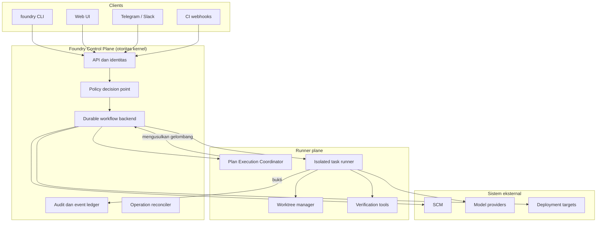

# Delivery Foundry: Control Plane Terkelola untuk Pengiriman Perangkat Lunak AI

## Apa yang Dibangun

[Delivery Foundry](https://github.com/okfriansyah-moh/the-foundry) adalah **control plane
terkelola** untuk pengiriman perangkat lunak berbasis loop. Arsitektur V12 mendefinisikan
model eksekusi yang tahan lama, dapat dilanjutkan, dan terverifikasi bukti untuk agen AI
yang beroperasi di bawah envelope kebijakan eksplisit, bukan kepercayaan implisit.

Repositori mengirim **Task 1** pada 2026-07-20 (Makefile berbasis Docker, CI, scaffold Go).
[Pull request #1](https://github.com/okfriansyah-moh/the-foundry/pull/1) (digabung
2026-07-25) menyelesaikan **Task 2–22** hingga milestone M0 (Shared Kernel Proof) dan
awal M1 (Foundation). [Pull request #2](https://github.com/okfriansyah-moh/the-foundry/pull/2)
(digabung 2026-07-27) menyelesaikan **Task 23–40** dan keluar dari **M1 — Production Foundation**:

- **Agent harness (Task 2)** — [`.ai/`](https://github.com/okfriansyah-moh/the-foundry/tree/main/.ai) canonical ARES dengan enam agen peran, sebelas skill, dan komposisi multi-provider ke `AGENTS.md` / `CLAUDE.md` / `.codex/` (provider Claude + Codex di `.ai/manifest.yaml`)
- **Plan runner otonom (Task 3)** — `tools/planrunner` dengan jalur AUTO vs GATED berbasis risiko dan gate persetujuan Telegram
- **Stack runtime (Task 4–5)** — `postgres` + `temporal` di compose; paket state enam-status canonical (`internal/state`)
- **Admission dan provenance (Task 6–8, 24)** — schema/parser PLAN, `AdmissionClassifier` deterministik v0, rantai `ApprovedPlan` bertanda tangan dengan audit log berantai hash
- **Substrat eksekusi (Task 9–11, 34)** — worktree manager, kontrak executor, penyimpanan evidence bundle, dan **sandbox executor OCI rootless** (jail filesystem, jaringan default-deny dengan egress gate, cap cgroup)
- **Workflow kernel (Task 12–16, 32)** — worker Temporal `foundryd` menghosting `DeliverPlan`; bukti resume checkpoint + forced-restart; supervisor liveness dan semantik terminal `PROVEN_BLOCKED` yang jujur
- **Permukaan operator (Task 13–15, 18–19, 36)** — validation runner, proyeksi status PostgreSQL, CLI `foundry`, **HTTP API `/v1`** dengan paritas CLI, dan pemeriksaan konstitusi `fitlint`
- **Lapisan foundation (Task 20–22, 23–29, 35–39)** — migrasi, profiles/principals/organizations, **PDP berbasis OPA**, ledger operasi eksternal, SCM GitHub write, cost accounting/anggaran, backend secrets file, **drill backup/restore**, projector v2 dengan alert lag
- **Integrasi produksi (Task 30–33, 38)** — engine notifikasi Telegram dengan flood control, baseline observabilitas Prometheus/Grafana, backpressure/brownout control-plane, lint dokumentasi (`make doclint`) di CI
- **Entry venture (Task 40)** — engine `MissionContract` dan schema misi untuk misi otonom Track A

[Pull request #4](https://github.com/okfriansyah-moh/the-foundry/pull/4) (digabung 2026-07-28)
mengirim **Task 41–50** — kesiapan venture dan scaffolding kebijakan:

- **Mission Setup Ceremony (VEN-02)** — `foundry mission ceremony` menjalani checklist deterministik,
  mengumpulkan bukti atau deferral, dan menyimpan `MissionReadinessArtifact` sebelum operasi tanpa pengawasan
- **Engine template produk** — `foundry product new --from-template` menginstansiasi scaffold venture
  dari `templates/product`
- **Config pemetaan kebijakan/efek** — `effect-mapping.yaml`, `mission-decide-policy.yaml`, dan
  `synthetic-canary-policy.yaml` menghubungkan tier admission ke side effect bertipe

[Pull request #5](https://github.com/okfriansyah-moh/the-foundry/pull/5) (digabung 2026-07-28)
menyelesaikan **Task 51–60** — **exit venture MLS Track A** dan **fondasi integrator Track B**:

- **Siklus perbaikan terbatas (VEN-12)** — `RunImproveCycle` berbasis cassette dengan lease promosi
  dan pemeriksaan envelope; digest veto mingguan dengan guard freeze-on-rollback-depth
- **Track A MLS e2e** — harness venture 12 langkah dengan assertion `HUMAN_TOUCHES=0` melalui deploy → observe → improve
- **Paket tata kelola organisasi (TX-01)** — profil `organization-10x.yaml` dengan bukti policy compiler tighten-only
- **PEC v1 (TX-03)** — proposal gelombang via sort topologi Kahn, proposal remediasi, dan tes larangan CI (`check_pec_boundary.sh`)
- **Grup atomik + Branch Integrator (TX-04–06)** — digest change-set deterministik, antrian integrasi, drift guard dengan semantik requeue `PROVEN_BLOCKED`
- **Terminal handoff 10x (TX-07)** — `TEN_X_BRANCH_HANDOFF_READY` dengan pernyataan larangan C15 wajib di notifikasi

[Pull request #6](https://github.com/okfriansyah-moh/the-foundry/pull/6) (digabung 2026-07-28)
mengirim **Task 61–75** — **exit 10x MLS Track B**, **M2 Operational Hardening**, dan bootstrap M3:

- **Bukti larangan 10x (TX-08)** — langkah fitness CI menolak simbol PR/merge/deploy di jalur panggilan TenX
- **Adapter SCM Bitbucket (TX-09)** — adapter CAS-push/read opsional berbagi tes kontrak dengan GitHub
- **Track B MLS e2e (TX-10)** — harness berbasis fixture melalui provenance org → grup atomik → integrator → push → terminal
- **Hardening M2 (HRD-01–10)** — suite chaos, fairness quota/backpressure, sweeper retention/PII, verifikasi hash-chain audit + drill tamper,
  alert SLO Prometheus, job rekonsiliasi cost, korpus red-team prompt-injection, drill DR otomatis, fuzz/soak Telegram,
  goreleaser + upgrade drill — **exit M2** via `docs/notes/m2-exit-report.md`
- **Pipeline auto-promosi L0 (EVO-01)** — registry tunable dan bootstrap pipeline promosi untuk M3

[Pull request #7](https://github.com/okfriansyah-moh/the-foundry/pull/7) (digabung 2026-07-28)
mengimplementasikan **Task 76–93** — **seleksi executor berbasis config**:

- **Registry kapabilitas executor** — `config/executor-capabilities.yaml` mencatat fitur adapter, ketersediaan, dan timestamp verifikasi
- **Routing berbasis kebijakan** — `executor-routing.yaml` dan `executor-models.yaml` memetakan kelas task ke executor/model preferen; `ExecutorSelector` kernel menggantikan nama hardcoded
- **Adapter multi-provider** — OpenCode, Gemini CLI, Cursor, Copilot, Windsurf, OpenAI, dan Local executor terdaftar di `foundryd`
- **Lint staleness kapabilitas** — `fitlint capability` gagal CI saat verifikasi provider melebihi 180 hari

[Pull request #8](https://github.com/okfriansyah-moh/the-foundry/pull/8) (digabung 2026-07-30)
menambahkan **Task 100–110** — UX operasional PLAN/mission dan gate CI:

- **CLI/API Mission** — `foundry mission start|resume|list|status`, perintah opportunity, dan endpoint OpenAPI `/missions`
- **Pengiriman PLAN** — `foundry plan run` dan API `/plans/{id}/deliver` terhubung ke workflow kernel
- **Gate fitness PLAN** — pemeriksaan research-boundary, validasi, dan topologi (DAG) `fitlint` ditegakkan sebagai job CI wajib

[Pull request #9](https://github.com/okfriansyah-moh/the-foundry/pull/9) (digabung 2026-07-31)
menutup **Task 111–120 (M5 gap-closure)** — intake, keamanan, dan hardening cost:

- **Intake bertahap dapat dilanjutkan (INT-03)** — `foundry mission start --idea` menjalankan opportunity → verdict → spec → PLAN → admission → approval → mission-start; REJECT/VALIDATE-MORE tidak membangun apa pun; tier H tidak pernah self-approve
- **Transport inbound Telegram (INT-04–05)** — pacing offset tahan lama, `/idea`→`/confirm` dengan proteksi nonce/replay; teks pesan diperlakukan sebagai data tidak tepercaya
- **Sandbox wajib + kebijakan fail-closed (SEC-01–02)** — kernel menolak eksekusi host saat sandbox tidak tersedia; loader kebijakan empat lapisan; allowlist URL kosong menolak
- **Isolasi kredensial + tenancy profil (SEC-03–04)** — env per-child untuk subprocess; profile-kind `ApprovedPlan` menegakkan step-up org dan root worktree scoped
- **Anggaran fail-closed + rekonsiliasi cost (COST-01–02)** — misi tanpa pengawasan tanpa envelope menolak; `RecordCost` terhubung ke `DeliverPlan` dengan tabel rate per-model dan `foundry cost reconcile`

[Pull request #10](https://github.com/okfriansyah-moh/the-foundry/pull/10) (digabung 2026-08-01)
mengirim **Task 121–130** — runtime multi-mission, gelombang konkuren, dan integrasi produksi:

- **Scheduler portfolio (MMR-01)** — workflow `PortfolioLoop` berbasis Postgres dengan isolasi anggaran per-mission,
  batas fairness, dan bukti restart kill −9 (`test/portfolio_restart_live_test.go`)
- **Idempotensi aktivitas mission (MMR-02)** — aktivitas Temporal dibungkus receipt dengan gate ID deterministik
  dan timestamp stabil saat replay (C9)
- **Recovery task teracun (MMR-03)** — pelacakan failure signature di PostgreSQL; kegagalan identik berulang
  dieskalasi ke supervisor alih-alih retry tak terbatas (C22)
- **Gelombang PEC konkuren (PAR-01)** — task independen dalam satu gelombang berjalan paralel di worktree terisolasi
  dengan urutan topologi Kahn, konkurensi terbatas, dan barrier per-gelombang (`wave_concurrency_test.go`)
- **Adapter deploy Fly.io (VEN-15)** — jalur deploy nyata dengan health check, rollback, enforcement gate,
  dan pembungkus extops-receipt
- **Billing Stripe (VEN-16)** — klien test-mode, endpoint webhook terverifikasi signature, persistensi event tahan lama,
  dan loop reconciler revenue di `foundryd`
- **Siklus improvement produksi (VEN-17)** — improvement otonom terbatas terhubung melalui state freeze tahan lama
  dan enforcement change-budget
- **Penyimpanan bukti S3/MinIO (INF-01)** — selector backend berbasis profil dengan suite conformance membuktikan
  interoperabilitas dengan filesystem store
- **Fallback provider (INF-02)** — circuit breaker `HealthTracker` dengan loop reselection terbatas;
  diskriminasi fault provider bertipe dan semantik fail-closed saat tidak ada executor yang diizinkan
- **ADR OpenHands / 9Router (ADR-01)** — [ADR-001](https://github.com/okfriansyah-moh/the-foundry/blob/main/docs/foundry/docs/architecture/adr/ADR-001-openhands-9router.md)
  mencatat 9Router ditolak (Task 129 memenuhi intent) dan OpenHands ditunda sebagai adapter eksternal opsional

[Pull request #11](https://github.com/okfriansyah-moh/the-foundry/pull/11) (digabung 2026-08-01)
menutup **Task 131–140** dan **V1 Evidence Gate (Task 136)**:

- **Kebersihan dokumentasi (DOC-01)** — lint stale-task dan test-source-write `fitlint` gagal CI pada
  komentar self-disclosed-gap yang sudah usang
- **Bukti venture live (PRF-01, Task 132)** — misi personal terbukti end-to-end pada control plane nyata
- **Bukti 10x Bitbucket live (PRF-02, Task 133)** — remote disposable menerima push nyata yang SHA-nya
  dibaca ulang secara independen; bukti prohibisi C15 (tanpa PR, merge, atau deploy) di workflow CI terjadwal
- **Benchmark akselerasi V1 (ACC-01/02, Task 134–135)** — baseline JSON control-arm ditambang dari
  delivery git historis; `foundry bench` dan `make bench-baseline` / `make bench-foundry` membandingkan
  target penerimaan di `config/benchmark-targets.yaml`
- **Intake mockup terpadu (VEN-18, Task 138)** — router mengingest mockup Figma, HTML, PDF, dan gambar
  ke tahap spec/plan dengan tes ekstraksi golden-file
- **Allowlist sinyal validasi (OPP-05, Task 139)** — ingestion sinyal validasi pasar nyata terbatas dengan
  record berprovenance; `must_have_real_validation_signal` digate pada sumber allowlisted
- **Seleksi provider SCM fail-closed (TX-12, Task 140)** — kernel menolak saat tidak ada provider SCM
  yang diizinkan kebijakan; paritas write Bitbucket diperkuat (Task 137)
- **Observabilitas human-touch** — `internal/observe/humantouch.go` mencatat intervensi operator
  untuk pelaporan benchmark dan evidence gate

[Pull request #12](https://github.com/okfriansyah-moh/the-foundry/pull/12) (digabung 2026-08-02)
menutup **Task 141–152 (M6)** — penutupan runtime otoritatif dan **Final V1 Evidence Gate (Task 152)**:

- **Execution envelope (RTC-05, Task 141)** — envelope immutable yang diselesaikan kernel disimpan di
  PostgreSQL; tes replay membuktikan resume deterministik tanpa mendefinisikan ulang otoritas side effect
- **Adapter executor kompatibel sandbox (SEC-05, Task 142)** — jalur executor produksi memerlukan
  sandbox tersedia; adapter menghormati schema kapabilitas di `config/schemas/executor-capability.schema.json`
- **Resolusi plan/repositori produksi (RTC-06, Task 143)** — kernel menyelesaikan sumber PLAN disetujui
  dan entri registry repositori sebelum dispatch; tanpa jalur stub di rute intake live
- **CLI idea-to-mission live (INT-07, Task 144)** — `foundry mission start --idea` konvergen melalui
  tahap intake dan memulai `MissionLoop` via Temporal di `cmd/foundry/intake_live.go`
- **Intake produksi Telegram (INT-08, Task 145)** — dispatch perintah tahan lama, draft store, dan
  penanganan attachment terhubung ke transport inbound produksi `foundryd`
- **Sinyal validasi produksi (OPP-06, Task 146)** — sinyal pasar nyata allowlisted menggate verdict BUILD
  venture di jalur live, bukan shortcut sintetis saja
- **Loop venture tertutup (VEN-19, Task 147)** — `ImprovementWorkflow` menghubungkan deploy → observe → improve
  dengan state freeze, anggaran perubahan, dan bundel bukti di stack produksi
- **Orkestrasi 10x penuh (TX-13, Task 148)** — PLAN disetujui melalui grup atomik, antrian integrator,
  dan terminal `TEN_X_BRANCH_HANDOFF_READY` pada workflow TenX tahan lama
- **Isolasi profil + penutupan cost (SEC-06, Task 149)** — enforcement runtime profil dan sweeper
  cost belum direkonsiliasi menutup celah akuntansi M5
- **Input router terpadu (INT-09, Task 150)** — `internal/inputrouter` merutekan entry IDEA, PLAN, dan MOCKUP
  melalui satu pipeline admission-aware dengan tes golden
- **Bukti release V1 wajib (PRF-03, Task 151)** — `make v1-proof` dan `.github/workflows/v1-proof.yml`
  fail closed saat infrastruktur atau kredensial live tidak ada; `V1_PROOF_ALLOW_SKIP=1` menghasilkan exit 2
  dan tidak boleh diarsipkan sebagai bukti PASS
- **Final V1 Evidence Gate (V1-02, Task 152)** — mengintegrasikan Task 141–151 plus baseline benchmark;
  verdict terdokumentasi di `docs/notes/v1-final-evidence-gate.md` dan `benchmarks/report-v1-final.md`

[Pull request #13](https://github.com/okfriansyah-moh/the-foundry/pull/13) (digabung 2026-08-04)
mengirim **Task 153–155 (M7)** — kemasan kapabilitas produk:

- **Katalog agen/skill (CAP-01, Task 153)** — `agents/catalog.yaml` dan `skills/catalog.yaml` mendefinisikan
  agen, skill, input, output, dan binding canonical; `foundry catalog` menampilkan dan memvalidasi entri
- **Materialisasi runtime (CAP-02, Task 154)** — antarmuka `Materializer` provider-neutral di
  `adapters/agent-runtime/`; adapter Claude Code memproyeksikan paket enabled ke `.claude/agents/` dan
  `.claude/skills/` dengan digest manifest; instalasi idempoten dan fail-closed pada drift
- **Jembatan evolusi skill L1 (CAP-03, Task 155)** — promosi terbatas dari `SkillRegistry` ke versi paket
  on-disk dengan rollback append-only; kandidat profil organisasi tetap proposal-only;
  bukti e2e di `test/e2e/skill_evolution/`

Kontrak normatif tetap di `docs/foundry/delivery_foundry.md` dan pohon modular
`docs/foundry/docs/`; roadmap implementasi aktif ada di `docs/PLAN.md`
(Task 1–155 ✅ melalui kemasan kapabilitas M7).

[Pull request #14](https://github.com/okfriansyah-moh/the-foundry/pull/14) (digabung 2026-08-08)
mengirim **Task 156–161 (SoT config operator Postgres)**:

- **SoT config operator (Task 156–161)** — `internal/operatorcfg.Store` membaca policy layer, kuota, tarif model, threshold opportunity, kebijakan mission-decide, nilai tunable, dan katalog packaging dari **PostgreSQL** sebagai source of truth; startup daemon men-seed dari disk saat key kosong; perintah catalog CLI menerima `-pg-dsn` untuk katalog dan rollback berbasis DB

## Masalah

Kebanyakan workflow AI coding memperlakukan agen sebagai executor tepercaya: membaca
rencana, memutasi repositori, dan melaporkan selesai sendiri. Model itu gagal saat retry
(duplikasi side effect), crash (progress hilang), drift kebijakan (agen memperluas izin
sendiri), dan state terminal ambigu (apakah pekerjaan benar-benar terverifikasi?).

Loop delivery tingkat produksi membutuhkan **control plane** yang memiliki state
otoritatif, mengurutkan side effect, menegakkan anggaran dan persetujuan, serta menerima
penyelesaian hanya jika didukung bukti bertipe — sambil tetap membiarkan koordinator
agen mengusulkan gelombang pekerjaan berikutnya.

## Mengapa Masalah Ini Sulit

1. **Pemisahan otoritas** — Agen harus menginterpretasi rencana dan merekomendasikan
   dispatch, tetapi tidak boleh menjadi mesin workflow kedua atau memutasi state
   otoritatif secara langsung.
2. **Enam status, nuansa tak terbatas** — Makna workflow harus hidup di field bertipe
   terkontrol registry (`phase`, `reason`, `result_code`), bukan enum status ad hoc.
3. **Dua track produk** — Otonomi venture personal dan engineering 10x organisasi
   berbagi satu kernel tetapi membutuhkan profil tata kelola dan semantik terminal berbeda.
4. **Penyelesaian jujur** — Outcome terminal seperti `PROVEN_BLOCKED` atau
   `TEN_X_BRANCH_HANDOFF_READY` harus mengenkode bukti nyata, bukan optimisme agen.
5. **Recovery tanpa improvisasi** — Self-healing harus menaiki tangga terbatas (retry →
   buat ulang sandbox → rollback → eskalasi manusia) tanpa menekan peringatan keamanan.

## Model Mental Pemula

Bayangkan ruang kontrol pabrik (**kernel**) dan supervisor lantai (**Plan Execution
Coordinator**, atau PEC). Supervisor membaca rencana produksi, mengusulkan stasiun
berikutnya, dan melaporkan progress — tetapi hanya ruang kontrol yang boleh
membalik saklar, menulis ke ledger, push ke Git, atau menyatakan batch selesai. Setiap
perubahan state membutuhkan bundel bukti distempel. Jika listrik padam, ruang kontrol
memutar ulang dari checkpoint terakhir; supervisor tidak merestart pabrik dari ingatan.

## Persyaratan dan Batasan

| Persyaratan | Kontrak arsitektural |
|-------------|---------------------|
| Tepat enam status workflow | `PENDING`, `RUNNING`, `WAITING`, `SUCCEEDED`, `FAILED`, `CANCELLED` |
| Makna lebih kaya di field bertipe | `phase`, `reason`, `result_code` terkontrol registry |
| Kernel memiliki side effect | SCM writes, anggaran, lease, checkpoint, penyelesaian |
| PEC hanya mengusulkan | Gelombang, dispatch, remediasi — diuji larangan di CI |
| Penyelesaian berbasis bukti | Tidak ada "selesai" laporan mandiri tanpa bundel verifikasi |
| Admission deterministik | Classifier versi; rencana tidak bisa mengotorisasi diri sendiri |
| Workspace terisolasi | Agen beroperasi di worktree, bukan clone kanonik |
| Operasi eksternal idempoten | Ledger operasi dengan kunci idempotency untuk setiap side effect |
| Paralelisme dual-track | Track venture dan 10x berbagi kernel, gate penerimaan independen |

Batasan ini dicantumkan sebagai artikel konstitusi C1–C22 di `PLAN_7.md`.

## Ringkasan Arsitektur

Delivery Foundry adalah **control plane**, bukan framework agen universal atau kumpulan
skrip shell. Klien (CLI, Web UI, Telegram, webhook CI) memanggil control plane; runner
plane mengeksekusi pekerjaan terbatas di sandbox terisolasi dan mengembalikan bukti
bertipe.


```mermaid
flowchart TB
  subgraph Clients
    CLI[foundry CLI]
    WEB[Web UI]
    CHAT[Telegram / Slack]
    CI[CI webhooks]
  end

  subgraph ControlPlane["Foundry Control Plane (otoritas kernel)"]
    API[API dan identitas]
    POLICY[Policy decision point]
    WF[Durable workflow backend]
    LEDGER[Audit dan event ledger]
    RECON[Operation reconciler]
  end

  subgraph RunnerPlane["Runner plane"]
    PEC[Plan Execution Coordinator]
    RUNNER[Isolated task runner]
    WORKTREE[Worktree manager]
    VERIFY[Verification tools]
  end

  subgraph External["Sistem eksternal"]
    SCM[SCM]
    MODEL[Model providers]
    DEPLOY[Deployment targets]
  end

  CLI --> API
  WEB --> API
  CHAT --> API
  CI --> API

  API --> POLICY
  POLICY --> WF
  WF --> PEC
  PEC -->|mengusulkan gelombang| WF
  WF --> RUNNER
  RUNNER --> WORKTREE
  RUNNER --> VERIFY
  RUNNER -->|bukti| LEDGER
  WF --> SCM
  WF --> DEPLOY
  RUNNER --> MODEL
```

## Alur Eksekusi

1. **Entry** — Misi, mockup, requirement, spesifikasi, `PLAN.md` yang disetujui, atau
   teks `--idea` tiba di API control plane atau transport inbound Telegram.
2. **Intake dan admission** — Untuk ide, pipeline intake bertahap menghasilkan opportunity →
   spec → PLAN sebelum admission; classifier deterministik menetapkan tier (A0/A1/A2/H),
   memverifikasi provenance untuk rencana org, dan menolak start tanpa pengawasan tanpa envelope anggaran.
3. **Pembuatan workflow** — Kernel membuat workflow di `PENDING`, transisi ke
   `RUNNING` dengan phase `intake`, dan menetapkan checkpoint.
4. **Interpretasi PEC** — PEC membaca rencana yang diadmit, mengusulkan gelombang
   aware dependensi dan dispatch task terbatas dalam envelope yang diberikan kernel.
5. **Eksekusi terisolasi** — Runner **wajib** memakai sandbox OCI wajib (`requires_sandbox`);
   eksekusi host ditolak saat sandbox tidak tersedia. Agen mengeksekusi di worktree
   ephemeral scoped ke tenancy profil dan mengembalikan ringkasan ke PEC (bukan state kernel).
6. **Verifikasi** — Pemeriksaan deterministik menghasilkan bundel bukti; kernel
   maju phase (mis. `implementation` → `verifying` → `integrating`).
7. **Side effect** — Branch Integrator milik kernel melakukan SCM writes; operasi
   eksternal mencatat kunci idempotency di ledger.
8. **Keputusan terminal** — Kernel menetapkan `SUCCEEDED` atau `FAILED` dengan
   `result_code` terkontrol registry (mis. `MISSION_TARGET_REACHED`,
   `TEN_X_BRANCH_HANDOFF_READY`, `PROVEN_BLOCKED`).
9. **Recovery saat gagal** — Recovery Manager membaca klasifikasi kegagalan dan
   menaiki tangga L0–L7; gate manusia pause di batas yang dikonfigurasi.

## Komponen Penting

| Komponen | Tanggung jawab |
| -------- | --------------- |
| **Kernel** | State workflow otoritatif, sequencing, lease, checkpoint, kebijakan, anggaran, semua side effect |
| **Plan Execution Coordinator (PEC)** | Menginterpretasi rencana diadmit; mengusulkan gelombang, dispatch, remediasi, progress |
| **Admission classifier** | Penetapan tier deterministik; mencegah rencana mengotorisasi diri sendiri |
| **State projection (PostgreSQL)** | Model baca dapat dibangun ulang dengan rebuild/lag alert v2 — bukan otoritas eksekusi |
| **Backend Temporal (`foundryd`)** | Riwayat eksekusi tahan lama, timer, routing task-queue per-lane — worker pada queue `foundry-core` |
| **CLI `foundry` + API `/v1`** | Perintah operator dan paritas HTTP: status, plan submit/approve/verify, projection rebuild, doctor, policy, evidence, mission, budget, audit verify |
| **OPA PDP (`internal/policy/pdp`)** | Keputusan otorisasi berbasis Rego; route API memerlukan session JWT + PDP Allow sebelum handler berjalan |
| **Strong auth (`internal/authn`)** | Session OIDC, WebAuthn step-up untuk approval tier H, binding identitas Telegram |
| **Executor sandbox (`internal/executor/sandbox`)** | Container OCI rootless dengan topologi egress gate; CI memverifikasi lane Docker dan rootless Podman |
| **`fitlint` + `make fitness`** | Penegakan konstitusi: enum lint (C1), superseded-term lint, batas import, resolver doc-link |
| **Agent harness `.ai/`** | Enam peran executor, sebelas skill, instruksi batas otoritas; dikomposisi ke file agen per provider |
| **Plan runner (`tools/planrunner`)** | Orkestrator bootstrap untuk Task 4–22; pensiun setelah kernel mengadmit backlog sendiri (exit condition Task 3) |
| **Pipeline bukti** | Bundel verifikasi bertipe wajib untuk kemajuan phase |
| **Operation ledger (`internal/ledger/extops`)** | Kunci idempotency dan rekonsiliasi untuk side effect eksternal termasuk push SCM |
| **Cost ledger (`internal/ledger/cost`)** | Akuntansi reserve → incur → reconcile dengan enforcement anggaran |
| **Recovery Manager** | Tangga self-healing terbatas dengan larangan eksplisit dan supervisi liveness |
| **Branch Integrator / SCM write** | Push GitHub milik kernel dengan verifikasi CAS dan token source berbasis secrets |
| **Engine Telegram (`internal/notify`)** | Notifikasi ber-tier prioritas, batching, flood control, dead-letter queue |
| **Engine mission (`internal/mission`)** | Schema MissionContract, ceremony readiness, siklus perbaikan terbatas, dan pipeline intake |
| **Pipeline intake (`internal/intake`)** | Alur idea→mission bertahap dapat dilanjutkan dengan resume idempoten dan gate anggaran fail-closed |
| **PEC (`internal/pec`)** | Proposal gelombang/remediasi saja; sort topologi + deteksi siklus; tes larangan batas CI |
| **Branch Integrator (`internal/kernel/integrator`)** | Antrian push milik kernel, drift guard, validasi scope, `PROVEN_BLOCKED` pada drift tidak recoverable |
| **Executor selector (`foundryd`)** | Memuat registry kapabilitas + kebijakan routing; memilih executor tersandbox per kelas task |
| **Retention sweeper (`internal/retention`)** | Kelas TTL, legal hold, endpoint DSR — enforcement PII M2 |
| **Audit verifier (`internal/audit`)** | Walker hash-chain dengan anchor inkremental; drill tamper `foundry audit verify` |
| **Scheduler portfolio (`internal/mission/portfolio_*`)** | Workflow Temporal `PortfolioLoop`; store portfolio Postgres dengan isolasi anggaran dan bukti restart |
| **Idempotensi mission (`internal/kernel/idempotency.go`)** | Aktivitas dibungkus receipt; gate ID deterministik bertahan crash/replay |
| **Failure signatures (`internal/kernel/failure_signature.go`)** | Melacak kegagalan identik berulang; eskalasi task teracun ke supervisor |
| **Barrier gelombang konkuren (`internal/kernel/workflow.go`)** | Dispatch task paralel dalam gelombang; urutan Kahn + konkurensi terbatas + barrier |
| **Adapter deploy (`internal/deploy/flyio.go`)** | Deploy Fly.io dengan health check, rollback, dan receipt extops |
| **Billing Stripe (`internal/billing/*`)** | Klien test-mode, verifikasi webhook, event tahan lama, reconciler revenue |
| **Backend bukti (`internal/evidence/store_s3.go`)** | Store S3/MinIO dengan selector profil; conformance-tested terhadap store FS |
| **Kesehatan provider (`internal/executor/capability/health.go`)** | Circuit breaker + reselection fallback terbatas di `ExecuteTask` |
| **Store benchmark (`internal/bench/*`)** | Capture baseline, perbandingan metrik, dan laporan bukti akselerasi V1 |
| **Sinyal validasi (`internal/opportunity/signals/*`)** | Ingestion sinyal validasi pasar nyata allowlisted dengan provenance |
| **Router mockup (`internal/spec/mockup/*`)** | Ingestion mockup multi-format (Figma/HTML/PDF/gambar) ke tahap spec |
| **Selector provider SCM (`internal/kernel/scm_provider.go`)** | Seleksi fail-closed kernel adapter write GitHub/Bitbucket |
| **Store execution envelope (`internal/kernel/execution_envelope*.go`)** | Envelope immutable diselesaikan kernel dengan persistensi stabil replay (Task 141) |
| **Input router (`internal/inputrouter/*`)** | Routing IDEA / PLAN / MOCKUP terpadu dengan store admission-aware (Task 150) |
| **Runtime profil (`internal/profile/runtime.go`)** | Enforcement isolasi profil produksi di batas dispatch (Task 149) |
| **Orkestrasi TenX (`internal/kernel/tenx_orchestration.go`)** | Workflow handoff 10x PLAN disetujui → tahan lama (Task 148) |
| **Workflow improvement (`internal/mission/improvement_workflow.go`)** | Loop venture deploy → observe → improve tertutup dengan gate freeze (Task 147) |
| **Sweeper cost belum direkonsiliasi (`internal/ledger/cost/unreconciled.go`)** | Menutup celah akuntansi; berpasangan dengan jalur anggaran fail-closed (Task 149) |
| **Draft store Telegram (`internal/notify/draft_store.go`)** | Persistensi perintah inbound produksi dan attachment (Task 145) |
| **Materializer runtime agen (`adapters/agent-runtime/*`)** | Proyeksi paket provider-neutral; adapter Claude Code dengan integritas manifest (Task 154–155) |
| **Kemasan kapabilitas (`internal/packaging/*`, `internal/evolve/skill_packages.go`)** | Validasi, instalasi, dan evolusi paket skill canonical dengan rollback (Task 153–155) |
| **`operatorcfg.Store` (Task 156–161)** | SoT config operator-hot berbasis Postgres: policy layer versi, kuota, policy/tarif model, threshold opportunity, kebijakan mission-decide, nilai tunable, katalog/enablement packaging; seed dari disk pada run pertama |
| **Pemuat katalog packaging** | Fallback berbasis file untuk dev lokal; `-pg-dsn` pada subperintah `foundry catalog` memuat katalog dan enablement dari config store |

Paket Go kini membawa implementasi nyata hingga Task 155 dan milestone CFG/CAP
(Task 156–161) — masing-masing dengan `doc.go`
batas otoritas: `internal/kernel`, `internal/state`, `internal/admission`,
`internal/provenance`, `internal/evidence`, `internal/worktree`, `internal/executor/*`
(termasuk `sandbox/`), `internal/projection`, `internal/policy/pdp`, `internal/api`,
`internal/authn`, `internal/ledger/*`, `internal/scm/write`, `internal/notify`,
`internal/mission`, `internal/profile`, `internal/operatorcfg`, dan lainnya. Paket PEC tetap proposal-only
per C5; otoritas side effect ada di jalur kode kernel yang dijalankan `foundryd`.

## Contoh Implementasi Disederhanakan

Representasi state kanonik (dari `docs/architecture/state-model.md`):

```yaml
status: RUNNING          # salah satu dari enam status kanonik
phase: implementation    # terkontrol registry
reason: null             # diisi saat WAITING atau FAILED
result_code: null        # hanya di transisi terminal
wake_at: null
next_action: verify
checkpoint_id: checkpoint-789
```

Batas otoritas PEC (disederhanakan dari `docs/architecture/authority-model.md`):

```text
PEC BOLEH:  mengusulkan gelombang, merekomendasikan dispatch, mengevaluasi ringkasan, mengusulkan remediasi
PEC TIDAK BOLEH: memutasi state workflow, melakukan SCM writes, memberi izin,
                  menaikkan anggaran, menyatakan penyelesaian terminal, override kebijakan
```

Entri tangga recovery (dari `docs/workflows/recovery.md`):

```text
L0 — retry operasi idempoten dengan backoff
L1 — buat ulang sandbox bersih dan ulangi
L2 — agen debugging fokus
...
L7 — pause dan eskalasi ke manusia
```

Versi config operator (disederhanakan dari `internal/operatorcfg/store.go` dan migrasi `00044_operator_config_sot.sql`):

```sql
-- Setiap config_key melacak pointer active_version
-- operator_config_versions menyimpan payload immutable + SHA256 + metadata apply
-- operator_config_apply_audit mencatat siapa yang menyetujui setiap promosi
SELECT config_key, active_version FROM operator_config_entries;
-- Key termasuk policy.layer.*, quotas, executor.models, packaging.catalog.*
```

Jalur seed startup (disederhanakan dari `cmd/foundryd/main.go`):

```go
cfgStore := operatorcfg.NewStore(db)
cfgStore.EnsureSeeded(ctx, operatorcfg.SeedPaths{
    PolicyOrganizationPath: "config/profiles/organization-10x.yaml",
    PolicyPersonalPath:     "config/profiles/personal-autonomous-venture.yaml",
    // ... quotas, model rates, catalogs, enablement ...
})
modelPolicy, err := cfgStore.LoadModelPolicy(ctx) // semua pembacaan runtime berbasis DB
```

## Reliabilitas dan Idempotency

- **Checkpoint** — Kernel mencatat `checkpoint_id` pada setiap transisi bermakna;
  restart proses memutar ulang dari riwayat Temporal dan proyeksi PostgreSQL.
- **Ledger operasi eksternal** — Setiap push SCM, deployment, atau panggilan billing
  membawa kunci idempotency; reconciler mendeteksi operasi duplikat atau yatim.
- **Invariant enam status** — Aturan fitness CI menolak enum status kedua; label V11
  historis hanya dipetakan ke tuple kanonik `(status, phase, reason, result_code)`.
- **Supervisi liveness** — `ORPHANED` adalah kondisi supervisor, bukan status workflow;
  dokumen disaster-recovery mendefinisikan semantik checkpoint/restart.
- **Blocking jujur** — `PROVEN_BLOCKED` pada `FAILED` berarti bukti terverifikasi bahwa
  pekerjaan tidak dapat dipenuhi sesuai scope — bukan kode error generik.
- **Restart portfolio** — State aktivasi, spend, dan jadwal portfolio bertahan `kill -9`;
  `PortfolioLoop` melanjutkan tanpa side effect duplikat (Task 121).
- **Receipt aktivitas mission** — Aktivitas Temporal membawa kunci idempotency dan timestamp
  stabil replay sehingga crash mid-mission tidak menerapkan side effect ganda (Task 122).
- **Eskalasi task teracun** — Failure signature di PostgreSQL mendeteksi kegagalan identik
  berulang dan merutekan ke supervisor alih-alih retry tak terbatas (Task 123).
- **Failover provider** — Executor tidak tersedia memicu circuit breaker kesehatan; kernel
  memilih ulang provider berikutnya yang diizinkan kebijakan atau fail closed dengan klasifikasi bertipe (Task 129).
- **Execution envelope** — Envelope diselesaikan kernel disimpan sebelum side effect; replay tidak dapat
  memperluas otoritas di luar envelope tersimpan (Task 141).
- **Integritas materialisasi** — Instalasi runtime hanya menerima file absent atau proyeksi byte-identik;
  drift katalog fail closed alih-alih menimpa file yang dikontrol workspace (Task 154).
- **Config operator versi** — Policy overlay, kuota, dan katalog packaging dipromosikan melalui
  baris versi immutable; `active_version` pada `operator_config_entries` adalah satu-satunya
  pointer mutable; apply audit menegakkan reviewer ≠ implementer pada promosi.
- **Seed-then-serve** — Boot `foundryd` pertama menyalin YAML disk ke Postgres saat key tidak memiliki
  versi; perubahan berikutnya harus melalui jalur apply config store, bukan pengeditan file diam-diam.

## Mode Kegagalan

| Kegagalan | Deteksi | Recovery |
| --------- | ------- | -------- |
| Outage provider transient | `WAITING`, reason `provider-outage` | Backoff L0; timer wake |
| Kegagalan kode deterministik | klasifikasi `deterministic-failure` | Agen debug L2; max 1 retry agen sama |
| Pelanggaran kebijakan | `FAILED`, result `ADMISSION_REJECTED` | Tidak auto-retry; review manusia |
| Anggaran habis | `WAITING`, reason `budget` | Pause sampai reset anggaran atau override manusia |
| PEC overreach | Tes larangan CI | Build gagal sebelum merge |
| Config berbasis file usang | Daemon membaca DB; key hilang gagal startup dengan error bernama | Re-seed atau apply versi baru via operatorcfg |
| Crash proses mid-phase | Supervisor liveness | Replay dari checkpoint; lanjut di phase ter-commit terakhir |
| Security hold | `WAITING`, reason `security-hold` | Recovery Manager tidak boleh menekan alert |
| Task teracun / kegagalan identik berulang | Ambang hitung failure signature | Eskalasi ke supervisor; tanpa retry tak terbatas (Task 123) |
| Outage kapasitas provider | Circuit HealthTracker terbuka | Pilih ulang executor yang diizinkan atau fail closed (Task 129) |
| Config provider SCM hilang | Penolakan kernel saat dispatch | Fail closed — tanpa downgrade diam-diam (Task 140) |
| Replay webhook Stripe | Store event tahan lama + verifikasi signature | Persistensi event idempoten (Task 126) |
| Kredensial bukti V1 hilang | Preflight `make v1-proof` | Fail closed — exit non-zero; skip exit 2, bukan PASS (Task 151) |
| Drift katalog / enablement | Mismatch digest manifest saat reinstall | Fail closed; materialize ke workspace baru (Task 154) |
| Anggaran promosi skill terlampaui | Store freeze PostgreSQL | Rollback dan promosi berhenti sebelum aktivasi paket (Task 155) |

## Trade-off dan Alternatif yang Ditolak

| Keputusan | Alasan |
| --------- | ------ |
| Pemisahan kernel vs PEC | Mencegah framework agen menjadi mesin workflow bayangan |
| Enam status + field bertipe | Phase extensible tanpa ledakan enum; dapat ditegakkan CI |
| Temporal + proyeksi PostgreSQL | Riwayat tahan lama terpisah dari model baca dapat dibangun ulang (C2/C3) |
| Bangun control plane (ADR-000) | Logika sequencing/kebijakan diferensiasi vs membeli orchestration generik |
| Modularisasi dok V12 | Mempertahankan konten V11 sambil menambah kontrak normatif |
| Toolchain dev hanya Docker | Host hanya butuh Docker + make; paritas dev/CI dari Task 1 |
| Handoff 10x tanpa PR | `TEN_X_BRANCH_HANDOFF_READY` adalah sukses — batas stop workflow org |
| 9Router ditolak (ADR-001) | Fallback provider Task 129 memenuhi intent routing tanpa dependensi proxy |
| OpenHands ditunda | Adapter eksternal opsional — tidak wajib untuk V1 evidence gate |
| Akselerasi terukur (C25) | Exit V1 memerlukan bukti benchmark terhadap baseline tercatat, bukan klaim kecepatan laporan mandiri |
| Claude Code sebagai materializer M7 tunggal | OpenHands dan 9Router tetap ditunda; kemasan tervalidasi tanpa dependensi adapter eksternal |
| Instal skill ≠ otoritas eksekusi | Materialisasi hanya menulis file provider; kernel dan kebijakan mempertahankan keputusan side effect |
| Postgres SoT untuk config operator-hot (Task 156–161) | Memusatkan policy/kuota/katalog dengan riwayat versi dan audit; path file menjadi input seed saja, mengurangi drift antara CLI, daemon, dan API |

## Pengujian

Validasi saat ini (Task 1–155, Final V1 Evidence Gate, bukti live, kemasan kapabilitas, dan CFG/CAP Task 156–161):

- `make bootstrap test lint fitness doclint` di dalam image Docker `dev`
- `internal/operatorcfg/store_pg_test.go` — jalur seed, load, dan apply versi store Postgres
- `make up` + `make doctor` — verifikasi Docker/Compose, PostgreSQL `SELECT 1`, Temporal `GetSystemInfo`
- `scripts/fitness.sh` — pemeriksaan konstitusi termasuk larangan TenX C15 (langkah i), batas PEC (langkah h), staleness kapabilitas executor, topologi/validasi/research-boundary PLAN, aturan sandbox subprocess, dan aturan isolasi env
- `make skp-e2e` — Shared Kernel Proof: admit plan → worktree → verify → bukti → **forced restart → resume**
- `make m1-exit`, `make m2-exit` — suite acceptance milestone dengan laporan exit di `docs/notes/`
- `make e2e-venture`, `make e2e-tenx` — harness MLS Track A dan Track B (assertion zero human touches / larangan C15)
- `make chaos`, `make redteam`, `make dr-drill`, `make soak-telegram`, `make soak-fairness` — drill hardening operasional M2
- `test/improvement_cycle_e2e.sh`, skrip e2e intake/telegram — bukti perbaikan venture dan transport inbound
- Workflow CI: `ci.yaml` (suite validasi PLAN wajib), `chaos.yml` (nightly), `dr-drill.yml` (bulanan)
- Tes red-team isolasi profil, bukti anggaran fail-closed, dan tes isolasi kredensial `-race` N-way (Task 117–119)
- `test/portfolio_restart_live_test.go`, `test/recovery_poisoned_live_test.go` — bukti restart portfolio kill −9 dan eskalasi task teracun (Task 121, 123)
- `internal/kernel/wave_concurrency_test.go` — dispatch gelombang konkuren dengan determinisme replay (Task 124)
- `internal/evidence/store_conformance_test.go` — interoperabilitas store S3/MinIO vs FS (Task 128)
- `internal/billing/stripe_live_test.go`, `internal/deploy/flyio_live_test.go` — tes kontrak adapter Stripe dan Fly.io (Task 125–126)
- `make bench-baseline`, `make bench-foundry` — capture dan perbandingan benchmark akselerasi V1 (Task 134–135)
- Workflow CI terjadwal: `e2e-venture.yml`, `e2e-tenx.yml`, `e2e-bitbucket.yml` — bukti live manual/terjadwal untuk Track A, Track B, dan remote Bitbucket (Task 132–133)
- `test/e2e/venture/live_test.go`, `test/e2e/tenx/live_test.go` — bukti end-to-end live terhubung ke CI (Task 132–133)
- Verdict V1 Evidence Gate terdokumentasi di `docs/notes/v1-evidence-gate.md` (Task 136)
- `make v1-proof` dan `.github/workflows/v1-proof.yml` — bukti release nyata wajib; kredensial
  absent fail closed (Task 151); verdict gate final di `docs/notes/v1-final-evidence-gate.md` (Task 152)
- `internal/kernel/execution_envelope_replay_test.go`, `internal/inputrouter/router_test.go` —
  determinisme replay envelope dan routing router terpadu (Task 141, 150)
- `test/e2e/product_packaging/` — e2e instalasi kemasan produk (Task 154)
- `test/e2e/skill_evolution/` — bukti promosi L1, rollback, isolasi profil, dan batas otoritas (Task 155)
- `adapters/agent-runtime/claudecode/materializer_test.go` — instalasi idempoten, integritas manifest, perlindungan symlink/collision

Keterbatasan diketahui (terdokumentasi di laporan exit M1): guard upsert proyeksi hanya
membandingkan nomor sequence; konten stale pada sequence lebih tinggi dapat regresi phase
terproyeksi — ditandai untuk follow-up, tidak disembunyikan.

## Operasi dan Observabilitas

- **Entry CLI** — subperintah `foundry`: `doctor`, `status`, `plan submit|approve|verify|revoke|run`,
  `projection rebuild`, `principal create`, `keygen`, `policy`, `evidence`, `migrate`, `login`,
  `mission start|resume|list|status|ceremony`, `intake show|resume|list`, `product new`,
  `opportunity list|show|report`, `budget`, `cost reconcile|show`, `audit verify`,
  `catalog`, `agents install`, `skills install|rollback`, `promotions unfreeze`, plus paritas HTTP `/v1` via `foundryd`
- **Daemon** — `foundryd` menghosting worker Temporal dan HTTP API; satu-satunya proses yang melakukan side effect kernel (C4)
- **Target Make** — `bootstrap`, `up`, `down`, `doctor`, `test`, `lint`, `fitness`, `doclint`,
  `skp-e2e`, `m1-exit`, `m2-exit`, `e2e-venture`, `e2e-tenx`, `chaos`, `redteam`, `dr-drill`,
  `soak-telegram`, `soak-fairness`, `plan-run`, `evidence-verify`, `projection-rebuild`, `backup`,
  `restore`, `drill-backup-restore`, `drill-brownout`, `release-dryrun`, `upgrade-drill`,
  `bench-baseline`, `bench-foundry`, `e2e-bitbucket`, `v1-proof`
  (semua dibungkus Docker; profil `up obs` menambah Prometheus/Grafana)
- **Engine Telegram** — Notifikasi ber-tier prioritas (P0–P3), batching, flood control, dead-letter
  store; approval tier H memerlukan step-up WebAuthn, bukan Telegram saja (C11/C12)
- **Cost accounting** — Reserve → incur → reconcile dengan tabel anggaran (`00009_budgets.sql`) dan CLI `budget`/`cost`
- **Observabilitas** — Metrik Prometheus, dashboard Grafana (`deploy/dashboards/foundry-overview.json`),
  runbook projection-lag; katalog SLO penuh tetap di `docs/foundry/docs/operations/observability-and-alerts.md`
- **Backup/restore** — `scripts/backup.sh` / `scripts/restore.sh` dengan verifikasi manifest sha256 dan
  re-verify audit-chain setelah restore; drill mid-flight membuktikan kontinuitas workflow setelah destroy/recover

## Pelajaran

1. **Pisahkan "siapa memutuskan" dari "siapa mengeksekusi"** — PEC kuat dalam interpretasi
   rencana tetapi harus tetap proposal-only; retensi side effect kernel tidak bisa ditawar.
2. **Semantik terminal adalah fitur produk** — `TEN_X_BRANCH_HANDOFF_READY` mengenkode
   batas stop intentional untuk workflow organisasi, bukan kegagalan merge.
3. **Registry mengalahkan enum** — Registry phase, wait-reason, dan result-code memungkinkan
   evolusi tanpa melanggar invariant enam status.
4. **Bukti sebelum penyelesaian** — Ringkasan agen laporan mandiri adalah input PEC, bukan
   bukti penyelesaian; bundel verifikasi menggate kemajuan phase.
5. **Bootstrap arsitektur dulu** — Task 1 discaffold batas otoritas di `doc.go`
   sebelum kode implementasi, sehingga CI dapat menegakkan peran paket lebih awal.
6. **Agent harness provider-neutral** — Task 2 menjaga `.ai/` sebagai sumber canonical tunggal;
   `ars compose` memproyeksikan skill dan batas ke format Claude/Codex tanpa menduplikasi kebijakan.
7. **Fitness mewujudkan konstitusi** — `fitlint` Task 18 mengubah artikel C1 menjadi kegagalan CI,
   bukan panduan dokumentasi saja.
8. **Routing berbasis config mengalahkan executor hardcoded** — Task 76–93 memindahkan seleksi provider
   ke YAML versioned sehingga freshness kapabilitas dan kebijakan kelas task dapat diaudit tanpa redeploy logika kernel.
9. **Default fail-closed bertahan pada config parsial** — M5 gap-closure menutup jalur allowlist kosong dan classifier nil;
   misi tanpa pengawasan tanpa envelope anggaran berhenti alih-alih menghabiskan secara diam-diam.
10. **Fairness multi-mission butuh state portfolio tahan lama** — Task 121 membuktikan isolasi anggaran dan
    fairness jadwal hanya saat tabel portfolio bertahan kematian proses, bukan scheduling in-memory saja.
11. **Klaim akselerasi memerlukan baseline** — V1 Evidence Gate Task 136 mengikat exit ke delivery control-arm
    yang ditambang dan perbandingan benchmark (C25), menolak laporan "kami lebih cepat" naratif saja.
12. **Intake live harus memulai workflow nyata** — Task 144 mengganti stub intake dengan start Temporal `MissionLoop`
    sehingga konvergensi CLI mengeksersis jalur kernel yang sama dengan produksi.
13. **Otoritas kemasan terpisah dari eksekusi** — Task 153–155 mematerialisasi file agen/skill
    ke workspace executor tanpa memperluas allowlist SCM, deploy, atau executor.
14. **Config operator-hot milik database** — Task 156–161 memindahkan policy layer, kuota,
    tarif model, dan katalog packaging ke store Postgres berversi; YAML disk menjadi
    input seed, menghilangkan drift config diam-diam antara daemon, CLI, dan API.

## Terkait

- [Merancang Deterministic Agentic Coding Orchestrator](/id/docs/concepts/deterministic-agentic-orchestrator)
- [State Kanonik dalam Pipeline Desain Multi-Agen](/id/docs/concepts/ai-orchestration-patterns)
- [Ringkasan Proyek Delivery Foundry](/id/docs/projects/delivery-foundry)

## Sumber

- Repository: [okfriansyah-moh/the-foundry](https://github.com/okfriansyah-moh/the-foundry)
- Pull request: [#14 — Task 156–161 (operator config Postgres SoT)](https://github.com/okfriansyah-moh/the-foundry/pull/14), [#13 — Task 153–155 (kemasan kapabilitas)](https://github.com/okfriansyah-moh/the-foundry/pull/13), [#12 — Task 141–152 (penutupan runtime M6, Final V1 gate)](https://github.com/okfriansyah-moh/the-foundry/pull/12), [#11 — Task 131–140 (V1 Evidence Gate)](https://github.com/okfriansyah-moh/the-foundry/pull/11), [#10 — Task 121–130 (portfolio, gelombang konkuren, integrasi produksi)](https://github.com/okfriansyah-moh/the-foundry/pull/10), [#9 — Task 111–120 (M5 gap-closure)](https://github.com/okfriansyah-moh/the-foundry/pull/9), [#8 — Task 100–110](https://github.com/okfriansyah-moh/the-foundry/pull/8), [#7 — Task 76–93](https://github.com/okfriansyah-moh/the-foundry/pull/7), [#6 — Task 61–75 (exit M2, MLS Track B)](https://github.com/okfriansyah-moh/the-foundry/pull/6), [#5 — Task 51–60 (MLS Track A, PEC, integrator)](https://github.com/okfriansyah-moh/the-foundry/pull/5), [#4 — Task 41–50](https://github.com/okfriansyah-moh/the-foundry/pull/4), [#2 — Task 22–40 (exit M1)](https://github.com/okfriansyah-moh/the-foundry/pull/2), [#1 — Task 3–22](https://github.com/okfriansyah-moh/the-foundry/pull/1)
- Laporan exit: `docs/notes/m1-exit-report.md`, `docs/notes/m2-exit-report.md`, `docs/notes/track-a-exit-report.md`, `docs/notes/track-b-exit-report.md`, `docs/notes/v1-evidence-gate.md`, `docs/notes/v1-final-evidence-gate.md`, `docs/notes/v1-release-proof.md`, `docs/notes/capability-packaging.md`, `benchmarks/report-v1-final.md` di repo sumber
- Arsitektur: `docs/foundry/delivery_foundry.md`, `docs/architecture.md`, `docs/foundry/docs/architecture/state-model.md`, `docs/foundry/docs/architecture/authority-model.md`
- Agent harness: `.ai/manifest.yaml`, `.ai/instructions/authority-boundaries.md`
- Rencana implementasi: `docs/PLAN.md` (Task 1–155 ✅ melalui kemasan kapabilitas M7; Task 156–161 ✅ SoT config operator Postgres)
