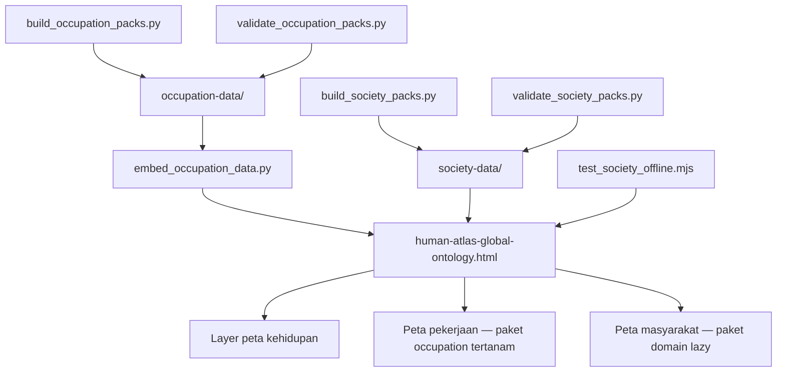

# Human Atlas: Arsitektur Workspace Riset Offline

## Apa yang Dibangun

[Human Atlas](https://github.com/okfriansyah-moh/human-atlas) adalah workspace riset
standalone untuk mengeksplorasi konteks manusia di kehidupan, pekerjaan, dan masyarakat.
Antarmuka utamanya adalah satu file HTML (`human-atlas-global-ontology.html`, sekitar
12 MB) yang berjalan di browser modern tanpa server aplikasi. Repositori ini mengirim
snapshot bertanggal (**2026-08-17**) berisi:

- **Peta kehidupan** — 15 tahap kehidupan dan 190 observasi terhubung.
- **Peta pekerjaan** — hierarki ISCO-08 lengkap: 10 kelompok besar, 43 sub-kelompok besar,
  130 kelompok kecil, dan 436 profil unit pekerjaan.
- **Peta masyarakat** — 312 konteks di delapan domain (agama, civic, budaya, bahasa,
  etnis, sosioekonomi, migrasi, rumah tangga).
- **Guardrail riset** — status evidence per field, metadata sumber, cakupan geografis,
  aturan privasi, dan eksperimen validasi.

Data occupation tertanam langsung di HTML sehingga mode Work sepenuhnya mandiri.
Data society memakai file companion JavaScript klasik untuk pemuatan progresif offline.

## Masalah

Brainstorming produk dan riset solo founder membutuhkan konteks manusia terstruktur —
tahap kehidupan, pekerjaan, setting budaya — tetapi kebanyakan alat menyembunyikan
ketidakpastian di balik UI yang terlalu percaya diri atau membutuhkan backend live.
Atlas riset harus:

1. Berjalan offline dari snapshot yang di-commit (termasuk buka via `file://`).
2. Memisahkan **fakta ber-sumber** dari **hipotesis** di level field, bukan halaman.
3. Memuat dataset besar secara progresif tanpa memblokir first paint.
4. Menegakkan batas privasi (tanpa inferensi agama/politik, tanpa daftar anggota pribadi).
5. Membuktikan integritas dengan skrip build dan validasi yang reproduksibel.

## Mengapa Masalah Ini Sulit

1. **Skala tanpa server** — 436 unit pekerjaan plus 312 node society melebihi ukuran
   unduhan JSON tunggal yang praktis untuk offline.
2. **Heterogenitas evidence** — sebagian field berasal dari spreadsheet ILO, lainnya
   hipotesis terstruktur yang tidak boleh tampil sebagai fakta mapan.
3. **Domain sensitif** — data agama, etnis, dan civic membutuhkan aturan privasi eksplisit
   dan batas rekomendasi.
4. **Kebenaran offline** — pemuatan progresif, restorasi state URL, dan recovery pack
   hilang harus bekerja tanpa `fetch()`, ES module, atau HTTP.
5. **Snapshot reproduksibel** — setiap pack yang di-generate membawa checksum SHA-256
   di manifest sehingga tampering atau rebuild parsial terdeteksi.

## Model Mental untuk Pemula

Bayangkan Human Atlas sebagai **perpustakaan dengan sticky note berkode warna**:

- **File HTML** adalah ruang baca — terbuka di mana saja, tanpa pustakawan (server).
- **Rak Work** (paket occupation) ditempel di cover depan sehingga taksonomi pekerjaan
  selalu tersedia.
- **Rak Society** tetap di folder terpisah; ruang baca mengambil satu folder sekaligus
  saat Anda menelusuri domain.
- Setiap fakta membawa **catatan berwarna** (`source_backed`, `market_inferred`,
  `ai_hypothesis`, atau `evidence_gap`) sehingga Anda tahu apakah harus mengutip,
  memvalidasi, atau memperlakukannya sebagai pertanyaan terbuka.

## Persyaratan dan Batasan

| Persyaratan | Implementasi |
| ----------- | -------------- |
| Tanpa server aplikasi | Satu HTML + direktori saudara `society-data/` |
| Mode Work offline-lengkap | Manifest, index, dan 10 paket major occupation tertanam via `<script type="application/json">` |
| Pemuatan progresif society | File companion `.js` lazy-load per domain pack |
| Evidence per field | Empat nilai `evidence_status` pada record yang di-generate |
| Verifikasi integritas | Checksum SHA-256 di `manifest.json` untuk setiap pack |
| Penegakan privasi | `privacy_rules` dan `recommendation_rules` di manifest society |
| Rebuild reproduksibel | Builder Python + validator; smoke test Node untuk `file://` |
| Embedding JSON aman | `<` di-escape sebagai `\u003c` saat inline JSON ke HTML |

## Gambaran Arsitektur



Snapshot yang di-commit menanamkan data occupation saat build. Paket society tetap
script companion eksternal sehingga browser hanya memuat domain aktif.

## Alur Eksekusi

1. **Rebuild layer occupation** (opsional) — `build_occupation_packs.py` membaca struktur
   ISCO-08, suplemen ESCO/O\*NET/KBJI, dan mengeluarkan JSON + paket JS di
   `occupation-data/packs/`.
2. **Embed data occupation** — `embed_occupation_data.py` mengganti blok
   `HA_OCCUPATION_DATA_START/END` di HTML dengan manifest, index, dan sepuluh tag script
   JSON major-group.
3. **Rebuild layer society** (opsional) — `build_society_packs.py` menghasilkan delapan
   domain pack dengan node, edge, opportunity, dan registry sumber.
4. **Validasi pack** — validator Python menghitung ulang checksum SHA-256 dan menelusuri
   setiap field untuk status evidence, geografis, dan tanggal verifikasi yang valid.
5. **Smoke test offline** — `test_society_offline.mjs` mengeksekusi skrip Atlas di modul
   `vm` Node terhadap kontrak DOM, membuktikan progressive load dan restorasi URL tanpa HTTP.
6. **Pengguna membuka atlas** — browser memuat HTML; mode Work membaca JSON tertanam;
   mode Society menyuntikkan script companion domain on demand.

## Komponen Penting

| Komponen | Tanggung jawab |
| -------- | --------------- |
| `human-atlas-global-ontology.html` | UI standalone, data Work tertanam, logika aplikasi Atlas |
| `occupation-data/manifest.json` | Inventaris pack, checksum, registry sumber, hitungan validasi |
| `occupation-data/packs/major-*.json` | Unit pekerjaan major-group ISCO-08 dengan dimensi profil |
| `society-data/manifest.json` | Metadata domain pack, aturan privasi, batas rekomendasi |
| `society-data/packs/domain-*.js` | Graf society lazy-load per domain |
| `scripts/build_occupation_packs.py` | Menghasilkan index dan pack occupation dari snapshot sumber |
| `scripts/build_society_packs.py` | Menghasilkan node, edge, dan opportunity society |
| `scripts/embed_occupation_data.py` | Inline JSON occupation ke HTML dengan escape `<` |
| `scripts/validate_*_packs.py` | Validasi checksum + skema + gate evidence |
| `scripts/test_society_offline.mjs` | Smoke test perilaku offline deterministik |

## Contoh Implementasi Disederhanakan

Embedding occupation meng-escape `<` agar JSON inline tetap di dalam tag script inert:

```python
# disederhanakan dari scripts/embed_occupation_data.py
def safe_json(path: Path) -> str:
    return path.read_text(encoding="utf-8").replace("<", "\\u003c")

blocks.append(
    f'<script type="application/json" id="ha-occ-manifest">'
    f'{safe_json(DATA / "manifest.json")}</script>'
)
```

Validasi society menolak status evidence tidak dikenal dan geografis yang hilang:

```python
# disederhanakan dari scripts/validate_society_packs.py
VALID_STATUS = {"source_backed", "market_inferred", "ai_hypothesis", "evidence_gap"}

def validate_fact(value, path, source_ids, errors):
    if value["evidence_status"] not in VALID_STATUS:
        errors.append(f"{path}: invalid evidence status")
    if not value.get("geography"):
        errors.append(f"{path}: missing geography")
```

## Reliabilitas dan Idempotensi

- **Manifest checksum** — setiap pack mencatat `checksum` dan `script_checksum`; validator
  menghitung ulang SHA-256 dan gagal jika mismatch.
- **Flag release-ready** — manifest menyertakan `"release_ready": true` hanya setelah
  validasi lulus tanpa error.
- **Embed idempoten** — `embed_occupation_data.py` mengganti blok HTML bertanda antara
  `HA_OCCUPATION_DATA_START` dan `HA_OCCUPATION_DATA_END`, sehingga re-run tidak menduplikasi data.
- **Smoke test offline** — skrip Node mensimulasikan pack domain hilang dan memverifikasi
  recovery error graceful tanpa akses jaringan.

## Mode Kegagalan

| Kegagalan | Deteksi | Recovery |
| --------- | ------- | -------- |
| Mismatch checksum setelah edit | `validate_*_packs.py` exit non-zero | Rebuild pack terdampak dari snapshot sumber |
| Status evidence tidak valid pada field | Walk validator melaporkan path | Perbaiki builder atau mapping sumber; rebuild pack |
| Pack society dipindah dari HTML | UI tidak bisa memuat script domain | Jaga `society-data/` sebagai saudara HTML (dokumentasi di README) |
| Pack hilang saat runtime | Smoke test menyuntik handler `onerror` | UI menampilkan state pack hilang; pengguna restore file |
| Rekomendasi tidak aman dari hipotesis | `recommendation_rules.evidence_order` | Hipotesis terlihat di riset tetapi dikecualikan dari rekomendasi |

## Trade-off dan Alternatif yang Ditolak

| Keputusan | Alasan | Alternatif ditolak |
| --------- | ------ | ------------------ |
| Embed data Work di HTML | Menjamin mode Work offline dalam satu file | Fetch pack occupation saat runtime (rusak `file://`) |
| Lazy-load pack Society | Delapan domain × ~300 KB–2 MB; muat on demand | JSON society monolitik (first open lambat) |
| Companion `<script src>` klasik | Bekerja offline tanpa module atau bundler | Graf ES module yang butuh server HTTP |
| Empat status evidence | Membuat ketidakpastian terlihat bagi peneliti | Flag true/false biner yang menyembunyikan layer hipotesis |
| Snapshot bertanggal, bukan API live | Baseline riset reproduksibel | Panggilan Wikidata/API live (non-deterministik, online-only) |

## Pengujian

| Tes | Perintah | Apa yang dibuktikan |
| --- | -------- | ------------------- |
| Integritas pack occupation | `python3 scripts/validate_occupation_packs.py` | Checksum, hitungan hierarki (10/43/130/436), dimensi wajib |
| Integritas pack society | `python3 scripts/validate_society_packs.py` | Gate evidence, field privasi, skema opportunity |
| Perilaku society offline | `node scripts/test_society_offline.mjs` | Progressive load, state URL, recovery pack hilang tanpa HTTP |

Validator society memperbarui `society-data/validation-report.json` dengan hasil.

## Operasi dan Observabilitas

**Buka atlas:** buka `human-atlas-global-ontology.html` di browser desktop terkini.
Tidak perlu instalasi paket untuk snapshot yang di-commit. Google Fonts dimuat saat online;
data dan logika aplikasi tetap lokal.

**Validasi data yang di-commit** dari root repositori:

```sh
python3 scripts/validate_occupation_packs.py
python3 scripts/validate_society_packs.py
node scripts/test_society_offline.mjs
```

**Rebuild data yang di-generate** hanya saat sengaja memperbarui snapshot — rebuild
menimpa index, manifest, pack, companion JS, dan laporan validasi.

## Pelajaran yang Dipetik

1. **Evidence per field mengalahkan disclaimer per halaman** — peneliti berhenti percaya
   saat satu kalimat percaya diri menyembunyikan hipotesis tiga bagian sebelumnya.
2. **Offline-first membatasi arsitektur sejak awal** — menanamkan data Work dan memakai
   tag script klasik menghindari retrofit dukungan `file://` nanti.
3. **Manifest checksum mengubah snapshot menjadi kontrak** — validator menangkap edit
   parsial yang review manual lewatkan.
4. **Domain sensitif butuh aturan privasi machine-readable** — `privacy_rules` dan
   `recommendation_rules` di level manifest skala lebih baik daripada peringatan prosa.

## Terkait

- [Human Atlas](/id/docs/projects/human-atlas)
- [LLM Guardrails](/id/docs/concepts/llm-guardrails)

## Sumber

- Repositori: [okfriansyah-moh/human-atlas](https://github.com/okfriansyah-moh/human-atlas)
- Snapshot publik awal: commit `7d61cc0` (2026-08-17) — GitHub Pages `index.html` + atlas HTML
- File kunci: `README.md`, `society-data/manifest.json`, `occupation-data/manifest.json`,
  `scripts/build_society_packs.py`, `scripts/test_society_offline.mjs`
